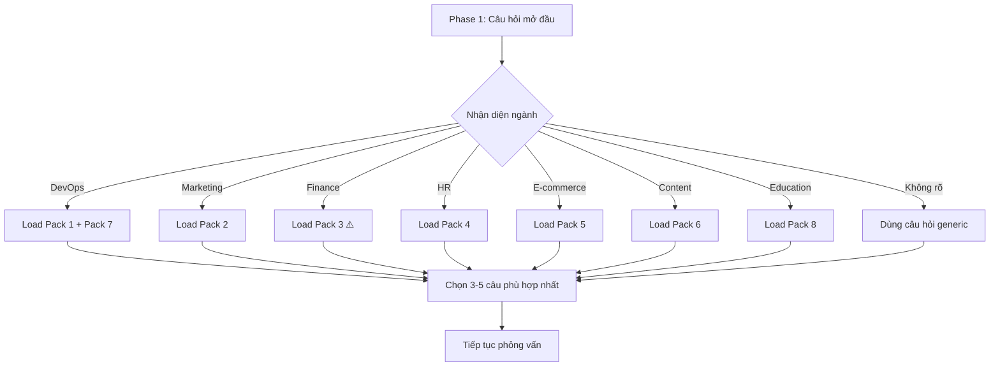

# 🏭 Industry Question Packs — Câu Hỏi Phỏng Vấn Chuyên Ngành

Bộ câu hỏi bổ sung cho Phase 1 (Deep Interview), chuyên biệt theo từng ngành.
Chọn pack phù hợp khi phát hiện user thuộc ngành cụ thể.

---

## 🖥️ Pack 1: Software Development (Phát triển phần mềm)

| # | Câu hỏi | Mục đích |
|---|---|---|
| 1 | "Tech stack dự án là gì? (React/Vue/Python/...)" | Detect Pattern 3 |
| 2 | "Có CI/CD pipeline không?" | Detect Pattern 5 |
| 3 | "Có testing framework nào đang dùng?" | Tools integration |
| 4 | "Code conventions của team là gì?" | Constraints |
| 5 | "Git workflow: GitFlow, trunk-based, hay feature branch?" | Process context |
| 6 | "Có deploy lên môi trường nào? (Vercel/AWS/Docker)" | Safety check |
| 7 | "Bao nhiêu dev trong team?" | Scale context |

### Trigger keywords

`code`, `dev`, `deploy`, `API`, `database`, `frontend`, `backend`, `bug`, `test`

---

## 📊 Pack 2: Marketing & Sales (Tiếp thị & Bán hàng)

| # | Câu hỏi | Mục đích |
|---|---|---|
| 1 | "Kênh marketing chính là gì? (Google Ads/Facebook/Email/SEO)" | Scope |
| 2 | "KPI đo lường thế nào? (CPA/ROAS/CTR/Conversion)" | Success criteria |
| 3 | "Tool tracking: GA4, GTM, Meta Pixel?" | Tools |
| 4 | "Ngân sách marketing hàng tháng khoảng bao nhiêu?" | Scale |
| 5 | "Đối tượng khách hàng chính?" | Context |
| 6 | "Có content calendar không?" | Process |
| 7 | "Báo cáo marketing gửi cho ai? Bao lâu 1 lần?" | Output format |

### Trigger keywords

`quảng cáo`, `ads`, `campaign`, `SEO`, `email marketing`, `khách hàng`, `lead`

---

## 💰 Pack 3: Finance & Accounting (Tài chính & Kế toán)

| # | Câu hỏi | Mục đích |
|---|---|---|
| 1 | "Phần mềm kế toán đang dùng? (MISA/Fast/Excel)" | Tools |
| 2 | "Báo cáo tài chính theo chuẩn nào? (VAS/IFRS)" | Standards |
| 3 | "Chu kỳ kế toán: tháng/quý/năm?" | Schedule |
| 4 | "Thuế suất VAT áp dụng?" | Business rules |
| 5 | "Ai duyệt chi? Quy trình phê duyệt thế nào?" | Approval flow |
| 6 | "Có cần xuất hóa đơn điện tử không?" | Integration |
| 7 | "Dữ liệu tài chính có bao mật không? Ai được xem?" | Security |

### Trigger keywords

`hóa đơn`, `invoice`, `thuế`, `VAT`, `báo cáo tài chính`, `công nợ`, `doanh thu`

### ⚠️ Lưu ý đặc biệt

- Dữ liệu tài chính = **NHẠY CẢM** → Luôn thêm Pattern 4 (Safety-First)
- Tính toán tiền = **CHÍNH XÁC** → Thêm Verification Steps
- KHÔNG hỏi số liệu tài chính cụ thể trong phỏng vấn

---

## 👥 Pack 4: HR & Operations (Nhân sự & Vận hành)

| # | Câu hỏi | Mục đích |
|---|---|---|
| 1 | "Quy mô công ty? Bao nhiêu nhân viên?" | Scale |
| 2 | "Phần mềm HR đang dùng? (Base.vn/HRM/Excel)" | Tools |
| 3 | "Quy trình tuyển dụng có mấy vòng?" | Process |
| 4 | "Hệ thống chấm công kiểu gì?" | Integration |
| 5 | "Đánh giá KPI nhân viên theo chu kỳ nào?" | Schedule |
| 6 | "Có chính sách WFH/Remote không?" | Business rules |
| 7 | "Onboarding nhân viên mới mất bao lâu?" | Pain point |

### Trigger keywords

`nhân sự`, `tuyển dụng`, `chấm công`, `KPI`, `lương`, `onboarding`, `đào tạo`

---

## 🏪 Pack 5: E-commerce & Retail (Thương mại điện tử & Bán lẻ)

| # | Câu hỏi | Mục đích |
|---|---|---|
| 1 | "Bán trên kênh nào? (Shopee/Lazada/Tiki/Website riêng)" | Platform |
| 2 | "Bao nhiêu SKU (mã sản phẩm)?" | Scale |
| 3 | "Quy trình xử lý đơn hàng thế nào?" | Process |
| 4 | "Có quản lý tồn kho không? Sync thế nào?" | Integration |
| 5 | "Chính sách đổi trả?" | Business rules |
| 6 | "Vận chuyển qua đơn vị nào? (GHN/GHTK/J&T)" | Partners |
| 7 | "Có chương trình khuyến mãi định kỳ không?" | Automation |

### Trigger keywords

`đơn hàng`, `sản phẩm`, `tồn kho`, `vận chuyển`, `khuyến mãi`, `shopee`, `website bán`

---

## 📝 Pack 6: Content & Creative (Nội dung & Sáng tạo)

| # | Câu hỏi | Mục đích |
|---|---|---|
| 1 | "Loại content chính: Blog/Video/Social/Podcast?" | Output type |
| 2 | "Tone of voice: Chuyên nghiệp/Thân thiện/Hài hước?" | Style |
| 3 | "Xuất bản ở đâu? (WordPress/Medium/Facebook/YouTube)" | Platform |
| 4 | "Tần suất xuất bản?" | Schedule |
| 5 | "Có brand guideline không?" | Constraints |
| 6 | "Quy trình duyệt content?" | Approval flow |
| 7 | "Target audience?" | Context |

### Trigger keywords

`viết bài`, `content`, `blog`, `social media`, `copywriting`, `video script`

---

## 🔧 Pack 7: DevOps & Infrastructure (Hạ tầng)

| # | Câu hỏi | Mục đích |
|---|---|---|
| 1 | "Cloud provider: AWS/GCP/Azure/DigitalOcean?" | Platform |
| 2 | "Container: Docker/K8s/None?" | Tools |
| 3 | "Monitoring: Grafana/Datadog/CloudWatch?" | Observability |
| 4 | "Có IaC không? (Terraform/Pulumi/CDK)" | Automation level |
| 5 | "SLA uptime yêu cầu bao nhiêu?" | Constraints |
| 6 | "Incident response process?" | Safety |
| 7 | "Có staging environment không?" | Environment |

### Trigger keywords

`server`, `deploy`, `docker`, `kubernetes`, `monitoring`, `incident`, `uptime`

---

## 🎓 Pack 8: Education & Training (Giáo dục & Đào tạo)

| # | Câu hỏi | Mục đích |
|---|---|---|
| 1 | "Đào tạo ai? (Sinh viên/Nhân viên/Khách hàng)" | Audience |
| 2 | "Format: Online/Offline/Hybrid?" | Delivery |
| 3 | "Có LMS (hệ thống quản lý học tập) không?" | Platform |
| 4 | "Đánh giá kết quả học tập thế nào?" | Assessment |
| 5 | "Có tài liệu/giáo trình sẵn không?" | Resources |
| 6 | "Mỗi khóa học bao nhiêu learner?" | Scale |

### Trigger keywords

`đào tạo`, `khóa học`, `bài giảng`, `quiz`, `certificate`, `learning`

---

## 📋 Cách sử dụng Industry Packs

### Quy trình tích hợp

### Quy tắc

1. **Chỉ chọn 3-5 câu** từ pack — KHÔNG hỏi hết
2. **Kết hợp** với câu hỏi generic từ `interview_questions.md`
3. **Ưu tiên** câu hỏi về Tools và Process (ảnh hưởng pattern detection)
4. Nếu ngành không có trong packs → Dùng câu hỏi generic
