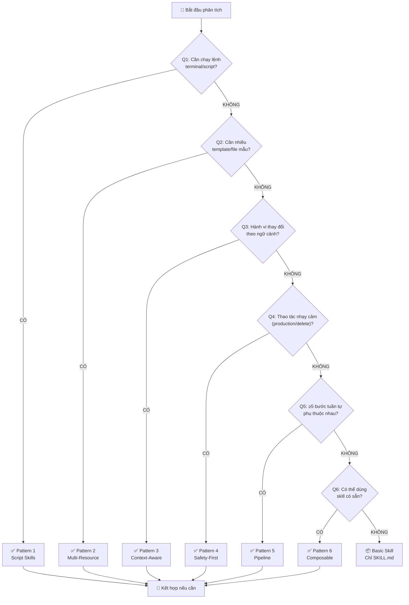

# 🔎 Pattern Detection — Bảng quyết định chọn kiến trúc Skill

Dùng tài liệu này trong Phase 3 để tự động nhận diện pattern phù hợp
cho skill dựa trên thông tin đã thu thập.

---

## Decision Tree (Cây quyết định)



> **Lưu ý:** Một skill có thể kết hợp NHIỀU pattern cùng lúc.
> VD: Deploy app = Pipeline + Safety-First + Script

---

## Keyword Triggers (Từ khóa nhận diện)

Khi user mô tả quy trình, tìm các từ khóa sau để detect pattern:

### Pattern 1: Script Skills

| Từ khóa từ user | Nhận diện |
|---|---|
| "chạy lệnh", "run command" | ✅ Cần scripts/ |
| "đọc file", "ghi file", "parse" | ✅ Cần scripts/ |
| "gọi API", "curl", "request" | ✅ Cần scripts/ |
| "đếm", "thống kê", "phân tích data" | ✅ Cần scripts/ |
| "convert", "chuyển đổi format" | ✅ Cần scripts/ |

### Pattern 2: Multi-Resource

| Từ khóa từ user | Nhận diện |
|---|---|
| "theo mẫu", "template", "format chuẩn" | ✅ Cần resources/templates/ |
| "nhiều loại", "tùy trường hợp" | ✅ Nhiều template |
| "có sẵn file mẫu" | ✅ Cần resources/ |
| "theo quy chuẩn công ty" | ✅ Cần resources/standards/ |
| "thuật ngữ chuyên ngành" | ✅ Cần resources/glossary.md |

### Pattern 3: Context-Aware

| Từ khóa từ user | Nhận diện |
|---|---|
| "tùy thuộc vào", "nếu là... thì" | ✅ Logic rẽ nhánh |
| "khác nhau cho mỗi", "tùy dự án" | ✅ Strategies khác nhau |
| "có nhiều cách" | ✅ Multiple approaches |
| "phụ thuộc vào tech stack" | ✅ Tech-aware |

### Pattern 4: Safety-First

| Từ khóa từ user | Nhận diện |
|---|---|
| "production", "server thật", "live" | ✅ Cần Safety Check |
| "xóa", "delete", "drop" | ✅ Destructive operation |
| "deploy", "phát hành", "release" | ✅ Cần confirmation |
| "database", "dữ liệu quan trọng" | ✅ Sensitive data |
| "API key", "mật khẩu", "token" | ✅ Secrets handling |
| "backup trước", "không được mất" | ✅ Data protection |

### Pattern 5: Pipeline

| Từ khóa từ user | Nhận diện |
|---|---|
| "trước tiên... rồi... sau đó" | ✅ Sequential steps |
| "nếu fail thì dừng" | ✅ Stage gating |
| "phải pass hết mới được" | ✅ All-or-nothing |
| "mỗi bước phụ thuộc bước trước" | ✅ Dependencies |
| "quy trình nhiều giai đoạn" | ✅ Multi-stage |

### Pattern 6: Composable

| Từ khóa từ user | Nhận diện |
|---|---|
| "giống như skill X nhưng..." | ✅ Extend existing |
| "trước đó phải chạy..." | ✅ Pre-requisite skill |
| "kết hợp mấy việc lại" | ✅ Orchestration |

---

## Complexity Scoring (Chấm điểm phức tạp)

### Bảng tính điểm

| Yếu tố | Điểm | Cách đếm |
|---|---|---|
| Mỗi bước trong quy trình | +1 | Đếm steps từ phỏng vấn |
| Mỗi quy tắc/constraint | +1 | Đếm rules từ phỏng vấn |
| Cần chạy script/lệnh | +3 | 1 lần nếu có bất kỳ script nào |
| Có logic rẽ nhánh | +2/nhánh | Đếm số nhánh if/else |
| Thao tác production/nhạy cảm | +5 | 1 lần nếu chạm production |
| Cần nhiều template | +2 | 1 lần nếu ≥2 templates |
| Cần kết nối API/service | +3 | 1 lần nếu có integration |
| Có rollback/undo | +2 | 1 lần nếu cần undo |

### Bảng phân loại

| Tổng điểm | Mức độ | Emoji | Cấu trúc file | Thời gian sinh |
|---|---|---|---|---|
| 1-5 | Đơn giản | 🟢 | SKILL.md only | ~2 phút |
| 6-12 | Trung bình | 🟡 | + examples/ | ~5 phút |
| 13-20 | Phức tạp | 🟠 | + resources/ + examples/ | ~10 phút |
| 21+ | Rất phức tạp | 🔴 | + scripts/ + resources/ + examples/ | ~15 phút |

---

## Ví dụ phân tích thực tế

### Case 1: "Viết email trả lời khách hàng"

```
Steps: 3 (+3)
Rules: 2 (+2) = "Luôn chào bằng tên, tone chuyên nghiệp"
Script: Không (+0)
Rẽ nhánh: 2 (+4) = "Nếu hỏi giá / Nếu khiếu nại"
Production: Không (+0)
Template: Có (+2) = "Mẫu email reply"
───────────────────
TỔNG: 11 → 🟡 Trung bình → SKILL.md + examples/ + resources/templates/
```

### Case 2: "Deploy ứng dụng Next.js lên Vercel"

```
Steps: 6 (+6) = lint, test, build, env check, deploy, verify
Rules: 4 (+4) = "Test phải pass, không deploy thứ 6, backup DB..."
Script: Có (+3) = chạy npm run lint, test, build
Rẽ nhánh: 3 (+6) = "Nếu lint fail / test fail / build fail"
Production: Có (+5) = deploy lên server thật
Template: Không (+0)
Rollback: Có (+2)  
───────────────────
TỔNG: 26 → 🔴 Rất phức tạp → Full structure
```

### Case 3: "Format tin nhắn commit Git"

```
Steps: 4 (+4) = diff, analyze, format, suggest
Rules: 3 (+3) = "Conventional Commits, chữ thường, không dấu chấm"
Script: Không (+0) = chỉ dùng git diff
Rẽ nhánh: 0 (+0)
Production: Không (+0)
Template: Không (+0)
───────────────────
TỔNG: 7 → 🟡 Trung bình → SKILL.md + examples/
```

---

## Pattern Combination Matrix (Ma trận kết hợp)

Một số kết hợp phổ biến:

| Use case | Pattern combo | Ví dụ |
|---|---|---|
| Deploy pipeline an toàn | P5 + P4 + P1 | CI/CD pipeline |
| Sinh báo cáo đa dạng | P2 + P3 | Report generator |
| Quản trị database | P4 + P1 | DB migration helper |
| Review code tự động | P5 + P6 | Uses lint + test skills |
| Onboarding dự án mới | P2 + P3 + P6 | Project scaffolder |

### Quy tắc kết hợp

- ✅ Có thể kết hợp tối đa **3 patterns**
- ⚠️ Nếu cần ≥4 patterns → Tách thành nhiều skill + dùng P6 (Composable)
- ❌ KHÔNG kết hợp P5 + P6 quá sâu (pipeline gọi skill gọi pipeline = nightmare)
