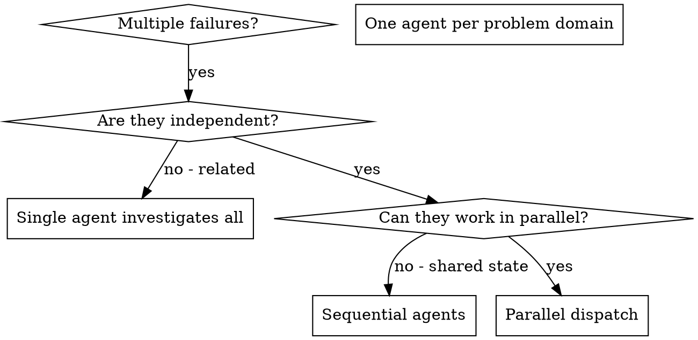

```dot
digraph when_to_use {
    "Multiple failures?" [shape=diamond];
    "Are they independent?" [shape=diamond];
    "Single agent investigates all" [shape=box];
    "One agent per problem domain" [shape=box];
    "Can they work in parallel?" [shape=diamond];
    "Sequential agents" [shape=box];
    "Parallel dispatch" [shape=box];

    "Multiple failures?" -> "Are they independent?" [label="yes"];
    "Are they independent?" -> "Single agent investigates all" [label="no - related"];
    "Are they independent?" -> "Can they work in parallel?" [label="yes"];
    "Can they work in parallel?" -> "Parallel dispatch" [label="yes"];
    "Can they work in parallel?" -> "Sequential agents" [label="no - shared state"];
}
```
