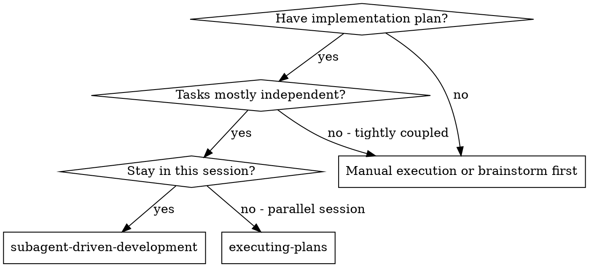

# Subagent-Driven Development

Execute plan by dispatching fresh subagent per task, with two-stage review after each: spec compliance review first, then code quality review.

**Why subagents:** You delegate tasks to specialized agents with isolated context. By precisely crafting their instructions and context, you ensure they stay focused and succeed at their task. They should never inherit your session's context or history — you construct exactly what they need. This also preserves your own context for coordination work.

**Core principle:** Fresh subagent per task + two-stage review (spec then quality) = high quality, fast iteration

## When to Use

**vs. Executing Plans (parallel session):**
- Same session (no context switch)
- Fresh subagent per task (no context pollution)
- Two-stage review after each task: spec compliance first, then code quality
- Faster iteration (no human-in-loop between tasks)

## 📚 Bách Khoa Toàn Thư (Knowledge Base & SOPs)

> [!TIP]
> File này đã được Đại Phẫu V2 ép chuẩn Kiến Trúc 9-Layer (Lazy-Loading) bởi ABM. Các ví dụ, giới hạn, và quy trình xử lý cồng kềnh đã được rút vứt vào kho dự phòng.
> Để đọc bộ tài liệu đầy đủ cực kỳ quan trọng đó, hãy chạy Tool `view_file` dọc vào đây trước khi bắt tay làm:
> 👉 **/Users/dungtq/ABM-Workforce/.agents/skills/subagent-driven-development/references/sop.md**

<!-- 📦 Refactored by ABM Skill Architect v2.0 | Mass-Extraction Token Decoupling -->
