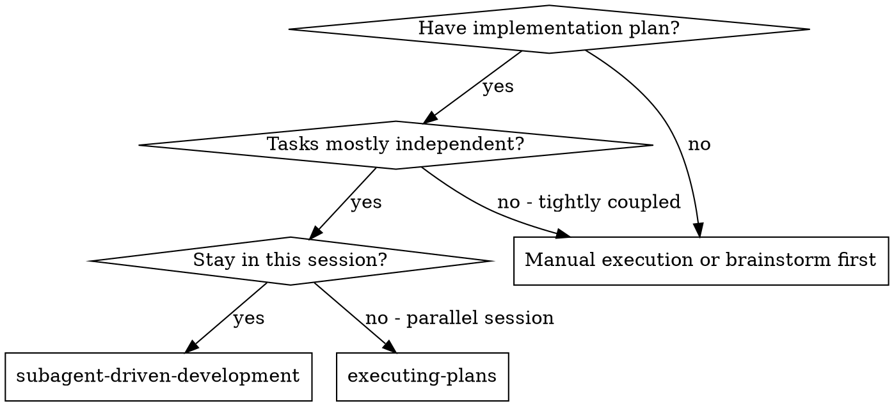
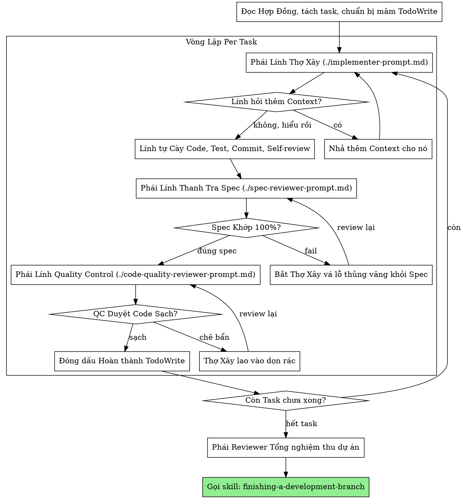

# Sơ đồ Tư Duy Điều Phối Lính Đánh Thuê (Subagent Flow)

## Tiêu chí Lựa chọn Giữa Execute Inline và Subagent

```dot
digraph when_to_use {
    "Have implementation plan?" [shape=diamond];
    "Tasks mostly independent?" [shape=diamond];
    "Stay in this session?" [shape=diamond];
    "subagent-driven-development" [shape=box];
    "executing-plans" [shape=box];
    "Manual execution or brainstorm first" [shape=box];

    "Have implementation plan?" -> "Tasks mostly independent?" [label="yes"];
    "Have implementation plan?" -> "Manual execution or brainstorm first" [label="no"];
    "Tasks mostly independent?" -> "Stay in this session?" [label="yes"];
    "Tasks mostly independent?" -> "Manual execution or brainstorm first" [label="no - tightly coupled"];
    "Stay in this session?" -> "subagent-driven-development" [label="yes"];
    "Stay in this session?" -> "executing-plans" [label="no - parallel session"];
}
```

## Chuỗi Hành Vi của Jarvis (Orchestrator Process)

```dot
digraph process {
    rankdir=TB;

    subgraph cluster_per_task {
        label="Vòng Lặp Per Task";
        "Phái Lính Thợ Xây (./implementer-prompt.md)" [shape=box];
        "Lính hỏi thêm Context?" [shape=diamond];
        "Nhả thêm Context cho nó" [shape=box];
        "Lính tự Cày Code, Test, Commit, Self-review" [shape=box];
        "Phái Lính Thanh Tra Spec (./spec-reviewer-prompt.md)" [shape=box];
        "Spec Khớp 100%?" [shape=diamond];
        "Bắt Thợ Xây vá lỗ thủng văng khỏi Spec" [shape=box];
        "Phái Lính Quality Control (./code-quality-reviewer-prompt.md)" [shape=box];
        "QC Duyệt Code Sạch?" [shape=diamond];
        "Thợ Xây lao vào dọn rác" [shape=box];
        "Đóng dấu Hoàn thành TodoWrite" [shape=box];
    }

    "Đọc Hợp Đồng, tách task, chuẩn bị mâm TodoWrite" [shape=box];
    "Còn Task chưa xong?" [shape=diamond];
    "Phái Reviewer Tổng nghiệm thu dự án" [shape=box];
    "Gọi skill: finishing-a-development-branch" [shape=box style=filled fillcolor=lightgreen];

    "Đọc Hợp Đồng, tách task, chuẩn bị mâm TodoWrite" -> "Phái Lính Thợ Xây (./implementer-prompt.md)";
    "Phái Lính Thợ Xây (./implementer-prompt.md)" -> "Lính hỏi thêm Context?";
    "Lính hỏi thêm Context?" -> "Nhả thêm Context cho nó" [label="có"];
    "Nhả thêm Context cho nó" -> "Phái Lính Thợ Xây (./implementer-prompt.md)";
    "Lính hỏi thêm Context?" -> "Lính tự Cày Code, Test, Commit, Self-review" [label="không, hiểu rồi"];
    "Lính tự Cày Code, Test, Commit, Self-review" -> "Phái Lính Thanh Tra Spec (./spec-reviewer-prompt.md)";
    "Phái Lính Thanh Tra Spec (./spec-reviewer-prompt.md)" -> "Spec Khớp 100%?";
    "Spec Khớp 100%?" -> "Bắt Thợ Xây vá lỗ thủng văng khỏi Spec" [label="fail"];
    "Bắt Thợ Xây vá lỗ thủng văng khỏi Spec" -> "Phái Lính Thanh Tra Spec (./spec-reviewer-prompt.md)" [label="review lại"];
    "Spec Khớp 100%?" -> "Phái Lính Quality Control (./code-quality-reviewer-prompt.md)" [label="đúng spec"];
    "Phái Lính Quality Control (./code-quality-reviewer-prompt.md)" -> "QC Duyệt Code Sạch?";
    "QC Duyệt Code Sạch?" -> "Thợ Xây lao vào dọn rác" [label="chê bẩn"];
    "Thợ Xây lao vào dọn rác" -> "Phái Lính Quality Control (./code-quality-reviewer-prompt.md)" [label="review lại"];
    "QC Duyệt Code Sạch?" -> "Đóng dấu Hoàn thành TodoWrite" [label="sạch"];
    "Đóng dấu Hoàn thành TodoWrite" -> "Còn Task chưa xong?";
    "Còn Task chưa xong?" -> "Phái Lính Thợ Xây (./implementer-prompt.md)" [label="còn"];
    "Còn Task chưa xong?" -> "Phái Reviewer Tổng nghiệm thu dự án" [label="hết task"];
    "Phái Reviewer Tổng nghiệm thu dự án" -> "Gọi skill: finishing-a-development-branch";
}
```
