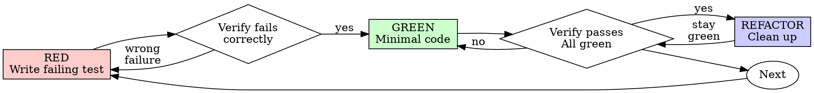

```dot
digraph tdd_cycle {
    rankdir=LR;
    red [label="RED\nWrite failing test", shape=box, style=filled, fillcolor="#ffcccc"];
    verify_red [label="Verify fails\ncorrectly", shape=diamond];
    green [label="GREEN\nMinimal code", shape=box, style=filled, fillcolor="#ccffcc"];
    verify_green [label="Verify passes\nAll green", shape=diamond];
    refactor [label="REFACTOR\nClean up", shape=box, style=filled, fillcolor="#ccccff"];
    next [label="Next", shape=ellipse];

    red -> verify_red;
    verify_red -> green [label="yes"];
    verify_red -> red [label="wrong\nfailure"];
    green -> verify_green;
    verify_green -> refactor [label="yes"];
    verify_green -> green [label="no"];
    refactor -> verify_green [label="stay\ngreen"];
    verify_green -> next;
    next -> red;
}
```
