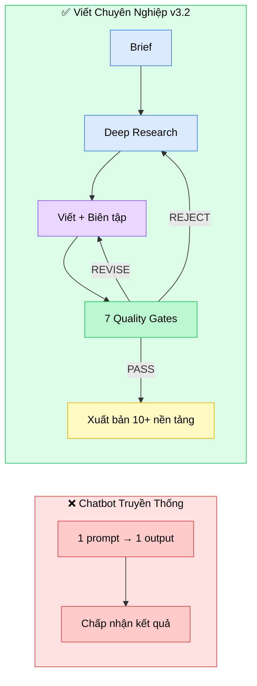
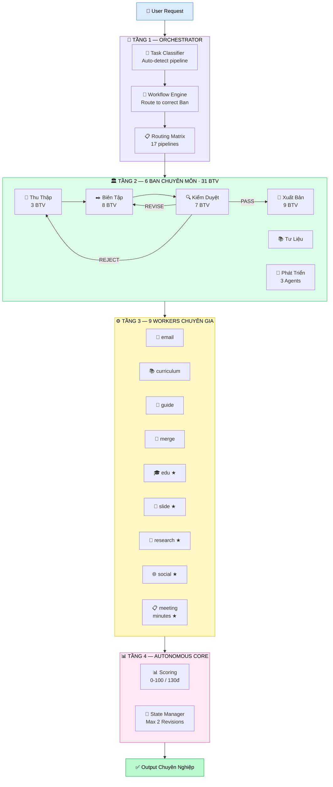
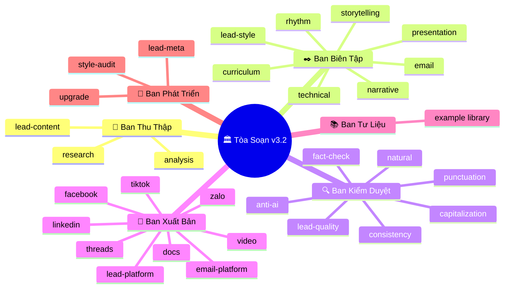
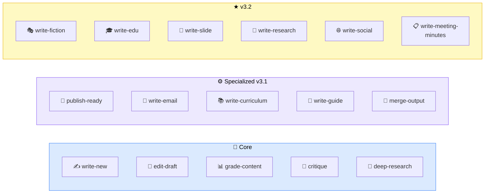
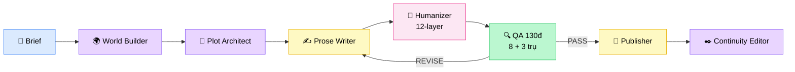
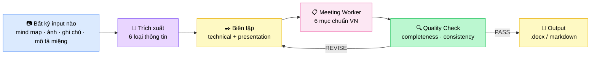
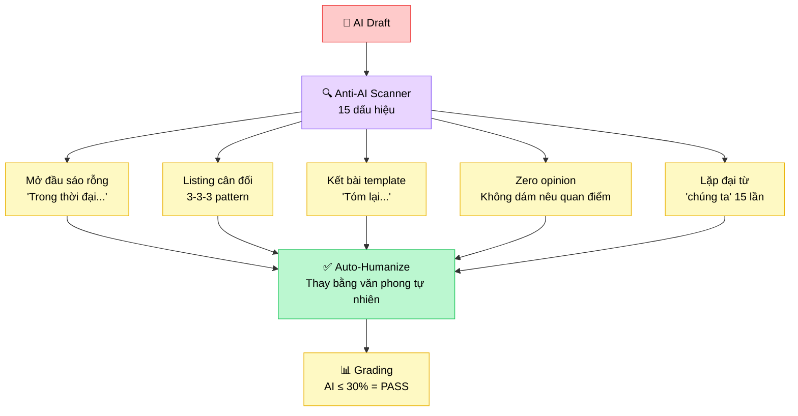
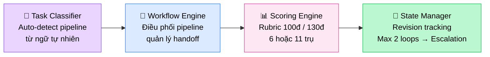
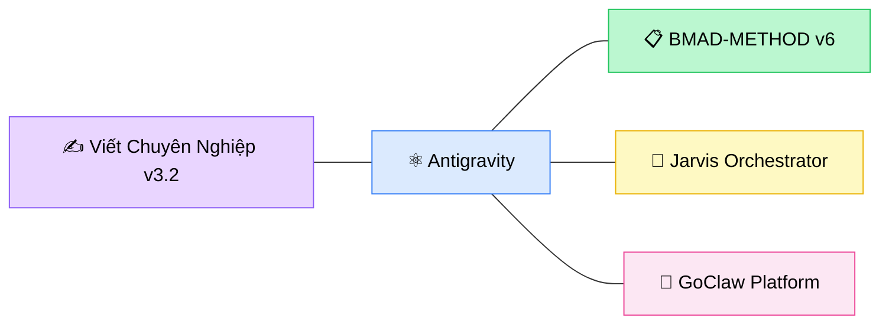

<div align="center">

  

# ✍️ VIẾT CHUYÊN NGHIỆP `v3.2`

### Kiến Trúc Tòa Soạn AI — Vietnamese Professional Writing Engine

> *Không phải chatbot viết bài. Đây là một **tòa soạn báo hoàn chỉnh** vận hành bên trong AI —  
> với Tổng Biên Tập, 6 Ban chuyên môn, 42 biên tập viên, và 17 quy trình sản xuất.*

**6 Ban** · **31 Biên Tập Viên** · **9 Workers** · **17 Pipelines** · **4 Autonomous Engines**

[](.)
[](.)
[](.)
[](.)
[](LICENSE)
[](.)
[](.)

</div>

---

## 🧬 Tại Sao Tòa Soạn, Không Phải Chatbot?

> *"Một chatbot viết bài — giống một intern làm tất cả. Tạm dùng được.*  
> *Nhưng tòa soạn — mỗi người một vai, mỗi bài qua 7 gate — mới tạo ra xuất sắc."*



| Tòa soạn thật | Viết Chuyên Nghiệp v3.2 |
|:---|:---|
| Phóng viên đi thực địa | **Ban Thu Thập** — deep research trước khi viết |
| 8 biên tập viên chuyên biệt | **Ban Biên Tập** — storytelling, rhythm, narrative, technical... |
| Tổng biên tập duyệt bài | **Ban Kiểm Duyệt** — 7 gate kiểm tra song song |
| Trưởng ban phát hành | **Ban Xuất Bản** — 10+ nền tảng |
| Phòng tư liệu | **Ban Tư Liệu** — thư viện bài mẫu đã kiểm duyệt |
| Phòng R&D | **Ban Phát Triển** — tự audit, tự nâng cấp |

---

## ⚡ Quick Start — 30 Giây

```bash
# 🚀 Kích hoạt Tổng Biên Tập
/viet-pro

# ✍️ Viết ebook
/viet-pro viết ebook "AI cho doanh nghiệp Việt Nam"

# 📊 Chấm bài (rubric 100đ, 6 chiều)
/viet-pro chấm bài article.md

# 📧 Viết email sequence
/viet-pro viết email "5-email nurture cho khóa coaching AI"

# 🎭 Viết truyện fiction ★
/viet-pro viết truyện "Đô thị tu tiên — nhân vật chính dân IT"

# 🎤 Tạo slide thuyết trình ★
/viet-pro tạo slide "AI trong doanh nghiệp — hội nghị 2026"

# 🔬 Viết white paper ★
/viet-pro viết nghiên cứu "Xu hướng ESG tại Việt Nam 2026"

# 🌐 Content đa nền tảng ★
/viet-pro viết social "Repurpose → Facebook, LinkedIn, TikTok, Twitter"

# 📋 Viết biên bản cuộc họp ★ NEW
/viet-pro viết biên bản họp "Sprint review tuần 11 — 5 thành viên"
```

---

## 🏗️ Kiến Trúc — 4 Tầng Xử Lý



---

## 🎯 6 Ban — 31 Biên Tập Viên



<details>
<summary><b>📰 Ban Thu Thập (Content)</b> — 3 BTV · <i>Deep research trước mọi bài viết</i></summary>

| BTV | Chức năng |
|:----|:----------|
| `lead-content` | Trưởng ban — Bóc brief, xác định scope |
| `research` | Nghiên cứu sâu 5 lớp, cross-verify |
| `analysis` | Phân tích audience, angle, cạnh tranh |

</details>

<details>
<summary><b>✒️ Ban Biên Tập (Style)</b> — 8 BTV · <i>Mỗi BTV = 1 chuyên môn biên tập</i></summary>

| BTV | Chức năng |
|:----|:----------|
| `lead-style` | Trưởng ban — Chọn tone, phân bổ BTV |
| `storytelling` | Kể chuyện, narrative arc, hook |
| `rhythm` | Nhịp văn, câu ngắn/dài, punch line |
| `narrative` | Cấu trúc tường thuật, POV, signpost |
| `presentation` | Visual hierarchy, slide format |
| `technical` | Văn phong kỹ thuật, chuyên ngành |
| `email` | Subject line, body, CTA, sequence |
| `curriculum` | Bloom's Taxonomy, module design |

</details>

<details>
<summary><b>🔍 Ban Kiểm Duyệt (Quality)</b> — 7 BTV · <i>7 gate chạy song song → PASS / REVISE / REJECT</i></summary>

| BTV | Gate |
|:----|:-----|
| `lead-quality` | Tổng hợp 6 gate, ra quyết định cuối |
| `punctuation` | Dấu câu, chính tả |
| `capitalization` | Viết hoa, viết thường chuẩn Việt |
| `natural` | Văn phong tự nhiên, không sáo rỗng |
| `anti-ai` | **15 dấu hiệu AI** — phát hiện & loại bỏ |
| `fact-check` | Kiểm chứng sự kiện, 5-tier source |
| `consistency` | Nhất quán thuật ngữ xuyên suốt |

</details>

<details>
<summary><b>📡 Ban Xuất Bản (Platform)</b> — 9 BTV · <i>Tối ưu native cho từng nền tảng</i></summary>

| BTV | Nền tảng |
|:----|:---------|
| `lead-platform` | Trưởng ban — Chọn kênh, phân bổ |
| `facebook` | Facebook VN 2026 — hook, engagement |
| `tiktok` | TikTok Gen Z — script ngắn, trending |
| `linkedin` | LinkedIn B2B — thought leadership |
| `video` | Kịch bản video (short + long form) |
| `email-platform` | Email marketing, deliverability |
| `zalo` | Zalo OA / ZNS — locale VN |
| `threads` | Meta Threads — conversational |
| `docs` | PDF / DOCX / Notion — tài liệu chuẩn |

</details>

<details>
<summary><b>📚 Ban Tư Liệu</b> + <b>🔬 Ban Phát Triển</b></summary>

**📚 Tư Liệu** — Thư viện bài mẫu đã qua quality gate. Làm reference cho các BTV.

**🔬 Phát Triển** — 3 agents tự nâng cấp hệ thống:
| Agent | Chức năng |
|:------|:----------|
| `lead-meta` | Điều phối nâng cấp |
| `upgrade` | Phân tích feedback, đề xuất cải tiến |
| `style-audit` | Audit style consistency toàn hệ thống |

</details>

---

## 🔄 17 Pipelines — Mọi Nhu Cầu Viết



| Pipeline | Mô tả | Luồng |
|:---------|:-------|:------|
| `write-new` | Viết mới bất kỳ nội dung nào | content → style → quality → platform |
| `edit-draft` | Sửa bản nháp cho tự nhiên | content → style → quality |
| `grade-content` | Chấm bài thang 100 điểm | content → quality (rubric) |
| `critique-content` | Phản biện đa chiều | content → quality (logic + fact) |
| `deep-research` | Nghiên cứu chuyên sâu | content → quality |
| `publish-ready` | Kiểm duyệt cuối trước xuất bản | quality → platform |
| `write-email` | Email marketing / B2B / nurture | content → style → quality → platform |
| `write-curriculum` | Giáo trình theo Bloom's Taxonomy | content → style → quality → platform |
| `write-guide` | User Guide / SOP / FAQ | content → style → quality → platform |
| `merge-output` | Ghép file, verify encoding | merge-worker → quality |
| **`write-fiction`** ★ | Truyện fiction 8 thể loại | content → style → quality **130đ** → platform |
| **`write-edu`** ★ | Tài liệu học tập | content → edu-worker → quality → platform |
| **`write-slide`** ★ | Slide thuyết trình | content → slide-worker → quality → platform |
| **`write-research`** ★ | White paper, policy brief | content → research-worker → quality → platform |
| **`write-social`** ★ | Social đa nền tảng + repurpose | content → social-worker → quality → multi-platform |
| **`write-meeting-minutes`** ★ | Biên bản cuộc họp chuẩn VN | content → meeting-minutes-worker → quality → platform (.docx) |

---

## ⚙️ 9 Workers — Chuyên Gia Thực Thi

> *Workers bổ sung **execution templates** và **domain frameworks**. Workers KHÔNG thay thế BTV — Pipeline gọi BTV trước → Worker bổ sung chuyên môn.*

| Worker | Chức năng | Version |
|:-------|:----------|:--------|
| `email-worker` | Templates email B2B, nurture, cold outreach | v3.1 |
| `curriculum-worker` | Bloom's Taxonomy, ADDIE, module design | v3.1 |
| `guide-worker` | SOP structure, RACI, troubleshooting | v3.1 |
| `merge-worker` | File concatenation, encoding verify | v3.1 |
| **`edu-worker`** ★ | Handout, workbook, quiz, lesson plan | **v3.2** |
| **`slide-worker`** ★ | Narrative arc, ≤7 từ/title, speaker notes | **v3.2** |
| **`research-writer-worker`** ★ | 5-tier source evaluation, citation | **v3.2** |
| **`social-writer-worker`** ★ | 6 platforms, cross-platform repurposing | **v3.2** |
| **`meeting-minutes-worker`** ★ | 6 mục chuẩn VN, action items, ký tên | **v3.2** |

---

## 🎭 Spotlight: Fiction Engine

> *Pipeline sáng tạo mạnh nhất — 7+1 agent, QA **130 điểm**, 8 thể loại.*



**8 thể loại:** Tiên hiệp · Đô thị · Ngôn tình · Huyền huyễn · Khoa huyễn · Kinh dị · Trinh thám · Lịch sử

---

## 📋 Spotlight: Meeting Minutes Pipeline ★ NEW

> *Mind map, ảnh chụp, ghi chú nháp → Biên bản cuộc họp chuẩn hành chính Việt Nam.*



**Cấu trúc 6 mục:** `I. Thông tin` · `II. Mục tiêu` · `III. Nội dung thảo luận` · `IV. Phân công & Deadline` · `V. Rút kinh nghiệm` · `VI. Kết thúc + Ký tên`

---

## 🛡️ Anti-AI Detection Engine

> *Vấn đề lớn nhất của AI writing: đọc là biết AI viết. Engine này giải quyết tận gốc.*



---

## 🧠 Autonomous Core — 4 Engine



- **Task Classifier** — User nói tự nhiên → hệ thống tự nhận diện pipeline phù hợp
- **Workflow Engine** — Điều phối pipeline, quản lý handoff giữa các Ban
- **Scoring Engine** — Chấm 6 chiều (100đ) cho non-fiction, 11 trụ (130đ) cho fiction
- **State Manager** — Theo dõi revision loop (max 2 vòng), risk flags, escalation

---

## 🎓 Tính Năng Nổi Bật

<table>
<tr>
<td width="50%">

### 🔬 Deep Research First
Mọi bài viết bắt đầu bằng nghiên cứu 5 lớp — không bao giờ viết "từ không khí." Source Trust Framework phân loại nguồn 5 tier.

</td>
<td width="50%">

### 📊 Scoring 100đ / 130đ
Rubric 6 chiều cho non-fiction. Rubric 11 trụ cho fiction (8 gốc + 3 anti-AI). Mọi output đều có quality stamp.

</td>
</tr>
<tr>
<td width="50%">

### 🔄 Self-Healing Pipeline
Quality gate → `REVISE` → quay lại sửa → kiểm tra lại. Max 2 vòng. `REJECT` → escalation → content nghiên cứu lại.

</td>
<td width="50%">

### 📡 10+ Platform Output
1 nội dung gốc → repurpose native cho Facebook, TikTok, LinkedIn, Twitter/X, Video, Email, Zalo, Threads, Docs, Blog.

</td>
</tr>
<tr>
<td width="50%">

### 🛡️ Anti-AI Detection
BTV chuyên trách phát hiện & loại bỏ 15 dấu vết AI. Output đọc như **con người viết** — không phải máy.

</td>
<td width="50%">

### 📋 Meeting Minutes → .docx
Mind map, ảnh, ghi chú → biên bản 6 mục chuẩn hành chính VN. Bảng action items + ký tên. Xuất .docx.

</td>
</tr>
<tr>
<td width="50%">

### 🎭 Fiction Engine
8 thể loại, 7+1 agents chuyên biệt, QA 130 điểm. World Builder → Plot → Prose → 12-layer Humanizer.

</td>
<td width="50%">

### 🧩 Modular & Extensible
Thêm Ban? Tạo folder. Thêm BTV? Drop file `.md`. Thêm pipeline? 1 file trong `Team-Orchestration/`.

</td>
</tr>
</table>

---

## 📊 Scoring Rubric

### Non-Fiction (100 điểm)
| Dimension | Weight | Description |
|:----------|:------:|:------------|
| **Nội dung** | 25% | Depth, originality, value |
| **Cấu trúc** | 20% | Logic flow, hierarchy |
| **Phong cách** | 15% | Tone, voice, readability |
| **Chính xác** | 20% | Facts, data, citations |
| **Anti-AI** | 10% | Natural language patterns |
| **Format** | 10% | Layout, visual hierarchy |

> **Fiction pipeline** dùng rubric riêng **130 điểm**: 8 trụ gốc (storyline, character, world, prose, rhythm, dialogue, theme, ending) + 3 trụ anti-AI.

---

## 📂 Cấu Trúc Dự Án

```
viet-chuyen-nghiep/
│
├── 📄 SKILL.md                    # Core brain — Tổng Biên Tập
├── 📄 viet-pro.md                 # Workflow trigger
├── 📄 workforce-config.json       # Cấu hình workforce
├── 📄 CHANGELOG.md                # Version history
│
├── 🏛️ Ban/                        # ═══ 6 BAN CHUYÊN MÔN ═══
│   ├── content/                   #   📰 Thu Thập (3 BTV)
│   ├── style/                     #   ✒️ Biên Tập (8 BTV)
│   ├── quality/                   #   🔍 Kiểm Duyệt (7 BTV)
│   ├── platform/                  #   📡 Xuất Bản (9 BTV)
│   ├── examples/                  #   📚 Tư Liệu
│   └── meta/                      #   🔬 Phát Triển (3 Agents)
│
├── ⚙️ Workers/                    # ═══ 9 WORKERS ═══
│   ├── email-worker.md
│   ├── curriculum-worker.md
│   ├── guide-worker.md
│   ├── merge-worker.md
│   ├── edu-worker.md              # ★ v3.2
│   ├── slide-worker.md            # ★ v3.2
│   ├── research-writer-worker.md  # ★ v3.2
│   ├── social-writer-worker.md    # ★ v3.2
│   └── meeting-minutes-worker.md  # ★ v3.2 NEW
│
├── 🔄 Team-Orchestration/         # 17 Pipeline definitions
├── 🧠 Autonomous-Core/            # 4 Engine files
├── 📖 Context-Layer/              # Knowledge Base + Second Brain
├── 🎯 Orchestrator/               # Routing Matrix + Delegation
├── 📝 Memory/                     # Session memory
├── 📚 docs/                       # Documentation
├── 🎬 output/                     # Generated content
└── 🔧 scripts/                    # Utility scripts
```

---

## 📜 Changelog

Xem chi tiết tại [CHANGELOG.md](CHANGELOG.md).

| Version | Highlights |
|:--------|:-----------|
| **v3.2** ★ | +6 Pipelines (fiction/edu/slide/research/social/meeting-minutes), +5 Workers, 130đ Fiction QA, .docx output |
| **v3.1** | +3 Workers (email/curriculum/guide), +Zalo/Threads BTV, merge-output pipeline |
| **v3.0** | Kiến Trúc Tòa Soạn — 6 Ban, 25→31 BTV, Autonomous Core |
| **v2.0** | Worker-based architecture, SubAgents |
| **v1.0** | Single-agent writing system |

---

## 🤝 Ecosystem

<div align="center">



Được xây dựng bởi **[ABM](https://github.com/xaotiensinh-abm)** — AI Business Mastery

Powered by **Antigravity** · **BMAD-METHOD** v6 · **Jarvis** Multi-Agent · **GoClaw** AI Gateway

</div>

---

<div align="center">

> *"Viết hay — không phải vì AI giỏi.*  
> *Viết hay — vì có **tòa soạn giỏi** đứng sau AI."*

**Viết Chuyên Nghiệp v3.2** · **42 Agents** · **17 Pipelines** · **10+ Platforms**

Made with ❤️ in Vietnam 🇻🇳

</div>
