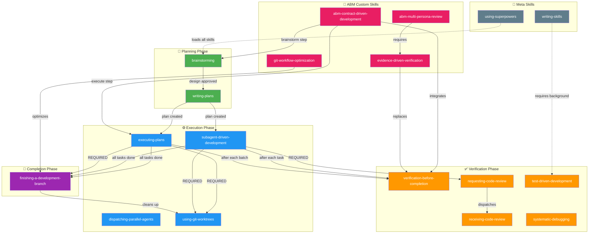
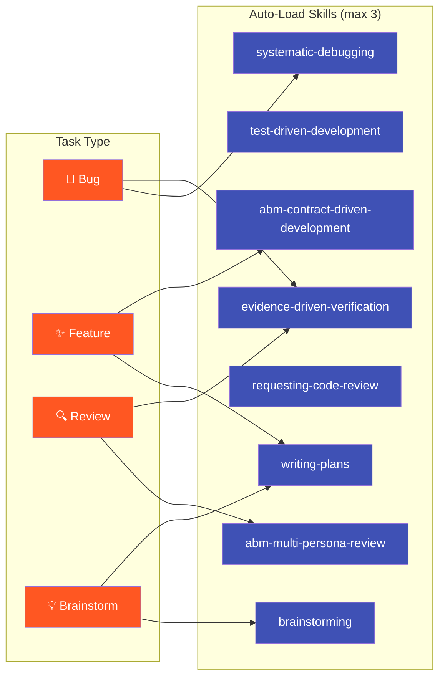

# ABM-Vibecoding — Dependency Graph

## Skill Dependencies

```mermaid
graph TD
    subgraph "🧠 Planning Phase"
        BS[brainstorming]
        WP[writing-plans]
    end

    subgraph "⚙️ Execution Phase"
        EP[executing-plans]
        SDD[subagent-driven-development]
        DPA[dispatching-parallel-agents]
        GW[using-git-worktrees]
    end

    subgraph "✅ Verification Phase"
        VBC[verification-before-completion]
        RCR[requesting-code-review]
        RECV[receiving-code-review]
        TDD[test-driven-development]
        SD[systematic-debugging]
    end

    subgraph "🏁 Completion Phase"
        FDB[finishing-a-development-branch]
    end

    subgraph "🔷 ABM Custom Skills"
        ACDD[abm-contract-driven-development]
        AMPR[abm-multi-persona-review]
        GWO[git-workflow-optimization]
        EDV[evidence-driven-verification]
    end

    subgraph "📖 Meta Skills"
        US[using-superpowers]
        WS[writing-skills]
    end

    %% Core workflow flow
    BS -->|"design approved"| WP
    WP -->|"plan created"| EP
    WP -->|"plan created"| SDD
    EP -->|"all tasks done"| FDB
    SDD -->|"all tasks done"| FDB

    %% Required dependencies
    EP -->|"REQUIRED"| GW
    SDD -->|"REQUIRED"| GW
    EP -->|"REQUIRED"| FDB
    SDD -->|"REQUIRED"| RCR
    FDB -->|"cleans up"| GW

    %% Verification links
    RCR -->|"dispatches"| RECV
    SDD -->|"after each task"| VBC
    EP -->|"after each batch"| VBC

    %% ABM integration
    ACDD -->|"integrates"| VBC
    ACDD -->|"brainstorm step"| BS
    ACDD -->|"execute step"| EP
    AMPR -->|"requires"| EDV
    EDV -->|"replaces"| VBC
    GWO -->|"optimizes"| FDB

    %% Meta
    US -.->|"loads all skills"| BS
    WS -.->|"requires background"| TDD

    %% Styling
    classDef planning fill:#4CAF50,color:white
    classDef execution fill:#2196F3,color:white
    classDef verification fill:#FF9800,color:white
    classDef completion fill:#9C27B0,color:white
    classDef abm fill:#E91E63,color:white
    classDef meta fill:#607D8B,color:white

    class BS,WP planning
    class EP,SDD,DPA,GW execution
    class VBC,RCR,RECV,TDD,SD verification
    class FDB completion
    class ACDD,AMPR,GWO,EDV abm
    class US,WS meta
```

## Skill Routing Table

```mermaid
graph LR
    subgraph "Task Type"
        BUG[🐛 Bug]
        FEAT[✨ Feature]
        REV[🔍 Review]
        BRAIN[💡 Brainstorm]
    end

    subgraph "Auto-Load Skills (max 3)"
        S1[systematic-debugging]
        S2[test-driven-development]
        S3[writing-plans]
        S4[evidence-driven-verification]
        S5[requesting-code-review]
        S6[abm-multi-persona-review]
        S7[brainstorming]
        S8[abm-contract-driven-development]
    end

    BUG --> S1
    BUG --> S4
    FEAT --> S3
    FEAT --> S8
    REV --> S6
    REV --> S4
    BRAIN --> S7
    BRAIN --> S3

    classDef task fill:#FF5722,color:white
    classDef skill fill:#3F51B5,color:white
    class BUG,FEAT,REV,BRAIN task
    class S1,S2,S3,S4,S5,S6,S7,S8 skill
```
