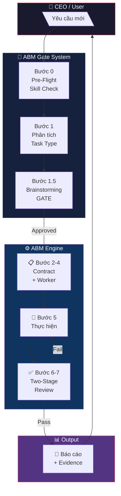
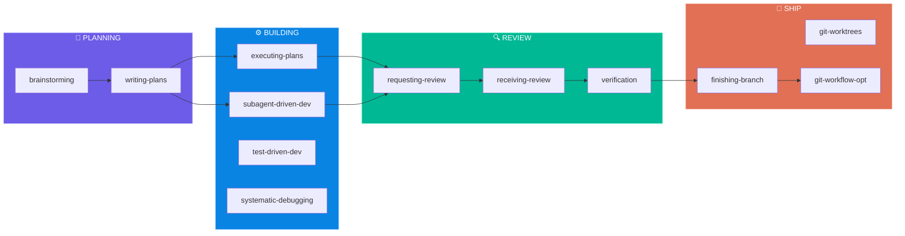
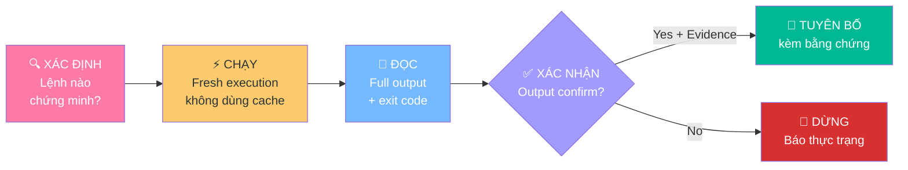
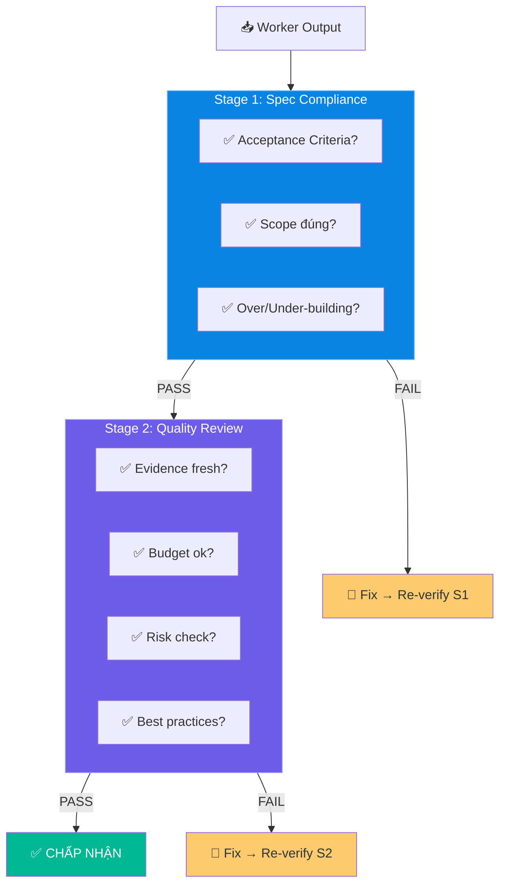
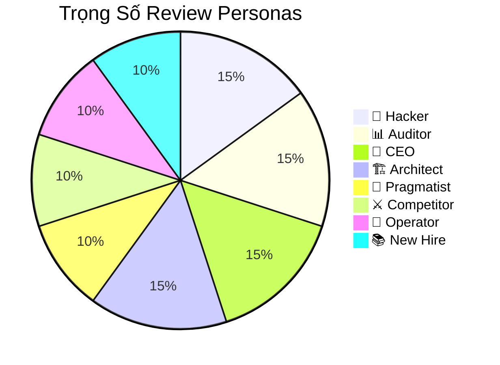

<div align="center">

# 🧠 ABM-Vibecoding

### *AI-Powered Agentic Skills Framework for Vibecoding Workflow*

[](skills/)
[](GETTING-STARTED.md)
[](LICENSE)
[](https://github.com/obra/superpowers)

**Hệ thống 18 skills agentic tích hợp ABM Workforce orchestration — tối ưu hóa cho Vibecoding workflow.**

[Quick Start](#-quick-start) · [Skills](#-18-skills) · [Architecture](#-architecture) · [ABM Integration](#-abm-workforce-integration) · [Usage Guide](USAGE-GUIDE.md) · [Contributing](#-contributing)

</div>

---

## ⚡ Điểm nổi bật

<table>
<tr>
<td width="50%">

### 🔮 Superpowers gốc
- 14 dev skills
- Manual orchestration
- Code review only
- English documentation
- Basic verification

</td>
<td width="50%">

### 🚀 ABM-Vibecoding
- **18 skills** (14 + 4 ABM custom)
- **6-bước Delegation Chain** tự động
- **8-persona multi-dimensional review**
- **100% Tiếng Việt** cho business output
- **Iron Law + Rationalization Table**

</td>
</tr>
</table>

---

## 🏗 Architecture



---

## 📦 18 Skills

### Workflow Pipeline



### Danh sách đầy đủ

<table>
<tr>
<th>🧠 Planning</th>
<th>⚙️ Building</th>
<th>🔍 Review</th>
<th>🚀 Ship</th>
</tr>
<tr>
<td>

`brainstorming`
`writing-plans`

</td>
<td>

`executing-plans`
`subagent-driven-dev`
`test-driven-dev`
`systematic-debugging`
`dispatching-parallel`

</td>
<td>

`requesting-code-review`
`receiving-code-review`
`verification-before-completion`

</td>
<td>

`using-git-worktrees`
`finishing-a-dev-branch`
`using-superpowers`
`writing-skills`

</td>
</tr>
</table>

### 🔷 4 Custom ABM Skills

<table>
<tr>
<td width="25%" align="center">

**📋 Contract-Driven Dev**

6-bước Delegation Chain
`Contract → Worker →`
`Attestation → Verify`

</td>
<td width="25%" align="center">

**🔍 Multi-Persona Review**

8 personas × weighted scoring
`Hacker · Auditor · CEO`
`Architect · Pragmatist`

</td>
<td width="25%" align="center">

**✅ Evidence Verification**

Iron Law + Rationalization
`"Chưa có evidence`
`= chưa kết luận"`

</td>
<td width="25%" align="center">

**🚀 Git Workflow Opt**

Pre-push checklist
`Convention · Branch`
`Strategy · CI/CD`

</td>
</tr>
</table>

---

## 🛡️ Iron Law — Kỷ Luật Sắt

> **KHÔNG KẾT LUẬN MÀ CHƯA CÓ BẰNG CHỨNG XÁC MINH MỚI (FRESH).**
>
> *Vi phạm chữ = vi phạm tinh thần. Không có ngoại lệ.*



### Rationalization Table — Bảng Chống Biện Minh

| 🤔 Biện minh | ⚡ Thực tế |
|---|---|
| *"Chắc là ok rồi"* | → **CHẠY** lệnh xác minh |
| *"Tôi tự tin"* | → Confidence ≠ evidence |
| *"Agent nói success"* | → Verify **INDEPENDENTLY** |
| *"Quá đơn giản để sai"* | → Đơn giản ≈ **dễ sai nhất** |
| *"Mệt, cần nhanh"* | → Mệt ≠ excuse |
| *"Spirit vs letter"* | → Vi phạm letter = vi phạm spirit |

---

## 🔷 ABM Workforce Integration

### Two-Stage Review



### 8-Persona Review System



---

## 🚀 Quick Start

```powershell
# 1. Clone
git clone https://github.com/xaotiensinh-abm/ABM-Vibecoding.git

# 2. Verify
cd ABM-Vibecoding
Get-ChildItem -Recurse -Filter "SKILL.md" skills\ | Measure-Object
# → Count: 18

# 3. Explore
cat GETTING-STARTED.md
```

> 📖 Xem chi tiết tại **[GETTING-STARTED.md](GETTING-STARTED.md)**

---

## 📂 Cấu trúc dự án

```
ABM-Vibecoding/
├── 📄 GEMINI.md                     ← Entry point (auto-load)
├── 📄 GETTING-STARTED.md            ← Quick start guide
├── 📄 DEPENDENCY-GRAPH.md           ← Skill dependency map
├── 📄 gemini-extension.json         ← Gemini CLI config
│
├── 🧠 skills/
│   ├── brainstorming/               ← 💡 Ideation workflow
│   ├── writing-plans/               ← 📋 Implementation plans
│   ├── executing-plans/             ← ⚙️ Plan execution
│   ├── test-driven-development/     ← 🧪 TDD discipline
│   ├── systematic-debugging/        ← 🔧 4-phase debugging
│   ├── subagent-driven-development/ ← 🤖 Multi-agent execution
│   ├── dispatching-parallel-agents/ ← ⚡ Parallel dispatch
│   ├── requesting-code-review/      ← 🔍 Review workflow
│   ├── receiving-code-review/       ← 📝 Feedback handling
│   ├── verification-before-completion/ ← ✅ Verification gate
│   ├── using-git-worktrees/         ← 🌿 Branch isolation
│   ├── finishing-a-development-branch/ ← 🏁 Branch completion
│   ├── using-superpowers/           ← 📖 Meta + tool mapping
│   ├── writing-skills/              ← ✍️ Skill creation (TDD)
│   │
│   ├── abm-contract-driven-development/ ← 📋 [ABM] Delegation Chain
│   ├── abm-multi-persona-review/    ← 🔍 [ABM] 8-persona review
│   ├── evidence-driven-verification/← ✅ [ABM] Iron Law
│   └── git-workflow-optimization/   ← 🚀 [ABM] Push optimization
│
├── 🪝 hooks/                        ← Git hooks (Windows)
└── 🧪 tests/                        ← Test suite
```

---

## 🔧 Git Workflow

```powershell
# Commit Convention
git commit -m "feat(skill-name): mô tả thay đổi"
git commit -m "skill(new-skill): initial implementation"
git commit -m "fix(debugging): sửa lỗi regex pattern"
git commit -m "docs: cập nhật Getting Started"

# Branch Strategy
#   main     → Production-ready (PR only)
#   develop  → Integration
#   skill/*  → New skill development
#   fix/*    → Bug fixes
```

---

## 🙏 Credits

<table>
<tr>
<td align="center">

**obra/superpowers**
Framework gốc v5.0.0
[GitHub](https://github.com/obra/superpowers)

</td>
<td align="center">

**ABM Workforce**
AI Business Master
Orchestration System

</td>
<td align="center">

**Antigravity**
Google Deepmind
Advanced Agentic Coding

</td>
</tr>
</table>

---

<div align="center">

*📦 Customized by ABM Skill Generator v1.0 | ABM Workforce | Antigravity*

**[⬆ Back to Top](#-abm-vibecoding)**

</div>
