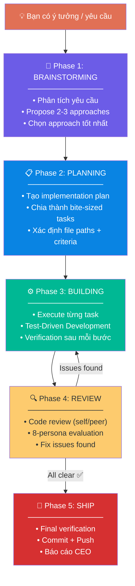
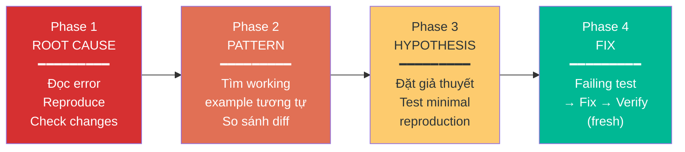
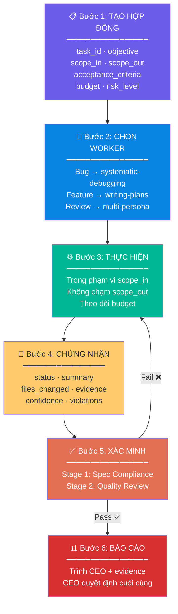
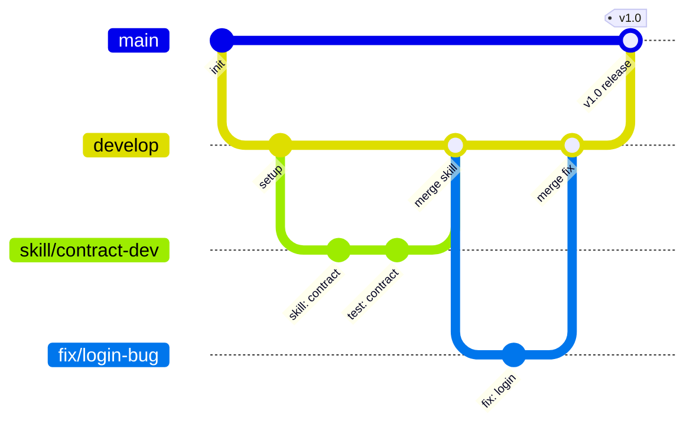

<div align="center">

# 📖 Hướng Dẫn Sử Dụng ABM-Vibecoding

### *Từ cài đặt đến thành thạo — hướng dẫn chi tiết từng bước*

</div>

---

## 📑 Mục Lục

- [1. Cài đặt & Cấu hình](#1--cài-đặt--cấu-hình)
- [2. Hiểu về Skills](#2--hiểu-về-skills)
- [3. Workflow Cơ Bản](#3--workflow-cơ-bản)
- [4. Hướng Dẫn Từng Skill](#4--hướng-dẫn-từng-skill)
- [5. ABM Delegation Chain](#5--abm-delegation-chain)
- [6. Iron Law & Verification](#6--iron-law--verification)
- [7. Git Workflow](#7--git-workflow)
- [8. Tình Huống Thực Tế](#8--tình-huống-thực-tế)
- [9. Troubleshooting](#9--troubleshooting)
- [10. FAQ](#10--faq)

---

## 1. 🔧 Cài Đặt & Cấu Hình

### Yêu cầu hệ thống

| Thành phần | Yêu cầu |
|---|---|
| OS | Windows 10+ / macOS / Linux |
| Git | 2.30+ |
| Node.js | 18+ (cho tests) |
| AI Agent | Gemini CLI (Antigravity) / Claude Code / Cursor |

### Cài đặt

```powershell
# Bước 1: Clone repo
git clone https://github.com/xaotiensinh-abm/ABM-Vibecoding.git
cd ABM-Vibecoding

# Bước 2: Xác minh
Get-ChildItem -Recurse -Filter "SKILL.md" skills\ | Measure-Object
# → Count: 18 ← Đúng 18 skills

# Bước 3: Kiểm tra entry point
cat GEMINI.md
# Nội dung: @skills/using-superpowers/SKILL.md + @...antigravity-tools.md
```

### Cấu hình cho từng nền tảng

<table>
<tr>
<th>Nền tảng</th>
<th>Entry File</th>
<th>Cách cấu hình</th>
</tr>
<tr>
<td>Gemini CLI / Antigravity</td>
<td><code>GEMINI.md</code></td>
<td>Tự động load khi mở workspace chứa repo</td>
</tr>
<tr>
<td>Claude Code</td>
<td><code>CLAUDE.md</code></td>
<td>Đổi tên <code>GEMINI.md</code> → <code>CLAUDE.md</code></td>
</tr>
<tr>
<td>Cursor</td>
<td><code>.cursorrules</code></td>
<td>Copy nội dung <code>GEMINI.md</code> vào <code>.cursorrules</code></td>
</tr>
</table>

> 💡 **Tip:** Repo hoạt động tốt nhất khi nằm trong thư mục workspace của dự án bạn đang làm, hoặc được reference qua `@` syntax.

---

## 2. 🧠 Hiểu Về Skills

### Skill là gì?

Skill = bộ hướng dẫn cho AI agent, giống như **SOP (Standard Operating Procedure)** cho AI. Mỗi skill dạy AI cách làm một việc cụ thể, với workflow rõ ràng và verification bắt buộc.

### Cấu trúc một skill

```
skills/brainstorming/
└── SKILL.md          ← File chính (bắt buộc)
    ├── Frontmatter   ← name + description (trigger AI kích hoạt)
    ├── Goal          ← Mục tiêu 1 câu
    ├── Instructions  ← Quy trình từng bước
    ├── Examples      ← Ví dụ input → output
    └── Constraints   ← Quy tắc + giới hạn
```

### Khi nào skill được kích hoạt?

AI đọc `description` trong frontmatter để tự quyết định khi nào dùng skill:

```yaml
---
name: systematic-debugging
description: Use when encountering any bug, error, or unexpected behavior...
---
```

> 🔑 **Quan trọng:** Bạn KHÔNG cần gõ tên skill. AI tự nhận biết context và kích hoạt skill phù hợp dựa trên câu hỏi của bạn.

### Cách gọi skill thủ công

Nếu muốn ép AI dùng skill cụ thể:
```
Hãy dùng skill "brainstorming" để phân tích ý tưởng này: ...
```

---

## 3. 🔄 Workflow Cơ Bản

### Vòng đời một task



### Ví dụ giao tiếp từng phase

**Phase 1 — Brainstorming:**
```
Bạn: "Tôi muốn thêm dark mode cho dashboard"

AI:  "Để phân tích, tôi đề xuất 3 approaches:
      1. CSS Variables — nhanh, ít code
      2. Theme Provider — linh hoạt, scalable
      3. Tailwind dark: — cần refactor lớn
      → Khuyến nghị: Option 2. CEO approve?"

Bạn: "ok"
```

**Phase 2 — Planning:**
```
AI:  "Implementation plan:
      Task 1: Tạo ThemeContext (src/contexts/theme.js) — 3 phút
      Task 2: Dark color tokens (src/styles/dark.css) — 3 phút
      Task 3: Toggle component (src/components/ThemeToggle.jsx) — 5 phút
      Task 4: Integrate vào App.jsx — 2 phút
      Verification: Build pass + visual check"
```

**Phase 3-5 — Build → Review → Ship:**
```
AI thực thi từng task → Verify → Review → Push
```

---

## 4. 📦 Hướng Dẫn Từng Skill

### 🧠 `brainstorming` — Tư duy ý tưởng

**Dùng khi:** Bắt đầu feature mới, cần phân tích requirements, hoặc muốn explore nhiều hướng giải quyết.

```
Bạn: "Brainstorm cách tổ chức API cho ứng dụng e-commerce"
AI:  → Phân tích → Đề xuất 3 architectures → So sánh → Waiting CEO chọn
```

**Quy tắc quan trọng:**
- AI phải đề xuất ít nhất 2-3 approaches
- Mỗi approach có **pros/cons** rõ ràng
- KHÔNG code trước khi bạn approve design

---

### 📋 `writing-plans` — Viết kế hoạch

**Dùng khi:** Sau brainstorming, cần triển khai ý tưởng thành bước cụ thể.

```
Bạn: "Viết plan implement dark mode theo Option 2"
AI:  → Plan chi tiết: file paths, code changes, verification commands
```

**Quy tắc Bite-Sized Tasks:**
- Mỗi task **2-5 phút** (không hơn)
- File paths **chính xác** (không mô tả chung)
- Verification command **cụ thể** cho từng task
- Nếu task > 5 phút → **TÁCH** thành sub-tasks

---

### ⚙️ `executing-plans` — Thực thi kế hoạch

**Dùng khi:** Có plan rồi, cần AI thực thi từng bước.

```
Bạn: "Execute plan dark mode"
AI:  → Task 1: ✅ → Task 2: ✅ → Task 3: ✅ → Verify → Done
```

**Quy tắc:**
- AI đọc plan TRƯỚC khi code
- Thực thi ĐÚNG THỨ TỰ trong plan
- Verify MỖI task trước khi chuyển task tiếp
- Nếu gặp vấn đề → DỪNG, báo bạn

---

### 🧪 `test-driven-development` — TDD

**Dùng khi:** Viết feature mới cần tests đi kèm, hoặc muốn ensure code quality.

```
Bạn: "Viết function calculateDiscount() với tests trước"
AI:  → Viết test (RED) → Viết code (GREEN) → Refactor → Verify
```

**Cycle:** `RED → GREEN → REFACTOR`
1. **RED:** Viết test → chạy → FAIL (expected)
2. **GREEN:** Viết code minimal → chạy → PASS
3. **REFACTOR:** Clean up → chạy lại → vẫn PASS

---

### 🔧 `systematic-debugging` — Debug có hệ thống

**Dùng khi:** Gặp bug, error, hoặc behavior bất thường.

```
Bạn: "API trả về 500 error khi login"
AI:  → Phase 1: Root Cause → Phase 2: Pattern → Phase 3: Hypothesis → Phase 4: Fix
```

**4-Phase Protocol:**



> ⚠️ **3+ lần fix thất bại → DỪNG.** Đây là vấn đề kiến trúc, không phải bug đơn giản.

---

### 🔍 `requesting-code-review` + `receiving-code-review`

**Dùng khi:** Cần AI review code, hoặc bạn review code của AI.

```
Bạn: "Review lại code dark mode trước khi merge"
AI:  → Đọc diff → Check patterns → Phát hiện issues → Đề xuất fixes
```

---

### 🤖 `dispatching-parallel-agents` — Chạy đa tuyến

**Dùng khi:** Có nhiều tasks độc lập có thể chạy song song, tăng tốc workflow.

```
Bạn: "Fix 3 bugs này cùng lúc: login timeout, CSS overflow, API 404"
AI:  → Dispatch Agent 1 (login) + Agent 2 (CSS) + Agent 3 (API) → Thu kết quả
```

---

### 🌿 `using-git-worktrees` — Làm việc song song trên Git

**Dùng khi:** Cần develop feature mới mà không ảnh hưởng branch hiện tại.

```
Bạn: "Tạo worktree cho feature payment integration"
AI:  → git worktree add → Develop → Test → Clean up
```

---

### 🏁 `finishing-a-development-branch` — Hoàn tất branch

**Dùng khi:** Feature done, cần merge/push/cleanup.

**Options:**
1. ✅ **Merge locally** — merge vào develop/main
2. ✅ **Push + Create PR** — push lên GitHub, tạo Pull Request
3. ✅ **Keep as-is** — giữ nguyên branch
4. ⚠️ **Discard** — xóa branch (cần confirm)

---

## 5. 📋 ABM Delegation Chain

### 6-Bước Bắt Buộc

Khi bạn giao việc phức tạp, ABM-Vibecoding sử dụng **Contract-Driven Development**:



### Ví dụ Contract thực tế

```yaml
task_id: TG-dev-W1
objective: Fix login timeout > 30s trên dashboard
scope_in: src/auth/login.js, src/api/timeout.js
scope_out: src/auth/register.js, database/
acceptance_criteria: Login < 3s, 0 timeout errors trong 10 lần test
budget: 15 tool calls, 2 retries
risk_level: trung bình
```

---

## 6. 🛡️ Iron Law & Verification

### Quy tắc sắt

> **KHÔNG KẾT LUẬN MÀ CHƯA CÓ BẰNG CHỨNG MỚI (FRESH).**

Điều này có nghĩa:
- AI phải **CHẠY** lệnh verify, không được nói "chắc là ok"
- Evidence phải **MỚI** (fresh) — không dùng output cũ
- Phải **SHOW** evidence cho bạn — không chỉ nói "đã test"

### Ví dụ đúng vs sai

```
❌ SAI:
AI: "Đã sửa xong bug login timeout. Lỗi nằm ở config API."
→ Thiếu evidence! Chưa chạy test! Không có proof!

✅ ĐÚNG:
AI: "Đã sửa timeout config 5ms → 5000ms trong timeout.js:42.
    Evidence: npm test → 24/24 passed (exit code 0).
    Login response time: avg 1.2s (trước: >30s)."
→ Có evidence cụ thể, fresh, measurable.
```

### 8-Persona Review

Khi bạn cần đánh giá sâu (architecture, code quality, security):

```
Bạn: "Review toàn bộ auth module"

AI chạy 8 góc nhìn:
  🔴 Hacker   → "JWT secret hardcoded → 🔴 Critical"
  📊 Auditor  → "Thiếu login attempt logging → 🟡"
  💼 CEO      → "Auth serve 100% users → ✅"
  🏗️ Architect → "Thiếu rate limiting → 🟡"
  🔧 Pragmatist → "Code clean → ✅"
  ⚔️ Competitor → "Industry standard → ✅"
  🔄 Operator → "Thiếu health check → 🟡"
  📚 New Hire → "README rõ, thiếu API docs → 🔵"
  
  Tổng: 7.8/10 → Action plan P0/P1/P2
```

---

## 7. 🚀 Git Workflow

### Commit Convention

```bash
# Format
<type>(<scope>): <mô tả ngắn gọn>

# Types
feat     → Feature mới
fix      → Sửa bug
docs     → Documentation
style    → Formatting (không ảnh hưởng logic)
refactor → Refactor code
test     → Thêm / sửa tests
chore    → Maintenance tasks
skill    → Thêm / sửa skill
```

### Ví dụ commit messages

```bash
feat(auth): thêm OAuth2 login flow
fix(dashboard): sửa lỗi chart không render trên mobile
skill(abm-review): thêm adversarial testing example
docs: cập nhật usage guide với git workflow
chore: cleanup unused dependencies
```

### Branch Strategy



### Pre-Push Checklist

Trước khi push, AI sẽ tự động kiểm tra:

```
✅ 1. VERIFY  — Tests pass? Build ok?
✅ 2. CLEAN   — Git status clean? Staged đúng files?
✅ 3. COMMIT  — Message theo convention?
✅ 4. BRANCH  — Đúng branch? Base updated?
✅ 5. REVIEW  — Self-review diff trước push?
✅ 6. PUSH    — Push lên đúng remote
```

---

## 8. 💼 Tình Huống Thực Tế

### Tình huống 1: Fix bug khẩn cấp

```
Bạn: "Trang checkout bị crash khi user nhấn Pay, fix gấp"

AI workflow:
1. 🔧 systematic-debugging kích hoạt
2. Phase 1: Đọc error → "TypeError: cart.total is undefined"
3. Phase 2: Tìm working example → cart.js:87 thiếu null check
4. Phase 3: Hypothesis → "cart data chưa load xong khi render"
5. Phase 4: Thêm loading state + null check → Test pass
6. ✅ Evidence: "npm test → 42/42 passed, checkout flow OK"
7. 🚀 Commit + Push
```

### Tình huống 2: Feature mới từ đầu

```
Bạn: "Thêm tính năng dark mode cho toàn bộ app"

AI workflow:
1. 🧠 brainstorming → Đề xuất 3 approaches → CEO chọn
2. 📋 writing-plans → Plan 4 tasks bite-sized
3. ⚙️ executing-plans → Thực thi từng task
4. 🔍 verification → Test + visual check
5. 📝 code-review → Self-review diff
6. 🚀 git-workflow → Commit + Push
```

### Tình huống 3: Review system trước deploy

```
Bạn: "Review toàn bộ system trước khi deploy production"

AI workflow:
1. 🔍 abm-multi-persona-review kích hoạt
2. Thu thập evidence: đếm files, đo lines, đọc code
3. 8 personas đánh giá: Hacker, Auditor, CEO, Architect...
4. Chấm điểm weighted → Tổng X.X/10
5. Phân loại findings: 🔴 🟡 🔵 ✅
6. Action plan: P0 → P1 → P2
7. Trình CEO quyết định
```

### Tình huống 4: Tạo skill mới

```
Bạn: "Tạo skill tự động viết API documentation"

AI workflow:
1. ✍️ writing-skills kích hoạt
2. Phỏng vấn: Skill làm gì? Trigger khi nào? Input/Output?
3. Pattern detection → Chọn complexity level
4. Generate SKILL.md → Test → Verify
5. Đăng ký vào skills/ directory
```

---

## 9. 🔧 Troubleshooting

### Skill không kích hoạt

| Vấn đề | Nguyên nhân | Giải pháp |
|---|---|---|
| AI không dùng skill | Description không match context | Gọi skill thủ công: "hãy dùng skill X" |
| AI dùng sai skill | Context mơ hồ | Mô tả rõ hơn yêu cầu |
| Skill không tìm thấy | Repo chưa trong workspace | Clone repo vào workspace |

### Verification errors

| Vấn đề | Nguyên nhân | Giải pháp |
|---|---|---|
| AI nói "xong" mà không có evidence | Vi phạm Iron Law | Yêu cầu: "Show evidence cho claim đó" |
| Test pass nhưng feature vẫn sai | Test coverage thiếu | Yêu cầu: "Thêm test cho edge case X" |
| AI lặp fix 3+ lần | Vấn đề kiến trúc | Yêu cầu: "DỪNG, phân tích root cause architecture" |

### Git issues

| Vấn đề | Giải pháp |
|---|---|
| Push bị reject | `git pull --rebase origin main` rồi push lại |
| Conflict khi merge | Resolve manually → commit → push |
| Commit sai branch | `git cherry-pick <hash>` sang đúng branch |

---

## 10. ❓ FAQ

<details>
<summary><b>Q: ABM-Vibecoding có cần API key không?</b></summary>

Không. ABM-Vibecoding là tập hợp skill files (markdown) — không cần API key, không cần server, không cần database. Chỉ cần AI agent có thể đọc files.
</details>

<details>
<summary><b>Q: Tôi có thể thêm skill mới không?</b></summary>

Có! Dùng skill `writing-skills` hoặc ABM Skill Generator workflow:
1. Tạo folder `skills/your-skill-name/`
2. Viết `SKILL.md` với frontmatter + Goal + Instructions + Examples + Constraints
3. Test → Verify → Commit
</details>

<details>
<summary><b>Q: Skills này hoạt động với Claude Code / Cursor không?</b></summary>

Có. Đổi `GEMINI.md` → `CLAUDE.md` cho Claude Code, hoặc copy nội dung vào `.cursorrules` cho Cursor. Skills sử dụng generic tool names nên tương thích cross-platform.
</details>

<details>
<summary><b>Q: ABM Delegation Chain có bắt buộc không?</b></summary>

Cho task phức tạp (multi-file, > 5 phút) — có, nên dùng Contract để ensure quality. Cho task đơn giản (1 file, < 2 phút) — không bắt buộc, AI sẽ tự xử lý nhanh.
</details>

<details>
<summary><b>Q: Iron Law có áp dụng cho mọi thứ không?</b></summary>

Iron Law áp dụng khi có **claim** về kết quả: "đã fix", "đã deploy", "tests pass". Không áp dụng cho thảo luận, brainstorming, hoặc planning — những hoạt động không có claim cụ thể.
</details>

<details>
<summary><b>Q: Có thể dùng tiếng Anh thay tiếng Việt không?</b></summary>

Skills và code comments dùng tiếng Anh. ABM business output (báo cáo, contract, attestation) mặc định tiếng Việt. Bạn có thể yêu cầu: "output bằng tiếng Anh" để thay đổi.
</details>

<details>
<summary><b>Q: Làm sao cập nhật khi có phiên bản mới?</b></summary>

```powershell
git pull origin main
Get-ChildItem -Recurse -Filter "SKILL.md" skills\ | Measure-Object
# Verify số lượng skills không giảm
```
</details>

---

<div align="center">

**📦 ABM-Vibecoding v1.0** · *Built with ❤️ by ABM Workforce*

[⬆ Về đầu trang](#-hướng-dẫn-sử-dụng-abm-vibecoding) · [README](README.md) · [Dependency Graph](DEPENDENCY-GRAPH.md)

</div>
