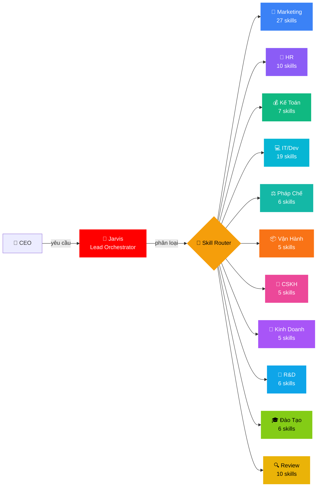
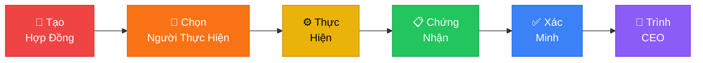
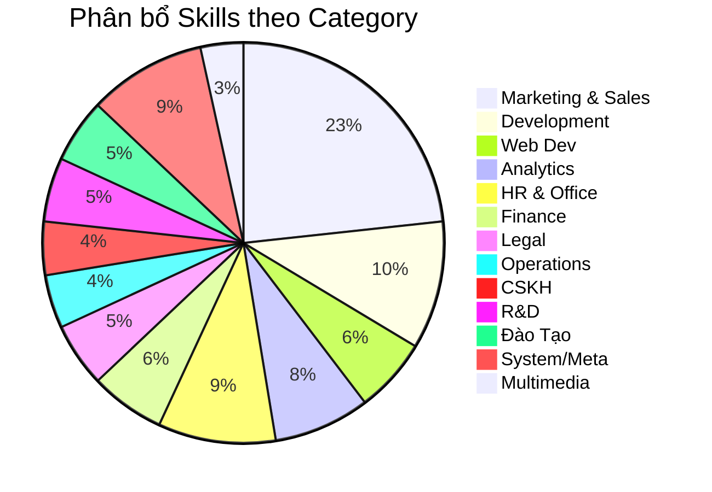
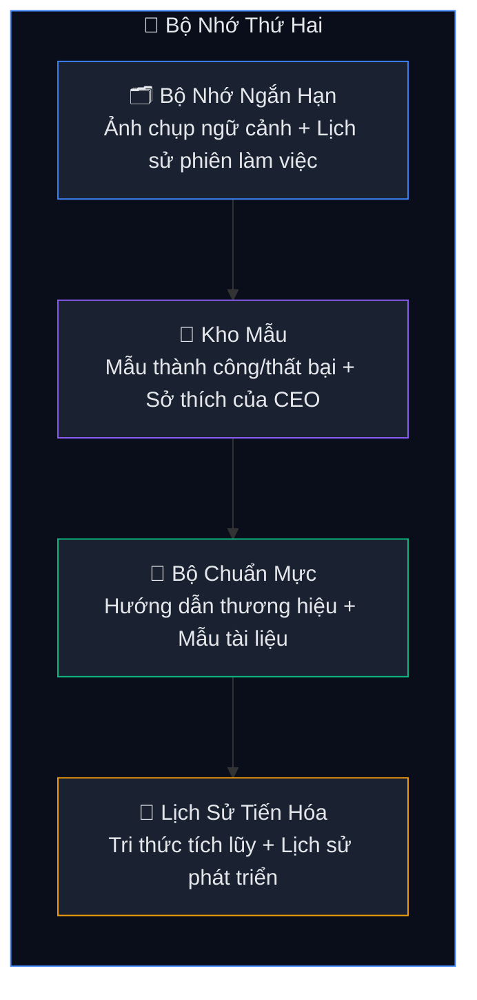

<p align="center">
  
</p>

<h1 align="center">🏢 ABM Workforce — AI Business Master</h1>

<p align="center">
  <strong>Hệ sinh thái AI đa tác tử (Multi-Agent) điều phối doanh nghiệp số — 11 phòng ban, 116 kỹ năng, 1 bộ não trung tâm.</strong>
</p>

<p align="center">
  <a href="ABM-CHANGELOG.md"></a>
  <a href="LICENSE"></a>
  <a href="_abm/_config/skill-manifest.csv"></a>
  <a href=".agents/workflows/"></a>
  <a href=".gemini/RULES.md"></a>
  <a href="dashboard/index.html"></a>
</p>

<p align="center">
  <em>Kỷ luật sắt · Bằng chứng thật · Kết quả đo được · 100% Tiếng Việt</em>
</p>

---

## 🎯 ABM Là Gì?

ABM Workforce biến AI thành **đội ngũ nhân sự số hoàn chỉnh** cho doanh nghiệp Việt Nam. Thay vì dùng AI rời rạc, ABM tổ chức AI thành **11 phòng ban** — mỗi phòng ban có tác tử riêng (agent — trợ lý AI chuyên biệt), kỹ năng riêng (skills — bộ hướng dẫn chuyên sâu), và quy trình riêng (workflow — luồng xử lý công việc) — tất cả được điều phối bởi **Jarvis** (bộ não trung tâm điều phối toàn hệ thống).

### 💬 Vibe Working — Làm Việc Bằng Cảm Xúc Với AI

**Chỉ cần nói tiếng Việt tự nhiên** — không cần học lệnh, không cần biết code. Bạn nói chuyện với AI như nói chuyện với đồng nghiệp, AI tự hiểu và làm việc cho bạn.

> **Vibe Working** = Bạn mô tả ý tưởng → AI tự phân loại → chọn phòng ban phù hợp → chọn kỹ năng cần thiết → thực hiện → trả kết quả kèm bằng chứng.



---

## ⚡ Bắt Đầu Trong 60 Giây

```bash
# 1. Clone
git clone https://github.com/xaotiensinh-abm/abm-workforce.git
cd abm-workforce

# 2. Mở IDE hỗ trợ .gemini/ rules
#    (Antigravity, Cursor, Gemini CLI, WindSurf...)
#    Không cần install — toàn bộ là Markdown + YAML

# 3. Gõ lệnh đầu tiên
/jarvis
```

> 🧠 Jarvis sẽ online và sẵn sàng nhận việc. Nói tiếng Việt — Jarvis tự phân loại và route.

---

## 🏗️ Kiến Trúc Hệ Thống

```mermaid
graph TB
    subgraph CORE["🧠 Lõi Hệ Thống"]
        J["Jarvis — Bộ não điều phối"]
        DC["Chuỗi Ủy Quyền"]
        VBC["Giao Thức Xác Minh"]
        CE["Kỹ Thuật Ngữ Cảnh"]
        PS["Lính Gác Prompt"]
    end

    subgraph AGENTS["🤖 Tầng Tác Tử — 8 Trợ Lý AI"]
        SA1["Chuyên gia Marketing"]
        SA2["Chuyên gia Nhân Sự"]
        SA3["Chuyên gia Phân Tích"]
        SA4["Kỹ sư Tự Động Hóa"]
        SA5["Quản lý Văn Phòng"]
        SA6["Chiến lược Sáng Tạo"]
        SA7["Chuyên gia R&D"]
        SA8["Chuyên gia Đào Tạo"]
    end

    subgraph SKILLS["🧩 Kho Kỹ Năng — 116 Bộ Hướng Dẫn"]
        S1["Marketing và Bán Hàng (27)"]
        S2["Phát Triển Phần Mềm (19)"]
        S3["Phân Tích Dữ Liệu (9)"]
        S4["Nhân Sự và Văn Phòng (11)"]
        S5["Kế Toán Tài Chính (7)"]
        S6["Pháp Chế (6)"]
        S7["Vận Hành (5)"]
        S8["Chăm Sóc Khách Hàng (5)"]
        S9["Nghiên Cứu Phát Triển (6)"]
        S10["Đào Tạo (6)"]
        S11["Hệ Thống Lõi (11)"]
        S12["Đa Phương Tiện (4)"]
    end

    subgraph MEMORY["💾 Bộ Nhớ Thứ Hai"]
        M1["Kho Tri Thức"]
        M2["Mẫu và Chuẩn Mực"]
        M3["Lịch Sử Tiến Hóa"]
        M4["Bộ Nhớ Phiên Làm Việc"]
    end

    CORE --> AGENTS
    AGENTS --> SKILLS
    SKILLS --> MEMORY

    style CORE fill:#FF0000,stroke:#cc0000,color:#fff
    style AGENTS fill:#3b82f6,stroke:#2563eb,color:#fff
    style SKILLS fill:#8b5cf6,stroke:#7c3aed,color:#fff
    style MEMORY fill:#10b981,stroke:#059669,color:#fff
```



---

## 🔐 Chuỗi Ủy Quyền — Quy Tắc Tối Thượng

*Chuỗi Ủy Quyền (Delegation Chain) là quy trình bắt buộc mỗi khi AI nhận việc — đảm bảo mọi công việc đều có hợp đồng, bằng chứng, và kiểm tra trước khi trả kết quả.*

Mọi công việc đều đi qua **6 bước bắt buộc** — bỏ bước nào = vi phạm:



| Bước | Mô tả |
|:----:|-------|
| 1 | **Hợp đồng** — Mục tiêu rõ ràng, phạm vi được phép / phạm vi cấm, tiêu chí chấp nhận, ngân sách, mức rủi ro |
| 2 | **Chọn người thực hiện** — Tự động phân tuyến đúng tác tử theo loại công việc |
| 3 | **Thực hiện** — Người thực hiện làm trong phạm vi được phép, không chạm phạm vi cấm |
| 4 | **Chứng nhận** — Trạng thái hoàn thành, bằng chứng, điểm tin cậy, danh sách file đã thay đổi |
| 5 | **Xác minh** — Kiểm tra 5 tiêu chí độc lập: tiêu chí chấp nhận, bằng chứng, phạm vi, ngân sách, rủi ro |
| 6 | **Trình CEO** — CEO quyết định cuối cùng dựa trên bằng chứng |

> **Trách nhiệm luôn đi LÊN**: Tác tử phụ → Người thực hiện → Jarvis → CEO

---

## 💡 18 Slash Commands

<table>
<tr>
<td width="33%">

### 🎯 Điều Phối
| Lệnh | Mô tả |
|-------|-------|
| `/jarvis` | Tổng điều phối |
| `/review` | Đánh giá 10 chiều |
| `/council` | Hội đồng phản biện |
| `/save` | Lưu trạng thái |
| `/recap` | Khôi phục ngữ cảnh |
| `/skill-sync` | Đồng bộ kỹ năng mới |

</td>
<td width="33%">

### 🏢 Phòng Ban
| Lệnh | Mô tả |
|-------|-------|
| `/marketing` | Nội dung, quảng cáo, SEO |
| `/sales` | Đề xuất, email mở đầu |
| `/hr` | Mô tả công việc, đánh giá, tuyển dụng |
| `/finance` | Báo cáo, thuế, dòng tiền |
| `/legal` | Hợp đồng, sở hữu trí tuệ |
| `/cskh` | Phiếu hỗ trợ, phản hồi |

</td>
<td width="33%">

### ⚙️ Chuyên Môn
| Lệnh | Mô tả |
|-------|-------|
| `/dev` | Viết mã, gỡ lỗi, tính năng mới |
| `/docs` | Quy trình, biên bản, đề xuất |
| `/report` | Chỉ số KPI, báo cáo tháng |
| `/rd` | Nghiên cứu AI, công nghệ mới |
| `/training` | Đào tạo, hội thảo thực hành |
| `/product-launch` | Phát triển + Marketing song song |

</td>
</tr>
</table>

```
💬 Không cần nhớ lệnh — nói chuyện tự nhiên:
   "Viết cho anh email giới thiệu sản phẩm phần mềm quản lý nhân sự"
   → Jarvis tự phân loại → chọn phòng Marketing → nạp kỹ năng phù hợp → thực hiện → trả kết quả
```

---

## 🧩 116 Skills — 12 Categories



<details>
<summary><strong>📣 Marketing & Sales — 27 skills</strong> (click mở)</summary>

`product-marketing-context` · `copywriting` · `copy-editing` · `content-strategy` · `social-content` · `email-marketing` · `email-sequence` · `marketing-psychology` · `page-cro` · `signup-flow-cro` · `form-cro` · `popup-cro` · `seo-audit` · `ai-seo` · `seo-content-planner` · `programmatic-seo` · `ab-test-setup` · `analytics-tracking` · `ad-creative` · `cold-email` · `sales-enablement` · `revops` · `pricing-strategy` · `launch-strategy` · `churn-prevention` · `referral-program` · `free-tool-strategy`
</details>

<details>
<summary><strong>🔧 Development — 12 skills</strong></summary>

`subagent-driven-development` · `dispatching-parallel-agents` · `writing-plans` · `code-review` · `systematic-debugging` · `finishing-a-development-branch` · `git-worktrees` · `project-hierarchy` · `sprint-planning` · `database-management` · `self-healing` · `github-issues-sprint`
</details>

<details>
<summary><strong>🌐 Web Development — 7 skills</strong></summary>

`ui-ux-pro-max` · `frontend-design` · `frontend-developer` · `vercel-react-best-practices` · `web-design-guidelines` · `vercel-composition-patterns` · `canvas-design`
</details>

<details>
<summary><strong>📈 Analytics — 9 skills</strong></summary>

`data-analysis` · `workflow-automation` · `competitive-landscape` · `market-sizing-analysis` · `startup-analyst` · `deep-research` · `competitor-intelligence` · `knowledge-graph` · `agentic-memory`
</details>

<details>
<summary><strong>👥 HR & Office — 11 skills</strong></summary>

`hr-operations` · `office-documents` · `internal-comms` · `brainstorming` · `performance-review` · `employee-engagement` · `talent-acquisition` · `docx` · `xlsx` · `pdf` · `pptx`
</details>

<details>
<summary><strong>💰 Finance — 7 skills</strong></summary>

`startup-financial-modeling` · `expense-management` · `cash-flow-forecast` · `tax-compliance` · `data-analysis` · `xlsx` · `pdf`
</details>

<details>
<summary><strong>⚖️ Legal — 6 skills</strong></summary>

`contract-review` · `compliance-checker` · `ip-protection` · `labor-law` · `docx` · `pdf`
</details>

<details>
<summary><strong>📦 Operations — 5 skills</strong></summary>

`supply-chain` · `inventory-management` · `logistics-optimization` · `quality-management` · `facility-management`
</details>

<details>
<summary><strong>💬 CSKH — 5 skills</strong></summary>

`churn-prevention` · `email-marketing` · `agent-email-cli` · `ticket-management` · `customer-feedback`
</details>

<details>
<summary><strong>🔬 R&D — 6 skills</strong> ✨ MỚI</summary>

`ai-trend-radar` · `tech-scouting` · `research-to-training` · `knowledge-builder` · `benchmark-lab` · `innovation-report`
</details>

<details>
<summary><strong>🎓 Đào Tạo — 6 skills</strong> ✨ MỚI</summary>

`course-design` · `lms-management` · `student-assessment` · `training-content` · `workshop-facilitation` · `certification-program`
</details>

<details>
<summary><strong>🔒 System/Meta — 11 skills</strong></summary>

`delegation-chain` · `verification-before-completion` · `context-engineering` · `skill-creator` · `multi-dimensional-review` · `knowledge-crystallizer` · `capability-evolver` · `memory-keeper` · `save` · `critical-thinking` · `prompt-sentinel`
</details>

<details>
<summary><strong>🎨 Multimedia — 4 skills</strong></summary>

`imagen` · `veo-video-gen` · `grok-imagen` · `freepik-spaces`
</details>

---

## 📊 Bảng Điều Khiển — Trung Tâm Giám Sát

Bảng điều khiển động theo dõi **toàn bộ hoạt động** của hệ thống, tự cập nhật mỗi 30 giây:

| Chế độ xem | Nội dung |
|------|---------|
| **🏠 Tổng Quan** | Dòng thời gian dự án, Điểm đánh giá 10 chiều, Mức phủ phòng ban, Trạng thái sức khỏe hệ thống |
| **📋 Lịch Sử Công Việc** | Bảng công việc có thể lọc theo phòng ban, sắp xếp, gắn nhãn kỹ năng |
| **📈 Phân Tích** | Kỹ năng được dùng nhiều nhất, Hoạt động của tác tử, Tiến độ theo thời gian |

> 📂 Mở `dashboard/index.html` để xem Bảng Điều Khiển.

---

## 🧠 Bộ Nhớ Thứ Hai — 4 Tầng Tri Thức

*Bộ Nhớ Thứ Hai (Second Brain) giúp hệ thống ghi nhớ mọi thứ qua các phiên làm việc — AI không quên những gì đã học.*



---

## 📁 Cấu Trúc Dự Án

```
abm-workforce/
├── 📋 .gemini/              → Rules toàn cục (100% Tiếng Việt)
├── ⚡ .agents/workflows/     → 18 slash commands
├── 🧠 _abm/
│   ├── bmm/agents/          → Jarvis + 8 SubAgents
│   │   └── skills/          → 116 skills (SKILL.md mỗi skill)
│   ├── _config/             → skill-manifest.csv (116 entries)
│   ├── SubAgents/           → 8 agent chuyên biệt
│   ├── Workers/             → 10 worker kỹ thuật
│   ├── Context-Layer/
│   │   ├── Knowledge-Base/  → KB entries (mirror skills)
│   │   └── Second-Brain/    → Memory + Patterns + Standards
│   └── Team-Orchestration/  → 14+ workflow pipelines
├── 📊 dashboard/            → Web Dashboard (dark theme + auto-sync)
├── 📖 docs/                 → FAQ + Quick Start + Changelog
└── 🔧 scripts/             → health-check.ps1
```

---

## 💬 Vibe Working Thực Tế — Nói Chuyện Tự Nhiên Với AI

> **Vibe Working** = Làm việc với AI bằng ngôn ngữ tự nhiên, như nói chuyện với đồng nghiệp. Không cần nhớ lệnh, không cần code — chỉ cần mô tả điều bạn muốn.

<table>
<tr>
<td width="50%">

**📣 Marketing — Viết Quảng Cáo**
```
Viết cho anh 10 mẫu quảng cáo Facebook
cho khóa học AI giá 1.200K,
nhắm đến sinh viên CNTT từ 20-28 tuổi,
giọng văn trẻ trung, có hook mạnh
```

**💰 Kế Toán — Dự Báo Dòng Tiền**
```
Dự báo dòng tiền 13 tuần tới,
tính 3 kịch bản: lạc quan, bình thường, xấu nhất.
Cho anh biết công ty còn sống được bao lâu
với số tiền hiện tại
```

**🔬 R&D — Nghiên Cứu Xu Hướng AI**
```
Scan hết xu hướng AI nổi bật tháng này,
tập trung vào mảng AI agent và tự động hóa.
Làm thành báo cáo tuần gọn gàng,
anh gửi cho team đọc được luôn
```

</td>
<td width="50%">

**👥 HR — Tuyển Dụng**
```
Viết mô tả công việc và tiêu chí sàng lọc
cho vị trí Lập trình viên Frontend cấp cao,
công nghệ: React, TypeScript, Next.js.
Viết bằng tiếng Việt, chuyên nghiệp
```

**🎓 Đào Tạo — Thiết Kế Khóa Học**
```
Thiết kế khóa học AI cơ bản
cho nhân viên không biết code, 12 buổi.
Làm đề cương chi tiết và dàn ý slide,
anh cần bắt đầu dạy tuần sau
```

**⚖️ Pháp Chế — Đăng Ký Sở Hữu Trí Tuệ**
```
Chuẩn bị hồ sơ đăng ký
nhãn hiệu "ABM Workforce" tại Cục SHTT,
lớp 9 (phần mềm), 35 (quản lý), 42 (công nghệ).
Liệt kê giấy tờ cần nộp và phí
```

</td>
</tr>
</table>

> 💡 **Mẹo Vibe Working**: Nói càng cụ thể, kết quả càng chính xác. Thêm bối cảnh (ai đọc?, dùng để làm gì?, khi nào cần?) để AI hiểu đúng ý bạn.

---

## 📈 Hành Trình Phát Triển

| Chỉ số | v1.0 | v2.0 | v3.0 | v3.5 | Tăng trưởng |
|--------|:----:|:----:|:----:|:----:|:------:|
| Kỹ năng | 36 | 66 | 103 | **116** | **3.22x** |
| Quy trình | 6 | 13 | 15 | **18** | **3.00x** |
| Trợ lý AI | 4 | 5 | 6 | **8** | **2.00x** |
| Phòng ban | 5 | 9 | 9 | **11** | **2.20x** |
| Bảng điều khiển | ❌ | ❌ | ✅ | **✅ Tự cập nhật** | 🆕 |
| Điểm đánh giá | — | 8.33 | 9.58 | **9.58/10** | ⭐ |

---

## 🆕 Có Gì Mới Trong v3.5

### 🔬 Phòng Nghiên Cứu Phát Triển (R&D) — 6 Kỹ Năng Mới
Theo dõi xu hướng AI thế giới, đánh giá công nghệ mới, so sánh các mô hình AI, xây kho tri thức.
- `ai-trend-radar` (radar xu hướng AI) · `tech-scouting` (dò tìm công nghệ) · `benchmark-lab` (phòng thí nghiệm so sánh) · `knowledge-builder` (xây kho tri thức) · `research-to-training` (chuyển nghiên cứu thành đào tạo) · `innovation-report` (báo cáo đổi mới)

### 🎓 Phòng Đào Tạo — 6 Kỹ Năng Mới
Thiết kế khóa học, quản lý hệ thống học trực tuyến, đánh giá học viên, tổ chức hội thảo thực hành, chương trình chứng chỉ.
- `course-design` (thiết kế khóa học) · `lms-management` (quản lý hệ thống học) · `student-assessment` (đánh giá học viên) · `training-content` (nội dung đào tạo) · `workshop-facilitation` (tổ chức hội thảo) · `certification-program` (chương trình chứng chỉ)

### 🛡️ Lính Gác Prompt — Kỹ Năng Bảo Vệ Mới
Kiểm tra câu lệnh gửi cho AI — phát hiện 20 kiểu lỗi thường gặp, chạy 3 luồng kiểm tra song song, tìm lỗi tiềm ẩn trong hệ thống tác tử.

### 📊 Bảng Điều Khiển Tự Cập Nhật
Bảng điều khiển tự cập nhật dữ liệu mỗi 30 giây qua đường ống `sync.ps1` → `task-data.js`.

### 3 Quy Trình Mới
`/rd` (nghiên cứu) · `/training` (đào tạo) · `/recap` (khôi phục ngữ cảnh) — hoàn thiện mức phủ cho phòng Nghiên Cứu, Đào Tạo, và phục hồi trạng thái làm việc.

---

## 🤝 Đóng Góp

```bash
# 1. Fork + Clone
git fork && git clone

# 2. Tạo branch
git checkout -b feature/ten-tinh-nang

# 3. Commit
git commit -m "feat: mô tả thay đổi"

# 4. Push + PR
git push origin feature/ten-tinh-nang
```

### Thêm Skill Mới

```
/jarvis → skill-creator → 7 pha:
  Thu thập → Phỏng vấn → Viết → Test → Đánh giá → Tối ưu → Đăng ký
```

---

## 📜 License

**MIT License** — Sử dụng tự do cho mục đích thương mại và cá nhân.

---

## 👤 Tác Giả

<table>
<tr>
<td>

**Trịnh Quang Dũng** — Kiến trúc sư ABM Workforce

📱 Liên hệ: **0976 202 028**

🎯 *Sứ mệnh: Biến AI thành đội ngũ nhân sự thực sự cho doanh nghiệp Việt Nam.*

</td>
</tr>
</table>

---

## ☕ Ủng Hộ Dự Án

> *ABM Workforce được phát triển miễn phí, mã nguồn mở, và liên tục cập nhật. Nếu dự án giúp ích cho công việc của bạn, một ly cà phê sẽ là động lực lớn để tiếp tục phát triển!*

<table>
<tr>
<td align="center" width="100%">

### 🏦 Chuyển Khoản Ngân Hàng

| | Thông Tin |
|:--|:---------|
| 🏛️ **Ngân hàng** | **Techcombank** (Ngân hàng TMCP Kỹ Thương Việt Nam) |
| 🔢 **Số tài khoản** | **`1918100718`** |
| 👤 **Chủ tài khoản** | **Trịnh Quang Dũng** |
| 💬 **Nội dung CK** | `ABM Workforce - [Tên bạn]` |

</td>
</tr>
</table>

<p align="center">
  <strong>Mỗi đóng góp đều được ghi nhận. Cảm ơn bạn! 🙏</strong><br/>
  <em>☕ 30K = 1 ly cà phê · 🍜 50K = 1 bữa trưa dev · 🚀 100K+ = Sponsor chính thức</em>
</p>

---

<p align="center">
  <br/>
  <strong>116 Skills · 18 Workflows · 8 SubAgents · 11 Phòng Ban</strong><br/>
  <em>Kỷ luật sắt. Bằng chứng thật. Kết quả đo được.</em><br/><br/>
  <a href="https://github.com/xaotiensinh-abm/abm-workforce/stargazers">⭐ Star repo này nếu bạn thấy hữu ích!</a>
</p>
