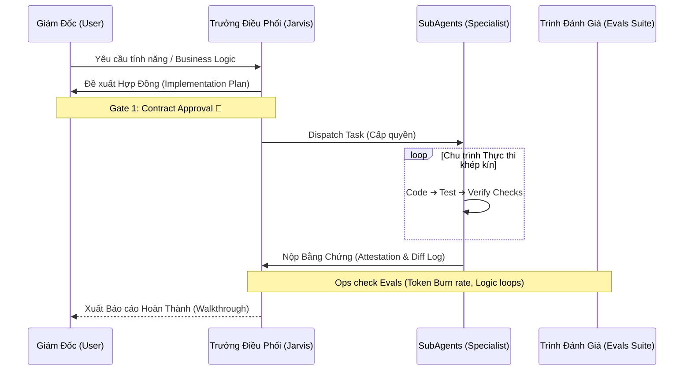

<div align="center">
  
  <h1>ABM Workforce 3.0</h1>
  <h2>Enterprise-Grade Agentic Harness & Multi-Agent Ecosystem</h2>
  <p>Một kiến trúc <strong>Hệ Điều Hành AI (AI Operating System)</strong> tiên phong, được thiết kế theo các tiêu chuẩn khắt khe nhất của <a href="https://github.com/walkinglabs/awesome-harness-engineering">Harness Engineering</a>. Khắc phục triệt để các rào cản chí mạng của LLM: <i>Vỡ ngữ cảnh, Ảo giác thực thi, và Đốt Token vô ích.</i></p>

  <p>
    <a href="#core-innovations"><b>Đột phá Công nghệ</b></a> • 
    <a href="#architecture"><b>Kiến trúc Lõi</b></a> • 
    <a href="#deployment"><b>Cài đặt & Thử nghiệm</b></a>
  </p>
</div>

---

## 🎯 Vấn Đề Của AI Hiện Đại & Giải Pháp Quản Trị Của ABM
Thế hệ AI Agent hiện tại (như Cursor, Devin, Claude Code) thường thất bại khi đưa vào môi trường sản xuất (Production) do 3 nguyên nhân cốt lõi:
1. **Context Window Bloat:** Agent quét mù quáng hàng nghìn files gây tràn Context, làm suy giảm thảm hại khả năng suy luận logic (Recall Degradation).
2. **Loop Traps & Token Burn:** Agent gọi tool sai hoặc vướng vào vòng lặp sửa lỗi (Fix-Fail-Fix) không lối thoát, đốt hàng trăm USD phí API mà không đạt kết quả.
3. **Blackbox Execution:** Trao quyền tự trị (Autonomy) mù quáng mà không có khâu đệm để đánh giá, thẩm định chất lượng output (Lack of Deterministic Evals).

**ABM Workforce 3.0** ra đời không phải để cung cấp thêm vài chục file Prompt. Nó là một **Lớp Vỏ Bao Bọc (The Harness)** — một môi trường Sandbox "kỷ luật thép" ép các siêu trí tuệ AI phải hoạt động tuân thủ theo quy trình của một Tập đoàn Công nghệ Đa Quốc gia. 

---

## 🔬 Đột Phá Công Nghệ (Core Innovations)

Mã nguồn này chứa nền tảng tư duy Agent tiên tiến nhất, xứng đáng để bất kỳ AI Engineer hay Researcher nào tải về nghiên cứu mổ xẻ:

### 1. Progressive Disclosure Layer (Tiết Lộ Ngữ Cảnh Tịnh Tiến)
Thay vì ném 111 kỹ năng (Skills) vào não LLM cùng lúc, ABM áp dụng cơ chế Lazy-Loading:
- Hệ thống duy trì một mảng từ điển siêu nhẹ `skills-index-l0.json` (chỉ ~6,000 tokens).
- Bất kỳ Agent nào khi nhận request từ user sẽ **buộc phải tra cứu L0-Index trước**, xác định đúng tọa độ của Skill, sau đó mới dùng File Explorer để đọc các Skill chuyên sâu. Cơ chế này giảm thiểu 90% lượng rác Token và đảm bảo sự nhạy bén của Agent luôn ở mức cao nhất.

### 2. Repo-Local Instructions & Hard-Boundaries
- Các Model AI thế hệ mới thường "quá tự tin". ABM thuần phục chúng ngay từ cửa ngõ bằng tệp `CLAUDE.md` và `AGENTS.md` đặt ở Root. 
- Ngay khi Agent boot vào Workspace, nó bị áp đặt ngay các luật lệ không thể đàm phán: Bắt buộc dùng `Tiếng Việt 100%`, cấm xóa log theo dõi, cấm trả lời "xong" khi chưa có bằng chứng (Evidence-driven verification).

### 3. Context Condensation Engine (Nén Bộ Nhớ Chủ Động)
- Hệ thống tích hợp module `capability-evolver` hoạt động ngầm. Khi một Session (hội thoại) phình to quá **10,000 tokens**, siêu-kỹ năng `CONDENSE` tự động được gọi. 
- Log hội thoại sẽ bị chặt bỏ sự rườm rà, chắt lọc ra các "Milestones" và đẩy vào định dạng Vector rút gọn (`goals.md`), giúp AI nhớ chính xác mục tiêu tối thượng mà không bị choáng ngợp bởi hàng nghìn dòng thông báo lỗi trước đó.

### 4. Trace Grading & Offline Evals (Giám Sát & Chấm Điểm)
- Chấm dứt kỷ nguyên "Box đen". Sau mỗi Task, công cụ `abm-agent-evals` sẽ tự động lục soát dữ liệu hành vi (Traces log).
- Đánh giá sự lãng phí (Token Inefficiency) bằng cách đếm xem Agent lặp lại bao nhiêu lệnh sai, check tính xác thực (Deterministic Check) xem File có sinh ra đúng như Hợp đồng không. Báo cáo đánh giá được dump thành JSONL tại `.agents/traces/`, cho phép Human-in-the-loop (CEO) dễ dàng theo dõi chi phí.

### 5. Multi-Layer MCP Registry (Giao Thức Context Mở Rộng)
- Bứt phá khỏi khả năng thao tác Local, hệ thống tích hợp chuẩn **Model Context Protocol (MCP)** thông qua Registry tập trung `_abm/_config/mcp-registry.yaml`.
- Liên kết Native với `claude-router.sh`, giúp mô hình nội hạt vừa có thể duyệt web, vừa kích hoạt kịch bản tự động hóa trên N8N hoặc chọc vào Database hệ thống mà không vỡ kiến trúc bảo mật.

---

## ⚙️ Kiến Trúc Uỷ Quyền Đa Tầng (Contract-Driven Delegation)

Mọi sự thay đổi trong dự án đều phải đi qua một **Chuỗi Uỷ Quyền (Delegation Chain)** thay vì gõ dòng Prompt tự do. Cấu trúc này chia hệ thống thành 10 Phòng Ban chuyên biệt với sự giám sát khắt khe:



**Một số Trigger Tiêu biểu trong 111 Skills:**
- **`/jarvis`**: Khởi động bảng điều phối trung tâm.
- **`/dev`**: Khởi chạy chuỗi lập trình tự động với TDD và Root Cause Analysis bảo vệ 2 tầng.
- **`/marketing` / `/viet`**: Khởi động Tòa Soạn V3.2 — Đỉnh cao tạo sinh Content/Sách/Ebook với 6 ban chuyên môn (Từ Outline, Đồ họa đến Xuất bản).
- **`/security-audit`**: Truy quét lỗ hổng bảo mật trực tiếp trên luồng hoạt động.
- **`abm-review-pr` (Raven's Verdict)**: Reviewer Code AI mang phong cách tàn nhẫn và đa chiều nhất để tìm lỗ hổng Logic.

---

## 🚀 Hướng Dẫn Triển Khai (Deployment)

Dự án này là mã nguồn mở giá trị cao dành cho các kỹ sư muốn đập tan giới hạn kiến trúc AI. Bạn có thể chèn nó trực tiếp vào Workspace của mình (Tương thích tuyệt đối với Cursor, Windsurf, Antigravity IDE).

**Cho hệ điều hành MacOS / Linux (Bash):**
```bash
bash <(curl -s https://raw.githubusercontent.com/xaotiensinh-abm/abm-workforce/main/install.sh)
```

**Cho hệ điều hành Windows (PowerShell):**
```powershell
irm https://raw.githubusercontent.com/xaotiensinh-abm/abm-workforce/main/install.ps1 | iex
```

*Trình cài đặt sẽ tự động thiết lập Symlinks, tải các hệ biến môi trường giả lập môi trường Doanh nghiệp (Enterprise Namespace) mà không phá vỡ dự án hiện hành.*

---

<div align="center">
  <p><b>ABM Workforce</b> — Kiến tạo bởi đội ngũ Lõi. Mở mã nguồn vì một kỷ nguyên AI kỷ luật và hiệu năng.</p>
  <i>"Your Agent Needs a Harness, Not Just a Prompt"</i>
</div>
