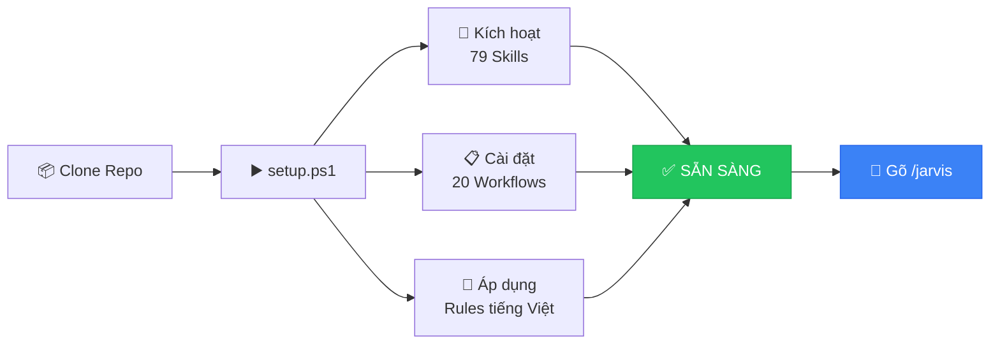
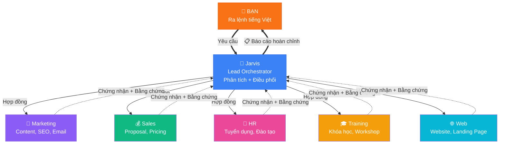
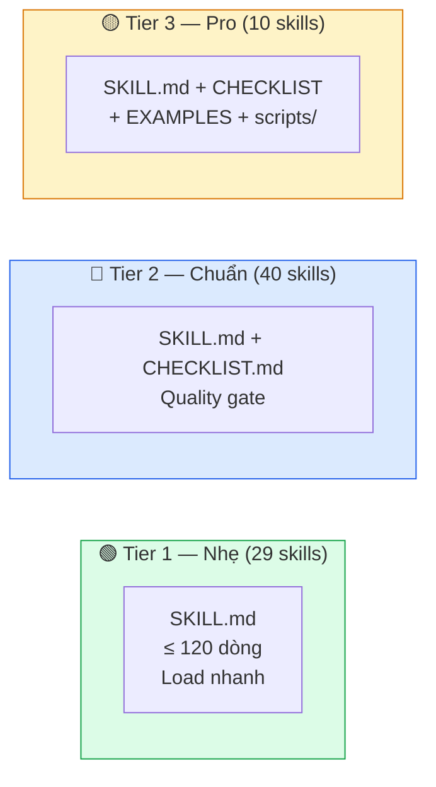
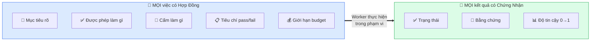
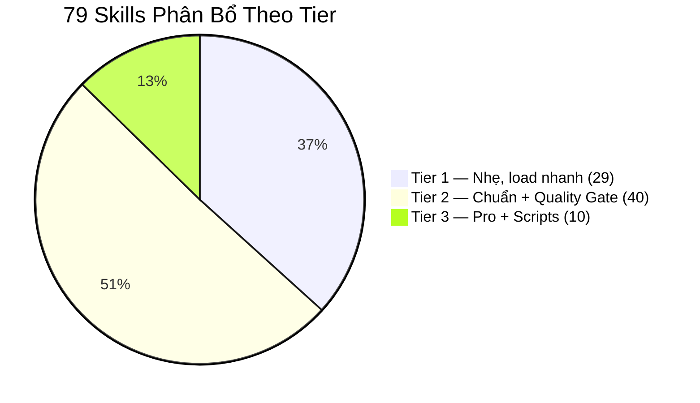
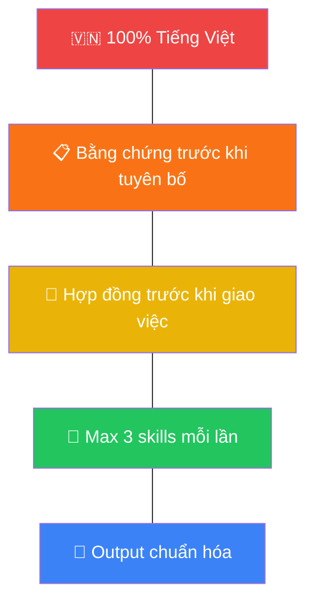

<div align="center">


# Biến AI Thành Đội Ngũ Nhân Sự 24/7 Cho Doanh Nghiệp Của Bạn

### Không cần biết code. Không cần biết tiếng Anh. Chỉ cần nói — Jarvis làm.

<br>

[](https://github.com/xaotiensinh-abm/abm-workforce)
[](#-79-skills--5-chuyên-gia-ai--sẵn-sàng-nhận-lệnh)
[](#-cài-đặt-trong-60-giây)
[](#-audit-score-9010)
[](#)

<br>

**CEO đang mất 192 triệu/năm cho công việc AI có thể làm trong 5 phút.**

[**🚀 Cài Đặt Ngay →**](#-cài-đặt-trong-60-giây) · [Xem Demo](#-xem-jarvis-làm-việc) · [So Sánh](#-tại-sao-không-phải-chatgpt)

</div>

---

## 😫 Bạn Đang Gặp Vấn Đề Này?

> *"Tôi tốn 3 tiếng viết 1 proposal, rồi phải sửa đi sửa lại..."*
> 
> *"Nhân viên marketing nghỉ, content kênh Facebook chết 2 tuần..."*
> 
> *"Muốn dùng AI nhưng không biết bắt đầu từ đâu, prompt kiểu gì..."*
> 
> *"ChatGPT trả lời chung chung, không hiểu business của mình..."*

### ABM Workforce giải quyết TẤT CẢ — trong **1 phút cài đặt**.

Bạn nói: *"Viết proposal coaching AI cho chuỗi nhà hàng, giá 250 triệu"*

Jarvis tự động: **phân tích → chọn chuyên gia → giao việc → kiểm tra → trả proposal 6 phần hoàn chỉnh** — sẵn gửi khách.

<div align="center">

### ⏱️ 5 phút với Jarvis = 3 tiếng làm thủ công

**[🚀 Cài Đặt Ngay — Miễn Phí →](#-cài-đặt-trong-60-giây)**

</div>

---

## 🆚 Tại Sao Không Phải ChatGPT?

| | ChatGPT / Gemini | **ABM Workforce** |
|---|:---:|:---:|
| **Số AI** | 1 AI "biết tuốt" | **5 chuyên gia + 5 worker** chuyên trách |
| **Ngôn ngữ** | Trộn Anh-Việt | **100% Tiếng Việt** chuẩn business |
| **Trí nhớ** | Quên sau mỗi chat | **Second Brain 12 files** — nhớ vĩnh viễn |
| **Kiểm chứng** | Không ai kiểm tra | **Hợp đồng + Chứng nhận + Bằng chứng** |
| **Phân công** | Bạn tự làm hết | **Jarvis tự routing** đúng chuyên gia |
| **Slash commands** | ❌ | **20 lệnh tắt** — `/marketing`, `/sales`... |
| **Skill chuyên sâu** | Generic | **79 skills** tối ưu cho SME Việt Nam |
| **Giá** | $20/tháng, tự prompt | **Miễn phí** + có đội ngũ sẵn |

> 💡 **ChatGPT là 1 nhân viên biết tuốt nhưng không chuyên gì.**
> **ABM là đội ngũ 10 chuyên gia**, mỗi người giỏi 1 lĩnh vực — và có quản lý (Jarvis) điều phối.

---

## 👀 Xem Jarvis Làm Việc

```
🧑‍💼 Bạn: "Viết 5 bài Facebook giới thiệu khóa AI cho CEO"

🧠 Jarvis phân tích:
   → Task: marketing (social content)
   → Chọn: Marketing Specialist
   → Load: copywriting + content-strategy + marketing-psychology
   → Budget: max 20 tool calls

📢 Marketing Specialist thực hiện:
   ✅ Bài 1: Hook storytelling — "Tôi từng mất 8 tiếng/ngày cho email..."
   ✅ Bài 2: Social proof — "127 CEO đã áp dụng, tiết kiệm 192tr/năm"
   ✅ Bài 3: Pain point — "Nhân viên nghỉ, ai viết content?"
   ✅ Bài 4: How-to — "3 bước biến AI thành trợ lý kinh doanh"
   ✅ Bài 5: CTA urgency — "Chỉ còn 5 suất coaching 1:1 trong Q2"
   + Hashtags + CTA + Emoji optimized

📋 Chứng nhận: status=xong | confidence=0.95 | 5 bài sẵn đăng
```

<div align="center">

### 5 bài content Facebook trong 2 phút. Không cần thuê copywriter.

**[🚀 Thử Ngay →](#-cài-đặt-trong-60-giây)**

</div>

---

## ⚡ Cài Đặt Trong 60 Giây

### Windows (PowerShell) — Khuyến nghị
```powershell
git clone https://github.com/xaotiensinh-abm/abm-workforce.git
cd abm-workforce
.\setup.ps1
```

### Windows (Không biết code? Double-click!)
```
1. Download repo → Giải nén
2. Double-click → setup.bat
3. Xong! Gõ /jarvis để bắt đầu 🚀
```

### Mac / Linux
```bash
git clone https://github.com/xaotiensinh-abm/abm-workforce.git
cd abm-workforce
chmod +x setup.sh && ./setup.sh
```

### Setup tự động làm gì?



```
Kết quả sau setup:
  ✅ Global skills: 79 — sẵn sàng
  ✅ Global workflows: 20 — sẵn sàng  
  ✅ Global rules: tiếng Việt 100%
  🎉 ABM Workforce installed successfully!
```

<div align="center">

### Quản lý
```
.\setup.ps1              # Cài đặt
.\setup.ps1 -Force       # Cài lại
.\setup.ps1 -Verify      # Kiểm tra
.\setup.ps1 -Uninstall   # Gỡ bỏ
```

</div>

---

## 🤖 79 Skills + 5 Chuyên Gia AI — Sẵn Sàng Nhận Lệnh

### Delegation Chain — Đội Ngũ AI Của Bạn



### 20 Slash Commands — Gõ 1 Lệnh, Nhận Kết Quả

| Lệnh | Việc gì? | Ví dụ thực tế |
|-------|---------|---------------|
| `/jarvis` | 🧠 Tổng đài — Jarvis tự phán đoán | `/jarvis` rồi mô tả yêu cầu |
| `/marketing` | 📢 Content, SEO, social, email | Viết 5 bài FB cho CEO SME |
| `/sales` | 💰 Proposal, cold email, pricing | Proposal tư vấn AI cho chuỗi FnB |
| `/hr` | 👥 JD, tuyển dụng, onboarding | JD tuyển HLV AI, lương 15-25tr |
| `/training` | 🎓 Khóa học, giáo trình, workshop | Thiết kế khóa "AI cho HR" 4 buổi |
| `/dev` | 💻 Website, bug fix, landing page | Sửa landing page, thêm form |
| `/report` | 📊 Báo cáo, KPI, phân tích | Báo cáo tháng 3, 45 HV mới |
| `/docs` | 📄 SOP, proposal, memo | SOP onboarding khách coaching |
| `/review` | 🔍 Đánh giá phản biện đa chiều | Review chiến lược marketing Q1 |
| `/cskh` | 🤝 Chăm sóc khách hàng | Follow-up, churn prevention |
| `/finance` | 💵 Kế toán, tài chính | Bảng lương, phân tích chi phí |
| `/legal` | ⚖️ Pháp chế, hợp đồng | Soạn hợp đồng coaching |
| `/rd` | 🔬 Nghiên cứu, benchmark | Trend AI 2026, benchmark đối thủ |
| `/save` | 💾 Lưu trạng thái | Backup phiên quan trọng |
| `/recap` | 🔄 Khôi phục phiên trước | Tiếp tục việc dang dở |
| `/product-launch` | 🎯 Ra mắt sản phẩm | Launch khóa học mới |
| `/council` | 🏛️ Hội đồng đánh giá | 8 personas phản biện |
| `/skill-generator` | ⚙️ Tạo skill mới | Pipeline 9 bước |
| `/skill-sync` | 🔄 Đồng bộ skills | Cập nhật hàng tháng |
| `/security-audit` | 🔒 Audit bảo mật | Scan secrets, PII |

### Hoặc Nói Như Nói Với Nhân Viên

```
✅ "Jarvis viết email follow-up cho 200 học viên chưa gia hạn"
✅ "Jarvis tạo kịch bản chatbot tư vấn khóa học cho Zalo OA"
✅ "Jarvis phân tích đối thủ ABC Education về giá và chương trình"
✅ "Jarvis thiết kế agenda workshop AI cho doanh nghiệp, 4 tiếng"
```

> 🔥 **Không cần nhớ lệnh. Không cần prompt engineering. Nói tiếng Việt bình thường là được.**

---

## 🏗️ Hệ Thống Được Xây Dựng Bài Bản

### Hybrid 3-Tier — 79 Skills Không Phải Con Số Ngẫu Nhiên



### Hợp Đồng → Chứng Nhận — Tại Sao Output ABM Luôn Chất Lượng



> 💡 **Giống như giao KPI cho nhân viên**: rõ mục tiêu, rõ phạm vi, rõ deadline — và nhân viên phải báo cáo kèm bằng chứng. Không "chắc là xong" mà không chứng minh.

### Second Brain — AI Hiểu Doanh Nghiệp Của Bạn

| Knowledge File | Dữ liệu |
|---------------|---------|
| `vn-digital-marketing.md` | 85.6M users, $3.1B ads, FB 87.3M |
| `coaching-industry.md` | $6.25B global market, pricing benchmarks |
| `seo-knowledge.md` | Core Web Vitals, E-E-A-T, VN SEO |
| `competitive-analysis.md` | Đối thủ, USPs, định vị thị trường |
| + 8 files nữa... | Patterns, playbook, tech stack, lessons |

---

## 💡 10 Mẹo Viết Prompt — Từ Yếu → Mạnh

| # | ❌ Yếu | ✅ Mạnh |
|:-:|--------|--------|
| 1 | "Viết email" | "Viết email follow-up cho HV workshop 7 ngày trước" |
| 2 | "Viết bài Facebook" | "5 bài FB cho CEO SME 35-50 tuổi, tone chuyên gia" |
| 3 | "Viết proposal" | "Proposal tư vấn AI cho chuỗi 10 phòng khám, 500tr/năm" |
| 4 | "Phân tích đối thủ" | "Bảng so sánh: Giá / Chương trình / Điểm mạnh / yếu" |
| 5 | "Viết content" | "Tone chia sẻ giá trị, không bán hàng trắng trợn" |
| 6 | "Viết vài bài" | "5 bài, 300-500 từ, kèm hashtag và CTA" |
| 7 | "Tạo kế hoạch" | "Marketing 30 ngày, budget 20tr, focus FB + Zalo" |
| 8 | "Viết mẫu email" | "3 mẫu: chào mừng, nhắc học, upsell — kèm subject A/B" |
| 9 | "Sửa lại" | "Thêm ROI dự kiến, bỏ đoạn giới thiệu dài" |
| 10 | "Viết theo kiểu..." | "Theo format trong `_abm-output/proposal-mau.md`" |

---

## 🔧 Scripts Tự Động — Chạy 1 Lệnh, Nhận Kết Quả

| Script | Chức năng | Lệnh |
|--------|----------|------|
| SEO Audit | Scan robots.txt, HTTPS, speed, meta | `.\run-seo-audit.ps1 -Url "https://abc.vn"` |
| Benchmark | Test tốc độ N lần | `.\run-benchmark.ps1 -Url "https://abc.vn"` |
| Security | Scan secrets, PII, scope | `.\security-check.ps1` |
| Code Review | Auto checklist | `.\review-checklist.ps1 -File "app.js"` |
| Quiz Generator | Tạo đề thi | `.\generate-quiz.ps1 -Module "AI"` |

---

## 📊 Audit Score: 9.0/10



| Chiều đánh giá | Điểm | Bằng chứng |
|----------------|:----:|-----------|
| Kiến trúc | **9** | Hybrid 3-Tier + manifest-sync |
| Kiểm soát chất lượng | **9** | 47 CHECKLIST + attestation |
| Độ phủ skill | **9** | 79 skills: web, business, security |
| Chất lượng skill | **9** | 7 scripts, avg 150+ dòng |
| Đội ngũ AI | **9** | 5 SubAgents + 5 Workers |
| Workflows | **9** | 20 workflows + 3 pipelines |
| Quản lý context | **9** | 116→79, tối ưu 32% |
| Knowledge Base | **9** | 12 files deep research |
| Truy vết | **9** | CHANGELOG + manifests |
| Bảo mật | **9** | prompt-sentinel + PII scan |

---

## 📁 Cấu Trúc

```
abm-workforce/
├── 🔧 setup.ps1 / setup.sh / setup.bat     ← Cài đặt 1 phút
├── 📖 README.md                              ← File này
├── _abm/
│   ├── bmm/agents/skills/   (79 skills)     ← AI skills
│   ├── SubAgents/           (5 specialists)  ← Chuyên gia AI  
│   ├── Workers/             (5 executors)    ← Worker thực thi
│   ├── Context-Layer/Second-Brain/ (12 files)← Trí nhớ AI
│   ├── Team-Orchestration/  (3 pipelines)    ← Quy trình tự động
│   └── _config/                              ← Manifests
├── .agents/workflows/       (20 commands)    ← Slash commands
└── _abm-output/                              ← Kết quả
```

---

## 🔒 5 Quy Tắc Sắt



---

## 📝 Changelog

### v4.0 (2026-03-14) — Hybrid 3-Tier + Auto Setup
- ✅ Auto-setup: 1 phút cài đặt, cross-platform
- ✅ 79 skills (29 + 40 + 10 theo 3 tier)
- ✅ 5 SubAgents + 5 Workers + Jarvis Orchestrator
- ✅ 12 Second-Brain files (deep research VN market)
- ✅ 47 quality gates + 7 executable scripts
- ✅ 20 workflows + 3 pipelines
- ✅ Audit score: **6.8 → 9.0/10**

---

<div align="center">

## 🚀 Bắt Đầu Ngay — Miễn Phí

### CEO đang đọc README này trong khi AI có thể đang viết proposal cho bạn.

```powershell
git clone https://github.com/xaotiensinh-abm/abm-workforce.git
cd abm-workforce
.\setup.ps1
```

**60 giây setup → Gõ `/jarvis` → Đội ngũ AI sẵn sàng 24/7.**

<br>

[](https://github.com/xaotiensinh-abm/abm-workforce)
[](https://abmedu.vn)

---

**🌐 [abmedu.vn](https://abmedu.vn)** · Vì một Việt Nam phổ cập A.I

Built with ❤️ by **ABM Team** · Powered by **Antigravity IDE**

MIT License — Free to use, modify, and distribute.

[⬆ Back to top](#biến-ai-thành-đội-ngũ-nhân-sự-247-cho-doanh-nghiệp-của-bạn)

</div>
