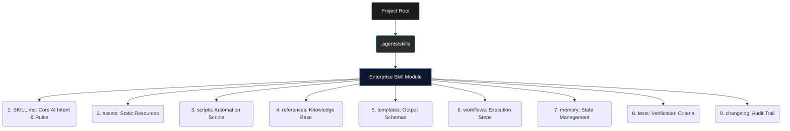
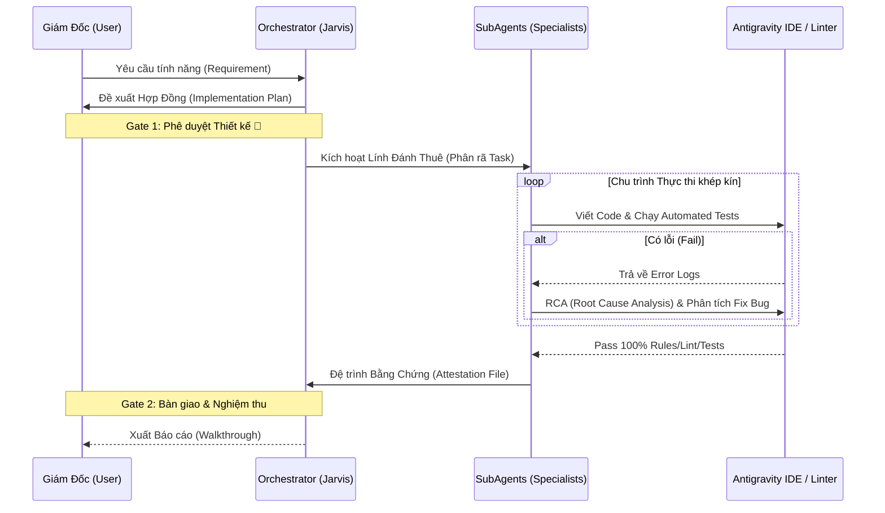

<div align="center">
  
  <h1>ABM Workforce System</h1>
  <h3>AI Business Master — Enterprise Multi-Agent Framework</h3>
  <p>Hệ thống Điều phối Đa Trí Tuệ (Multi-Agent) chuyên sâu dành cho Doanh nghiệp, tích hợp hoàn hảo vào Google Antigravity IDE và Claude Desktop.</p>
</div>

---

## 🎯 Tổng Quan Hệ Thống

**ABM Workforce (AI Business Master)** không phải là một bộ sưu tập prompt thông thường. Đây là một **Kiến trúc Hệ điều hành AI (AI Operating System Architecture)** được thiết kế để giải quyết các rào cản lớn nhất khi doanh nghiệp ứng dụng LLM vào môi trường sản xuất thuật toán: Vỡ ngữ cảnh (Context length limit), Ảo giác (Hallucination), và Giới hạn khả năng thực thi (Execution limitations).

Hệ thống hoạt động theo cơ chế **Delegation Chain (Chuỗi Ủy Quyền)**: Người dùng đóng vai trò CEO, giao phó ý tưởng cho Lõi Điều Phối (Jarvis). Hệ thống sẽ tự động bóc tách yêu cầu, ký kết Hợp đồng Triển khai (Implementation Plan) và phân bổ công việc xuống cho các Agent chuyên biệt (SubAgents) xử lý song song.

---

## 💎 Điểm Nhấn Công Nghệ (Core Innovations)

### 1. Kiến Trúc 9 Lớp Tiêu Chuẩn (The 9-Layer Architecture)
Thay vì nhồi nhét mọi logic vào một system prompt khổng lồ, mọi **Skill** trong ABM Workforce được module hóa chặt chẽ. Cách ly bộ nhớ giúp Agent duy trì sự tập trung tuyệt đối vào nghiệp vụ hiện tại.



### 2. Contract-Driven Development & Chuỗi Xác Minh (Trust Chain)
ABM Workforce áp dụng cơ chế xác minh khắt khe (Evidence-Driven Verification). Agent **bắt buộc** phải tuân thủ vòng lặp `Code ➜ Compile/Test ➜ Review` trước khi báo cáo hoàn thành. 



---

## 🧠 Mô Hình Cấu Trúc Tập Đoàn (Virtual Enterprise Ecosystem)

Điểm độc đáo nhất của ABM Workforce không nằm ở code, mà là **Sự Phân Lập Môi Trường Thành Hệ Thống Phòng Ban**. Thay vì một "trợ lý vạn năng" lộn xộn, hệ thống sở hữu **hơn 10 Phòng Ban Chuyên Trách** (Ban Công nghệ, Ban Marketing, Hành chính Nhân sự, Tài chính Pháp chế...) với các quy trình (SOPs) và Agent được thiết lập sẵn.

Sử dụng Slash Commands (`/`) trong IDE để luân chuyển hồ sơ sang đúng phòng ban xử lý:

### 👑 Ban Giám Đốc & Điều Phối (Executive Board)
- **`/jarvis` (Orchestrator):** Trưởng bộ phận điều phối. Phân loại yêu cầu của CEO và định tuyến xuống các phòng ban.
- **`/brainstorm` & `/write-plan`:** Ban R&D. Thiết kế chiến lược, phân tích khả thi và soạn thảo Hợp đồng Triển khai trước khi hành động.
- **`/council` & `/review`:** Hội đồng Thẩm định Tối cao. Đánh giá phản biện đa chiều cho các quyết định kiến trúc/kinh doanh lớn.

### 💻 Ban Công Nghệ & R&D (Engineering & Tech)
- **`/dev` (Trưởng nhóm Phát triển):** Chịu trách nhiệm Code, Refactor và thực thi kỹ thuật. Triển khai theo `/execute-plan`.
- **Raven's Verdict (`abm-review-pr`) & Systematic Debugger:** Khắc tinh của Bug. Thực hiện Code Review tàn tẫn và phân tích Log-driven RCA (Root Cause Analysis).
- **`/security-audit` & TDD Master:** Đội ngũ QA (Đảm bảo Chất lượng) và An toàn thông tin (AppSec Ops).
- **`/docs`:** Ban Thư ký kỹ thuật. Chuẩn hóa tài liệu Diátaxis.

### 📢 Ban Sales & Marketing
- **`/marketing` & `/viet` (Tòa Soạn):** Tổ chức bộ máy Marketing đa kênh. Viết Content, Email marketing, lên kịch bản nuôi dưỡng (Lead Nurturing). Phối hợp 6 ban chuyên môn (Biên tập, Đồ họa, SEO...).
- **`/sales`:** Ban Kinh doanh. Soạn Sales Deck, Proposal thầu, email chào hàng (Cold Email), tối ưu phễu giá (Pricing Strategy).
- **`/cskh`:** Chăm sóc khách hàng. Xử lý khiếu nại, churn prevention và thiết lập khảo sát sự hài lòng.

### 🏢 Ban Vận Hành & Hỗ Trợ (Back-Office)
- **`/hr` & `/training`:** Quản trị Nhân sự & Đào tạo. Soạn thảo JD (Mô tả công việc), Onboarding nhân sự mới, thiết kế khung bài giảng và Workshop.
- **`/finance`:** Ban Kế toán Tài chính. Phân tích điểm hòa vốn, lập bảng lương, tối ưu dòng tiền (Cashflow).
- **`/legal`:** Ban Pháp chế. Soát xét hợp đồng, soạn thảo điều khoản sử dụng (TOS), đảm bảo tuân thủ (Compliance).

---

## 💼 Use Cases Triển Khai Thực Tế

1. **Phát Triển Sản Phẩm (Zero to One):** Giao một tệp Yêu Cầu Kinh Doanh (PRD). ABM sẽ tự động luân chuyển qua `/brainstorm` (để ra Architecture Spec) ➜ `/write-plan` (Lên Task) ➜ `/execute-plan` (Code liên tục qua đêm) ➜ `/qa-generate-e2e-tests` (Viết Test kiểm chứng).
2. **Bảo Trì Hệ Thống Legacy (Refactoring):** Gọi thư viện `systematic-debugging` kết hợp `abm-review-prompt` để phân tích luồng code rối rắm. Sau đó dùng chuỗi Phân đoạn sửa đổi từ từ (Multi-replace) đảm bảo không gây Regression Bugs.
3. **Phòng Ngự Bảo Mật (AppSec OPs):** Dùng `/security-audit` đánh giá toàn bộ Input/Output Pipeline, phát hiện sớm Injection Flow, xác minh OWASP Top 10 trực tiếp ngay trên local source code.
4. **Viết Tài Liệu Kỹ Thuật Tự Động:** Giao URL hoặc Repository, Skill `documentation` sẽ quy hoạch lại toàn bộ cấu trúc dựa trên chuẩn Diátaxis Framework (Tutorials, How-to, Reference, Explanation).

---

## ⚙️ Cài Đặt (Deployment)

Dự án có thể được tích hợp trực tiếp vào bất kỳ Workspace nào đang vận hành **Google Antigravity** hoặc môi trường IDE hỗ trợ Agentic Coding.

**Cho hệ điều hành MacOS / Linux (Bash):**
Mở Terminal tại thư mục gốc của dự án của tổ chức, chạy cấp quyền:
```bash
bash <(curl -s https://raw.githubusercontent.com/xaotiensinh-abm/abm-workforce/main/install.sh)
```

**Cho hệ điều hành Windows (PowerShell):**
Mở PowerShell dưới quyền Quản trị (Administrator) và thực thi:
```powershell
irm https://raw.githubusercontent.com/xaotiensinh-abm/abm-workforce/main/install.ps1 | iex
```

*Hệ thống sẽ tự động khởi tạo cấu trúc xương sống `.agents/` và `_abm/` vào môi trường làm việc của bạn.*

---

<div align="center">
  <p><b>ABM Workforce</b> — Kiến tạo bởi đội ngũ kỹ thuật Lõi.</p>
  <i>Powered by Agentic Execution Architectures.</i>
</div>
