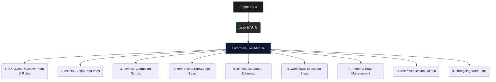
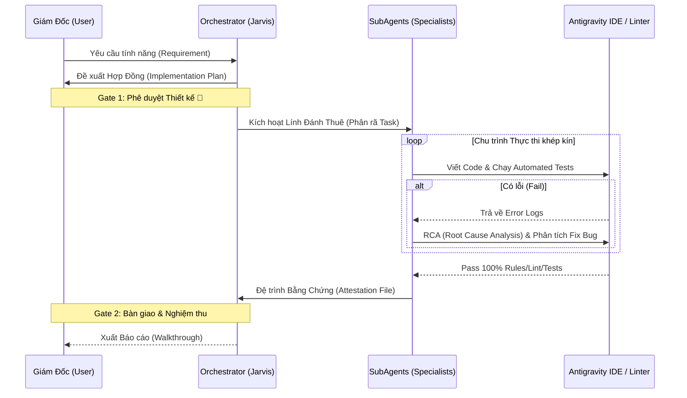

<div align="center">
  
  <h1>ABM Workforce System</h1>
  <h3>AI Business Master — Enterprise Multi-Agent Framework</h3>
  <p>Hệ thống Điều phối Đa Trí Tuệ (Multi-Agent) chuyên sâu dành cho Doanh nghiệp, tích hợp hoàn hảo vào Google Antigravity IDE và Claude Desktop.</p>
</div>

---

## 🎯 Tổng Quan Hệ Thống

**ABM Workforce (AI Business Master)** không phải là một bộ sưu tập prompt thông thường. Đây là một **Kiến trúc Hệ điều hành AI (AI Operating System Architecture)** được thiết kế để giải quyết các rào cản lớn nhất khi doanh nghiệp ứng dụng LLM vào môi trường sản xuất thuật toán: Vỡ ngữ cảnh (Context length limit), Ảo giác (Hallucination), và Giới hạn khả năng thực thi (Execution limitations).

Hệ thống hoạt động theo cơ chế **Delegation Chain (Chuỗi Ủy Quyền)**: Người dùng đóng vai trò CEO, giao phó ý tưởng cho Lõi Điều Phối (Jarvis). Hệ thống sẽ tự động bóc tách yêu cầu, ký kết Hợp đồng Triển khai (Implementation Plan) và phân bổ công việc xuống cho các Agent chuyên biệt (SubAgents) xử lý song song.

---

## 💎 Điểm Nhấn Công Nghệ (Core Innovations)

### 1. Kiến Trúc 9 Lớp Tiêu Chuẩn (The 9-Layer Architecture)
Thay vì nhồi nhét mọi logic vào một system prompt khổng lồ, mọi **Skill** trong ABM Workforce được module hóa chặt chẽ. Cách ly bộ nhớ giúp Agent duy trì sự tập trung tuyệt đối vào nghiệp vụ hiện tại.



### 2. Contract-Driven Development & Chuỗi Xác Minh (Trust Chain)
ABM Workforce áp dụng cơ chế xác minh khắt khe (Evidence-Driven Verification). Agent **bắt buộc** phải tuân thủ vòng lặp `Code ➜ Compile/Test ➜ Review` trước khi báo cáo hoàn thành. 



---

## 🧠 Hệ Sinh Thái Doanh Nghiệp (Enterprise Ecosystem)

ABM Workforce được trang bị sẵn **35+ Năng lực Cốt lõi (Skills)** và **15+ Quy trình Chuẩn hóa (Workflows)**, mô phỏng cấu trúc của một tập đoàn công nghệ.

### Trạm Điều Phối & Lệnh Khởi Động (Workflows)
Sử dụng Slash Commands (`/`) trong IDE để luân chuyển trạng thái dự án:
- `/jarvis`: Triệu hồi Trưởng bộ phận điều phối (Lead Orchestrator).
- `/brainstorm`: Thiết kế hệ thống, phân tích yêu cầu trước khi code (Giai đoạn R&D).
- `/write-plan`: Biên dịch tài liệu Spec thành Hợp đồng Triển khai mã lệnh.
- `/execute-plan`: Khai hỏa thực thi Hợp đồng Code từng bước (Inline hoặc Parallel).
- `/review`: Đánh giá phản biện đa chiều (Multi-persona Critique) cho hệ thống/ý tưởng.
- `/docs`: Khởi tạo và đồng bộ tài liệu kiến trúc, SOP, API Reference.
- `/security-audit`: Kích hoạt quy trình rà soát bảo mật toàn diện.

### Các Chuyên Viên & Kỹ Năng Kỹ Thuật (SubAgents & Skills)
- **Raven's Verdict (`abm-review-pr`)**: Hệ thống Code Review 2 lớp tàn nhẫn (Adversarial Cynical Review + Edge Case Hunter). Tìm diệt lỗi tư duy kiến trúc và lỗ hổng bảo mật ẩn sâu.
- **RCA Specialist (`abm-root-cause-analysis`)**: Phân tích tận gốc rễ (5 Whys) khi hệ thống sụp đổ, xuất báo cáo nguyên nhân và đề xuất cơ chế phòng ngừa.
- **Systematic Debugger (`systematic-debugging`)**: Bắt buộc kích hoạt trước khi Fix Bug để cô lập vấn đề bằng dữ liệu log (Log-driven), chống việc AI "đoán mò" và phá code.
- **TDD Master (`test-driven-development`)**: Chèn Test Cases tiêu chuẩn trước khi triển khai Logic.
- **UI/UX Pro Max (`ui-ux-pro-max`)**: Chuyên gia thiết kế giao diện (React, Tailwind, Svelte), xử lý hệ thống Design Token, Dark Mode, Animations.
- **TypeScript Expert (`typescript-expert`)**: Tối ưu Type-level programming, kiểm soát kiến trúc Monorepo.

---

## 💼 Use Cases Triển Khai Thực Tế

1. **Phát Triển Sản Phẩm (Zero to One):** Giao một tệp Yêu Cầu Kinh Doanh (PRD). ABM sẽ tự động luân chuyển qua `/brainstorm` (để ra Architecture Spec) ➜ `/write-plan` (Lên Task) ➜ `/execute-plan` (Code liên tục qua đêm) ➜ `/qa-generate-e2e-tests` (Viết Test kiểm chứng).
2. **Bảo Trì Hệ Thống Legacy (Refactoring):** Gọi thư viện `systematic-debugging` kết hợp `abm-review-prompt` để phân tích luồng code rối rắm. Sau đó dùng chuỗi Phân đoạn sửa đổi từ từ (Multi-replace) đảm bảo không gây Regression Bugs.
3. **Phòng Ngự Bảo Mật (AppSec OPs):** Dùng `/security-audit` đánh giá toàn bộ Input/Output Pipeline, phát hiện sớm Injection Flow, xác minh OWASP Top 10 trực tiếp ngay trên local source code.
4. **Viết Tài Liệu Kỹ Thuật Tự Động:** Giao URL hoặc Repository, Skill `documentation` sẽ quy hoạch lại toàn bộ cấu trúc dựa trên chuẩn Diátaxis Framework (Tutorials, How-to, Reference, Explanation).

---

## ⚙️ Cài Đặt (Deployment)

Dự án có thể được tích hợp trực tiếp vào bất kỳ Workspace nào đang vận hành **Google Antigravity** hoặc môi trường IDE hỗ trợ Agentic Coding.

**Cho hệ điều hành MacOS / Linux (Bash):**
Mở Terminal tại thư mục gốc của dự án của tổ chức, chạy cấp quyền:
```bash
bash <(curl -s https://raw.githubusercontent.com/xaotiensinh-abm/abm-workforce/main/install.sh)
```

**Cho hệ điều hành Windows (PowerShell):**
Mở PowerShell dưới quyền Quản trị (Administrator) và thực thi:
```powershell
irm https://raw.githubusercontent.com/xaotiensinh-abm/abm-workforce/main/install.ps1 | iex
```

*Hệ thống sẽ tự động khởi tạo cấu trúc xương sống `.agents/` và `_abm/` vào môi trường làm việc của bạn.*

---

<div align="center">
  <p><b>ABM Workforce</b> — Kiến tạo bởi đội ngũ kỹ thuật Lõi.</p>
  <i>Powered by Agentic Execution Architectures.</i>
</div>
