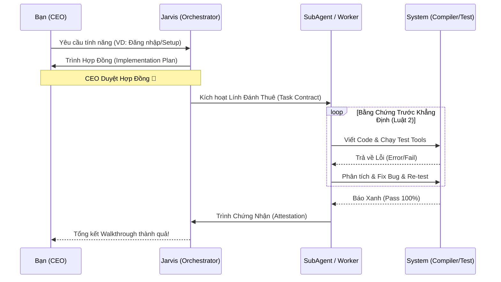
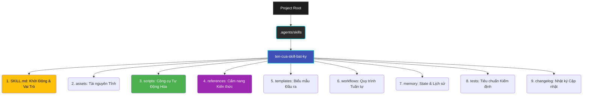

<div align="center">
  
  <h1>ABM Workspace — Hệ Điều Hành Ánh Sáng Cho Code/CEO</h1>
  <p>Đừng chỉ là Coder hì hục gõ Prompt. Hãy trở thành <b>CEO điều hành đội quân AI 9 lớp</b> chuẩn doanh nghiệp.</p>

  <p>
  <a href="#%EF%B8%8F-nỗi-đau-của-bạn">Nỗi Đau</a> • 
  <a href="#-giải-pháp-kiến-trúc-abm">Giải pháp</a> • 
  <a href="#-cài-đặt-trong-1-phút">Cài đặt 1 Click</a> • 
  <a href="#-donate-nuôi-jarvis">Mua cho Tác Giả Ly Cafe</a>
  </p>
</div>

---

## ☠️ Nỗi đau của bạn khi dùng ChatGPT/Claude
1. **Forgetful (Não cá vàng):** Đang làm dở dự án dài, AI bỗng dưng quên béng cấu trúc file, sinh ra mớ code chắp vá, lỗi lên lỗi xuống.
2. **Infinite Loop (Vòng lặp Test-Fix):** Giao AI code, nó lỗi. Bắt nó fix, nó sinh ra bug khác. Thức trắng đêm cãi nhau với bot.
3. **Mệt mỏi vì Zero-Context:** Mở Chat mới phải giải thích lại từ đầu về dự án, framework, thư viện, và phong cách Code của mình.
4. **Viết Prompt như Viết Code:** Bạn phải cắn bút nghĩ cách ra lệnh sao cho AI nghe lời, mất xừ nửa thanh xuân.

## 🚀 Giải pháp: Kiến Trúc ABM (AI Business Master)
Dự án này là Bộ khung xương (Framework) Cốt Lõi dùng cho **Google Antigravity IDE / Claude Desktop**. Nó không phải là Prompt lặt vặt. Nó là **Mô hình Doanh Nghiệp (Delegation Chain)**.

Mô hình hoạt động:
```text
(Bạn) CEO ➜ Giao Task ➜ (Jarvis) Trưởng Điều Phối ➜ Lập Hợp Đồng Code ➜ (SubAgents) Chuyên Viên ➜ Báo cáo lại.
```

✅ **Phân rã đa lớp (9-Layers):** 89 Skills & Agents đã được đào tạo nghiệp vụ cực sâu (Từ ông `Frontend`, bà `HR`, đến thằng sát thủ `Code Review`).
✅ **100% Tiếng Việt:** AI chỉ được phép Report và phân tích bằng tiếng mẹ đẻ, tiết kiệm não bộ để đọc logic.
✅ **Luật Thép - Có Hợp Đồng Mới Làm Việc:** AI không bao giờ hùa theo ý bạn kiểu "Ok em làm luôn". Nó sẽ lập 1 bản Implementation Plan (Hợp đồng gia công), bắt bạn duyệt thiết kế, xong mới nhúng tay vào làm. Hạn chế 99% bug ngay từ khâu ý tưởng.

### 💎 Hệ Thống Lõi "Chống Vỡ Cấu Trúc" (Anti-Hallucination)
Sự khác biệt lớn nhất của ABM so với các thư viện Tools/Prompts khác nằm ở **Chuỗi Xác Minh Niềm Tin (Trust Verification Chain)**. AI không bao giờ được phép báo cáo "Em làm xong rồi" nếu chưa nộp Bằng Chứng (Evidence) tường minh.



### 🧬 Kiến Trúc 9 Lớp Tiêu Chuẩn Doanh Nghiệp (The 9-Layer Architecture)
Mọi Skill trong ABM Workforce đều tuân thủ chặt chẽ kiến trúc 9 lớp rẽ ròi nhằm cô lập bộ nhớ, giúp AI sở hữu Ngữ Cảnh Cục Bộ siêu sắc nét mà không bị tràn RAM ảo.



---

## ⚡ Cài Đặt (Trong Lòng 1 Phút)

**Dành cho Mac/Linux:**
Mở Terminal ở thư mục dự án (Project) trống của sếp, và gõ lệnh sau để gọi Binh Đoàn ABM hạ phàm:
```bash
bash <(curl -s https://raw.githubusercontent.com/xaotiensinh-abm/abm-workforce/main/install.sh)
```

**Dành cho Windows:**
Mở PowerShell (Run as Administrator) và chạy:
```powershell
irm https://raw.githubusercontent.com/xaotiensinh-abm/abm-workforce/main/install.ps1 | iex
```

Hệ thống sẽ hiện ra hỏi Sếp tên gì, và tự động Rải toàn bộ Cấu trúc Lõi `_abm/` cùng `.agents/` vào máy bạn. Sau đó Sếp chỉ việc mở Antigravity/Claude lên, gõ `/jarvis` hoặc gõ `@[tên-skill]` là hưởng thụ cuộc sống của Tầng Lớp Tinh Hoa.

---

## ☕ Khát nước quá, Sếp ơi!
Làm Open-Source mệt mỏi đẻ ra được 119 file lõi Skill này tốn cả ngàn giờ của mình. Nếu sếp dùng ABM Framework chốt được dự án ngàn đô, hãy ủn cho tác giả (Lão Tôn - Trần Quốc Dũng) ly cà phê đá để tỉnh táo code tiếp chức năng xịn cho anh em nhé!

<div align="center">
  <h3>✨ Quét Mã Momo hoặc Chuyển Khoản ✨</h3>
  
  
  <p><b>MOMO:</b> <code>0976202028</code> (Ngân hàng/Momo đều được)</p>
  <p><i>Cảm ơn sự hào phóng của Sếp! Mọi đóng góp đều là huyết mạch để mình nuôi Server tiếp!</i></p>
</div>

---
<i>Made with 🩸 and 🤖 by DungTQ & Jarvis.</i>
