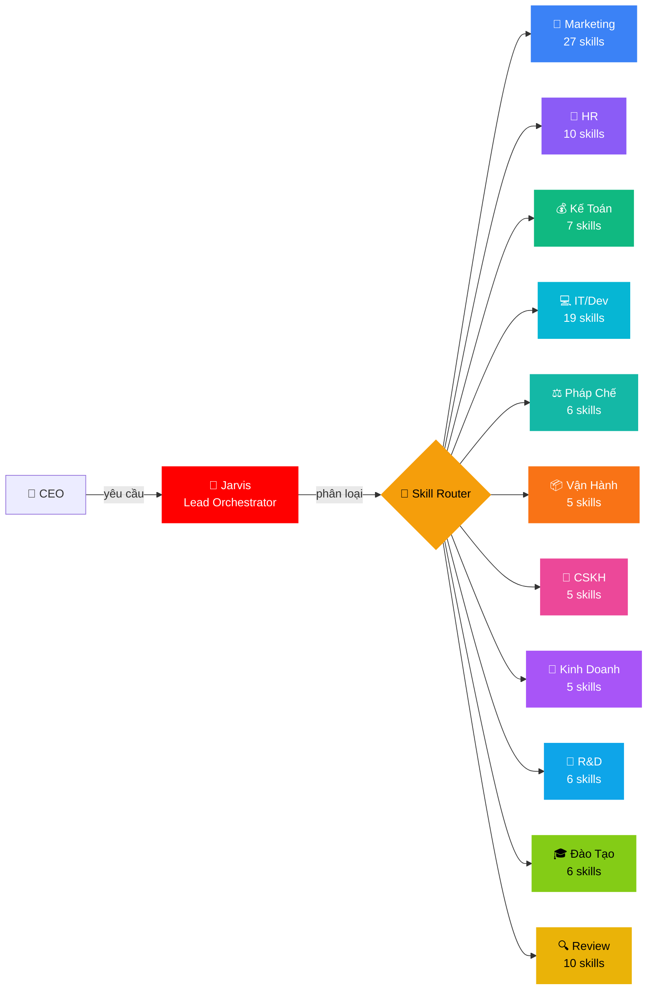
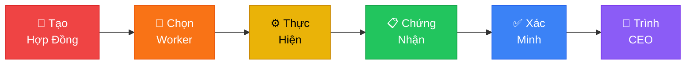
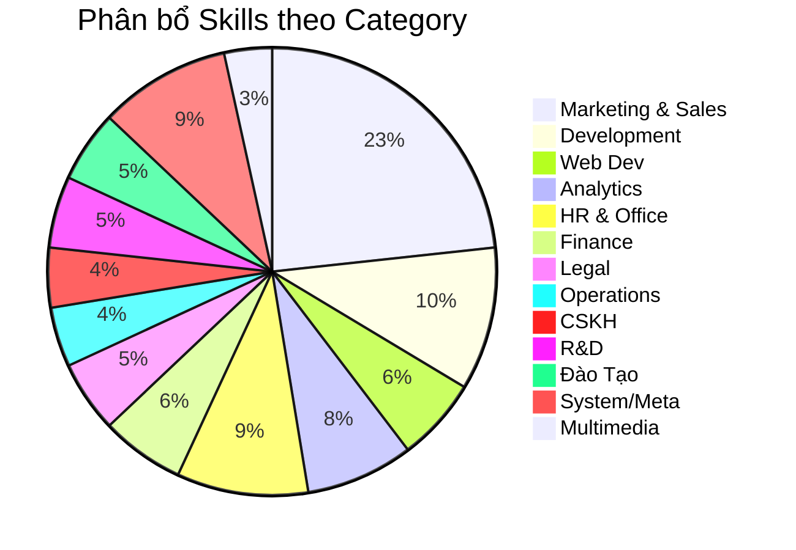
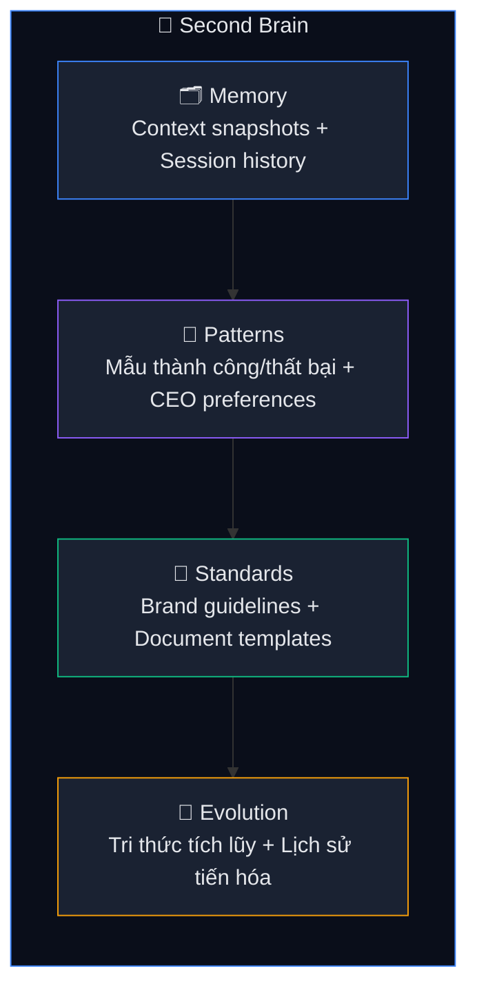

<p align="center">
  
</p>

<h1 align="center">🏢 ABM Workforce — AI Business Master</h1>

<p align="center">
  <strong>Hệ sinh thái Multi-Agent điều phối doanh nghiệp số — 11 phòng ban, 116 kỹ năng, 1 bộ não trung tâm.</strong>
</p>

<p align="center">
  <a href="ABM-CHANGELOG.md"></a>
  <a href="LICENSE"></a>
  <a href="_abm/_config/skill-manifest.csv"></a>
  <a href=".agents/workflows/"></a>
  <a href=".gemini/RULES.md"></a>
  <a href="dashboard/index.html"></a>
</p>

<p align="center">
  <em>Kỷ luật sắt · Bằng chứng thật · Kết quả đo được · 100% Tiếng Việt</em>
</p>

---

## 🎯 ABM Là Gì?

ABM Workforce biến AI thành **đội ngũ nhân sự số hoàn chỉnh** cho doanh nghiệp Việt Nam. Thay vì dùng AI rời rạc, ABM tổ chức AI thành **11 phòng ban** — mỗi phòng ban có agent, skills và workflow riêng — tất cả được điều phối bởi **Jarvis Lead Orchestrator**.

**Chỉ cần nói tiếng Việt tự nhiên** — Jarvis tự phân loại, route đúng phòng ban, chọn skills phù hợp, và trả kết quả kèm bằng chứng.



---

## ⚡ Bắt Đầu Trong 60 Giây

```bash
# 1. Clone
git clone https://github.com/xaotiensinh-abm/abm-workforce.git
cd abm-workforce

# 2. Mở IDE hỗ trợ .gemini/ rules
#    (Antigravity, Cursor, Gemini CLI, WindSurf...)
#    Không cần install — toàn bộ là Markdown + YAML

# 3. Gõ lệnh đầu tiên
/jarvis
```

> 🧠 Jarvis sẽ online và sẵn sàng nhận việc. Nói tiếng Việt — Jarvis tự phân loại và route.

---

## 🏗️ Kiến Trúc Hệ Thống

```mermaid
graph TB
    subgraph CORE["🧠 Core Engine"]
        J["Jarvis Orchestrator"]
        DC["Delegation Chain"]
        VBC["Verification Protocol"]
        CE["Context Engineering"]
        PS["Prompt Sentinel"]
    end

    subgraph AGENTS["🤖 Agent Layer — 8 SubAgents"]
        SA1["marketing-specialist"]
        SA2["hr-specialist"]
        SA3["business-analyst"]
        SA4["automation-engineer"]
        SA5["office-manager"]
        SA6["creative-strategist"]
        SA7["rd-specialist"]
        SA8["training-specialist"]
    end

    subgraph SKILLS["🧩 Skill Engine — 116 Skills"]
        S1["Marketing & Sales (27)"]
        S2["Development (19)"]
        S3["Analytics (9)"]
        S4["HR & Office (11)"]
        S5["Finance (7)"]
        S6["Legal (6)"]
        S7["Operations (5)"]
        S8["CSKH (5)"]
        S9["R&D (6)"]
        S10["Đào Tạo (6)"]
        S11["System/Meta (11)"]
        S12["Multimedia (4)"]
    end

    subgraph MEMORY["💾 Second Brain"]
        M1["Knowledge Base"]
        M2["Patterns & Standards"]
        M3["Evolution History"]
        M4["Session Memory"]
    end

    CORE --> AGENTS
    AGENTS --> SKILLS
    SKILLS --> MEMORY

    style CORE fill:#FF0000,stroke:#cc0000,color:#fff
    style AGENTS fill:#3b82f6,stroke:#2563eb,color:#fff
    style SKILLS fill:#8b5cf6,stroke:#7c3aed,color:#fff
    style MEMORY fill:#10b981,stroke:#059669,color:#fff
```



---

## 🔐 Delegation Chain — Quy Tắc Tối Thượng

Mọi task đều đi qua **6 bước bắt buộc** — bỏ bước nào = vi phạm:



| Bước | Mô tả |
|:----:|-------|
| 1 | **Hợp đồng** — Objective, scope_in/scope_out, acceptance criteria, budget, risk level |
| 2 | **Chọn Worker** — Agent routing tự động theo task type |
| 3 | **Thực hiện** — Worker làm trong phạm vi `scope_in`, không chạm `scope_out` |
| 4 | **Chứng nhận** — Status, evidence, confidence score, files changed |
| 5 | **Xác minh** — Kiểm tra 5 tiêu chí độc lập (criteria, evidence, scope, budget, risk) |
| 6 | **Trình CEO** — CEO quyết định cuối cùng dựa trên bằng chứng |

> **Trách nhiệm luôn đi LÊN**: SubAgent → Worker → Jarvis → CEO

---

## 💡 18 Slash Commands

<table>
<tr>
<td width="33%">

### 🎯 Điều Phối
| Lệnh | Mô tả |
|-------|-------|
| `/jarvis` | Tổng điều phối |
| `/review` | Đánh giá 10 chiều |
| `/council` | Hội đồng phản biện |
| `/save` | Lưu trạng thái |
| `/recap` | Khôi phục context |
| `/skill-sync` | Sync skills mới |

</td>
<td width="33%">

### 🏢 Phòng Ban
| Lệnh | Mô tả |
|-------|-------|
| `/marketing` | Content, ads, SEO |
| `/sales` | Proposal, cold email |
| `/hr` | JD, review, recruit |
| `/finance` | Báo cáo, thuế, CF |
| `/legal` | Hợp đồng, SHTT |
| `/cskh` | Ticket, feedback |

</td>
<td width="33%">

### ⚙️ Chuyên Môn
| Lệnh | Mô tả |
|-------|-------|
| `/dev` | Code, debug, feature |
| `/docs` | SOP, memo, proposal |
| `/report` | KPI, monthly report |
| `/rd` | Nghiên cứu AI, R&D |
| `/training` | Đào tạo, workshop |
| `/product-launch` | Dev + MKT song song |

</td>
</tr>
</table>

```
💬 Hoặc nói trực tiếp bằng tiếng Việt:
   "Viết email cold outreach cho SaaS quản lý nhân sự"
   → Jarvis tự route → marketing → load skills → thực hiện → trả kết quả
```

---

## 🧩 116 Skills — 12 Categories



<details>
<summary><strong>📣 Marketing & Sales — 27 skills</strong> (click mở)</summary>

`product-marketing-context` · `copywriting` · `copy-editing` · `content-strategy` · `social-content` · `email-marketing` · `email-sequence` · `marketing-psychology` · `page-cro` · `signup-flow-cro` · `form-cro` · `popup-cro` · `seo-audit` · `ai-seo` · `seo-content-planner` · `programmatic-seo` · `ab-test-setup` · `analytics-tracking` · `ad-creative` · `cold-email` · `sales-enablement` · `revops` · `pricing-strategy` · `launch-strategy` · `churn-prevention` · `referral-program` · `free-tool-strategy`
</details>

<details>
<summary><strong>🔧 Development — 12 skills</strong></summary>

`subagent-driven-development` · `dispatching-parallel-agents` · `writing-plans` · `code-review` · `systematic-debugging` · `finishing-a-development-branch` · `git-worktrees` · `project-hierarchy` · `sprint-planning` · `database-management` · `self-healing` · `github-issues-sprint`
</details>

<details>
<summary><strong>🌐 Web Development — 7 skills</strong></summary>

`ui-ux-pro-max` · `frontend-design` · `frontend-developer` · `vercel-react-best-practices` · `web-design-guidelines` · `vercel-composition-patterns` · `canvas-design`
</details>

<details>
<summary><strong>📈 Analytics — 9 skills</strong></summary>

`data-analysis` · `workflow-automation` · `competitive-landscape` · `market-sizing-analysis` · `startup-analyst` · `deep-research` · `competitor-intelligence` · `knowledge-graph` · `agentic-memory`
</details>

<details>
<summary><strong>👥 HR & Office — 11 skills</strong></summary>

`hr-operations` · `office-documents` · `internal-comms` · `brainstorming` · `performance-review` · `employee-engagement` · `talent-acquisition` · `docx` · `xlsx` · `pdf` · `pptx`
</details>

<details>
<summary><strong>💰 Finance — 7 skills</strong></summary>

`startup-financial-modeling` · `expense-management` · `cash-flow-forecast` · `tax-compliance` · `data-analysis` · `xlsx` · `pdf`
</details>

<details>
<summary><strong>⚖️ Legal — 6 skills</strong></summary>

`contract-review` · `compliance-checker` · `ip-protection` · `labor-law` · `docx` · `pdf`
</details>

<details>
<summary><strong>📦 Operations — 5 skills</strong></summary>

`supply-chain` · `inventory-management` · `logistics-optimization` · `quality-management` · `facility-management`
</details>

<details>
<summary><strong>💬 CSKH — 5 skills</strong></summary>

`churn-prevention` · `email-marketing` · `agent-email-cli` · `ticket-management` · `customer-feedback`
</details>

<details>
<summary><strong>🔬 R&D — 6 skills</strong> ✨ MỚI</summary>

`ai-trend-radar` · `tech-scouting` · `research-to-training` · `knowledge-builder` · `benchmark-lab` · `innovation-report`
</details>

<details>
<summary><strong>🎓 Đào Tạo — 6 skills</strong> ✨ MỚI</summary>

`course-design` · `lms-management` · `student-assessment` · `training-content` · `workshop-facilitation` · `certification-program`
</details>

<details>
<summary><strong>🔒 System/Meta — 11 skills</strong></summary>

`delegation-chain` · `verification-before-completion` · `context-engineering` · `skill-creator` · `multi-dimensional-review` · `knowledge-crystallizer` · `capability-evolver` · `memory-keeper` · `save` · `critical-thinking` · `prompt-sentinel`
</details>

<details>
<summary><strong>🎨 Multimedia — 4 skills</strong></summary>

`imagen` · `veo-video-gen` · `grok-imagen` · `freepik-spaces`
</details>

---

## 📊 Dashboard — Control Center

Dashboard động theo dõi **toàn bộ hoạt động** của hệ thống với auto-sync 30 giây:

| View | Nội dung |
|------|---------| 
| **🏠 Tổng Quan** | Timeline dự án, Score 10 chiều, Phòng ban coverage, Health status |
| **📋 Lịch Sử Tasks** | Bảng tasks filterable theo phòng ban, sortable, skill tags |
| **📈 Phân Tích** | Top skills usage, Agent/Worker activity, Tiến độ theo thời gian |

> 📂 Mở `dashboard/index.html` để xem Control Dashboard.

---

## 🧠 Second Brain — Bộ Nhớ 4 Tầng



---

## 📁 Cấu Trúc Dự Án

```
abm-workforce/
├── 📋 .gemini/              → Rules toàn cục (100% Tiếng Việt)
├── ⚡ .agents/workflows/     → 18 slash commands
├── 🧠 _abm/
│   ├── bmm/agents/          → Jarvis + 8 SubAgents
│   │   └── skills/          → 116 skills (SKILL.md mỗi skill)
│   ├── _config/             → skill-manifest.csv (116 entries)
│   ├── SubAgents/           → 8 agent chuyên biệt
│   ├── Workers/             → 10 worker kỹ thuật
│   ├── Context-Layer/
│   │   ├── Knowledge-Base/  → KB entries (mirror skills)
│   │   └── Second-Brain/    → Memory + Patterns + Standards
│   └── Team-Orchestration/  → 14+ workflow pipelines
├── 📊 dashboard/            → Web Dashboard (dark theme + auto-sync)
├── 📖 docs/                 → FAQ + Quick Start + Changelog
└── 🔧 scripts/             → health-check.ps1
```

---

## 📝 Ví Dụ Sử Dụng

<table>
<tr>
<td width="50%">

**📣 Marketing — Quảng Cáo AI**
```
/marketing Tạo 10 ad variants cho Meta Ads,
sản phẩm: Khóa học AI 1.200K,
target: Sinh viên CNTT 20-28 tuổi
```

**💰 Kế Toán — Dòng Tiền**
```
/finance Dự báo cash flow 13 tuần,
gồm scenario best/base/worst
+ tính runway
```

**🔬 R&D — Theo Dõi AI Trends**
```
/rd Scan xu hướng AI tháng 3/2026,
focus: agent frameworks,
output: weekly radar report
```

</td>
<td width="50%">

**👥 HR — Tuyển Dụng**
```
/hr Viết JD + screening criteria
cho Senior Frontend Developer,
stack: React, TypeScript, Next.js
```

**🎓 Đào Tạo — Thiết Kế Khóa Học**
```
/training Thiết kế khóa AI Fundamentals,
12 buổi, target: nhân viên non-tech,
output: syllabus + slide outline
```

**⚖️ Pháp Chế — Đăng Ký SHTT**
```
/legal Chuẩn bị hồ sơ đăng ký
nhãn hiệu "ABM Workforce" tại Cục SHTT,
lớp Nice 9, 35, 42
```

</td>
</tr>
</table>

---

## 📈 Hành Trình Phát Triển

| Metric | v1.0 | v2.0 | v3.0 | v3.5 | Growth |
|--------|:----:|:----:|:----:|:----:|:------:|
| Skills | 36 | 66 | 103 | **116** | **3.22x** |
| Workflows | 6 | 13 | 15 | **18** | **3.00x** |
| SubAgents | 4 | 5 | 6 | **8** | **2.00x** |
| Phòng ban | 5 | 9 | 9 | **11** | **2.20x** |
| Dashboard | ❌ | ❌ | ✅ | **✅ Auto-Sync** | 🆕 |
| Score | — | 8.33 | 9.58 | **9.58/10** | ⭐ |

---

## 🆕 Có Gì Mới Trong v3.5

### 🔬 Phòng R&D — 6 Skills Mới
Nghiên cứu xu hướng AI, đánh giá công nghệ, benchmark models, xây knowledge base.
- `ai-trend-radar` · `tech-scouting` · `benchmark-lab` · `knowledge-builder` · `research-to-training` · `innovation-report`

### 🎓 Phòng Đào Tạo — 6 Skills Mới  
Thiết kế khóa học, quản lý LMS, đánh giá học viên, tổ chức workshop, chương trình chứng chỉ.
- `course-design` · `lms-management` · `student-assessment` · `training-content` · `workshop-facilitation` · `certification-program`

### 🛡️ Prompt Sentinel — Skill Bảo Vệ Mới
Kiểm tra prompt LLM — 20 failure modes, 3 track song song, phát hiện lỗi tiềm ẩn trong prompt agent.

### 📊 Dashboard Auto-Sync
Dashboard tự cập nhật dữ liệu mỗi 30 giây qua pipeline `sync.ps1` → `task-data.js`.

### 3 Workflows Mới
`/rd` · `/training` · `/recap` — Hoàn thiện coverage cho R&D, Đào tạo, và khôi phục context.

---

## 🤝 Đóng Góp

```bash
# 1. Fork + Clone
git fork && git clone

# 2. Tạo branch
git checkout -b feature/ten-tinh-nang

# 3. Commit
git commit -m "feat: mô tả thay đổi"

# 4. Push + PR
git push origin feature/ten-tinh-nang
```

### Thêm Skill Mới

```
/jarvis → skill-creator → 7 pha:
  Thu thập → Phỏng vấn → Viết → Test → Đánh giá → Tối ưu → Đăng ký
```

---

## 📜 License

**MIT License** — Sử dụng tự do cho mục đích thương mại và cá nhân.

---

## 👤 Tác Giả

<table>
<tr>
<td>

**Trịnh Quang Dũng** — Kiến trúc sư ABM Workforce

📱 Liên hệ: **0976 202 028**

🎯 *Sứ mệnh: Biến AI thành đội ngũ nhân sự thực sự cho doanh nghiệp Việt Nam.*

</td>
</tr>
</table>

---

## ☕ Ủng Hộ Dự Án

> *ABM Workforce được phát triển miễn phí, mã nguồn mở, và liên tục cập nhật. Nếu dự án giúp ích cho công việc của bạn, một ly cà phê sẽ là động lực lớn để tiếp tục phát triển!*

<table>
<tr>
<td align="center" width="100%">

### 🏦 Chuyển Khoản Ngân Hàng

| | Thông Tin |
|:--|:---------|
| 🏛️ **Ngân hàng** | **Techcombank** (Ngân hàng TMCP Kỹ Thương Việt Nam) |
| 🔢 **Số tài khoản** | **`1918100718`** |
| 👤 **Chủ tài khoản** | **Trịnh Quang Dũng** |
| 💬 **Nội dung CK** | `ABM Workforce - [Tên bạn]` |

</td>
</tr>
</table>

<p align="center">
  <strong>Mỗi đóng góp đều được ghi nhận. Cảm ơn bạn! 🙏</strong><br/>
  <em>☕ 30K = 1 ly cà phê · 🍜 50K = 1 bữa trưa dev · 🚀 100K+ = Sponsor chính thức</em>
</p>

---

<p align="center">
  <br/>
  <strong>116 Skills · 18 Workflows · 8 SubAgents · 11 Phòng Ban</strong><br/>
  <em>Kỷ luật sắt. Bằng chứng thật. Kết quả đo được.</em><br/><br/>
  <a href="https://github.com/xaotiensinh-abm/abm-workforce/stargazers">⭐ Star repo này nếu bạn thấy hữu ích!</a>
</p>
