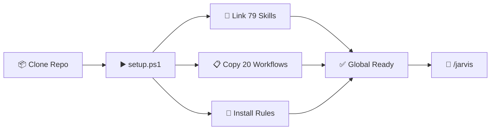
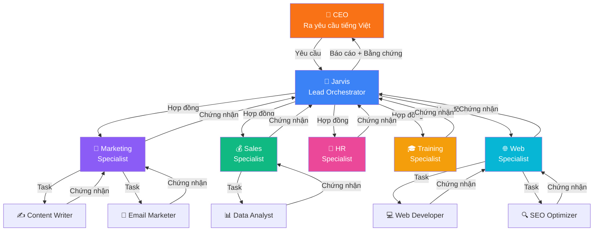
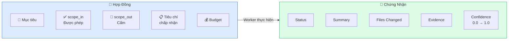
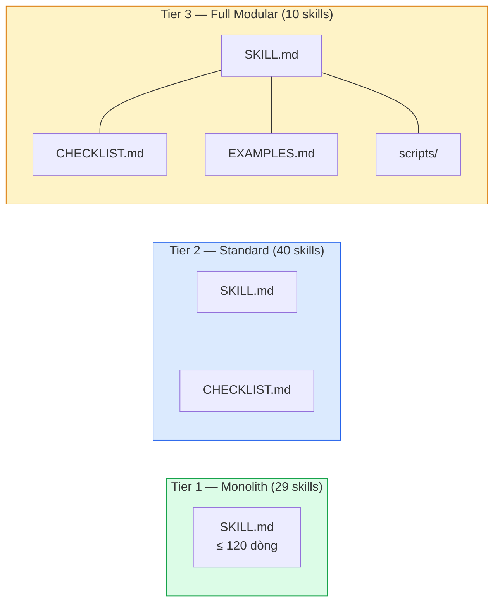
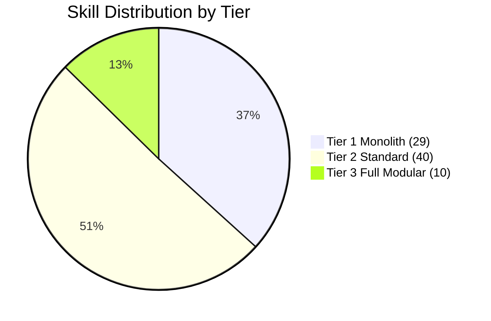
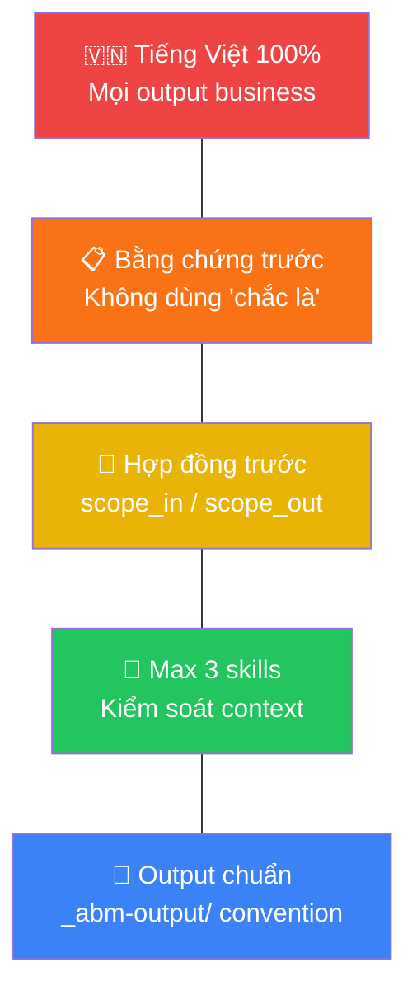

<div align="center">

# 🧠 ABM Workforce

### AI Business Master — Hệ Thống Quản Trị Doanh Nghiệp Bằng AI

[](https://github.com/xaotiensinh-abm/abm-workforce)
[](#-skill-categories)
[](#-slash-commands)
[](#-system-metrics)
[](#-license)

**Setup 1 phút** · **79 AI Skills** · **20 Workflows** · **5 SubAgents** · **100% Tiếng Việt**

[Cài Đặt](#-cài-đặt-nhanh-1-phút) · [So Sánh](#-so-sánh-với-các-công-cụ-khác) · [Hướng Dẫn](#-bắt-đầu-sử-dụng) · [Kiến Trúc](#-kiến-trúc-hệ-thống) · [Prompt Tips](#-10-mẹo-viết-prompt-hiệu-quả) · [Changelog](#-changelog)

</div>

---

## ✨ ABM Workforce Là Gì?

ABM Workforce là hệ thống **multi-agent AI** dành cho doanh nghiệp SME Việt Nam — biến AI thành **đội ngũ nhân sự ảo**: marketing, sales, HR, training, web development. CEO chỉ cần ra lệnh bằng tiếng Việt, hệ thống tự phân công, thực thi, báo cáo.

> **Triết lý**: "Brain-First" — Tư duy dẫn dắt Công nghệ, AI là đòn bẩy không phải thay thế.

### Highlights v4.0

| Feature | Chi tiết |
|---------|---------|
| 🏗️ **Hybrid 3-Tier Skills** | 79 skills phân theo 3 tier: Monolith → Standard → Full Modular |
| 🤖 **5 SubAgents** | Marketing, Sales, HR, Training, Web Specialist |
| ⚙️ **5 Workers** | Content Writer, Data Analyst, Web Dev, Email, SEO |
| 📚 **12 Second-Brain** | Knowledge base từ deep research: VN market, SEO, coaching |
| 🔧 **7 Scripts** | Auto-executable: SEO audit, security check, benchmark |
| 📋 **47 Quality Gates** | CHECKLIST.md cho mọi skill Tier 2+ |
| 🌐 **Auto Setup** | 1 lệnh → skills + workflows + rules kích hoạt global |

---

## 🆚 So Sánh Với Các Công Cụ Khác

| Tiêu chí | VS Code | Cursor | ChatGPT thuần | **Antigravity + ABM** |
|-----------|:-------:|:------:|:--------------:|:---------------------:|
| **Viết code** | ✅ | ✅ | ❌ | ✅ |
| **Chat AI** | Plugin | Tích hợp | ✅ | ✅ Tích hợp sâu |
| **Multi-Agent** | ❌ | ❌ Chỉ 1 AI | ❌ Chỉ 1 AI | ✅ **5 Agent + 5 Worker** |
| **Giao việc tiếng Việt** | ❌ | ❌ | ❌ | ✅ **100% Tiếng Việt** |
| **Hệ thống trí nhớ** | ❌ | ❌ | Có giới hạn | ✅ **Second Brain 12 files** |
| **Tự động phân việc** | ❌ | ❌ | ❌ | ✅ **Jarvis routing** |
| **Kiểm chứng output** | ❌ | ❌ | ❌ | ✅ **Hợp đồng + Chứng nhận** |
| **Slash commands** | ❌ | ❌ | ❌ | ✅ **20 workflows** |

> 💡 Khi dùng ChatGPT hay Gemini, bạn nói chuyện với **1 AI "biết tuốt"**. Với ABM, bạn có **đội ngũ AI chuyên trách** — mỗi agent chuyên 1 lĩnh vực, như đội nhân sự thật.

---

## ⚡ Cài Đặt Nhanh (1 phút)

### Windows (PowerShell) — Khuyến nghị
```powershell
git clone https://github.com/xaotiensinh-abm/abm-workforce.git
cd abm-workforce
.\setup.ps1
```

### Windows (Double-click)
```
1. Download hoặc clone repo
2. Double-click → setup.bat
3. Done!
```

### Mac / Linux
```bash
git clone https://github.com/xaotiensinh-abm/abm-workforce.git
cd abm-workforce
chmod +x setup.sh && ./setup.sh
```

### Setup làm gì?



### Quản lý cài đặt

```powershell
.\setup.ps1              # Cài đặt đầy đủ
.\setup.ps1 -Force       # Ghi đè & cài lại
.\setup.ps1 -Verify      # Kiểm tra trạng thái
.\setup.ps1 -Uninstall   # Gỡ sạch sẽ
```

### Kỳ vọng sau setup:
```
[OK] Global skills: 79
[OK] Global workflows: 20
[OK] Sample skill link valid
ABM Workforce installed successfully!
```

---

## 🚀 Bắt Đầu Sử Dụng

### Bước 1: Gọi Jarvis
```
/jarvis
```
Jarvis hiển thị greeting + dashboard + menu lệnh.

### Bước 2: Giao việc

#### Slash Commands — 20 lệnh tắt

| Command | Chức năng | SubAgent | Ví dụ thực tế |
|---------|-----------|----------|---------------|
| `/marketing` | Content, SEO, social, email | Marketing Specialist | `/marketing viết 5 bài FB giới thiệu khóa AI cho CEO` |
| `/sales` | Proposal, cold email, pricing | Sales Specialist | `/sales viết proposal tư vấn AI cho chuỗi nhà hàng 5 chi nhánh` |
| `/hr` | Tuyển dụng, onboarding, review | HR Specialist | `/hr viết JD tuyển HLV AI, lương 15-25 triệu` |
| `/training` | Khóa học, giáo trình, workshop | Training Specialist | `/training thiết kế khóa "AI cho HR" 4 buổi offline` |
| `/dev` | Bug fix, feature, website | Web Specialist | `/dev sửa landing page, thêm form đăng ký` |
| `/docs` | Tài liệu, SOP, proposal | — | `/docs viết SOP quy trình onboarding khách hàng` |
| `/report` | Báo cáo, KPI, dashboard | — | `/report báo cáo tháng 3, 45 học viên mới` |
| `/review` | Đánh giá phản biện đa chiều | — | `/review đánh giá chiến lược marketing Q1` |
| `/cskh` | Chăm sóc khách hàng | — | Follow-up, churn prevention |
| `/finance` | Kế toán, tài chính | — | Báo cáo tài chính, bảng lương |
| `/legal` | Pháp chế, tuân thủ | — | Soạn hợp đồng, điều khoản dịch vụ |
| `/rd` | Nghiên cứu & phát triển | — | Trend AI, benchmark công cụ |
| `/save` | Lưu trạng thái | — | Backup phiên làm việc |
| `/recap` | Khôi phục phiên trước | — | Tiếp tục công việc dang dở |
| `/product-launch` | Ra mắt sản phẩm | — | Quy trình launch khóa học mới |
| `/council` | Hội đồng đánh giá | — | Đánh giá đa chiều 8 personas |
| `/skill-sync` | Đồng bộ skills | — | Cập nhật skills hàng tháng |
| `/skill-generator` | Tạo skill mới | — | Pipeline 9 bước tạo skill |
| `/security-audit` | Audit bảo mật | — | Scan secrets, PII, scope |
| `/manifest-sync` | Đồng bộ manifests | — | Sync sau thay đổi skills |

### Hoặc nói tự nhiên — Không cần nhớ lệnh
```
✅ "jarvis viết email follow-up cho 200 học viên chưa gia hạn"
✅ "jarvis tạo kịch bản chatbot tư vấn khóa học cho Zalo OA"
✅ "jarvis phân tích đối thủ ABC Education về giá và chương trình"
✅ "jarvis thiết kế agenda workshop AI cho doanh nghiệp, 4 tiếng"
✅ "jarvis viết caption TikTok 15 giây về lợi ích dùng AI"
```

---

## 🏗️ Kiến Trúc Hệ Thống

### Delegation Chain — Chuỗi Ủy Quyền



### Ví dụ thực tế — Khi bạn giao việc

```
🧑‍💼 Bạn (CEO): "Viết proposal coaching AI cho doanh nghiệp FnB, giá 250 triệu"
         │
         ▼
🧠 Jarvis: Phân tích → Đây là việc sales + marketing
         │
    ┌─────┼──────────────┐
    ▼     ▼              ▼
📢 Marketing    💰 Sales       📄 Office
Specialist     Specialist      Manager
   │              │              │
   ▼              ▼              ▼
copywriting   pricing-      office-
content-      strategy      documents
strategy      sales-
              enablement
   │              │              │
   └──────────────┼──────────────┘
                  ▼
         📋 Proposal hoàn chỉnh
         (6 phần, tiếng Việt, sẵn gửi)
```

### Mô hình Hợp đồng → Chứng nhận

Đây là **LÕI CỐT LÕI** khiến ABM khác biệt. Mọi việc giao đi đều có HỢP ĐỒNG, trả về đều có BẰNG CHỨNG.



> 💡 **Tương tự coaching ABMEdu**: Giống như bạn giao KPI cho nhân viên — phải rõ mục tiêu, phạm vi, deadline, và nhân viên phải báo cáo kết quả kèm bằng chứng.

### Hybrid 3-Tier Skills



---

## 💡 10 Mẹo Viết Prompt Hiệu Quả

| # | Mẹo | ❌ Prompt yếu | ✅ Prompt mạnh |
|:-:|------|-------------|--------------|
| 1 | **Nêu rõ mục tiêu** | "Viết email" | "Viết email follow-up cho HV workshop 7 ngày trước" |
| 2 | **Chỉ định đối tượng** | "Viết bài Facebook" | "Viết bài FB cho CEO/chủ DN vừa nhỏ, 35-50 tuổi" |
| 3 | **Nêu context** | "Viết proposal" | "Viết proposal tư vấn AI cho chuỗi 10 phòng khám, 500tr/năm" |
| 4 | **Yêu cầu format** | "Phân tích đối thủ" | "Phân tích thành bảng: Giá / Chương trình / Điểm mạnh / yếu" |
| 5 | **Nêu tone** | "Viết content" | "Tone chuyên gia, chia sẻ giá trị, không bán hàng trắng trợn" |
| 6 | **Chỉ định số lượng** | "Viết vài bài" | "5 bài, mỗi bài 300-500 từ, kèm hashtag và CTA" |
| 7 | **Nêu constraint** | "Tạo kế hoạch" | "Kế hoạch marketing 30 ngày, budget 20tr, focus FB + Zalo" |
| 8 | **Yêu cầu ví dụ** | "Viết mẫu email" | "3 mẫu: chào mừng, nhắc học, upsell — kèm subject A/B" |
| 9 | **Phản hồi cụ thể** | "Sửa lại" | "Sửa lại — thêm ROI dự kiến, bỏ đoạn giới thiệu dài" |
| 10 | **Tham chiếu** | "Viết theo kiểu..." | "Viết theo format trong file `_abm-output/proposal-mau.md`" |

---

## 📁 Cấu Trúc Thư Mục

```
abm-workforce/
├── 🔧 setup.ps1 / setup.sh / setup.bat     # Auto setup
├── 📖 README.md                              # File này
│
├── _abm/
│   ├── 📖 README.md · CHANGELOG.md · RULES_GLOBAL.md
│   ├── bmm/agents/
│   │   ├── jarvis-orchestrator.md            # 🧠 Orchestrator (23KB)
│   │   └── skills/                           # 79 active skills
│   │       ├── [skill]/SKILL.md              # Skill definition
│   │       ├── [skill]/CHECKLIST.md          # 47 quality gates
│   │       ├── [skill]/scripts/              # 7 executable scripts
│   │       └── _archive/                     # 37 archived
│   ├── SubAgents/  (5)                       # Specialists
│   ├── Workers/    (5)                       # Task executors
│   ├── Context-Layer/Second-Brain/ (12)      # Knowledge base
│   ├── Team-Orchestration/         (3)       # Pipelines
│   └── _config/                              # Manifests + configs
│
├── .agents/
│   ├── skills/                               # Local skill links
│   └── workflows/                            # 20 slash commands
│
└── _abm-output/                              # Kết quả runtime
```

---

## 🎯 Skill Categories

### Business & Sales
`high-ticket-sales` · `pricing-strategy` · `proposal-generator` · `roi-calculator` · `sales-enablement` · `cold-email` · `client-success`

### Marketing & Content
`content-strategy` · `content-creator` · `copywriting` · `email-marketing` · `social-content` · `growth-engine` · `seo-fundamentals` · `seo-audit`

### Web & Design
`frontend-design` · `frontend-developer` · `landing-page-builder` · `responsive-web-design` · `web-accessibility` · `website-conversion` · `ui-ux-pro-max`

### Training & HR
`course-design` · `training-content` · `student-assessment` · `talent-acquisition` · `performance-review` · `workshop-facilitation`

### Operations & Security
`workflow-automation` · `prompt-sentinel` · `security-review` · `critical-thinking` · `multi-dimensional-review` · `verification-before-completion`

---

## 🔧 Executable Scripts

| Skill | Script | Command |
|-------|--------|---------|
| `seo-audit` | `run-seo-audit.ps1` | `.\run-seo-audit.ps1 -Url "https://example.com"` |
| `benchmark-lab` | `run-benchmark.ps1` | `.\run-benchmark.ps1 -Url "https://example.com"` |
| `security-review` | `security-check.ps1` | `.\security-check.ps1` |
| `code-review` | `review-checklist.ps1` | `.\review-checklist.ps1 -File "app.js"` |
| `student-assessment` | `generate-quiz.ps1` | `.\generate-quiz.ps1 -Module "AI"` |
| `workflow-automation` | `create-workflow.ps1` | `.\create-workflow.ps1 -Name "new-wf"` |
| `skill-generator` | `9-phase pipeline` | Full skill creation |

---

## 📊 System Metrics



### Audit Score: 9.0/10

| Dimension | Score | Evidence |
|-----------|:-----:|----------|
| Architecture | 9 | Hybrid 3-Tier + manifest-sync + CHANGELOG |
| Enforcement | 9 | 47 CHECKLIST + attestation template |
| Coverage | 9 | 79 skills: web, business, security, training |
| Quality | 9 | Scripts cho 7 skills, avg 150+ lines |
| Agent Ecosystem | 9 | 5 SubAgents + 5 Workers + routing |
| Workflows | 9 | 20 workflows + 3 pipelines |
| Context Management | 9 | Hybrid 3-Tier, 116→79 optimized |
| Knowledge Base | 9 | 12 Second-Brain files (deep research) |
| Traceability | 9 | CHANGELOG + manifests + sync |
| Security | 9 | prompt-sentinel + security-review + PII scan |

---

## 🔒 5 Quy Tắc Sắt



1. **Tiếng Việt 100%** — Mọi output business bằng tiếng Việt
2. **Bằng chứng trước khi khẳng định** — Không dùng "chắc là", "có lẽ"
3. **Hợp đồng trước khi giao việc** — Scope, criteria, budget rõ ràng
4. **Max 3 skills/lần load** — Kiểm soát context, tránh overload
5. **Output → `_abm-output/`** — Naming convention chuẩn hóa

---

## 📝 Changelog

### v4.0 (2026-03-14) — Hybrid 3-Tier + Auto Setup + Global Deploy
- ✅ README v4.0 với mermaid diagrams + ví dụ thực tế
- ✅ Auto-setup: `setup.ps1` / `setup.sh` / `setup.bat`
- ✅ Hybrid 3-Tier skill architecture (29 + 40 + 10)
- ✅ 5 SubAgents: marketing, sales, hr, training, web
- ✅ 5 Workers: content-writer, data-analyst, web-dev, email, seo
- ✅ 47 CHECKLIST.md quality gates
- ✅ 12 Second-Brain knowledge files (deep research VN market)
- ✅ 7 executable scripts cho skills
- ✅ 3 Team-Orchestration pipelines
- ✅ Global rules deployment
- ✅ Audit score: 6.8 → **9.0/10**

### v3.0 — Skills Expansion
- 54 → 79 active skills, archived 37 low-impact
- Web skills: responsive, a11y, SEO, landing page
- Revenue skills: proposal-generator, roi-calculator

### v2.0 — Foundation
- Delegation Chain Management model
- Jarvis Orchestrator engine
- 18 workflows + slash commands
- Vietnamese-first global rules

---

## 📄 License

MIT License — Free to use, modify, and distribute.

## 🙏 Credits

<div align="center">

Built with ❤️ by **ABM Team** · Powered by **Antigravity IDE**

**🌐 [abmedu.vn](https://abmedu.vn)** · Vì một Việt Nam phổ cập A.I

[⬆ Back to top](#-abm-workforce)

</div>
