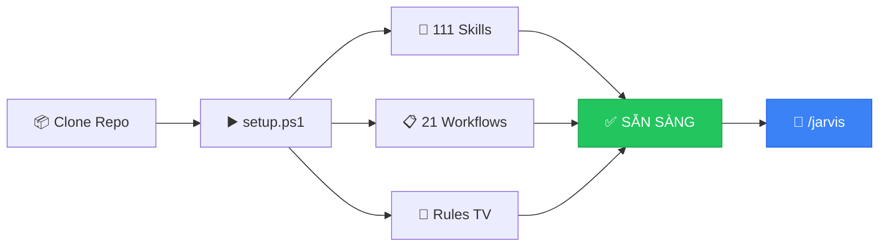
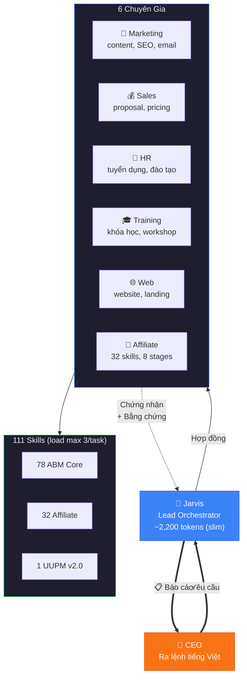
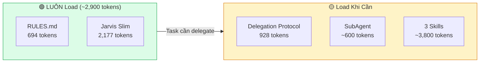
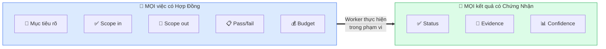
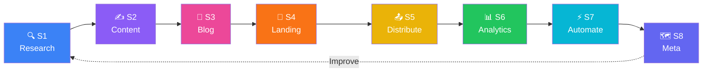
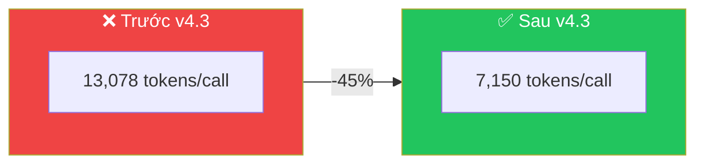
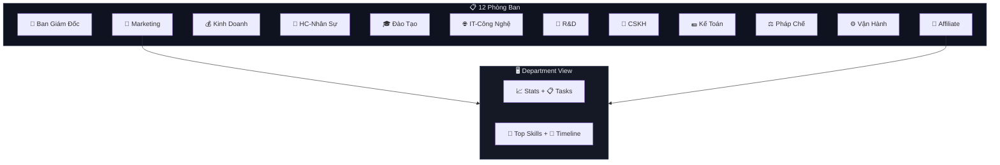
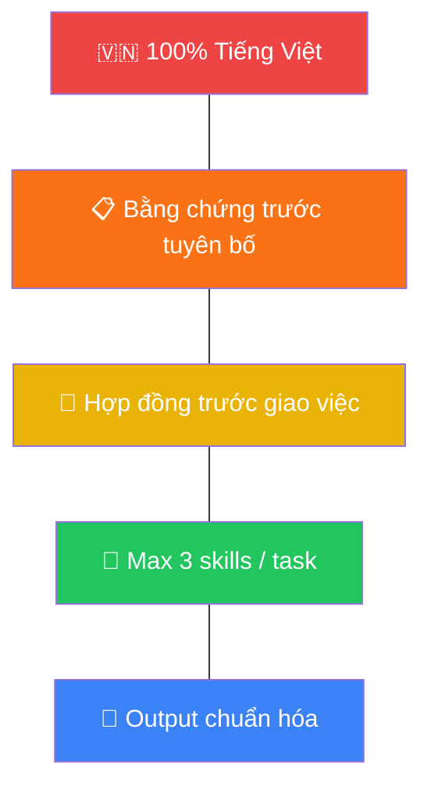

<div align="center">


# Biến AI Thành Đội Ngũ Nhân Sự 24/7 Cho Doanh Nghiệp Của Bạn

### Không cần biết code. Không cần biết tiếng Anh. Chỉ cần nói — Jarvis làm.

<br>

[](https://github.com/xaotiensinh-abm/abm-workforce)
[](#-111-skills--6-chuyên-gia-ai)
[](#-cài-đặt-trong-60-giây)
[](#-audit--hiệu-suất)
[](#)
[](#-context--token-optimization)

<br>

**CEO đang mất 192 triệu/năm cho công việc AI có thể làm trong 5 phút.**

[**🚀 Cài Đặt Ngay →**](#-cài-đặt-trong-60-giây) · [Xem Demo](#-xem-jarvis-làm-việc) · [So Sánh](#-tại-sao-không-phải-chatgpt)

</div>

---

## 😫 Bạn Đang Gặp Vấn Đề Này?

> *"Tôi tốn 3 tiếng viết 1 proposal, rồi phải sửa đi sửa lại..."*
> 
> *"Nhân viên marketing nghỉ, content kênh Facebook chết 2 tuần..."*
> 
> *"Muốn dùng AI nhưng không biết bắt đầu từ đâu, prompt kiểu gì..."*

### ABM Workforce giải quyết TẤT CẢ — trong **1 phút cài đặt**.

Bạn nói: *"Viết proposal coaching AI cho chuỗi nhà hàng, giá 250 triệu"*

Jarvis tự động: **phân tích → chọn chuyên gia → giao việc → kiểm tra → trả proposal hoàn chỉnh** — sẵn gửi khách.

<div align="center">

### ⏱️ 5 phút với Jarvis = 3 tiếng làm thủ công

**[🚀 Cài Đặt Ngay — Miễn Phí →](#-cài-đặt-trong-60-giây)**

</div>

---

## 🆚 Tại Sao Không Phải ChatGPT?

| | ChatGPT / Gemini | **ABM Workforce** |
|---|:---:|:---:|
| **Số AI** | 1 AI "biết tuốt" | **6 chuyên gia + 5 worker** chuyên trách |
| **Skills** | Generic | **111 skills** tối ưu cho SME Việt Nam |
| **Ngôn ngữ** | Trộn Anh-Việt | **100% Tiếng Việt** chuẩn business |
| **Trí nhớ** | Quên sau mỗi chat | **Second Brain + NotebookLM** — nhớ vĩnh viễn |
| **Kiểm chứng** | Không ai kiểm tra | **Hợp đồng + Chứng nhận + Bằng chứng** |
| **Phân công** | Bạn tự làm hết | **Jarvis tự routing** đúng chuyên gia |
| **Commands** | ❌ | **21 lệnh tắt** — `/marketing`, `/sales`, `/affiliate`... |
| **Token** | Không tối ưu | **Giảm 45%** context consumption |
| **Giá** | $20/tháng | **Miễn phí** + có đội ngũ sẵn |

> 💡 **ChatGPT là 1 nhân viên biết tuốt nhưng không chuyên gì.**
> **ABM là đội ngũ 11 chuyên gia**, mỗi người giỏi 1 lĩnh vực — và có quản lý (Jarvis) điều phối.

---

## 👀 Xem Jarvis Làm Việc

```
🧑‍💼 Bạn: "Viết 5 bài Facebook giới thiệu khóa AI cho CEO"

🧠 Jarvis phân tích:
   → Task: marketing (social content)
   → Chọn: Marketing Specialist
   → Load: copywriting + content-strategy + marketing-psychology
   → Budget: max 20 tool calls

📢 Marketing Specialist thực hiện:
   ✅ Bài 1: Hook storytelling — "Tôi từng mất 8 tiếng/ngày cho email..."
   ✅ Bài 2: Social proof — "127 CEO đã áp dụng, tiết kiệm 192tr/năm"
   ✅ Bài 3: Pain point — "Nhân viên nghỉ, ai viết content?"
   ✅ Bài 4: How-to — "3 bước biến AI thành trợ lý kinh doanh"
   ✅ Bài 5: CTA urgency — "Chỉ còn 5 suất coaching 1:1 trong Q2"

📋 Chứng nhận: status=xong | confidence=0.95 | 5 bài sẵn đăng
```

---

## ⚡ Cài Đặt Trong 60 Giây

### Windows (PowerShell)
```powershell
git clone https://github.com/xaotiensinh-abm/abm-workforce.git
cd abm-workforce
.\setup.ps1
```

### Windows (Double-click!)
```
1. Download repo → Giải nén
2. Double-click → setup.bat
3. Xong! Gõ /jarvis để bắt đầu 🚀
```

### Mac / Linux
```bash
git clone https://github.com/xaotiensinh-abm/abm-workforce.git
cd abm-workforce
chmod +x setup.sh && ./setup.sh
```



---

## 🤖 111 Skills + 6 Chuyên Gia AI

### Kiến Trúc Delegation Chain



### Lazy-Load Architecture (v4.3)



> 💡 **v4.3 giảm 45% token**: Jarvis orchestrator tách thành slim (luôn load) + delegation protocol (chỉ load khi ủy quyền). RULES.md giảm 75%.

### 21 Slash Commands

| Lệnh | Việc gì? | Ví dụ |
|-------|---------|-------|
| `/jarvis` | 🧠 Tổng đài — Jarvis tự phán đoán | Mô tả yêu cầu bất kỳ |
| `/marketing` | 📢 Content, SEO, social, email | 5 bài FB cho CEO SME |
| `/sales` | 💰 Proposal, cold email, pricing | Proposal tư vấn AI cho FnB |
| `/hr` | 👥 JD, tuyển dụng, onboarding | JD tuyển HLV AI |
| `/training` | 🎓 Khóa học, giáo trình, workshop | Khóa "AI cho HR" 4 buổi |
| `/dev` | 💻 Website, bug fix, landing page | Sửa landing, thêm form |
| `/affiliate` | 🔗 Affiliate funnel, commission | Tìm chương trình, viết review |
| `/report` | 📊 Báo cáo, KPI, phân tích | Báo cáo tháng 3 |
| `/docs` | 📄 SOP, proposal, memo | SOP onboarding khách |
| `/review` | 🔍 Đánh giá phản biện đa chiều | Review chiến lược Q1 |
| `/cskh` | 🤝 Chăm sóc khách hàng | Follow-up, churn prevention |
| `/finance` | 💵 Kế toán, tài chính | Bảng lương, chi phí |
| `/legal` | ⚖️ Pháp chế, hợp đồng | Soạn hợp đồng coaching |
| `/rd` | 🔬 Nghiên cứu, benchmark | Trend AI 2026 |
| `/save` | 💾 Lưu phiên + sync dashboard | **Luôn gõ sau mỗi task!** |
| `/recap` | 🔄 Khôi phục phiên trước | Tiếp tục việc dang dở |
| `/product-launch` | 🎯 Ra mắt sản phẩm | Launch khóa học mới |
| `/council` | 🏛️ Hội đồng đánh giá | 8 personas phản biện |
| `/skill-generator` | ⚙️ Tạo skill mới | Pipeline 9 bước |
| `/skill-sync` | 🔄 Đồng bộ skills | Cập nhật hàng tháng |
| `/security-audit` | 🔒 Audit bảo mật | Scan secrets, PII |

### Hoặc Nói Như Nói Với Nhân Viên

```
✅ "Jarvis viết email follow-up cho 200 học viên chưa gia hạn"
✅ "Jarvis tạo kịch bản chatbot tư vấn khóa học cho Zalo OA"
✅ "Jarvis tìm chương trình affiliate AI tools, commission recurring"
✅ "Jarvis thiết kế agenda workshop AI cho doanh nghiệp, 4 tiếng"
```

> 🔥 **Không cần nhớ lệnh. Không cần prompt engineering. Nói tiếng Việt bình thường.**

---

## 🏗️ Kiến Trúc Hệ Thống

### Hybrid 3-Tier — 111 Skills Được Tổ Chức Bài Bản


### Hợp Đồng → Chứng Nhận — Tại Sao Output Luôn Chất Lượng



### Second Brain — AI Hiểu Doanh Nghiệp Của Bạn

| Layer | Dữ liệu | Công nghệ |
|-------|---------|-----------|
| 12 Knowledge Files | VN market, coaching, SEO, đối thủ | Markdown files |
| NotebookLM | Semantic skill routing, long-term memory | Google NotebookLM API |
| Session Saves | Lịch sử task, context phiên | `/save` + `/recap` |
| Task History | Tracking toàn bộ task + evidence | `task-history.json` |

---

## 🔗 Phòng Affiliate — 32 Skills × 8 Stages



| Stage | Skills | Ví dụ |
|-------|:------:|-------|
| **S1 Research** | 4 | Tìm chương trình, phân tích niche |
| **S2 Content** | 4 | Viết content viral, TikTok script |
| **S3 Blog** | 4 | Bài review SEO, so sánh X vs Y |
| **S4 Landing** | 4 | Landing page, squeeze page |
| **S5 Distribute** | 4 | Email sequence, deploy, schedule |
| **S6 Analytics** | 4 | UTM tracking, A/B test, report |
| **S7 Automate** | 4 | Scale, repurpose, portfolio |
| **S8 Meta** | 4 | Funnel planner, compliance |

> Hướng dẫn sử dụng chi tiết: `_abm-output/affiliate/HUONG-DAN-AFFILIATE.md`

---

## ⚡ Context & Token Optimization

### v4.3 — Giảm 45% Token Consumption



| Component | Trước | Sau | Giảm |
|-----------|:-----:|:---:|:----:|
| RULES.md | 2,780 | **694** | -75% |
| Jarvis Orchestrator | 5,819 | **2,177** | -63% |
| Delegation Protocol | (gộp) | 928 (lazy) | On-demand |

**Cách thức:**
1. **Tách Jarvis** → slim (luôn load) + delegation protocol (lazy-load khi cần ủy quyền)
2. **Slim RULES.md** — bỏ ASCII diagram, gộp routing, tóm tắt format
3. **Lazy-load Skills** — routing table trong Jarvis, chỉ load SKILL.md khi chọn xong

---

## 💡 10 Mẹo Viết Prompt — Từ Yếu → Mạnh

| # | ❌ Yếu | ✅ Mạnh |
|:-:|--------|--------|
| 1 | "Viết email" | "Viết email follow-up cho HV workshop 7 ngày trước" |
| 2 | "Viết bài Facebook" | "5 bài FB cho CEO SME 35-50 tuổi, tone chuyên gia" |
| 3 | "Viết proposal" | "Proposal tư vấn AI cho chuỗi 10 phòng khám, 500tr/năm" |
| 4 | "Phân tích đối thủ" | "Bảng so sánh: Giá / Chương trình / Điểm mạnh / yếu" |
| 5 | "Tạo kế hoạch" | "Marketing 30 ngày, budget 20tr, focus FB + Zalo" |

---

## 💾 /save — Lưu Phiên & Đồng Bộ Dashboard

> ⚠️ **LUÔN gõ `/save` sau mỗi task hoặc cuối ngày!**


---

## 📊 Dashboard v4.0 — Trung Tâm Điều Khiển

```
📂 Mở: dashboard/index.html
```

### 12 Phòng Ban — Mỗi phòng có View riêng



---

## 📊 Audit & Hiệu Suất

| Chiều đánh giá | Điểm | Bằng chứng |
|----------------|:----:|-----------:|
| Kiến trúc | **9.5** | Hybrid 3-Tier + lazy-load + token optimization |
| Skill coverage | **9** | 111 skills: 78 core + 32 affiliate + UUPM |
| Đội ngũ AI | **9** | 6 SubAgents + 5 Workers + Jarvis |
| Quản lý context | **9.5** | Token giảm 45%, lazy-load delegation |
| Knowledge Base | **9** | 12 files + NotebookLM semantic routing |
| Truy vết | **9** | CHANGELOG + manifests + task-history |
| Bảo mật | **9** | prompt-sentinel + PII scan + compliance |
| **Trung bình** | **9.2** | |

---

## 📁 Cấu Trúc Dự Án

```
abm-workforce/
├── 🔧 setup.ps1 / setup.sh / setup.bat     ← Cài đặt 1 phút
├── 📖 README.md                              ← File này
├── 📊 dashboard/                             ← Dashboard v4.0
│   ├── index.html                            ← Mở để xem
│   ├── task-data.js                          ← Data (auto-generated)
│   └── sync.ps1                              ← Script đồng bộ
├── 🧠 tools/                                 ← Công cụ mở rộng
│   ├── notebooklm-brain/                     ← NotebookLM Second Brain
│   └── notebooklm/                           ← Setup & login scripts
├── _abm/
│   ├── bmm/agents/                           ← Jarvis + config
│   │   ├── jarvis-orchestrator.md            ← Slim (2,177 tokens)
│   │   ├── jarvis-delegation-protocol.md     ← Lazy-load (928 tokens)
│   │   └── skills/              (78 skills)  ← AI skills
│   ├── SubAgents/               (6 specs)    ← Chuyên gia AI
│   ├── Workers/                 (5 exec)     ← Worker thực thi
│   ├── Context-Layer/Second-Brain/           ← Trí nhớ AI
│   └── _config/                              ← Manifests
├── .agent/skills/                            ← Extended skills
│   ├── affiliate-skills/        (32 skills)  ← Affiliate Marketing
│   └── ui-ux-pro-max/                        ← UUPM v2.0
├── .agents/workflows/           (21 cmds)    ← Slash commands
├── .abm-sessions/                            ← Session saves
└── _abm-output/                              ← Kết quả runtime
    └── affiliate/                            ← Output affiliate
```

---

## 🔒 5 Quy Tắc Sắt



---

## 📝 Changelog

### v4.3 (2026-03-18) — Token Optimization + Affiliate Specialist v2
- ✅ 🚀 **Token giảm 45%**: Jarvis slim (2,177 tokens) + RULES.md slim (694 tokens)
- ✅ 📦 `jarvis-delegation-protocol.md` — lazy-load khi cần ủy quyền
- ✅ 🔗 Affiliate Specialist v2 — audit 3 rounds: 6.15 → 8.4 → **9.2/10 (Grade S)**
  - 4-section ABM chuẩn (Goal/Instructions/Examples/Constraints)
  - VN market context: Shopee, TikTok Shop, Lazada, AccessTrade
  - CHECKLIST.md + scope control + error recovery
- ✅ 📘 Hướng dẫn sử dụng Affiliate tiếng Việt (`HUONG-DAN-AFFILIATE.md`)

### v4.2 (2026-03-16) — NotebookLM Second Brain + UUPM v2.0 + Affiliate
- ✅ 🧠 NotebookLM Second Brain: semantic skill routing + long-term memory
- ✅ 🎨 UI UX Pro Max v2.0: 161 industry rules, design system generation
- ✅ 🔗 Phòng Affiliate: 32 skills, 8 stages full funnel, SubAgent + `/affiliate`
- ✅ CLI: `python brain.py skill|memory|ask` — hỏi đáp qua NotebookLM

### v4.1 (2026-03-15) — Dashboard + /save Pipeline
- ✅ Dashboard v4.0: 12 phòng ban, task detail modal, analytics
- ✅ `/save` pipeline: SESSION → task-history.json → sync → dashboard

### v4.0 (2026-03-14) — Hybrid 3-Tier + Auto Setup
- ✅ 79 skills, 5 SubAgents, 5 Workers, 47 quality gates
- ✅ Audit score: 6.8 → **9.0/10**

---

<div align="center">

## 🚀 Bắt Đầu Ngay — Miễn Phí

### CEO đang đọc README này trong khi AI có thể đang viết proposal cho bạn.

```powershell
git clone https://github.com/xaotiensinh-abm/abm-workforce.git
cd abm-workforce
.\setup.ps1
```

**60 giây setup → Gõ `/jarvis` → Đội ngũ AI sẵn sàng 24/7.**

<br>

[](https://github.com/xaotiensinh-abm/abm-workforce)
[](https://abmedu.vn)

---

**🌐 [abmedu.vn](https://abmedu.vn)** · Vì một Việt Nam phổ cập A.I

Built with ❤️ by **ABM Team** · Powered by **Antigravity IDE**

MIT License — Free to use, modify, and distribute.

[⬆ Back to top](#biến-ai-thành-đội-ngũ-nhân-sự-247-cho-doanh-nghiệp-của-bạn)

</div>
