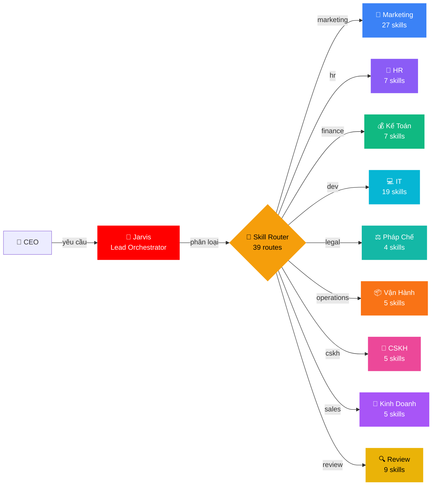
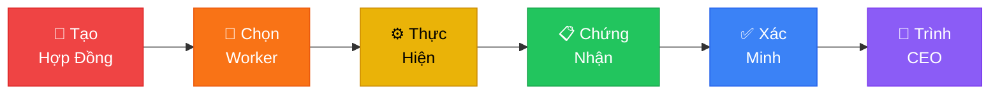
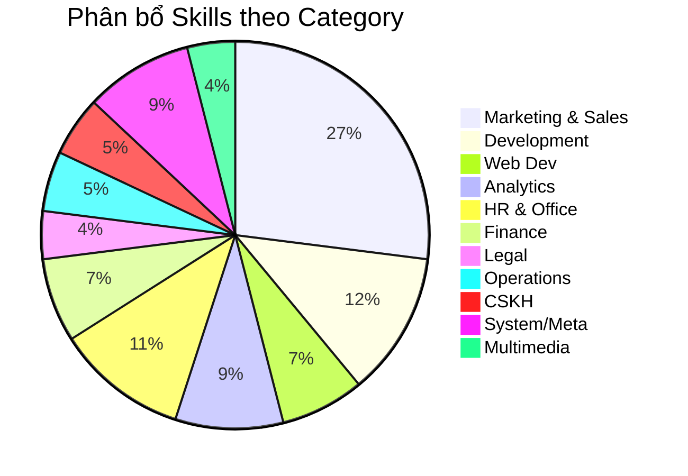
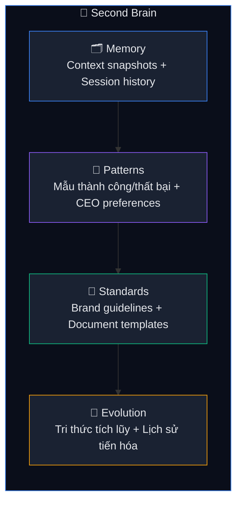

<p align="center">
  
</p>

<h1 align="center">🏢 ABM Workforce — AI Business Master</h1>

<p align="center">
  <strong>Hệ sinh thái Multi-Agent điều phối doanh nghiệp số — 9 phòng ban, 103 kỹ năng, 1 bộ não trung tâm.</strong>
</p>

<p align="center">
  <a href="ABM-CHANGELOG.md"></a>
  <a href="LICENSE"></a>
  <a href="_abm/_config/skill-manifest.csv"></a>
  <a href="_abm/bmm/agents/jarvis-orchestrator.md"></a>
  <a href=".agents/workflows/"></a>
  <a href=".gemini/RULES.md"></a>
  <a href="dashboard/index.html"></a>
</p>

<p align="center">
  <em>Kỷ luật sắt · Bằng chứng thật · Kết quả đo được · 100% Tiếng Việt</em>
</p>

---

## 🎯 Tổng Quan

ABM Workforce là hệ thống **Multi-Agent Orchestration** dành cho doanh nghiệp Việt Nam. Thay vì dùng AI rời rạc, ABM tổ chức AI thành **đội ngũ nhân sự số** hoàn chỉnh — mỗi phòng ban có agent, skills, và workflow riêng, tất cả được điều phối bởi **Jarvis Lead Orchestrator**.



---

## ⚡ Bắt Đầu Trong 60 Giây

```bash
# 1. Clone
git clone https://github.com/xaotiensinh-abm/abm-workforce.git
cd abm-workforce

# 2. Mở IDE (Antigravity / Cursor / Gemini-compatible)
# Không cần install — toàn bộ là Markdown + YAML

# 3. Gõ lệnh đầu tiên
/jarvis
```

> 🧠 Jarvis sẽ online và sẵn sàng nhận việc. Nói tiếng Việt tự nhiên — Jarvis tự phân loại và route.

---

## 🏗️ Kiến Trúc Hệ Thống

```mermaid
graph TB
    subgraph CORE["🧠 Core Engine"]
        J["Jarvis Orchestrator"]
        DC["Delegation Chain"]
        VBC["Verification Protocol"]
        CE["Context Engineering"]
    end

    subgraph AGENTS["🤖 Agent Layer"]
        SA1["marketing-specialist"]
        SA2["hr-specialist"]
        SA3["business-analyst"]
        SA4["automation-engineer"]
        SA5["office-manager"]
        SA6["creative-strategist"]
    end

    subgraph SKILLS["🧩 Skill Engine — 103 Skills"]
        S1["Marketing & Sales (27)"]
        S2["Development (19)"]
        S3["Analytics (9)"]
        S4["HR & Office (11)"]
        S5["Finance (7)"]
        S6["Legal (4)"]
        S7["Operations (5)"]
        S8["CSKH (5)"]
        S9["System/Meta (9)"]
        S10["Multimedia (4)"]
    end

    subgraph MEMORY["💾 Second Brain"]
        M1["Knowledge Base<br/>103 entries"]
        M2["Patterns & Standards"]
        M3["Evolution History"]
        M4["Usage Metrics"]
    end

    CORE --> AGENTS
    AGENTS --> SKILLS
    SKILLS --> MEMORY

    style CORE fill:#FF0000,stroke:#cc0000,color:#fff
    style AGENTS fill:#3b82f6,stroke:#2563eb,color:#fff
    style SKILLS fill:#8b5cf6,stroke:#7c3aed,color:#fff
    style MEMORY fill:#10b981,stroke:#059669,color:#fff
```



---

## 🔐 Delegation Chain — Quy Tắc Tối Thượng

Mọi task đều đi qua **6 bước bắt buộc** — bỏ bước nào = vi phạm:



| Bước | Bắt buộc | Mô tả |
|:----:|:--------:|-------|
| 1 | ✅ | **Hợp đồng** — Objective, scope, criteria, budget, risk level |
| 2 | ✅ | **Chọn Worker** — Agent routing theo task type |
| 3 | ✅ | **Thực hiện** — Trong phạm vi `scope_in`, không chạm `scope_out` |
| 4 | ✅ | **Chứng nhận** — Status, evidence, confidence, files changed |
| 5 | ✅ | **Xác minh** — Kiểm tra 5 tiêu chí độc lập |
| 6 | ✅ | **Trình CEO** — CEO quyết định cuối cùng |

> **Trách nhiệm luôn đi LÊN**: SubAgent → Worker → Jarvis → CEO

---

## 💡 15 Slash Commands

<table>
<tr>
<td width="33%">

### 🎯 Điều Phối
| Lệnh | Mô tả |
|-------|-------|
| `/jarvis` | Tổng điều phối |
| `/review` | Đánh giá 10 chiều |
| `/council` | Hội đồng phản biện |
| `/save` | Lưu trạng thái |
| `/skill-sync` | Sync skills mới |

</td>
<td width="33%">

### 🏢 Phòng Ban
| Lệnh | Mô tả |
|-------|-------|
| `/marketing` | Content, ads, SEO |
| `/sales` | Proposal, cold email |
| `/hr` | JD, review, recruit |
| `/finance` | Báo cáo, thuế, CF |
| `/legal` | Hợp đồng, SHTT |

</td>
<td width="33%">

### ⚙️ Vận Hành
| Lệnh | Mô tả |
|-------|-------|
| `/dev` | Code, debug, feature |
| `/docs` | SOP, memo, proposal |
| `/report` | KPI, monthly report |
| `/cskh` | Ticket, feedback |
| `/product-launch` | Dev + MKT song song |

</td>
</tr>
</table>

```
💬 Hoặc nói trực tiếp bằng tiếng Việt:
   "Viết email cold outreach cho SaaS quản lý nhân sự"
   → Jarvis tự route → marketing → load 3 skills → thực hiện → trả kết quả
```

---

## 🧩 103 Skills — 11 Categories



<details>
<summary><strong>📣 Marketing & Sales — 27 skills</strong> (click mở)</summary>

`product-marketing-context` · `copywriting` · `copy-editing` · `content-strategy` · `social-content` · `email-marketing` · `email-sequence` · `marketing-psychology` · `page-cro` · `signup-flow-cro` · `form-cro` · `popup-cro` · `seo-audit` · `ai-seo` · `seo-content-planner` · `programmatic-seo` · `ab-test-setup` · `analytics-tracking` · `ad-creative` · `cold-email` · `sales-enablement` · `revops` · `pricing-strategy` · `launch-strategy` · `churn-prevention` · `referral-program` · `free-tool-strategy`
</details>

<details>
<summary><strong>🔧 Development — 12 skills</strong></summary>

`subagent-driven-development` · `dispatching-parallel-agents` · `writing-plans` · `code-review` · `systematic-debugging` · `finishing-a-development-branch` · `git-worktrees` · `project-hierarchy` · `sprint-planning` · `database-management` · `self-healing` · `github-issues-sprint`
</details>

<details>
<summary><strong>🌐 Web Development — 7 skills</strong></summary>

`ui-ux-pro-max` · `frontend-design` · `frontend-developer` · `vercel-react-best-practices` · `web-design-guidelines` · `vercel-composition-patterns` · `canvas-design`
</details>

<details>
<summary><strong>📈 Analytics — 9 skills</strong></summary>

`data-analysis` · `workflow-automation` · `competitive-landscape` · `market-sizing-analysis` · `startup-analyst` · `deep-research` · `competitor-intelligence` · `knowledge-graph` · `agentic-memory`
</details>

<details>
<summary><strong>👥 HR & Office — 11 skills</strong></summary>

`hr-operations` · `office-documents` · `internal-comms` · `brainstorming` · `performance-review` · `employee-engagement` · `talent-acquisition` · `docx` · `xlsx` · `pdf` · `pptx`
</details>

<details>
<summary><strong>💰 Finance — 7 skills</strong></summary>

`data-analysis` · `startup-financial-modeling` · `expense-management` · `cash-flow-forecast` · `tax-compliance` · `xlsx` · `pdf`
</details>

<details>
<summary><strong>⚖️ Legal — 4 skills</strong></summary>

`contract-review` · `compliance-checker` · `ip-protection` · `labor-law`
</details>

<details>
<summary><strong>📦 Operations — 5 skills</strong></summary>

`supply-chain` · `inventory-management` · `logistics-optimization` · `quality-management` · `facility-management`
</details>

<details>
<summary><strong>💬 CSKH — 5 skills</strong></summary>

`churn-prevention` · `email-marketing` · `agent-email-cli` · `ticket-management` · `customer-feedback`
</details>

<details>
<summary><strong>🔒 System/Meta — 9 skills</strong></summary>

`delegation-chain` · `verification-before-completion` · `context-engineering` · `skill-creator` · `multi-dimensional-review` · `knowledge-crystallizer` · `capability-evolver` · `memory-keeper` · `save`
</details>

<details>
<summary><strong>🎨 Multimedia — 4 skills</strong></summary>

`imagen` · `veo-video-gen` · `grok-imagen` · `freepik-spaces`
</details>

---

## 📊 Dashboard — Control Center

Dashboard động theo dõi **toàn bộ hoạt động** của hệ thống:

| View | Nội dung |
|------|---------|
| **🏠 Tổng Quan** | Timeline dự án, Score 10 chiều, Phòng ban coverage, Health status |
| **📋 Lịch Sử Tasks** | Bảng tasks filterable theo phòng ban, sortable, skill tags |
| **📈 Phân Tích** | Top skills usage, Agent/Worker activity, Tiến độ theo thời gian |

> 📂 Mở `dashboard/index.html` để xem Control Dashboard.

---

## 🧠 Second Brain — Bộ Nhớ 4 Tầng



---

## 📁 Cấu Trúc Dự Án

```
abm-workforce/
├── 📋 .gemini/              → Rules toàn cục (100% Tiếng Việt)
├── ⚡ .agents/workflows/     → 15 slash commands
├── 🧠 _abm/
│   ├── bmm/agents/          → Jarvis + 6 SubAgents
│   │   └── skills/          → 103 skills (SKILL.md mỗi skill)
│   ├── _config/             → skill-manifest.csv (103 entries)
│   ├── SubAgents/           → 6 agent chuyên biệt
│   ├── Workers/             → 10 worker kỹ thuật
│   ├── Context-Layer/
│   │   ├── Knowledge-Base/  → 103 KB entries (mirror skills)
│   │   └── Second-Brain/    → Memory + Patterns + Standards
│   └── Team-Orchestration/  → 14+ workflow pipelines
├── 📊 dashboard/            → Web Dashboard (dark theme)
├── 📖 docs/                 → FAQ + Quick Start + ABM-CHANGELOG
└── 🔧 scripts/             → health-check.ps1
```

---

## 📝 Ví Dụ Sử Dụng

<table>
<tr>
<td width="50%">

**📣 Marketing — Quảng Cáo AI**
```
/marketing Tạo 10 ad variants cho Meta Ads,
sản phẩm: Khóa học AI 1.200K,
target: Sinh viên CNTT 20-28 tuổi
```

**💰 Kế Toán — Dòng Tiền**
```
/finance Dự báo cash flow 13 tuần,
gồm scenario best/base/worst
+ tính runway
```

</td>
<td width="50%">

**👥 HR — Tuyển Dụng**
```
/hr Viết JD + screening criteria
cho Senior Frontend Developer,
stack: React, TypeScript, Next.js
```

**⚖️ Pháp Chế — Đăng Ký SHTT**
```
/legal Chuẩn bị hồ sơ đăng ký
nhãn hiệu "ABM Workforce" tại Cục SHTT,
lớp Nice 9, 35, 42
```

</td>
</tr>
</table>

---

## 🏆 Đánh Giá Hệ Thống

| Chiều | Điểm | | Chiều | Điểm |
|-------|:----:|-|-------|:----:|
| Kiến trúc | **9.5** | | Documentation | **9.5** |
| Enforcement | **9.5** | | Scalability | **9.5** |
| Coverage | **10** | | Phòng ban | **9.5** |
| Routing | **9.5** | | Tiếng Việt | **10** |
| Sync | **10** | | Security | **9.0** |
| | | | **TỔNG** | **9.58 / 10** |

> Đánh giá bởi **8 personas**: Architect, CEO, Auditor, Pragmatist, New Hire, Hacker, Operator, Competitor.

---

## 🤝 Đóng Góp

```bash
# 1. Fork + Clone
git fork && git clone

# 2. Tạo branch
git checkout -b feature/ten-tinh-nang

# 3. Commit
git commit -m "feat: mô tả thay đổi"

# 4. Push + PR
git push origin feature/ten-tinh-nang
```

### Thêm Skill Mới

```
/jarvis → skill-creator → 7 pha:
  Thu thập → Phỏng vấn → Viết → Test → Đánh giá → Tối ưu → Đăng ký
```

---

## 📜 License

**MIT License** — Sử dụng tự do cho mục đích thương mại và cá nhân.

---

## 👤 Tác Giả

<table>
<tr>
<td>

**DũngTQ** — Kiến trúc sư ABM Workforce

📱 Liên hệ: **0976 202 028**

🎯 *Sứ mệnh: Biến AI thành đội ngũ nhân sự thực sự cho doanh nghiệp Việt Nam.*

</td>
</tr>
</table>

---

<p align="center">
  <br/>
  <strong>103 Skills · 39 Routes · 15 Workflows · 6 SubAgents · 9 Phòng Ban</strong><br/>
  <em>Kỷ luật sắt. Bằng chứng thật. Kết quả đo được.</em><br/><br/>
  <a href="https://github.com/xaotiensinh-abm/abm-workforce/stargazers">⭐ Star repo này nếu bạn thấy hữu ích!</a>
</p>
