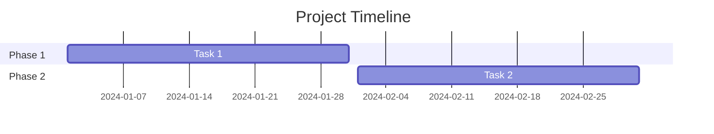
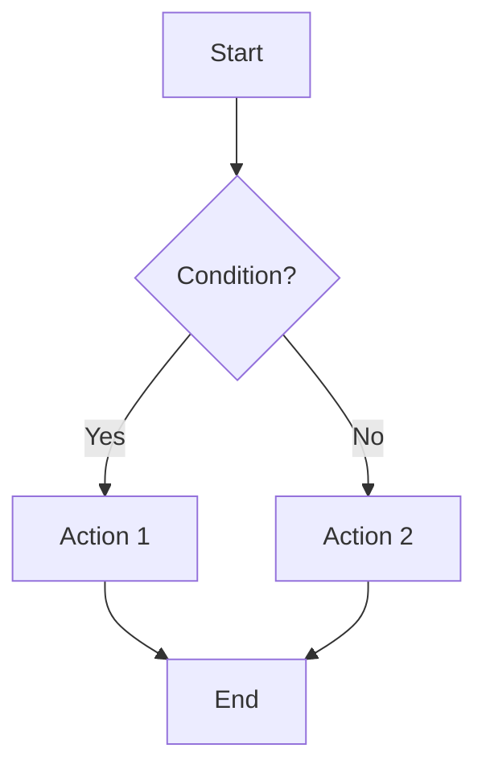

# Office Documents — Tài liệu văn phòng chuyên nghiệp

## Khi nào sử dụng
- Viết báo cáo kinh doanh (business report)
- Soạn proposal / đề xuất
- Tạo meeting minutes
- Viết SOP (Standard Operating Procedure)
- Lập bảng so sánh / phân tích
- Soạn hợp đồng / agreement framework

## 1. Business Report Template

```markdown
# [Report Title]
**Prepared by**: [name] | **Date**: [date] | **For**: [audience]

## Executive Summary
[3-5 câu tóm tắt key findings và recommendations]

## Background
[Vấn đề/context dẫn đến report này]

## Methodology
[Cách thu thập data, scope, timeframe]

## Key Findings
### Finding 1: [Title]
- **Data**: [số liệu cụ thể]
- **Insight**: [phân tích]
- **Impact**: [ảnh hưởng]

### Finding 2: [Title]
[same structure]

## Analysis
[Phân tích sâu, so sánh, trends]

| Metric | Q1 | Q2 | Q3 | YTD | Trend |
|--------|----|----|----|----|-------|

## Recommendations
| # | Action | Priority | Owner | Timeline | Impact |
|---|--------|----------|-------|----------|--------|
| 1 | [action] | High | [who] | [when] | [expected] |

## Appendix
[Data tables, references, methodology details]
```

## 2. Business Proposal Template

```markdown
# Proposal: [Title]
**To**: [Client/Stakeholder] | **From**: [Company]
**Date**: [date] | **Valid until**: [date]

## Tóm tắt đề xuất
[1 paragraph — vấn đề + giải pháp + expected outcome]

## Bối cảnh & Vấn đề
[Mô tả situation hiện tại và challenges]

## Giải pháp đề xuất
### Phase 1: [Name] — [Duration]
- Deliverable: [cụ thể]
- Timeline: [start → end]

### Phase 2: [Name] — [Duration]
[same structure]

## Ngân sách
| Hạng mục | Đơn giá | Số lượng | Thành tiền |
|---------|---------|----------|-----------|

**Tổng đầu tư**: [amount]
**Điều kiện thanh toán**: [terms]

## Timeline


## Tại sao chọn chúng tôi
- [Differentiator 1]
- [Case study / proof]
- [Guarantee]

## Next Steps
1. [Action 1 — deadline]
2. [Action 2 — deadline]
```

## 3. Meeting Minutes Template

```markdown
# Meeting: [Title]
**Date**: [date] | **Time**: [time] | **Location**: [place/link]
**Attendees**: [list]
**Absent**: [list]
**Note-taker**: [name]

## Agenda
1. [Topic 1]
2. [Topic 2]
3. [Topic 3]

## Discussion & Decisions
### [Topic 1]
- **Discussion**: [key points]
- **Decision**: [what was decided]
- **Action**: [who does what by when]

## Action Items
| # | Action | Owner | Deadline | Status |
|---|--------|-------|----------|--------|

## Next Meeting
**Date**: [date] | **Topic**: [focus]
```

## 4. SOP Template

```markdown
# SOP: [Process Name]
**Version**: [v1.0] | **Effective**: [date]
**Owner**: [department] | **Approver**: [name]

## Mục đích
[1-2 câu — tại sao process này tồn tại]

## Phạm vi áp dụng
- Ai thực hiện: [roles]
- Khi nào: [trigger conditions]
- Ngoại lệ: [exceptions]

## Quy trình
### Bước 1: [Action]
- **Ai làm**: [role]
- **Làm gì**: [specific steps]
- **Output**: [deliverable]
- **Tiêu chí hoàn thành**: [acceptance criteria]

### Bước 2: [Action]
[same structure]

## Flowchart


## KPIs
| Metric | Target | Measurement |
|--------|--------|-------------|

## Revision History
| Version | Date | Changes | Author |
|---------|------|---------|--------|
```

## 5. Comparison/Decision Matrix

```markdown
# Đánh giá & So sánh: [Topic]

## Tiêu chí đánh giá
| Tiêu chí | Trọng số | Mô tả |
|---------|---------|--------|

## So sánh
| Tiêu chí (Trọng số) | Option A | Option B | Option C |
|---------------------|----------|----------|----------|
| Feature 1 (30%) | ⭐⭐⭐⭐ | ⭐⭐⭐ | ⭐⭐⭐⭐⭐ |
| Cost (25%) | ⭐⭐⭐ | ⭐⭐⭐⭐⭐ | ⭐⭐ |
| **Tổng điểm** | **X.X** | **X.X** | **X.X** |

## Recommendation
[Đề xuất + lý do dựa trên data]
```
