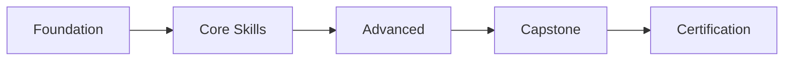

# Thiết Kế Khóa Học AI — Course Design

## Mục đích
Skill này giúp thiết kế khóa học đào tạo AI từ ý tưởng đến chương trình hoàn chỉnh, đảm bảo chất lượng sư phạm và hiệu quả học tập.

## Quy trình 6 bước

### Bước 1: Phân tích nhu cầu đào tạo
- **Đối tượng**: Ai học? Background? Trình độ hiện tại?
- **Mục tiêu nghề nghiệp**: Học xong làm được gì?
- **Gap analysis**: Khoảng cách giữa hiện tại và mục tiêu?
- **Thị trường**: Đối thủ dạy gì? Giá bao nhiêu? Thiếu gì?

### Bước 2: Xác định Learning Outcomes (Bloom's Taxonomy)

| Cấp độ | Động từ | Ví dụ AI |
|--------|---------|----------|
| **Nhớ** | Liệt kê, định nghĩa | Liệt kê 5 loại mô hình ML |
| **Hiểu** | Giải thích, so sánh | So sánh supervised vs unsupervised |
| **Áp dụng** | Triển khai, sử dụng | Triển khai model phân loại ảnh |
| **Phân tích** | Đánh giá, debug | Phân tích overfitting và cách xử lý |
| **Đánh giá** | Lựa chọn, biện minh | Chọn và giải thích kiến trúc phù hợp |
| **Sáng tạo** | Thiết kế, xây dựng | Xây dựng pipeline ML end-to-end |

**Mỗi module PHẢI có ít nhất 3 learning outcomes đo được.**

### Bước 3: Backward Design (Thiết kế ngược)
```
Kết quả mong muốn (Bước 2)
    ↓
Bài đánh giá (chứng minh đạt kết quả)
    ↓
Nội dung + Hoạt động (dẫn đến kết quả)
```

1. Viết đánh giá TRƯỚC khi viết nội dung
2. Mỗi assessment match 1:1 với learning outcome
3. Nội dung chỉ bao gồm những gì CẦN cho assessment

### Bước 4: Cấu trúc Module

**Template khóa học:**
```yaml
course:
  title: "[Tên khóa học]"
  duration: "[X tuần / X giờ]"
  level: "[Beginner / Intermediate / Advanced]"
  prerequisites: ["..."]
  
  modules:
    - module_id: "M01"
      title: "[Tên module]"
      duration: "[X giờ]"
      outcomes:
        - "LO1: Học viên có thể..."
        - "LO2: Học viên có thể..."
      content:
        - topic: "[Chủ đề]"
          type: "lecture | lab | discussion | project"
          duration: "[X phút]"
      assessment:
        type: "quiz | project | presentation | exam"
        criteria: ["..."]
        weight: "X%"
```

**Nguyên tắc:**
- Mỗi module: 2-4 giờ (online) hoặc 4-8 giờ (offline)
- Tỷ lệ lý thuyết:thực hành = 30:70 cho khóa AI
- Lab exercise SAU MỖI module lý thuyết
- Capstone project = 20-30% tổng điểm

### Bước 5: Lộ trình học tập (Learning Path)



- **Foundation**: Toán, Python, dữ liệu cơ bản
- **Core**: ML algorithms, Deep Learning, NLP/CV
- **Advanced**: LLM, RAG, Fine-tuning, Agent
- **Capstone**: Dự án thực tế end-to-end
- **Certification**: Thi + Portfolio review

### Bước 6: Quality Checklist

Trước khi hoàn tất thiết kế:

- [ ] Mỗi module có ≥ 3 learning outcomes đo được?
- [ ] Assessment match 1:1 với outcomes?
- [ ] Tỷ lệ thực hành ≥ 70%?
- [ ] Prerequisites rõ ràng?
- [ ] Lộ trình có tính tiến bộ (dễ → khó)?
- [ ] Có rubric chấm điểm?
- [ ] Có feedback mechanism?
- [ ] Thời lượng hợp lý cho từng module?

## Output mẫu

Khi được yêu cầu thiết kế khóa học, PHẢI trả về:
1. **Course Overview** — 1 trang tóm tắt
2. **Module Breakdown** — YAML structure đầy đủ
3. **Assessment Plan** — rubrics + trọng số
4. **Learning Path** — sơ đồ lộ trình
5. **Prerequisites** — yêu cầu đầu vào

---

## Ví Dụ Hoàn Chỉnh — Khóa "AI cho Marketing"

```yaml
course:
  title: "AI cho Marketing — Từ Zero đến Triển Khai"
  duration: "8 tuần (32 giờ)"
  level: "Beginner → Intermediate"
  format: "Online, live sessions + self-paced"
  price: "2.400.000 VNĐ"
  max_students: 30
  prerequisites:
    - "Biết dùng máy tính cơ bản"
    - "Có kinh nghiệm marketing (không cần code)"

  modules:
    - module_id: "M01"
      title: "AI 101 — Hiểu AI để không bị tụt hậu"
      duration: "4 giờ (Tuần 1)"
      outcomes:
        - "LO1: Giải thích được AI, ML, Deep Learning khác nhau thế nào"
        - "LO2: Liệt kê 5 ứng dụng AI trong marketing đang hoạt động"
        - "LO3: Đánh giá được tool AI nào phù hợp với nhu cầu cụ thể"
      content:
        - topic: "AI/ML/DL là gì? (không code)"
          type: "lecture"
          duration: "45 phút"
        - topic: "Demo: ChatGPT, Gemini, MidJourney trong marketing"
          type: "demo"
          duration: "30 phút"
        - topic: "Lab: Thử 5 công cụ AI marketing"
          type: "lab"
          duration: "60 phút"
        - topic: "Case study: Brands dùng AI thành công"
          type: "discussion"
          duration: "45 phút"
      assessment:
        type: "quiz"
        questions: 15
        pass_score: 70
        weight: "10%"

    - module_id: "M02"
      title: "AI Content — Viết copy, tạo ảnh, soạn video"
      duration: "8 giờ (Tuần 2-3)"
      outcomes:
        - "LO1: Viết prompt chuyên nghiệp cho text generation"
        - "LO2: Tạo ảnh quảng cáo bằng AI (MidJourney/Gemini)"
        - "LO3: Xây dựng content calendar AI-assisted"
      content:
        - topic: "Prompt Engineering cho Marketer"
          type: "lecture"
          duration: "60 phút"
        - topic: "Lab: Viết 10 biến thể ad copy bằng AI"
          type: "lab"
          duration: "90 phút"
        - topic: "Lab: Tạo 5 visual quảng cáo bằng AI"
          type: "lab"
          duration: "90 phút"
        - topic: "Workshop: Content calendar 1 tháng"
          type: "lab"
          duration: "120 phút"
      assessment:
        type: "project"
        brief: "Tạo content plan 1 tháng cho brand giả định"
        weight: "20%"

    - module_id: "M03"
      title: "AI Analytics — Phân tích dữ liệu không cần code"
      duration: "8 giờ (Tuần 4-5)"
      outcomes:
        - "LO1: Phân tích data marketing bằng AI (không code)"
        - "LO2: Tạo dashboard insights từ Google Analytics + AI"
        - "LO3: Đề xuất A/B test dựa trên data"
      content:
        - topic: "AI + Google Analytics: Tìm insight tự động"
          type: "lecture"
          duration: "60 phút"
        - topic: "Lab: Upload CSV → AI phân tích → Insight"
          type: "lab"
          duration: "90 phút"
        - topic: "Lab: Thiết kế A/B test với AI support"
          type: "lab"
          duration: "90 phút"
        - topic: "Case study: Data-driven campaign optimization"
          type: "discussion"
          duration: "60 phút"
      assessment:
        type: "quiz + lab"
        weight: "20%"

    - module_id: "M04"
      title: "Capstone — Chiến dịch Marketing AI"
      duration: "12 giờ (Tuần 6-8)"
      outcomes:
        - "LO1: Thiết kế chiến dịch marketing hoàn chỉnh dùng AI"
        - "LO2: Trình bày và bảo vệ chiến lược trước panel"
        - "LO3: Đánh giá ROI dự kiến của chiến dịch"
      content:
        - topic: "Brief dự án + team formation"
          type: "lecture"
          duration: "60 phút"
        - topic: "Mentoring sessions (nhóm)"
          type: "discussion"
          duration: "180 phút"
        - topic: "Presentation Day"
          type: "presentation"
          duration: "180 phút"
      assessment:
        type: "project + presentation"
        rubric:
          strategy: 25
          ai_tools_usage: 25
          creativity: 20
          presentation: 15
          documentation: 15
        weight: "50%"

  certification:
    type: "AI Foundation — Marketing Track"
    requirements:
      - "Quiz avg ≥ 70%"
      - "Hoàn thành 100% labs"
      - "Capstone ≥ 70%"
    certificate_id: "ABM-FOUND-MKT-2026-XXXX"
```

---

## Lộ Trình Đào Tạo AI Toàn Diện (v2 — tích hợp Community Skills)

```yaml
abm_ai_curriculum_v2:
  foundation_tier: # 🥉 AI Foundation — 6-8 tuần
    modules:
      - id: "F01"
        name: "Python for AI"
        duration: "12 giờ"
        type: "core"
      - id: "F02"
        name: "Toán cho ML"
        duration: "8 giờ"
        type: "core"
      - id: "F03"
        name: "Prompt Engineering Patterns"  # ← Community skill
        duration: "6 giờ"
        type: "core"
        source: "prompt-engineering-patterns (RAPID 48/50)"
      - id: "F04"
        name: "ML Basics (Scikit-learn)"
        duration: "10 giờ"
        type: "core"
    total_hours: 36
    certificate: "🥉 AI Foundation"
  
  practitioner_tier: # 🥈 AI Practitioner — 10-14 tuần
    tracks:
      nlp_track:
        - "Text Processing & NLP cơ bản (8h)"
        - "Transformers & Attention (6h)"
        - "LLM Applications & API (8h)"
      
      cv_track:
        - "Image Processing & CNNs (8h)"
        - "Object Detection (6h)"
        - "Multimodal AI (6h)"
      
      analytics_track:
        - id: "P-AN-01"
          name: "Data Storytelling"  # ← Community skill
          duration: "4 giờ"
          source: "data-storytelling (RAPID 46/50)"
        - "Feature Engineering & AutoML (6h)"
        - "MLOps Basics (6h)"
    total_hours: "~40 giờ / track"
    certificate: "🥈 AI Practitioner"
  
  specialist_tier: # 🏆 AI Specialist — 14-18 tuần
    modules:
      - id: "S01"
        name: "RAG Systems"  # ← Community skill
        duration: "8 giờ"
        type: "core"
        source: "rag-engineer (RAPID 47/50)"
      - id: "S02"
        name: "Fine-tuning (LoRA, QLoRA)"
        duration: "8 giờ"
        type: "core"
      - id: "S03"
        name: "AI Agent Development"  # ← Community skill
        duration: "12 giờ"
        type: "core"
        source: "ai-agent-development (RAPID 46/50)"
      - id: "S04"
        name: "Production Deployment"
        duration: "8 giờ"
        type: "core"
    total_hours: 36
    certificate: "🏆 AI Specialist"
  
  emerging_workshops: # 🔬 Ongoing (từ R&D)
    frequency: "1-2 / tháng"
    source: "ai-trend-radar → research-to-training pipeline"
    recent_examples:
      - "Gemini 2.5 Flash Workshop (2h)"
      - "AI Ethics & EU AI Act (3h)"
      - "Voice AI với Moshi (2h)"
  
  total_program:
    foundation: "36 giờ"
    practitioner: "~40 giờ"
    specialist: "36 giờ"
    community_skill_hours: "30 giờ (PE 6h + RAG 8h + DS 4h + Agents 12h)"
    grand_total: "~112 giờ + workshops ongoing"
```
