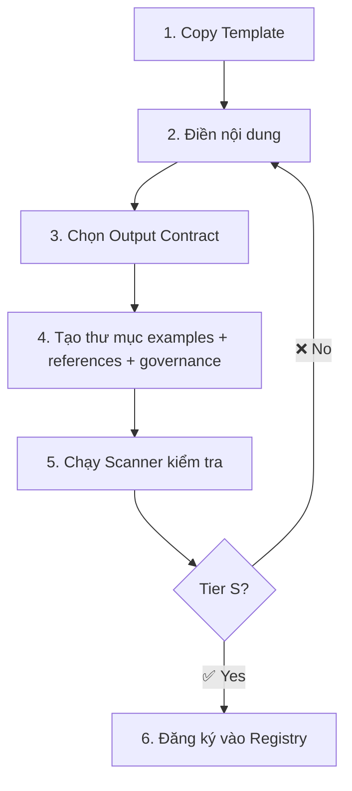
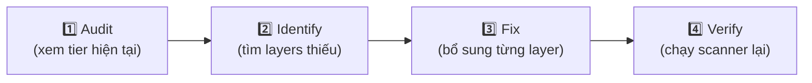

# 📖 Hướng Dẫn Sử Dụng — Hệ Thống 9-Layer Skill Engineering

> **ABM-Workforce v3.0 × 9-Layer Framework**
> Hướng dẫn toàn diện cho người dùng và người quản trị hệ thống skill
> Version 1.0 · Cập nhật: 2026-03-28

---

## Mục Lục

1. [Tổng quan hệ thống](#1-tổng-quan-hệ-thống)
2. [Kiến trúc thư mục](#2-kiến-trúc-thư-mục)
3. [Hiểu về 9 Layer](#3-hiểu-về-9-layer)
4. [Hệ thống xếp hạng Tier](#4-hệ-thống-xếp-hạng-tier)
5. [Tạo skill mới từ đầu](#5-tạo-skill-mới-từ-đầu)
6. [Nâng cấp skill cũ](#6-nâng-cấp-skill-cũ)
7. [Chạy Audit & Scanner](#7-chạy-audit--scanner)
8. [Đọc hiểu Dashboard](#8-đọc-hiểu-dashboard)
9. [Quản trị Governance](#9-quản-trị-governance)
10. [Phân loại Skill: Instruction vs Tooling](#10-phân-loại-skill-instruction-vs-tooling)
11. [Token & Hiệu năng](#11-token--hiệu-năng)
12. [Xử lý sự cố (Troubleshooting)](#12-xử-lý-sự-cố-troubleshooting)
13. [Best Practices](#13-best-practices)
14. [FAQ](#14-faq)

---

## 1. Tổng quan hệ thống

### Skill là gì?

**Skill** = "bộ não chuyên môn" của AI agent. Khi agent nhận một task, nó tìm skill phù hợp → load SKILL.md vào context → thực hiện theo hướng dẫn trong đó.

```
User: "Debug lỗi connection timeout"
        ↓
Agent: [Quét 138 skills → tìm trigger match]
        ↓
Match: systematic-debugging (L0 trigger: "bug, error, debug")
        ↓
Agent: [Load SKILL.md → theo quy trình 5-step trong đó]
        ↓
Output: Root cause analysis + fix verified
```

### 9-Layer Engineering là gì?

Đây là **tiêu chuẩn chất lượng** cho mỗi skill — giống như ISO cho phần mềm. Mỗi skill được đánh giá theo 9 tầng (L0–L8), từ metadata cơ bản đến governance quản trị.

### Vị trí trong ABM-Workforce

```
ABM-Workforce v3.0
├── 10 Workers (W1–W10)
├── 94 Workflows (lệnh /abm-*)
├── 138 Skills (★ ĐÂY LÀ THỨ BẠN ĐANG QUẢN LÝ)
│   ├── 80 Global Skills   → C:\Users\PC\.gemini\antigravity\skills\
│   └── 58 Workspace Skills → D:\AntigravityWorkspace\.agent\skills\
└── 4-Phase Methodology
```

---

## 2. Kiến trúc thư mục

### 2.1 Cây thư mục tổng thể

```
C:\Users\PC\.gemini\antigravity\skills\
├── _standards/                          ★ TRUNG TÂM QUẢN LÝ
│   ├── SKILL-TEMPLATE-V2.md             # Template chuẩn để tạo skill mới
│   ├── README.md                        # Tài liệu tham khảo nhanh
│   ├── scripts/
│   │   └── skill_health_check.py        ★ SCANNER — công cụ audit tự động
│   ├── output-contracts/                # Output Contract mẫu theo domain
│   │   ├── code.md                      #   → cho W1:CodeAgent
│   │   ├── content.md                   #   → cho W2:ContentAgent
│   │   ├── business.md                  #   → cho W3:BusinessAgent
│   │   ├── design.md                    #   → cho W4:DesignAgent
│   │   └── ops.md                       #   → cho W7:OpsAgent
│   ├── governance/
│   │   ├── 00-SKILL-MATURITY-REGISTRY.yaml  # Registry tier cho tất cả skills
│   │   ├── 01-TRIGGER-MAP.yaml              # Bản đồ trigger/routing
│   │   ├── 02-QUARTERLY-AUDIT-PROCESS.yaml  # Quy trình audit theo quý
│   │   └── DASHBOARD.md                ★ DASHBOARD — báo cáo sức khỏe hệ thống
│   └── templates/                       # (Dự phòng cho tương lai)
│
├── systematic-debugging/                # ← Đây là 1 skill
├── react-expert/                        # ← Đây là 1 skill
├── digital-twin/                        # ← Đây là 1 skill (mẫu 9/9 perfect)
└── ... (80 skills tổng cộng)

D:\AntigravityWorkspace\.agent\skills\
├── jarvis-code-agent/                   # ← Workspace skill
├── css-expert/                          # ← Workspace skill
└── ... (58 skills tổng cộng)
```

### 2.2 Cấu trúc 1 skill hoàn chỉnh (Tier S)

```
📂 my-skill/
├── 📄 SKILL.md              ← ★ FILE CHÍNH — L0 + L1 + L2
│                                (trigger, metadata, core content)
├── 📄 OUTPUT-CONTRACT.md     ← L7: Tiêu chuẩn output
│
├── 📁 references/            ← L3: Tài liệu tham khảo chuyên sâu
│   └── README.md             #   Domain knowledge, schemas, API docs
│
├── 📁 examples/              ← L4: Ví dụ sử dụng
│   ├── happy_path.md         #   ✅ Case đúng chuẩn
│   ├── edge_path.md          #   ⚠️ Case biên, khó
│   └── anti_path.md          #   ❌ Case SAI (để tránh)
│
├── 📁 governance/            ← L8: Quản trị lifecycle
│   ├── CHANGELOG.md          #   Lịch sử thay đổi
│   └── MATURITY.md           #   Tier tracking
│
├── 📁 scripts/               ← L5: Scripts tự động (chỉ tooling skills)
│   └── validate.py           #   Validation/automation
│
└── 📁 assets/                ← L6: Templates & resources (chỉ tooling skills)
    └── templates/
        └── output-template.md
```

> [!IMPORTANT]
> **Không phải skill nào cũng cần đầy đủ 9/9 folders.** 80% skills là "instruction-only" — chúng chỉ cần L0–L4, L7, L8 (7/9 layers) là đủ Tier S. Xem [mục 10](#10-phân-loại-skill-instruction-vs-tooling) để hiểu chi tiết.

---

## 3. Hiểu về 9 Layer

### 3.1 Bảng tổng hợp

| Layer | Tên | Ở đâu? | Bắt buộc? | Mô tả |
|:-----:|------|---------|:---------:|-------|
| **L0** | Trigger & Use Case | `SKILL.md` (description) | ✅ | Agent biết **KHI NÀO** cần dùng skill này |
| **L1** | Metadata | `SKILL.md` (YAML frontmatter) | ✅ | Tên, mô tả, version, tags, worker-id |
| **L2** | Core Content | `SKILL.md` (body) | ✅ | Nội dung chính: Goal, Instructions, Examples, Constraints |
| **L3** | References | `references/` folder | ✅ | Tri thức nền, tài liệu tham khảo chuyên sâu |
| **L4** | Examples | `examples/` folder | ✅ | 3 loại ví dụ: Happy, Edge, Anti |
| **L5** | Scripts | `scripts/` folder | ⚪ | Scripts tự động (chỉ cho tooling skills) |
| **L6** | Assets | `assets/` folder | ⚪ | Templates, tài nguyên (chỉ cho tooling skills) |
| **L7** | Output Contract | `OUTPUT-CONTRACT.md` | ✅ | Tiêu chuẩn chất lượng output |
| **L8** | Governance | `governance/` folder | ✅ | Changelog, maturity tracking |

> ✅ = Bắt buộc cho Tier S &nbsp;&nbsp;&nbsp; ⚪ = Chỉ cần cho tooling skills

### 3.2 Giải thích từng Layer chi tiết

#### L0: Trigger & Use Case Map — "Khi nào dùng?"

**Vị trí:** Trường `description` trong YAML frontmatter của `SKILL.md`

**Tại sao quan trọng?**
Đây là cách agent tự động chọn đúng skill. Không có L0 = agent "mù" — không biết khi nào nên kích hoạt skill.

**Ví dụ tốt:**
```yaml
description: >
  Expert in systematic code improvement through proven refactoring techniques.
  Use when: refactoring, code smell, structural optimization, extract method,
  rename variable, simplify conditional, or design pattern application.
```

**Ví dụ xấu:**
```yaml
description: "Refactoring skill"
# → Quá ngắn, agent khó match
```

**Quy tắc:**
- Tối thiểu 2 dòng, tối đa 5 dòng
- Phải chứa "Use when:", "Use this skill when:", hoặc "Auto-activate khi"
- Liệt kê 5-10 trigger keywords cụ thể

---

#### L1: Metadata — "Skill này thuộc ai?"

**Vị trí:** YAML frontmatter block ở đầu `SKILL.md`

**Format chuẩn:**
```yaml
---
name: systematic-debugging
description: >
  Root cause debugging methodology. Use when encountering any bug,
  test failure, or unexpected behavior, before proposing fixes.
metadata:
  version: "1.0"
  author: ABM-Workforce
  worker-id: W1        # Worker chịu trách nhiệm chính
  maturity: "Tier-S"
  category: development # development/business/content/design/ops/security/utility
  tags: [debug, bug, error, troubleshoot, root-cause]
  last-updated: 2026-03-28
---
```

**Các trường bắt buộc (REQUIRED):**

| Trường | Mô tả | Ví dụ |
|--------|--------|-------|
| `name` | ID duy nhất | `systematic-debugging` |
| `description` | Mô tả + trigger (L0) | Xem ví dụ trên |

**Các trường khuyến nghị (RECOMMENDED):**

| Trường | Mô tả | Ví dụ |
|--------|--------|-------|
| `metadata.version` | Phiên bản hiện tại | `"2.1"` |
| `metadata.worker-id` | Worker chính | `W1` (CodeAgent) |
| `metadata.maturity` | Tier hiện tại | `"Tier-S"` |
| `metadata.category` | Phân loại domain | `development` |
| `metadata.tags` | Tags cho search & routing | `[debug, bug, error]` |

---

#### L2: Core Content — "Skill dạy gì?"

**Vị trí:** Phần body của `SKILL.md` (sau frontmatter)

**4 phần chuẩn (Canonical Sections):**

| Section | Heading regex | Mô tả |
|---------|--------------|-------|
| **Goal** | `# Goal`, `# Purpose`, `# Overview` | Mục tiêu duy nhất (1-3 câu) |
| **Instructions** | `# Instructions`, `# Workflow`, `# Process` | Quy trình step-by-step |
| **Examples** | `# Examples`, `# Ví dụ` | Ví dụ Input → Output |
| **Constraints** | `# Constraints`, `# Rules` | Giới hạn, điều KHÔNG BAO GIỜ làm |

**Tiêu chí PASS:**
- ≥2 canonical sections, **HOẶC**
- ≥3 headings + ≥100 words

---

#### L3: References — "Kiến thức nền ở đâu?"

**Vị trí:** Thư mục `references/` trong skill directory

**Mục đích:** Tách kiến thức chuyên sâu ra khỏi SKILL.md để giữ context window nhỏ. Agent chỉ đọc khi CẦN.

**Ví dụ cấu trúc:**
```
references/
├── README.md              # Tổng quan + chỉ mục
├── domain-knowledge.md    # Kiến thức nền chuyên sâu
├── api-reference.md       # API docs
└── schemas.md             # Data schemas
```

**Cách sử dụng trong SKILL.md:**
```markdown
## Tài nguyên tham chiếu
- Đọc `references/domain-knowledge.md` khi cần hiểu lý thuyết
- Đọc `references/api-reference.md` khi cần gọi API
```

---

#### L4: Examples — "Cho tôi xem thực tế"

**Vị trí:** Thư mục `examples/` trong skill directory

**3 loại ví dụ bắt buộc:**

| File | Emoji | Mục đích |
|------|:-----:|----------|
| `happy_path.md` | ✅ | Case chuẩn, output lý tưởng |
| `edge_path.md` | ⚠️ | Case biên, đầu vào khó, ambiguous |
| `anti_path.md` | ❌ | Case SAI — cái gì KHÔNG ĐƯỢC làm |

**Format mẫu cho `happy_path.md`:**
```markdown
# ✅ Happy Path: Debugging a Memory Leak

## Input
User reports: "App crashes after 2 hours of use"
Environment: Node.js 20, Express, PM2

## Expected Output
1. Root cause identified: Unhandled Promise rejection accumulating buffers
2. Fix applied: Added `.catch()` and manual GC trigger
3. Memory profile before/after comparison
4. Unit test covering the fix

## Why This Is Good
- Identifies root cause BEFORE proposing fix
- Provides evidence (memory profile)
- Includes verification (test)
```

---

#### L5: Scripts & Tools — "Tự động hóa gì?"

**Vị trí:** Thư mục `scripts/` trong skill directory

> [!NOTE]
> **Chỉ cần cho 26 tooling skills** (ví dụ: `web-scraper`, `docx-document-builder`, `that-quiz-pipeline`). 110 instruction-only skills KHÔNG cần L5.

**Ví dụ:**
```
scripts/
├── validate.py         # Validate output theo contract
├── health_check.sh     # Check dependencies
└── generate.py         # Auto-generate boilerplate
```

---

#### L6: Assets & Templates — "Template output trông thế nào?"

**Vị trí:** Thư mục `assets/` hoặc `assets/templates/`

> [!NOTE]
> **Chỉ cần cho tooling skills.** Instruction-only skills KHÔNG cần L6.

**Ví dụ:**
```
assets/
└── templates/
    ├── report-template.md      # Template báo cáo
    ├── checklist-template.yaml # Template checklist
    └── config-sample.json      # Config mẫu
```

---

#### L7: Output Contract — "Output tốt trông thế nào?"

**Vị trí:** File `OUTPUT-CONTRACT.md` ở root của skill directory

**Mục đích:** Định nghĩa rõ ràng:
1. Output PHẢI có gì? (Required Sections)
2. Format ra sao? (Format Standards)
3. Chấm điểm tự đánh giá thế nào? (Self-Check Rubric)

**Có 2 template tùy loại skill:**

| Loại skill | Template | Mô tả |
|------------|----------|-------|
| Instruction-only | 5 domain templates tại `_standards/output-contracts/` | code, content, business, design, ops |
| Tooling | Custom template | Specific cho mỗi tool |

**Ví dụ Self-Check Rubric (từ `code.md`):**

| Dimension | Weight | Mô tả |
|-----------|:------:|-------|
| Correctness | 30% | Code chạy đúng theo spec |
| Robustness | 20% | Handle edge cases |
| Security | 20% | Không lỗ hổng OWASP |
| Readability | 15% | Code dễ hiểu, maintain |
| Performance | 15% | Không bottleneck |

**Grading Scale:**

| Score | Grade | Action |
|:-----:|:-----:|--------|
| 9-10 | **S** | Ship it |
| 7-8 | A | Minor polish → ship |
| 5-6 | B | Cần cải thiện |
| 3-4 | C | Phải refactor |
| 0-2 | F | Viết lại từ đầu |

---

#### L8: Governance — "Ai sở hữu? Thay đổi gì?"

**Vị trí:** Thư mục `governance/` trong skill directory

**Gồm 2 file:**

**`governance/CHANGELOG.md`** — Lịch sử thay đổi:
```markdown
# Changelog

## [1.0.0] - 2026-03-28
- Initial 9-Layer compliance
- Added OUTPUT-CONTRACT.md
- Created references/ and examples/ directories
```

**`governance/MATURITY.md`** — Theo dõi tier:
```markdown
# Maturity Tracking

| Date | Tier | Score | Auditor | Notes |
|------|------|-------|---------|-------|
| 2026-03-28 | S | 7/9 | skill_health_check.py | Initial 9-Layer compliant |
```

---

## 4. Hệ thống xếp hạng Tier

### 4.1 Bảng Tier

| Tier | Emoji | Layers | Ý nghĩa | Hành động |
|:----:|:-----:|:------:|----------|-----------|
| **S** | 🏆 | 7–9/9 | **Mature** — Production-grade | Maintain & evolve |
| **A** | ⭐ | 4–6/9 | **Structured** — Có nền tảng tốt | Upgrade thêm 1-3 layers |
| **B** | 📦 | 2–3/9 | **Basic** — Chỉ có nội dung | Cần đầu tư significant |
| **C** | ⚠️ | 0–1/9 | **Orphan** — Gần như trống | Archive hoặc rewrite |

### 4.2 Công thức tính Health Score

```
Health = (S×100 + A×75 + B×40 + C×10) ÷ Tổng skills
```

**Ví dụ:**
- 138 skills, tất cả Tier S → Health = `(138×100) ÷ 138 = 100` 🏆
- 50 Tier S, 50 Tier A, 38 Tier B → Health = `(5000+3750+1520) ÷ 138 = 74.4`

### 4.3 Tiêu chí Tier S cho instruction-only skills

Instruction-only skill đạt Tier S khi có **7/9 layers** (L5, L6 not required):

```
✅ L0: SKILL.md có description + trigger keywords
✅ L1: SKILL.md có YAML frontmatter (name + description)
✅ L2: SKILL.md có ≥2 canonical sections HOẶC ≥3 headings + 100 words
✅ L3: Có thư mục references/
✅ L4: Có thư mục examples/ HOẶC ≥3 inline examples
⚪ L5: KHÔNG cần (instruction-only)
⚪ L6: KHÔNG cần (instruction-only)
✅ L7: Có file OUTPUT-CONTRACT.md HOẶC inline rubric + self-check
✅ L8: Có governance/ (CHANGELOG.md) HOẶC root CHANGELOG.md
```

---

## 5. Tạo skill mới từ đầu

### 5.1 Quy trình 6 bước



### 5.2 Bước chi tiết

#### Bước 1: Copy template

```powershell
# Tạo thư mục skill mới
mkdir C:\Users\PC\.gemini\antigravity\skills\my-new-skill

# Copy template
copy "C:\Users\PC\.gemini\antigravity\skills\_standards\SKILL-TEMPLATE-V2.md" `
     "C:\Users\PC\.gemini\antigravity\skills\my-new-skill\SKILL.md"
```

#### Bước 2: Điền nội dung SKILL.md

Mở `SKILL.md` và thay thế placeholders:

```yaml
---
name: my-new-skill
description: >
  Mô tả 2-5 dòng. Bao gồm trigger keywords.
  Use when: keyword1, keyword2, keyword3.
metadata:
  version: "1.0"
  author: ABM-Workforce
  worker-id: W1          # Chọn W1–W10 phù hợp
  maturity: "Tier-B"     # Bắt đầu ở Tier-B
  category: development  # Chọn domain
  tags: [tag1, tag2, tag3]
  last-updated: 2026-03-28
---

# Goal

Mục tiêu duy nhất của skill (1-3 câu).

# Instructions

Quy trình step-by-step...

# Examples

## ✅ Ví dụ 1: Happy Path
**Input**: ...
**Output**: ...

## ⚠️ Ví dụ 2: Edge Case
**Input**: ...
**Output**: ...

## ❌ Ví dụ 3: Anti-Example
**Input**: ...
**Wrong output**: ...
**Why wrong**: ...
**Correct output**: ...

# Constraints

Các giới hạn và điều KHÔNG BAO GIỜ làm...
```

#### Bước 3: Chọn Output Contract

Copy contract phù hợp domain:

```powershell
# Cho development skill:
copy "C:\Users\PC\.gemini\antigravity\skills\_standards\output-contracts\code.md" `
     "C:\Users\PC\.gemini\antigravity\skills\my-new-skill\OUTPUT-CONTRACT.md"

# Hoặc content:  output-contracts\content.md
# Hoặc business: output-contracts\business.md
# Hoặc design:   output-contracts\design.md
# Hoặc ops:      output-contracts\ops.md
```

#### Bước 4: Tạo thư mục cấu trúc

```powershell
cd C:\Users\PC\.gemini\antigravity\skills\my-new-skill

# L3: References
mkdir references
echo "# References" > references\README.md

# L4: Examples
mkdir examples
echo "# ✅ Happy Path" > examples\happy_path.md
echo "# ⚠️ Edge Case" > examples\edge_path.md
echo "# ❌ Anti-Pattern" > examples\anti_path.md

# L8: Governance
mkdir governance
echo "# Changelog`n`n## [1.0.0] - $(Get-Date -Format 'yyyy-MM-dd')`n- Initial release" > governance\CHANGELOG.md
echo "# Maturity Tracking`n`n| Date | Tier | Score | Notes |`n|------|------|-------|-------|`n| $(Get-Date -Format 'yyyy-MM-dd') | B | 7/9 | Initial |" > governance\MATURITY.md
```

#### Bước 5: Chạy Scanner kiểm tra

```powershell
$env:PYTHONIOENCODING='utf-8'
cd C:\Users\PC\.gemini\antigravity\skills\_standards

python scripts/skill_health_check.py "C:/Users/PC/.gemini/antigravity/skills/my-new-skill"
```

**Output mong đợi:**
```
============================================================
  🏆 SKILL: my-new-skill
  Tier: S | Score: 7/9 | Words: 350
============================================================

  ✅ Passed: L0, L1, L2, L3, L4, L7, L8
  ❌ Missing: L5, L6

  ──────────────────────────────────────────────────
  Layer    Status Details
  ──────────────────────────────────────────────────
  L0       ✅   description=✅, tags=✅
  L1       ✅   required=2/2, extended=partial
  L2       ✅   3/4 canonical, 5 headings, 350 words
  L3       ✅   directory=✅, inline_mentions=2
  L4       ✅   directory=✅, inline_examples=3
  L5       ❌   directory=❌, files=0
  L6       ❌   assets=❌, templates=❌
  L7       ✅   contract_file=✅, inline_rubric=❌
  L8       ✅   changelog=✅, governance_dir=✅
```

> ✅ **7/9 = Tier S** cho instruction-only skill!

#### Bước 6: Đăng ký Registry (optional)

Cập nhật file `_standards/governance/00-SKILL-MATURITY-REGISTRY.yaml`.

---

## 6. Nâng cấp skill cũ

### 6.1 Quy trình 4 bước



### 6.2 Thứ tự ưu tiên khi upgrade

Nếu skill thiếu nhiều layers, upgrade theo thứ tự này:

```
L1 (Metadata)     → Nhanh nhất, chỉ cần thêm YAML header
L0 (Trigger)      → Thêm description vào frontmatter
L7 (Contract)     → Copy template từ output-contracts/
L4 (Examples)     → Tạo 3 file ví dụ
L3 (References)   → Tạo references/README.md
L8 (Governance)   → Tạo governance/ folder
L2 (Content)      → Cải thiện nội dung (tốn công nhất)
```

### 6.3 Ví dụ: Nâng skill từ Tier B → Tier S

**Trước:**
```
my-skill/
└── SKILL.md    # Chỉ có nội dung, không frontmatter
                # Score: 2/9 → Tier B
```

**Sau khi upgrade:**
```
my-skill/
├── SKILL.md              # + YAML frontmatter (L0+L1) + structured content (L2)
├── OUTPUT-CONTRACT.md     # + L7
├── references/
│   └── README.md          # + L3
├── examples/
│   ├── happy_path.md      # + L4
│   ├── edge_path.md
│   └── anti_path.md
└── governance/
    ├── CHANGELOG.md        # + L8
    └── MATURITY.md
```

```
Score: 2/9 → 7/9
Tier:  B   → S 🏆
```

---

## 7. Chạy Audit & Scanner

### 7.1 Vị trí scanner

```
C:\Users\PC\.gemini\antigravity\skills\_standards\scripts\skill_health_check.py
```

### 7.2 Các lệnh cơ bản

> [!IMPORTANT]
> **Luôn set encoding trước khi chạy** (bắt buộc trên Windows do đường dẫn và tên skill không phải ASCII):
> ```powershell
> $env:PYTHONIOENCODING='utf-8'
> ```

#### Kiểm tra 1 skill cụ thể

```powershell
python scripts/skill_health_check.py "C:/Users/PC/.gemini/antigravity/skills/digital-twin"
```

#### Kiểm tra tất cả skills trong 1 thư mục

```powershell
python scripts/skill_health_check.py --all "C:/Users/PC/.gemini/antigravity/skills"
```

#### Tạo báo cáo tổng hợp (★ HAY DÙNG NHẤT)

```powershell
# Global skills
python scripts/skill_health_check.py --report "C:/Users/PC/.gemini/antigravity/skills"

# Workspace skills
python scripts/skill_health_check.py --report "D:/AntigravityWorkspace/.agent/skills"
```

#### Lọc theo tier

```powershell
# Chỉ xem Tier B (cần upgrade)
python scripts/skill_health_check.py --all --tier B "C:/Users/PC/.gemini/antigravity/skills"

# Chỉ xem Tier C (cần archive/rewrite)
python scripts/skill_health_check.py --all --tier C "C:/Users/PC/.gemini/antigravity/skills"
```

#### Xuất JSON (cho script xử lý tiếp)

```powershell
python scripts/skill_health_check.py --report --json "C:/Users/PC/.gemini/antigravity/skills" > report.json
```

### 7.3 Đọc output scanner

```
============================================================
  📊 ABM-WORKFORCE SKILL HEALTH REPORT
  Generated: 2026-03-28 09:30
  Total Skills Scanned: 80
============================================================

  TIER DISTRIBUTION:
  🏆 Tier S (Mature):     80          ← ★ Mọi skill đều Tier S
  ⭐ Tier A (Structured): 0
  📦 Tier B (Basic):      0
  ⚠️  Tier C (Orphan):     0

  🩺 Overall Health Score: 100/100    ← ★ Perfect score

  ──────────────────────────────────────────────────
  MOST COMMON GAPS:                   ← ★ Layers thường thiếu nhất
    L5 (Scripts & Tools): 69 skills (86%)   ← Bình thường cho instruction-only
    L6 (Assets & Templates): 75 skills (94%) ← Bình thường cho instruction-only
```

---

## 8. Đọc hiểu Dashboard

### 8.1 Vị trí

```
C:\Users\PC\.gemini\antigravity\skills\_standards\governance\DASHBOARD.md
```

### 8.2 Các phần trong Dashboard

| Phần | Ý nghĩa |
|------|---------|
| **System Overview** | Health score và tier distribution (Global + Workspace + Combined) |
| **Tier Distribution** | Bar chart ASCII cho tỷ lệ từng tier |
| **Layer Coverage Matrix** | % coverage của từng layer (L0–L8) |
| **Progress Timeline** | Lịch sử health score qua từng milestone |
| **9/9 Perfect Skills** | Danh sách skills đạt 9/9 layers (hiếm và đáng tự hào!) |
| **How to Refresh** | Commands để cập nhật dashboard |

### 8.3 Cách refresh Dashboard

Dashboard không tự động cập nhật. Sau khi thay đổi skills, chạy:

```powershell
$env:PYTHONIOENCODING='utf-8'
cd C:\Users\PC\.gemini\antigravity\skills\_standards

# Chạy report cho cả 2 thư mục
python scripts/skill_health_check.py --report "C:/Users/PC/.gemini/antigravity/skills"
python scripts/skill_health_check.py --report "D:/AntigravityWorkspace/.agent/skills"

# Sau đó cập nhật DASHBOARD.md bằng kết quả mới
```

---

## 9. Quản trị Governance

### 9.1 File Registry

**Vị trí:** `_standards/governance/00-SKILL-MATURITY-REGISTRY.yaml`

Đây là "sổ đăng bộ" của tất cả skills. Format:

```yaml
skills:
  - name: systematic-debugging
    path: global/systematic-debugging
    tier: S
    score: 7/9
    worker: W1
    category: development
    last-audit: 2026-03-28
```

### 9.2 File Trigger Map

**Vị trí:** `_standards/governance/01-TRIGGER-MAP.yaml`

Bản đồ routing: keyword → skill. Agent dùng file này để match task của user với skill phù hợp.

### 9.3 Quy trình Audit theo quý

**Vị trí:** `_standards/governance/02-QUARTERLY-AUDIT-PROCESS.yaml`

Đề xuất chạy audit toàn hệ thống mỗi quý:

```
Quý 1 (Mar) → Full audit + cleanup orphans
Quý 2 (Jun) → Focus L7 contract review
Quý 3 (Sep) → Focus L4 examples freshness
Quý 4 (Dec) → Annual strategic review
```

---

## 10. Phân loại Skill: Instruction vs Tooling

### 10.1 Instruction-only Skills (110/138 = 80%)

**Đặc điểm:** Dạy AI cách làm gì đó, nhưng KHÔNG có script/tool kèm.

**Ví dụ:** `systematic-debugging`, `react-expert`, `auth-expert`, `copywriting`

**Layers cần:** L0, L1, L2, L3, L4, L7, L8 = **7/9 → Tier S** ✅

**KHÔNG cần:** L5 (Scripts), L6 (Assets)

### 10.2 Tooling Skills (26/138 = 19%)

**Đặc điểm:** Có scripts tự động hóa, templates cụ thể, hoặc pipeline xử lý.

**Ví dụ:** `docx-document-builder`, `web-scraper`, `that-quiz-pipeline`, `python-excel-pro`

**Layers cần:** Đầy đủ L0–L8 = **9/9 → Tier S Perfect** 🏆

### 10.3 Hybrid Skills (2/138 = 1%)

**Đặc điểm:** Chủ yếu instruction nhưng có 1-2 scripts hỗ trợ.

**Ví dụ:** `digital-twin`, `ai-media-studio`

### 10.4 Bảng so sánh

| Feature | Instruction | Tooling | Hybrid |
|---------|:-----------:|:-------:|:------:|
| SKILL.md (L0-L2) | ✅ | ✅ | ✅ |
| references/ (L3) | ✅ | ✅ | ✅ |
| examples/ (L4) | ✅ | ✅ | ✅ |
| scripts/ (L5) | ❌ | ✅ | ✅ |
| assets/ (L6) | ❌ | ✅ | ⚪ |
| OUTPUT-CONTRACT (L7) | ✅ | ✅ | ✅ |
| governance/ (L8) | ✅ | ✅ | ✅ |
| **Min score for Tier S** | **7/9** | **7/9** | **7/9** |
| **Ideal score** | 7/9 | 9/9 | 8/9 |

---

## 11. Token & Hiệu năng

### 11.1 Cái gì ảnh hưởng token? Cái gì không?

| File/Folder | Tự động load? | Token impact | Giải thích |
|-------------|:-------------:|:------------:|-----------|
| `SKILL.md` | ✅ **Có** | 🔴 **Có** | Agent load ~3-5 skills mỗi task |
| `references/` | ❌ Không | 🟢 Zero | Chỉ đọc khi agent cần tra cứu |
| `examples/` | ❌ Không | 🟢 Zero | Chỉ đọc khi cần ví dụ tham khảo |
| `OUTPUT-CONTRACT.md` | ❌ Không | 🟢 Zero | Chỉ dùng cho quality check |
| `governance/` | ❌ Không | 🟢 Zero | Chỉ cho audit/review |
| `scripts/` | ❌ Không | 🟢 Zero | Agent gọi khi cần execute |
| `assets/` | ❌ Không | 🟢 Zero | Chỉ copy template khi cần |

### 11.2 Tóm tắt

> **~936 files đã tạo trong quá trình nâng cấp nhưng KHÔNG tốn thêm 1 token nào khi chạy task.** Chỉ SKILL.md được auto-load, và mỗi task chỉ load 3-5 skills phù hợp.

### 11.3 Cách giữ SKILL.md nhỏ gọn

| Kỹ thuật | Khi nào dùng |
|----------|-------------|
| Tách kiến thức → `references/` | Khi SKILL.md > 500 words |
| Inline examples → `examples/` | Giữ SKILL.md có ≤3 examples, phần mở rộng ở `examples/` |
| Output contract → `OUTPUT-CONTRACT.md` | Tách rubric ra file riêng |

---

## 12. Xử lý sự cố (Troubleshooting)

### 12.1 Lỗi thường gặp

#### ❌ Scanner báo "UnicodeDecodeError"

**Nguyên nhân:** Thiếu encoding UTF-8 trên Windows

**Fix:**
```powershell
$env:PYTHONIOENCODING='utf-8'
# Chạy lại scanner
```

#### ❌ Skill có nội dung tốt nhưng L2 fail

**Nguyên nhân:** SKILL.md không có heading chuẩn hoặc quá ngắn

**Fix:**
- Đảm bảo có ≥2 headings matching regex: `Goal`, `Instructions`, `Examples`, `Constraints`, `Rules`, `Process`, `Pipeline`
- Hoặc có ≥3 headings bất kỳ + ≥100 words

#### ❌ L0 fail dù có description

**Nguyên nhân:** `description` nằm ngoài frontmatter

**Fix:** Đảm bảo `description` ở trong block `---`:
```yaml
---
name: my-skill
description: > 
  Phải ở đây, giữa hai dấu ---
---
```

#### ❌ L8 fail dù có CHANGELOG.md

**Nguyên nhân:** File ở root thay vì `governance/`

**Fix:** Scanner chấp nhận cả 2 vị trí:
- `CHANGELOG.md` ở root ✅
- `governance/CHANGELOG.md` ✅
- Hoặc chỉ cần thư mục `governance/` tồn tại ✅

#### ❌ Tier A nhưng muốn Tier S

**Nguyên nhân:** Thiếu 1-3 layers

**Fix:** Chạy scanner → xem `Missing layers` → bổ sung theo thứ tự ưu tiên ở [mục 6.2](#62-thứ-tự-ưu-tiên-khi-upgrade)

### 12.2 Kiểm tra nhanh 1 skill

```powershell
# Xem chi tiết 9 layers
$env:PYTHONIOENCODING='utf-8'
python C:\Users\PC\.gemini\antigravity\skills\_standards\scripts\skill_health_check.py `
  "C:/Users/PC/.gemini/antigravity/skills/TEN-SKILL"
```

---

## 13. Best Practices

### Cho người tạo skill mới

| # | Quy tắc | Lý do |
|---|---------|-------|
| 1 | **Luôn bắt đầu từ template** | Đảm bảo compliance từ đầu |
| 2 | **Viết trigger (L0) trước** | Agent cần biết khi nào dùng skill |
| 3 | **Ít nhất 3 ví dụ** | Happy + Edge + Anti = quality assurance |
| 4 | **Giữ SKILL.md < 500 words** | Tách phần dài vào references/ |
| 5 | **Chạy scanner trước khi commit** | Verify Tier S ngay lập tức |

### Cho người quản trị hệ thống

| # | Quy tắc | Tần suất |
|---|---------|----------|
| 1 | **Chạy `--report` cho cả 2 thư mục** | Mỗi tuần |
| 2 | **Cập nhật DASHBOARD.md** | Sau mỗi batch thay đổi |
| 3 | **Review Tier A/B skills** | Mỗi tháng |
| 4 | **Archive Tier C skills** | Ngay khi phát hiện |
| 5 | **Full audit** | Mỗi quý (theo 02-QUARTERLY-AUDIT-PROCESS) |

### Naming conventions

| Item | Convention | Ví dụ |
|------|-----------|-------|
| Skill folder | `kebab-case` | `systematic-debugging` |
| SKILL.md | PascalCase filename | `SKILL.md` (luôn cố định) |
| References | `kebab-case.md` | `api-reference.md` |
| Examples | `snake_case.md` | `happy_path.md` |
| Scripts | `snake_case.py` | `validate_output.py` |

---

## 14. FAQ

### Q: Tôi có 138 skills, tất cả Tier S. Bây giờ cần làm gì?

**A:** Hệ thống đang ở trạng thái hoàn hảo. Các việc cần làm tiếp:

1. **Maintain:** Chạy audit định kỳ (tuần/tháng) để phát hiện sớm regressions
2. **L5/L6 cho tooling skills:** 26 tooling skills có thể được nâng từ 7/9 → 9/9 bằng cách thêm scripts và templates thực sự
3. **Content freshness:** Cập nhật examples và references cho skills hay dùng
4. **New skills:** Tạo skill mới theo template, đảm bảo Tier S ngay từ đầu

### Q: Tôi thêm 1 skill mới, làm sao biết nó đạt chuẩn?

**A:** Chạy scanner cho skill đó:
```powershell
python scripts/skill_health_check.py "đường/dẫn/đến/skill"
```
Scanner sẽ cho biết chính xác thiếu layers nào và gợi ý cách fix.

### Q: Skill mới nên đặt ở Global hay Workspace?

**A:**

| Đặt ở | Khi nào |
|-------|---------|
| **Global** (`~/.gemini/antigravity/skills/`) | Skill dùng chung cho MỌI workspace/dự án |
| **Workspace** (`.agent/skills/`) | Skill đặc thù cho 1 workspace/dự án |

### Q: L5/L6 thấp (14%, 6%) có sao không?

**A:** **Hoàn toàn bình thường.** 80% skills (110/138) là instruction-only — chúng KHÔNG CẦN scripts hay assets. L5/L6 chỉ có ý nghĩa cho 26 tooling skills.

### Q: Batch upgrade có ảnh hưởng hiệu năng agent không?

**A:** **Không.** Tất cả files sinh ra (references/, examples/, governance/, OUTPUT-CONTRACT.md) là disk-only. Agent KHÔNG auto-load chúng. Xem [mục 11](#11-token--hiệu-năng).

### Q: Làm sao để "skill mẫu 9/9 perfect" trông như thế nào?

**A:** Xem `digital-twin` — skill đầu tiên đạt 9/9:

```
C:\Users\PC\.gemini\antigravity\skills\digital-twin\
├── SKILL.md              ← L0+L1+L2 (10KB, rất chi tiết)
├── OUTPUT-CONTRACT.md     ← L7
├── metadata.json          ← Extra metadata
├── agents/                ← Sub-agents
├── assets/                ← L6
├── examples/              ← L4
├── governance/            ← L8
├── output-contracts/      ← L7 extended
├── references/            ← L3
└── scripts/               ← L5
```

---

## Quick Reference Card

```
┌─────────────────────────────────────────────────────────────┐
│  📐 ABM-Workforce 9-Layer Quick Reference                   │
├─────────────────────────────────────────────────────────────┤
│                                                              │
│  📂 Paths:                                                   │
│  Global:    C:\Users\PC\.gemini\antigravity\skills\          │
│  Workspace: D:\AntigravityWorkspace\.agent\skills\           │
│  Standards: ...\skills\_standards\                            │
│  Scanner:   ...\skills\_standards\scripts\skill_health_check.py │
│  Dashboard: ...\skills\_standards\governance\DASHBOARD.md     │
│                                                              │
│  🔧 Commands:                                                │
│  $env:PYTHONIOENCODING='utf-8'    ← LUÔN chạy trước         │
│  python scanner <skill>           ← Check 1 skill            │
│  python scanner --report <root>   ← Báo cáo full            │
│  python scanner --all --tier B    ← Lọc theo tier            │
│  python scanner --json            ← Export JSON              │
│                                                              │
│  🏆 Tier S = 7+/9 layers:                                    │
│  L0(Trigger) + L1(Meta) + L2(Content) + L3(Refs)            │
│  + L4(Examples) + L7(Contract) + L8(Governance)              │
│  [L5 + L6 chỉ cho tooling skills]                            │
│                                                              │
│  📝 Tạo skill mới:                                           │
│  1. Copy SKILL-TEMPLATE-V2.md → SKILL.md                    │
│  2. Copy output-contracts/{domain}.md → OUTPUT-CONTRACT.md   │
│  3. mkdir references examples governance                     │
│  4. python scanner → verify Tier S                           │
│                                                              │
└─────────────────────────────────────────────────────────────┘
```

---

*ABM-Workforce 9-Layer Skill Engineering — User Guide v1.0*
*138 Skills · Health 100/100 · Tier S: 100%*
*Cập nhật: 2026-03-28*
