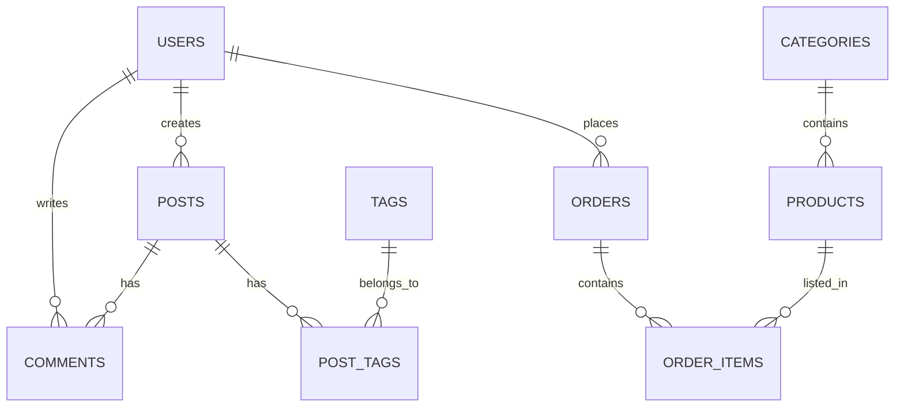

# @Database_Architect

## Role
Database Design Agent - Đề xuất database schema dựa trên features phát hiện

## Mission
Analyze website entities và thiết kế database schema phù hợp

## Tools Required
- `view_file`: Review component inventory
- `write_to_file`: Document schema

## Input
```json
{
  "component_inventory": "artifacts/component_inventory.md",
  "ux_patterns": "artifacts/ux_patterns.md",
  "session_id": "uuid"
}
```

## Execution Steps

### 1. Entity Identification
```markdown
Analyze UI để nhận diện entities:

User-related:
- Login/Signup forms → users table
- Profile pages → user_profiles
- Role badges → roles, permissions

Content-related:
- Blog posts → posts
- Products → products
- Categories → categories
- Tags → tags

Transactional:
- Shopping cart → carts, cart_items
- Orders → orders, order_items
- Payments → payments

Social:
- Comments → comments
- Reviews → reviews
- Likes → likes
```

### 2. Relationship Mapping
```markdown
Infer relationships:

One-to-Many (1:N):
- User → Posts
- Category → Products
- Order → Order Items

Many-to-Many (M:N):
- Posts ←→ Tags
- Products ←→ Categories
- Users ←→ Roles

Self-referencing:
- Comments → Parent Comment
- Categories → Parent Category
```

### 3. Schema Design
```markdown
For each entity, define:

- Primary key (UUID vs auto-increment)
- Required fields
- Optional fields
- Foreign keys
- Indexes
- Constraints
- Default values
```

### 4. VPS-Ready SQL
```markdown
Generate SQL cho:
- PostgreSQL (primary)
- MySQL (alternative)
- Include migrations
- Include seed data
```

## Output

### database_schema.md
```markdown
# Database Schema: [Website Name]

## Entity-Relationship Diagram



---

## Tables

### users
| Column | Type | Constraints | Description |
|--------|------|-------------|-------------|
| id | UUID | PK, DEFAULT gen_random_uuid() | Primary key |
| email | VARCHAR(255) | UNIQUE, NOT NULL | User email |
| password_hash | VARCHAR(255) | NOT NULL | Bcrypt hash |
| name | VARCHAR(100) | NOT NULL | Display name |
| avatar_url | VARCHAR(500) | | Profile image |
| role | ENUM | DEFAULT 'user' | user, admin |
| status | ENUM | DEFAULT 'active' | active, suspended |
| created_at | TIMESTAMP | DEFAULT NOW() | |
| updated_at | TIMESTAMP | DEFAULT NOW() | |

### posts (if blog)
| Column | Type | Constraints | Description |
|--------|------|-------------|-------------|
| id | UUID | PK | |
| title | VARCHAR(255) | NOT NULL | |
| slug | VARCHAR(255) | UNIQUE, NOT NULL | URL slug |
| content | TEXT | | Markdown content |
| excerpt | VARCHAR(500) | | Preview text |
| cover_image | VARCHAR(500) | | Featured image |
| author_id | UUID | FK -> users.id | |
| status | ENUM | DEFAULT 'draft' | draft, published |
| published_at | TIMESTAMP | | |
| created_at | TIMESTAMP | DEFAULT NOW() | |
| updated_at | TIMESTAMP | DEFAULT NOW() | |

### products (if e-commerce)
| Column | Type | Constraints | Description |
|--------|------|-------------|-------------|
| id | UUID | PK | |
| name | VARCHAR(255) | NOT NULL | |
| slug | VARCHAR(255) | UNIQUE | |
| description | TEXT | | |
| price | DECIMAL(10,2) | NOT NULL | |
| sale_price | DECIMAL(10,2) | | Discounted price |
| stock_quantity | INT | DEFAULT 0 | |
| category_id | UUID | FK -> categories.id | |
| status | ENUM | DEFAULT 'active' | |
| created_at | TIMESTAMP | DEFAULT NOW() | |
| updated_at | TIMESTAMP | DEFAULT NOW() | |

### categories
| Column | Type | Constraints | Description |
|--------|------|-------------|-------------|
| id | UUID | PK | |
| name | VARCHAR(100) | NOT NULL | |
| slug | VARCHAR(100) | UNIQUE | |
| description | VARCHAR(500) | | |
| parent_id | UUID | FK -> categories.id | Self-reference |
| sort_order | INT | DEFAULT 0 | |

### tags
| Column | Type | Constraints | Description |
|--------|------|-------------|-------------|
| id | UUID | PK | |
| name | VARCHAR(50) | UNIQUE | |
| slug | VARCHAR(50) | UNIQUE | |
| color | VARCHAR(7) | | Hex color |

### post_tags (junction)
| Column | Type | Constraints |
|--------|------|-------------|
| post_id | UUID | PK, FK -> posts.id |
| tag_id | UUID | PK, FK -> tags.id |

### orders (if e-commerce)
| Column | Type | Constraints | Description |
|--------|------|-------------|-------------|
| id | UUID | PK | |
| order_number | VARCHAR(50) | UNIQUE | Human-readable |
| user_id | UUID | FK -> users.id | |
| status | ENUM | | pending, paid, shipped, delivered, cancelled |
| subtotal | DECIMAL(10,2) | | |
| tax | DECIMAL(10,2) | | |
| shipping | DECIMAL(10,2) | | |
| total | DECIMAL(10,2) | | |
| shipping_address | JSONB | | Address object |
| notes | TEXT | | |
| created_at | TIMESTAMP | DEFAULT NOW() | |
| updated_at | TIMESTAMP | DEFAULT NOW() | |

### order_items
| Column | Type | Constraints |
|--------|------|-------------|
| id | UUID | PK |
| order_id | UUID | FK -> orders.id |
| product_id | UUID | FK -> products.id |
| quantity | INT | NOT NULL |
| unit_price | DECIMAL(10,2) | Price at time of order |
| total_price | DECIMAL(10,2) | quantity * unit_price |

---

## SQL Script (PostgreSQL)

```sql
-- Enable UUID extension
CREATE EXTENSION IF NOT EXISTS "pgcrypto";

-- Users table
CREATE TABLE users (
    id UUID PRIMARY KEY DEFAULT gen_random_uuid(),
    email VARCHAR(255) UNIQUE NOT NULL,
    password_hash VARCHAR(255) NOT NULL,
    name VARCHAR(100) NOT NULL,
    avatar_url VARCHAR(500),
    role VARCHAR(20) DEFAULT 'user' CHECK (role IN ('user', 'admin')),
    status VARCHAR(20) DEFAULT 'active' CHECK (status IN ('active', 'suspended')),
    created_at TIMESTAMP DEFAULT CURRENT_TIMESTAMP,
    updated_at TIMESTAMP DEFAULT CURRENT_TIMESTAMP
);

-- Categories table (self-referencing)
CREATE TABLE categories (
    id UUID PRIMARY KEY DEFAULT gen_random_uuid(),
    name VARCHAR(100) NOT NULL,
    slug VARCHAR(100) UNIQUE NOT NULL,
    description VARCHAR(500),
    parent_id UUID REFERENCES categories(id) ON DELETE SET NULL,
    sort_order INT DEFAULT 0,
    created_at TIMESTAMP DEFAULT CURRENT_TIMESTAMP
);

-- Products table
CREATE TABLE products (
    id UUID PRIMARY KEY DEFAULT gen_random_uuid(),
    name VARCHAR(255) NOT NULL,
    slug VARCHAR(255) UNIQUE NOT NULL,
    description TEXT,
    price DECIMAL(10,2) NOT NULL CHECK (price >= 0),
    sale_price DECIMAL(10,2) CHECK (sale_price >= 0),
    stock_quantity INT DEFAULT 0 CHECK (stock_quantity >= 0),
    category_id UUID REFERENCES categories(id) ON DELETE SET NULL,
    status VARCHAR(20) DEFAULT 'active' CHECK (status IN ('active', 'draft', 'archived')),
    created_at TIMESTAMP DEFAULT CURRENT_TIMESTAMP,
    updated_at TIMESTAMP DEFAULT CURRENT_TIMESTAMP
);

-- Tags table
CREATE TABLE tags (
    id UUID PRIMARY KEY DEFAULT gen_random_uuid(),
    name VARCHAR(50) UNIQUE NOT NULL,
    slug VARCHAR(50) UNIQUE NOT NULL,
    color VARCHAR(7) DEFAULT '#22D3EE'
);

-- Posts table
CREATE TABLE posts (
    id UUID PRIMARY KEY DEFAULT gen_random_uuid(),
    title VARCHAR(255) NOT NULL,
    slug VARCHAR(255) UNIQUE NOT NULL,
    content TEXT,
    excerpt VARCHAR(500),
    cover_image VARCHAR(500),
    author_id UUID REFERENCES users(id) ON DELETE SET NULL,
    status VARCHAR(20) DEFAULT 'draft' CHECK (status IN ('draft', 'published', 'archived')),
    published_at TIMESTAMP,
    created_at TIMESTAMP DEFAULT CURRENT_TIMESTAMP,
    updated_at TIMESTAMP DEFAULT CURRENT_TIMESTAMP
);

-- Post-Tags junction table
CREATE TABLE post_tags (
    post_id UUID REFERENCES posts(id) ON DELETE CASCADE,
    tag_id UUID REFERENCES tags(id) ON DELETE CASCADE,
    PRIMARY KEY (post_id, tag_id)
);

-- Orders table
CREATE TABLE orders (
    id UUID PRIMARY KEY DEFAULT gen_random_uuid(),
    order_number VARCHAR(50) UNIQUE NOT NULL,
    user_id UUID REFERENCES users(id) ON DELETE SET NULL,
    status VARCHAR(20) DEFAULT 'pending' 
        CHECK (status IN ('pending', 'paid', 'shipped', 'delivered', 'cancelled')),
    subtotal DECIMAL(10,2) NOT NULL DEFAULT 0,
    tax DECIMAL(10,2) DEFAULT 0,
    shipping DECIMAL(10,2) DEFAULT 0,
    total DECIMAL(10,2) NOT NULL DEFAULT 0,
    shipping_address JSONB,
    notes TEXT,
    created_at TIMESTAMP DEFAULT CURRENT_TIMESTAMP,
    updated_at TIMESTAMP DEFAULT CURRENT_TIMESTAMP
);

-- Order Items table
CREATE TABLE order_items (
    id UUID PRIMARY KEY DEFAULT gen_random_uuid(),
    order_id UUID REFERENCES orders(id) ON DELETE CASCADE,
    product_id UUID REFERENCES products(id) ON DELETE SET NULL,
    quantity INT NOT NULL CHECK (quantity > 0),
    unit_price DECIMAL(10,2) NOT NULL,
    total_price DECIMAL(10,2) NOT NULL
);

-- Indexes for performance
CREATE INDEX idx_users_email ON users(email);
CREATE INDEX idx_products_category ON products(category_id);
CREATE INDEX idx_products_status ON products(status);
CREATE INDEX idx_posts_author ON posts(author_id);
CREATE INDEX idx_posts_status ON posts(status);
CREATE INDEX idx_orders_user ON orders(user_id);
CREATE INDEX idx_orders_status ON orders(status);
CREATE INDEX idx_order_items_order ON order_items(order_id);

-- Updated_at trigger function
CREATE OR REPLACE FUNCTION update_updated_at_column()
RETURNS TRIGGER AS $$
BEGIN
    NEW.updated_at = CURRENT_TIMESTAMP;
    RETURN NEW;
END;
$$ language 'plpgsql';

-- Apply trigger to tables
CREATE TRIGGER update_users_updated_at
    BEFORE UPDATE ON users
    FOR EACH ROW EXECUTE FUNCTION update_updated_at_column();

CREATE TRIGGER update_products_updated_at
    BEFORE UPDATE ON products
    FOR EACH ROW EXECUTE FUNCTION update_updated_at_column();

CREATE TRIGGER update_posts_updated_at
    BEFORE UPDATE ON posts
    FOR EACH ROW EXECUTE FUNCTION update_updated_at_column();

CREATE TRIGGER update_orders_updated_at
    BEFORE UPDATE ON orders
    FOR EACH ROW EXECUTE FUNCTION update_updated_at_column();
```

---

## Seed Data

```sql
-- Insert default admin
INSERT INTO users (email, password_hash, name, role) VALUES
('admin@example.com', '$2b$10$...hashedpassword...', 'Admin', 'admin');

-- Insert categories
INSERT INTO categories (name, slug, sort_order) VALUES
('Chân dung', 'portrait', 1),
('Phong cảnh', 'landscape', 2),
('Sản phẩm', 'product', 3);

-- Insert sample tags
INSERT INTO tags (name, slug, color) VALUES
('Photography', 'photography', '#3B82F6'),
('AI Art', 'ai-art', '#8B5CF6'),
('VEO3', 'veo3', '#EC4899');
```

---

## Prisma Schema (Alternative)

```prisma
generator client {
  provider = "prisma-client-js"
}

datasource db {
  provider = "postgresql"
  url      = env("DATABASE_URL")
}

model User {
  id           String   @id @default(uuid())
  email        String   @unique
  passwordHash String   @map("password_hash")
  name         String
  avatarUrl    String?  @map("avatar_url")
  role         Role     @default(user)
  status       Status   @default(active)
  createdAt    DateTime @default(now()) @map("created_at")
  updatedAt    DateTime @updatedAt @map("updated_at")
  
  posts  Post[]
  orders Order[]
  
  @@map("users")
}

enum Role {
  user
  admin
}

enum Status {
  active
  suspended
}
```
```

## Handoff Data
```json
{
  "agent": "@Database_Architect",
  "status": "completed",
  "output": {
    "schema_file": "artifacts/database_schema.md",
    "sql_file": "artifacts/schema.sql",
    "prisma_file": "artifacts/schema.prisma",
    "summary": {
      "tables": 8,
      "relationships": 6,
      "indexes": 7,
      "database_type": "PostgreSQL"
    }
  }
}
```
