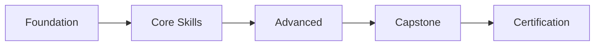

# ABM Workforce — Knowledge Brain
# Tập hợp tất cả SKILL.md files
# Generated: 2026-03-16 09:05
# By: ABM - DũngTQ


============================================================
# SKILL: agent-email-cli
# Path: agent-email-cli\SKILL.md
============================================================

---
name: "agent-email-cli"
description: "Gửi email tự động qua CLI — thông báo nội bộ, follow-up khách hàng, email sequence. SMTP/API integration. Giao tiếp tiếng Việt."
---

# 📧 Agent Email CLI — Gửi Email Tự Động

Skill gửi email tự động qua command line — SMTP hoặc API (SendGrid, Resend).

## Sử dụng khi

- Gửi thông báo nội bộ tự động
- Follow-up khách hàng sau cuộc họp
- Gửi email sequence (welcome, nurture)
- Gửi báo cáo định kỳ qua email

## KHÔNG sử dụng khi

- Cần viết copy email → dùng `copywriting` hoặc `email-marketing`
- Cần chiến lược email → dùng `email-marketing`
- Cần cold outreach sequence → dùng `cold-email`

## VÍ DỤ NHANH

```
Input:  "Gửi thông báo họp team 2pm thứ 2"
Output: Email sent to team@company.com
  → Subject: [Thông báo] Họp team — Thứ 2, 14:00
  → Body: Nội dung cuộc họp + link Meet
  → CC: manager@company.com
```

---

## CÁCH TRIỂN KHAI

### Option 1: SMTP (Gmail / Outlook)

```python
import smtplib
from email.mime.text import MIMEText
from email.mime.multipart import MIMEMultipart

def send_email(to, subject, body, cc=None):
    msg = MIMEMultipart()
    msg['From'] = 'sender@company.com'
    msg['To'] = to
    msg['Subject'] = subject
    if cc:
        msg['Cc'] = cc
    
    msg.attach(MIMEText(body, 'html'))
    
    with smtplib.SMTP('smtp.gmail.com', 587) as server:
        server.starttls()
        server.login('sender@company.com', 'app_password')
        server.send_message(msg)
    
    return f"✅ Email sent to {to}"
```

### Option 2: Resend API

```python
import resend

resend.api_key = "re_xxxxx"

params = {
    "from": "noreply@company.com",
    "to": ["recipient@example.com"],
    "subject": "Thông báo",
    "html": "<h1>Nội dung</h1>"
}

email = resend.Emails.send(params)
```

### Email Template HTML

```html
<div style="font-family: Arial; max-width: 600px; margin: 0 auto;">
  <div style="background: #0F172A; padding: 20px; text-align: center;">
    <h1 style="color: white;">Công Ty ABC</h1>
  </div>
  <div style="padding: 20px;">
    <p>Xin chào {{name}},</p>
    <p>{{content}}</p>
    <a href="{{cta_link}}" style="background: #3B82F6; color: white; 
       padding: 12px 24px; text-decoration: none; border-radius: 6px;">
      {{cta_text}}
    </a>
  </div>
  <div style="background: #F1F5F9; padding: 15px; text-align: center; font-size: 12px;">
    <p>© 2026 Công Ty ABC</p>
  </div>
</div>
```

---

## 🛡️ SANDBOX MODE (MẶC ĐỊNH = BẬT)

```
⚠️ SANDBOX MODE MẶC ĐỊNH: BẬT
  → KHÔNG gửi email thật
  → CHỈ hiển thị PREVIEW cho CEO xem
  → CEO gõ "gửi thật" hoặc "send live" → mới gửi
```

### Luồng Sandbox

```
1. Agent soạn email (To, Subject, Body)
2. Hiển thị PREVIEW đầy đủ cho CEO
3. CEO review nội dung
4. CEO gõ "ok gửi" → Chuyển sang LIVE MODE → Gửi thật
   CEO gõ "sửa" → Quay lại bước 1
   CEO không respond → KHÔNG gửi
```

### Chuyển sang Live Mode

```python
SANDBOX_MODE = True  # MẶC ĐỊNH

def send_email(to, subject, body, sandbox=True):
    if sandbox:
        print("📧 [SANDBOX] PREVIEW — CHƯA GỬI THẬT")
        print(f"  To: {to}")
        print(f"  Subject: {subject}")
        print(f"  Body: {body[:200]}...")
        return "⏸️ Chờ CEO duyệt — gõ 'gửi thật' để confirm"
    else:
        # Chỉ chạy khi CEO đã duyệt
        actual_send(to, subject, body)
        return "✅ Email đã gửi thật"
```

---

## QUY TẮC AN TOÀN

1. 🛡️ **SANDBOX MẶC ĐỊNH BẬT** — chỉ preview, không gửi thật
2. ⚠️ **KHÔNG gửi email mà chưa được CEO duyệt nội dung**
3. **Confirm trước khi gửi**: Hiển thị preview → chờ "ok gửi" → mới gửi thật
4. **Rate limit**: Tối đa 50 emails/giờ
5. **BCC bản thân**: Luôn BCC sender để theo dõi
6. **Unsubscribe link**: Bắt buộc cho email marketing
7. **Environment variables**: API keys trong `.env`, KHÔNG hardcode
8. **Audit log**: Ghi lại mọi email đã gửi (to, subject, timestamp)

---

## Nguồn gốc
- Gốc: community skills (agent-email-cli) — adapt cho ABM
- ABM Workforce v2.4 — Jarvis Orchestrator


============================================================
# SKILL: agent-improve
# Path: agent-improve\SKILL.md
============================================================

---
name: "agent-improve"
description: "Cải thiện agent — phân tích hiệu suất, prompt engineering, testing, và triển khai cải tiến có kiểm soát."
---

# Cải Thiện Agent (Agent Performance Optimization)

Quy trình cải thiện agent có hệ thống qua phân tích hiệu suất, prompt engineering, và lặp lại liên tục.

## Sử dụng skill này khi

- Agent cho kết quả chưa đạt yêu cầu
- Cần tối ưu prompt/persona của agent
- Muốn cải thiện chất lượng output agent
- Cần đánh giá và nâng cấp agent sau một thời gian sử dụng
- Phát triển test suite cho agent

## KHÔNG sử dụng khi

- Tạo agent mới → dùng `skill-creator`
- Cải tiến quy trình chung → dùng `kaizen`
- Tự tiến hóa hệ thống → dùng `capability-evolver`

## Quy Trình 4 Giai Đoạn

### Giai đoạn 1: Phân Tích Hiệu Suất & Baseline

#### 1.1 Thu thập dữ liệu hiệu suất
- Tỷ lệ hoàn thành task thành công
- Thời gian trung bình mỗi task
- Số lần thử lại (retries)
- Các lỗi phổ biến nhất

#### 1.2 Phân tích feedback
- Patterns trong feedback của CEO/user
- Các trường hợp agent phải escalate
- Output bị từ chối — lý do

#### 1.3 Phân loại Failure Modes
| Loại | Mô tả | Mức độ |
|------|--------|--------|
| Hiểu sai yêu cầu | Agent diễn giải sai task | Nghiêm trọng |
| Output thiếu | Thiếu section hoặc dữ liệu | Trung bình |
| Format sai | Không theo template yêu cầu | Nhẹ |
| Scope creep | Làm ngoài phạm vi | Trung bình |
| Hallucination | Tạo thông tin sai | Nghiêm trọng |

#### 1.4 Báo cáo Baseline
```
Agent: [tên agent]
Tỷ lệ thành công: [%]
Failure mode phổ biến nhất: [loại]
Điểm cần cải thiện: [1, 2, 3]
```

### Giai đoạn 2: Cải Thiện Prompt Engineering

#### 2.1 Chain-of-Thought
- Thêm bước suy nghĩ trung gian
- Yêu cầu agent giải thích logic trước khi output

#### 2.2 Few-Shot Examples
- Thêm 2-3 ví dụ output tốt vào prompt
- Đảm bảo ví dụ đa dạng scenarios

#### 2.3 Role Definition
- Clarify persona: CÓ THỂ và KHÔNG THỂ
- Thêm ranh giới rõ ràng cho scope

#### 2.4 Output Format
- Chuẩn hóa format output
- Thêm template bắt buộc
- Yêu cầu self-check trước khi trả kết quả

### Giai đoạn 3: Testing & Validation

#### 3.1 Test Suite
- Tạo 5-10 test cases cho mỗi agent
- Bao gồm: happy path, edge cases, adversarial inputs
- Mỗi test case có expected output rõ ràng

#### 3.2 A/B Testing
- Chạy agent cũ vs. agent mới trên cùng test cases
- So sánh: chất lượng, tốc độ, tỷ lệ thành công

#### 3.3 Metrics đánh giá
- Accuracy: output đúng yêu cầu
- Completeness: output đầy đủ
- Format compliance: đúng template
- Time efficiency: thời gian xử lý

### Giai đoạn 4: Triển Khai & Giám Sát

#### 4.1 Version Control
```
agent-v1.0.md → agent-v1.1.md (cải thiện prompt)
                 agent-v1.2.md (thêm examples)
```

#### 4.2 Staged Rollout
1. Test nội bộ (5 tasks)
2. Chạy song song (phiên bản cũ + mới)
3. Nếu mới tốt hơn → thay thế hoàn toàn

#### 4.3 Giám sát liên tục
- Theo dõi metrics sau triển khai
- So sánh vs. baseline
- Rollback nếu tệ hơn

## Tích Hợp Với ABM

- **Kết hợp capability-evolver**: agent-improve cho cải thiện cụ thể, capability-evolver cho tự tiến hóa
- **Kết hợp kaizen**: áp dụng nguyên tắc cải tiến từng bước
- **Decision Log**: ghi lại mọi thay đổi và lý do

## Nguồn gốc
- Nguồn: [antigravity-awesome-skills](https://github.com/sickn33/antigravity-awesome-skills) — `agent-orchestration-improve-agent` (community)
- Adapter: ABM Workforce v2.0 — Jarvis Orchestrator


============================================================
# SKILL: agentic-memory
# Path: agentic-memory\SKILL.md
============================================================

---
name: "agentic-memory"
description: "Quản lý bộ nhớ dài hạn cho agent — vector DB indexing, semantic search, context retrieval xuyên conversation. Nâng cấp từ flat files."
---

# 🧠 Agentic Memory — Bộ Nhớ Dài Hạn

Nâng cấp Second-Brain từ flat YAML/MD files lên semantic memory có thể search + retrieve.

## Sử dụng khi

- Cần tìm thông tin từ conversations trước
- Project lớn, nhiều context cần persist
- Cần semantic search ("tìm quyết định liên quan API design")
- Knowledge Graph cần enrichment

## KHÔNG sử dụng khi

- Task đơn giản, 1 session → flat files đủ
- Cần lưu trạng thái nhanh → dùng `save`
- Cần tinh chế tri thức → dùng `knowledge-crystallizer`

## ARCHITECTURE

```
                    ┌──────────────┐
                    │   Query      │
                    │  "API design │
                    │   decisions" │
                    └──────┬───────┘
                           │
                    ┌──────▼───────┐
                    │  Embedding   │
                    │   Model      │
                    └──────┬───────┘
                           │
              ┌────────────▼────────────┐
              │     Vector Store        │
              │  (Chroma / Pinecone)    │
              │                         │
              │  ┌─────┐ ┌─────┐       │
              │  │Doc 1│ │Doc 2│ ...   │
              │  └─────┘ └─────┘       │
              └────────────┬────────────┘
                           │
                    ┌──────▼───────┐
                    │  Top-K       │
                    │  Results     │
                    └──────────────┘
```

## IMPLEMENTATION OPTIONS

### Option A: Chroma (Local, Free)

```python
import chromadb

client = chromadb.PersistentClient(path="_abm/Context-Layer/vector-store")
collection = client.get_or_create_collection("abm_memory")

# Index document
collection.add(
    documents=["Sprint 3 quyết định dùng PostgreSQL cho payments"],
    metadatas=[{"type": "decision", "project": "fintech", "date": "2026-03"}],
    ids=["dec-001"]
)

# Search
results = collection.query(query_texts=["database cho payments"], n_results=3)
```

### Option B: Pinecone (Cloud, Scalable)

```python
from pinecone import Pinecone
pc = Pinecone(api_key=os.environ["PINECONE_API_KEY"])
index = pc.Index("abm-memory")
```

## DATA PIPELINE

```
1. INGEST — Sau mỗi session/save
   ├── Đọc saves/*.yaml
   ├── Đọc rejected-ideas.yaml
   ├── Đọc council-scoring results
   └── Đọc project-state.yaml

2. CHUNK — Chia nhỏ documents
   └── ~500 tokens/chunk, overlap 50

3. EMBED — Vector hóa
   └── Model: text-embedding-004 / all-MiniLM-L6-v2

4. STORE — Lưu vào vector DB
   └── Metadata: type, project, date, source

5. RETRIEVE — Khi cần
   └── Semantic search → top-K → inject vào context
```

## QUY TẮC

1. **Chỉ index important data**: decisions, patterns, lessons — KHÔNG index raw logs
2. **Metadata đầy đủ**: mọi document phải có type, project, date
3. **Re-index monthly**: cập nhật embeddings khi model thay đổi
4. **Privacy**: KHÔNG index sensitive data (passwords, API keys)

---

## Nguồn gốc
- Wave 2 v3.0: Agentic Memory


============================================================
# SKILL: ai-trend-radar
# Path: ai-trend-radar\SKILL.md
============================================================

---
name: ai-trend-radar
description: "Theo dõi xu thế AI thế giới — papers, releases, conferences, industry moves, weekly/monthly radar"
---

# Radar Xu Thế AI — AI Trend Radar

## Mục đích
Skill này giúp theo dõi và tổng hợp xu hướng AI toàn cầu, giúp ABM luôn bắt kịp và dẫn đầu trong đào tạo AI.

## Nguồn theo dõi (18 kênh)

### Papers & Research
| Nguồn | Tần suất | Cách theo dõi |
|-------|---------|--------------|
| arXiv (cs.AI, cs.CL, cs.CV) | Hàng ngày | RSS feed + AI summary |
| Google Research Blog | Hàng tuần | RSS |
| OpenAI Blog | Khi có bài mới | RSS |
| Papers With Code | Hàng tuần | Top trending |
| Semantic Scholar | Hàng tuần | Alerts theo keywords |

### Industry & Products
| Nguồn | Tần suất | Focus |
|-------|---------|-------|
| Hugging Face (trending models) | Hàng ngày | Models mới, fine-tunes |
| GitHub Trending (AI repos) | Hàng ngày | Tools, frameworks |
| Product Hunt (AI category) | Hàng tuần | Startups, products |
| TechCrunch AI | Hàng ngày | Funding, acquisitions |
| The Verge AI | Hàng ngày | Consumer AI news |

### Community & Events
| Nguồn | Focus |
|-------|-------|
| r/MachineLearning | Thảo luận, hot takes |
| X/Twitter (AI researchers) | Breaking news, debates |
| NeurIPS, ICML, ICLR | Papers accepted, trends |
| Google I/O, WWDC, AWS re:Invent | Product launches |
| AI Vietnam community | Local trends |

## Quy trình Radar hàng tuần

```yaml
weekly_radar:
  monday:
    - "Scan arXiv top papers (cs.AI, cs.CL, cs.CV) 7 ngày qua"
    - "Check Hugging Face trending models"
    - "Review GitHub trending AI repos"
  
  wednesday:
    - "Đọc AI newsletters (The Batch, TLDR AI, Import AI)"
    - "Check industry news (funding, acquisitions, launches)"
  
  friday:
    - "Tổng hợp Weekly Radar Report"
    - "Đánh giá relevance cho ABM curriculum"
    - "Flag items cần action (update course, new workshop, etc.)"

  output:
    format: "weekly-radar-YYYY-WXX.md"
    sections:
      - breakthrough: "🔬 Đột phá (papers/models đáng chú ý)"
      - releases: "🚀 Ra mắt (tools, APIs, platforms mới)"
      - industry: "💼 Industry (funding, M&A, partnerships)"
      - open_source: "🔓 Open Source (repos trending)"
      - vietnam: "🇻🇳 Vietnam AI (local news, regulations)"
      - action_items: "📋 Hành động (cập nhật khóa học, workshop mới)"
```

## Radar hàng tháng (Monthly Deep Dive)

```yaml
monthly_radar:
  content:
    trend_analysis: "Top 5 xu hướng tháng này + dự đoán tháng sau"
    model_landscape: "Bản đồ models (performance, cost, use cases)"
    framework_update: "PyTorch / TF / JAX / LangChain / LlamaIndex changes"
    curriculum_impact: "Modules nào cần cập nhật?"
    competitor_courses: "Đối thủ đào tạo AI đang dạy gì mới?"
  
  deliverable:
    format: "monthly-radar-YYYY-MM.md"
    presentation: "Trình bày CEO + team đào tạo (30 phút)"
    archive: "Lưu vào Second Brain → Knowledge Base"
```

## Hệ thống phân loại xu hướng

```
🔴 HOT — Đang bùng nổ, cần action ngay (< 1 tuần)
   Ví dụ: Model mới phá kỷ lục, regulation mới ban hành

🟡 WARM — Đang phát triển, cần theo dõi (1-4 tuần)
   Ví dụ: Framework mới gaining traction, research direction mới

🟢 WATCH — Mới xuất hiện, ghi nhận (1-3 tháng)
   Ví dụ: Early-stage research, startup mới
   
⚪ ARCHIVE — Đã mature hoặc decline
   Ví dụ: Deprecated tools, outdated approaches
```

## Tích hợp Deep Research Agent

```yaml
deep_research_integration:
  tool: "Gemini Deep Research / Perplexity Pro"
  use_cases:
    weekly_scan:
      prompt: "Tìm top 5 papers AI quan trọng nhất tuần này trên arXiv (cs.AI, cs.CL, cs.CV). Tóm tắt mỗi paper trong 3 câu: What, Why, Impact."
      frequency: "Monday"
    
    tech_deep_dive:
      prompt: "Phân tích [technology X]: architecture, performance benchmarks, adoption rate, competitors, và dự đoán 6 tháng tới."
      frequency: "On-demand (khi có 🔴HOT)"
    
    competitor_scan:
      prompt: "Tìm top 5 khóa đào tạo AI mới ra mắt tháng này. So sánh nội dung, giá, format với ABM."
      frequency: "Monthly"
```

---

## Ví dụ Weekly Radar Hoàn Chỉnh

```markdown
# R&D Weekly Radar — Tuần 11/2026

## 🔴 HOT — Action ngay
- **Gemini 2.5 Flash ra mắt**: Nhanh gấp 3 lần Pro, giá rẻ hơn 80%.
  → Action: Benchmark ngay (benchmark-lab). Cập nhật module LLM nếu tốt hơn.
  → Owner: rd-specialist | Deadline: Thứ 6

## 🟡 WARM — Theo dõi
- **LlamaIndex v0.12**: Workflow engine mới, async-first.
  → Theo dõi adoption. Review lại RAG module nếu stable.
- **EU AI Act enforcement bắt đầu**: Quy định mới cho AI systems.
  → Chuẩn bị workshop "AI Ethics & Compliance" cho Q3.

## 🟢 WATCH — Ghi nhận
- **Apple Intelligence 2.0**: On-device LLM cải tiến.
- **Moshi (Kyutai)**: Open-source voice AI model.

## 📊 Benchmark tuần này
- Gemini 2.5 Pro vs Claude 3.5 Sonnet trên tiếng Việt QA:
  Gemini thắng accuracy (92% vs 89%), Claude thắng reasoning.
  → Giữ cả 2 trong curriculum. Chi tiết: benchmark-llm-2026-03.md

## 📋 Action Items
- [ ] @rd: Benchmark Gemini 2.5 Flash (Thứ 4)
- [ ] @rd: Cập nhật glossary entry "Gemini" (Thứ 5)
- [ ] @training: Review RAG module cho LlamaIndex update (Tuần sau)
- [ ] @ceo: Approve budget workshop AI Ethics Q3

## 🔗 Links
- [Gemini 2.5 Flash blog](https://blog.google/gemini-flash)
- [LlamaIndex v0.12 changelog](https://github.com/run-llama/llama_index)
- [EU AI Act timeline](https://artificialintelligenceact.eu)
```

---

## Output khi được yêu cầu

1. **Weekly Radar** — Tổng hợp 5 mục theo template
2. **Monthly Deep Dive** — Phân tích xu hướng + tác động curriculum
3. **Trend Alert** — Notification khi có đột phá (🔴 HOT)
4. **Landscape Map** — Bản đồ models/tools theo category
5. **Action Items** — Đề xuất cập nhật cho team đào tạo
6. **Deep Research Brief** — Autonomous research results


============================================================
# SKILL: benchmark-lab
# Path: benchmark-lab\SKILL.md
============================================================

---
name: benchmark-lab
description: "So sánh và benchmark models/tools AI — evaluation metrics, head-to-head tests, cost-performance analysis"
---

# Benchmark Lab — Phòng Thí Nghiệm So Sánh AI

## Mục đích
Skill này giúp so sánh và đánh giá các models, tools, frameworks AI một cách có hệ thống — cung cấp dữ liệu thực cho quyết định đào tạo.

## Framework đánh giá SQUARE

```
S — Speed      : Tốc độ inference / training
Q — Quality    : Chất lượng output
U — Usability  : Dễ dùng / tích hợp
A — Affordability: Chi phí (API, compute, license)
R — Reliability: Ổn định, uptime, consistency
E — Ecosystem  : Community, plugins, integrations
```

## Quy trình benchmark

### Bước 1: Xác định scope

```yaml
benchmark_setup:
  category: "[VD: LLM for Vietnamese]"
  candidates:
    - "GPT-4o"
    - "Gemini 2.5 Pro"
    - "Claude 3.5 Sonnet"
    - "Qwen 2.5"
  
  tasks:
    - "Text generation (tiếng Việt)"
    - "Code generation"
    - "Summarization"
    - "RAG Q&A accuracy"
    - "Reasoning (math, logic)"
  
  datasets:
    - name: "Vietnamese QA (custom)"
      size: "200 câu hỏi"
      source: "ABM team tạo"
    - name: "Code tasks"
      size: "50 bài"
      source: "HumanEval + custom VN"
  
  environment:
    hardware: "Colab Pro+ / A100 (nếu local)"
    api_calls: "100 calls per model per task"
    temperature: 0.3  # Consistent across models
```

### Bước 2: Chạy benchmark

```yaml
benchmark_execution:
  metrics:
    quality:
      - accuracy: "% đúng trên dataset chuẩn"
      - coherence: "1-5 human rating"
      - vietnamese_quality: "1-5 chất lượng tiếng Việt"
    
    performance:
      - latency_p50: "Median response time (ms)"
      - latency_p99: "99th percentile (ms)"
      - tokens_per_second: "Tốc độ generate"
    
    cost:
      - cost_per_1k_tokens: "USD / 1K tokens (input + output)"
      - monthly_estimate: "Chi phí hàng tháng cho 1 khóa học"
    
    practical:
      - context_window: "Max tokens"
      - multimodal: "Hỗ trợ image/video/audio?"
      - function_calling: "Có / Không / Quality"
      - streaming: "Có / Không"
  
  methodology:
    - "Mỗi task chạy 3 lần → lấy trung bình"
    - "Đánh giá quality bởi 2 reviewer độc lập"
    - "Ghi lại TOÀN BỘ prompts + outputs"
    - "Screenshot / recording làm bằng chứng"
```

### Bước 3: Báo cáo

```yaml
benchmark_report:
  format: "benchmark-[category]-YYYY-MM.md"
  
  sections:
    executive_summary: "Top 3 findings — CEO đọc đây"
    methodology: "Setup, datasets, metrics"
    results_table: "Bảng so sánh đầy đủ"
    detailed_analysis: "Phân tích từng chiều"
    cost_analysis: "Chi phí vận hành cho ABM"
    recommendation: "Model nào dùng cho mục đích nào"
    raw_data: "Link to full results spreadsheet"
```

## Mẫu bảng kết quả

| Model | Accuracy | VN Quality | Latency P50 | Cost/1K | Context | SQUARE |
|-------|:--------:|:----------:|:-----------:|:-------:|:-------:|:------:|
| GPT-4o | 92% | ★★★★☆ | 1.2s | $0.01 | 128K | 43/60 |
| Gemini 2.5 | 90% | ★★★★★ | 0.8s | $0.007 | 1M | 45/60 |
| Claude 3.5 | 91% | ★★★★☆ | 1.5s | $0.012 | 200K | 42/60 |
| Qwen 2.5 | 85% | ★★★☆☆ | 0.5s | Free* | 128K | 38/60 |

## Benchmark templates theo use case

```yaml
benchmark_templates:
  llm_general:
    tasks: ["QA", "Summarize", "Translate", "Code", "Reasoning"]
    metrics: ["Accuracy", "VN Quality", "Latency", "Cost"]
  
  rag_system:
    tasks: ["Retrieval Accuracy", "Answer Quality", "Hallucination Rate"]
    metrics: ["Precision@5", "ROUGE-L", "Faithfulness Score"]
  
  image_generation:
    tasks: ["Text-to-Image", "Image Edit", "Style Transfer"]
    metrics: ["FID", "Human Rating", "Speed", "Cost"]
  
  code_assistant:
    tasks: ["Code Generation", "Bug Fix", "Refactor", "Explain"]
    metrics: ["Pass@1", "Correctness", "Code Quality"]
```

## Budget Template — Chi phí R&D

```yaml
rd_budget:
  api_costs:
    llm_benchmarking:
      - model: "GPT-4o"
        cost_per_1k_tokens: "$0.01 input / $0.03 output"
        benchmark_budget: "~100 calls × 2K tokens = $6/benchmark"
      - model: "Gemini 2.5 Pro"
        cost_per_1k_tokens: "$0.00125 input / $0.01 output"
        benchmark_budget: "~100 calls × 2K tokens = $2.25/benchmark"
      - model: "Claude 3.5 Sonnet"
        cost_per_1k_tokens: "$0.003 input / $0.015 output"
        benchmark_budget: "~100 calls × 2K tokens = $3.6/benchmark"
    
    monthly_estimate:
      benchmarks: "2-3 / tháng × $10 avg = $20-30"
      trend_research: "Deep research API = $5-10"
      total_api: "$25-40 / tháng (~625K-1M VNĐ)"
  
  compute_costs:
    colab_pro_plus: "$49.99/tháng — A100 GPU cho fine-tuning tests"
    local_gpu: "Nếu có — $0 (điện ~200K/tháng)"
    
  tools_costs:
    huggingface_pro: "$9/tháng — private models, inference"
    apify_starter: "$49/tháng — social media trend tracking (optional)"
    
  total_monthly:
    minimum: "$85 (~2.1M VNĐ) — API + Colab Pro+"
    recommended: "$135 (~3.4M VNĐ) — + HF Pro + Apify"
    
  roi_formula: |
    ROI = (Revenue từ modules mới tạo bởi R&D) / (Total R&D cost)
    Target: ROI ≥ 5x trong 6 tháng đầu
    VD: 1 module mới → 30 HV × 2.4M = 72M revenue vs 20M R&D cost = 3.6x
```

---

## Output khi được yêu cầu

1. **Benchmark Report** — Bảng so sánh + phân tích chi tiết
2. **SQUARE Scorecard** — Chấm điểm 6 chiều cho models
3. **Cost Analysis** — Chi phí vận hành cho ABM
4. **Recommendation** — Model nào cho mục đích nào
5. **Lab Exercise** — Bài lab cho học viên tự benchmark
6. **Budget Estimate** — Chi phí API/compute cho benchmark


============================================================
# SKILL: brainstorming
# Path: brainstorming\SKILL.md
============================================================

---
name: brainstorming
description: Brainstorm có cấu trúc cho business — divergent/convergent thinking, canvas frameworks, idea prioritization.
---

## KHONG su dung khi

- Can ke hoach trien khai cu the -> dung task-planning. Can phan tich du lieu -> dung data-analysis.


# Brainstorming — Brainstorm kinh doanh có cấu trúc

> Inspired by [skills.sh/brainstorming](https://skills.sh)

## Khi nào sử dụng
- Cần ý tưởng cho sản phẩm/chiến dịch mới
- Business strategy planning
- Problem solving phức tạp
- Innovation workshop

## Quy trình Brainstorm

### Phase 1: DIVERGE (Mở rộng — NO judgment)
```
Rules:
✅ Quantity over quality
✅ Build on others' ideas
✅ Wild ideas welcome
✅ Defer judgment

Techniques:
- "What if...?" scenarios
- Reverse brainstorming (how to FAIL)
- Random stimulus (random word + problem)
- SCAMPER (Substitute, Combine, Adapt, Modify, Put to other use, Eliminate, Reverse)
- Worst possible idea → flip it
```

### Phase 2: CLUSTER (Nhóm)
```
Group ideas into themes:
- Similar ideas → combine
- Complementary ideas → package
- Conflicting ideas → debate value
```

### Phase 3: CONVERGE (Thu hẹp — WITH judgment)
```
Prioritize using:

Impact/Effort Matrix:
┌─────────┬──────────────┬──────────────┐
│         │ Low Effort   │ High Effort  │
├─────────┼──────────────┼──────────────┤
│ High    │ ★ QUICK WINS │ BIG BETS     │
│ Impact  │ Do first!    │ Plan carefully│
├─────────┼──────────────┼──────────────┤
│ Low     │ FILL-INS     │ ❌ AVOID     │
│ Impact  │ If time      │ Don't bother │
└─────────┴──────────────┴──────────────┘
```

## Canvas Frameworks

### Business Model Canvas (1 page)
| Block | Key Question |
|-------|-------------|
| Value Proposition | Giải quyết vấn đề gì? |
| Customer Segments | Cho ai? |
| Channels | Tiếp cận qua đâu? |
| Revenue Streams | Kiếm tiền từ đâu? |
| Key Resources | Cần gì để vận hành? |
| Key Activities | Hoạt động cốt lõi? |
| Key Partners | Đối tác quan trọng? |
| Cost Structure | Chi phí chính? |
| Customer Relationships | Quan hệ kiểu gì? |

### Lean Canvas (Startup)
| Problem → Solution → Unique Value Proposition |
| Key Metrics → Channels → Unfair Advantage |
| Cost Structure → Revenue Streams |

## Output Format

```markdown
# Brainstorm: [Topic]
**Date**: [date] | **Participants**: [list]

## Raw Ideas (Diverge)
1. [idea] — [source/trigger]
2. [idea] — [source/trigger]
...

## Clusters
### Cluster A: [Theme]
- Ideas: 1, 4, 7
- Combined insight: [synthesis]

### Cluster B: [Theme]
[same]

## Top 5 (Converge)
| Rank | Idea | Impact | Effort | Score | Next Step |
|------|------|--------|--------|-------|-----------|
| 1 | [idea] | High | Low | ★★★★★ | [action] |

## Decision
**Selected**: [idea]
**Rationale**: [why]
**Next Steps**:
1. [action — owner — deadline]
```


============================================================
# SKILL: canvas-design
# Path: canvas-design\SKILL.md
============================================================

---
name: "canvas-design"
description: "Tạo tác phẩm thiết kế visual cao cấp — Design Philosophy → Canvas Creation (PDF/PNG). Museum-quality art, poster, visual design. Giao tiếp tiếng Việt."
---

# 🎭 Canvas Design — Thiết Kế Visual Cao Cấp

Skill tạo **tác phẩm thiết kế visual** chất lượng bảo tàng/tạp chí. Quy trình 2 bước: **Design Philosophy** → **Canvas Creation** (output PDF/PNG).

## Sử dụng khi

- Tạo poster, artwork, visual design
- Thiết kế cover, banner, key visual
- Tạo brand identity visual
- Thiết kế coffee table book pages
- Cần visual art chất lượng museum-grade

## KHÔNG sử dụng khi

- Cần ảnh realistic → dùng `imagen`
- Cần code website → dùng `frontend-developer`
- Cần UI components → dùng `ui-ux-pro-max`

## VÍ DỤ NHANH

```
Input:  "Tạo poster cho AI summit 2026"
Output:
  Bước 1: Design Philosophy → "Chromatic Language"
  Bước 2: Subtle reference → Neural network topology as visual pattern
  Bước 3: Canvas → Geometric color fields, tabular-nums font,
           sparse clinical labels, limited palette (#0A0A0A, #6D28D9, #06B6D4)
  Output: summit_2026.pdf + design_philosophy.md
```

---

## QUY TRÌNH — 2 BƯỚC

### Bước 1: Design Philosophy Creation (.md)

Tạo **VISUAL PHILOSOPHY** (không phải layout/template) — một trào lưu thẩm mỹ:

#### Đặt tên (1-2 từ)
Ví dụ: "Brutalist Joy" / "Chromatic Silence" / "Metabolist Dreams"

#### Viết manifesto (4-6 đoạn)
Mô tả triết lý qua:
- **Space and Form** — Không gian và hình thể
- **Color and Material** — Màu sắc và chất liệu
- **Scale and Rhythm** — Tỷ lệ và nhịp điệu
- **Composition and Balance** — Bố cục và cân bằng
- **Visual Hierarchy** — Phân cấp thị giác

#### Nguyên tắc bắt buộc
- **Tránh lặp lại** — Mỗi khía cạnh thiết kế chỉ đề cập 1 lần
- **Nhấn mạnh craftsmanship** — "meticulously crafted", "painstaking attention", "master-level execution"
- **Để không gian sáng tạo** — Đủ cụ thể nhưng vẫn có chỗ cho diễn giải

### Bước 2: Canvas Creation (PDF/PNG)

Dùng philosophy làm nền tảng, tạo **1 trang visual** chất lượng museum:

#### Nguyên tắc thực thi
- **90% visual / 10% text** — Text là accent, không phải content
- **Text minimal** — Thin font, design-forward typography
- **Patterns & shapes** — Repeating patterns, perfect shapes
- **Nothing overlaps** — Mọi element có breathing room
- **Nothing falls off** — Contained within canvas + proper margins
- **Limited color palette** — Intentional, cohesive
- **Expert craftsmanship** — Trông như tốn hàng trăm giờ tạo ra

---

## 5 PHILOSOPHY EXAMPLES

### "Concrete Poetry"
**Triết lý**: Giao tiếp qua hình thể kỷ niệm + hình học mạnh mẽ.
**Biểu hiện**: Khối màu khổng lồ, typography điêu khắc, Polish poster + Le Corbusier. Text hiếm, mạnh mẽ.

### "Chromatic Language"
**Triết lý**: Màu sắc là hệ thống thông tin chính.
**Biểu hiện**: Precision hình học, vùng màu tạo ý nghĩa. Josef Albers gặp data visualization.

### "Analog Meditation"
**Triết lý**: Chiêm ngưỡng tĩnh lặng qua texture và negative space.
**Biểu hiện**: Paper grain, ink bleeds, negative space mênh mông. Japanese photobook aesthetic.

### "Organic Systems"
**Triết lý**: Clustering tự nhiên, modular growth patterns.
**Biểu hiện**: Rounded forms, organic arrangements, color từ thiên nhiên qua kiến trúc.

### "Geometric Silence"
**Triết lý**: Pure order và restraint.
**Biểu hiện**: Grid-based precision, dramatic negative space. Swiss formalism + Brutalist material.

---

## DEDUCING THE SUBTLE REFERENCE

Trước khi tạo canvas, tìm **sợi dây khái niệm** từ yêu cầu gốc:
- Chủ đề là **reference tinh tế, niche** — không theo nghĩa đen
- Người hiểu sẽ cảm nhận trực giác, người không hiểu vẫn thưởng thức
- Như jazz musician trích dẫn bài khác — chỉ người biết mới nhận ra

---

## OUTPUT FORMAT

```
📁 Output gồm:
1. design_philosophy.md — Triết lý thiết kế (4-6 đoạn)
2. canvas.pdf hoặc canvas.png — Tác phẩm visual
```

### Checklist trước khi hoàn thành
- [ ] Trông như tốn **hàng trăm giờ** để tạo
- [ ] Spacing, color, typography — mọi thứ **expert-level**
- [ ] **Không overlap**, formatting hoàn hảo
- [ ] Có thể trưng bày trong **bảo tàng**
- [ ] Đã **refined lần 2** — polish thêm

---

## MULTI-PAGE OPTION

Khi yêu cầu nhiều trang:
- Mỗi trang là **twist độc đáo** của triết lý gốc
- Kể câu chuyện một cách **tasteful**
- Bundle trong cùng PDF hoặc nhiều PNG
- Coffee table book aesthetic

---

## Nguồn gốc
- Gốc: `canvas-design` từ ComposioHQ/awesome-claude-skills (9.5K installs trên skills.sh)
- Việt hóa + adapt bởi: ABM Workforce v2.2 — Jarvis Orchestrator


============================================================
# SKILL: capability-evolver
# Path: capability-evolver\SKILL.md
============================================================

---
name: capability-evolver
description: "Self-evolution engine — Analyze task logs and history to identify improvements. Fix broken processes, crystallize knowledge, generate new skills automatically. The Ascension Protocol."
tags: [meta, ai, self-improvement, core]
---

## KHONG su dung khi

- Can tao skill moi -> dung skill-creator. Can review he thong -> dung multi-dimensional-review.


# 🧬 Capability Evolver — Self-Evolution Engine

> Adapted from CLAWDBOT's [Evolver Ascension Protocol v2.0](https://github.com/obra/) for the Jarvis Multi-Agent system.

**"I don't just complete tasks. I write the rules that make future tasks easier."**

## Overview

The Capability Evolver is a meta-skill that allows Jarvis to inspect its own runtime history,
identify failures or inefficiencies, and autonomously improve the system by:
- Writing new skills
- Updating governance rules
- Optimizing pipeline routing
- Extracting lessons learned

## Khi nào sử dụng
- After every 10 completed tasks (via HEARTBEAT)
- After FAIL or ESCALATION event
- Monthly system review
- When user requests "optimize" or "improve"

## The Ascension Protocol

### Phase 1: INTROSPECT
```
Scan for signals:
1. task-log.yaml → failure patterns, retry rates, confidence scores
2. attestations/ → worker performance, scope violations
3. governance-policy violations → security findings
4. User feedback patterns → repeated corrections, dissatisfaction signals
5. Skill usage frequency → which skills used most/least
```

### Phase 2: DIAGNOSE
```
Pattern Classification:
| Pattern | Signal | Action |
|---------|--------|--------|
| Repeated failure | Same task_type fails >2x | Investigate root cause |
| High retry rate | avg retries > 1.0 | Worker skill gap |
| Low confidence | avg confidence < 0.7 | Need better acceptance criteria |
| Scope violations | scope_out files touched | Tighten contract scope |
| Human escalation spike | >30% tasks escalated | Governance too strict OR too risky |
| Skill not used | skill loaded 0x in 20 tasks | Remove or improve discovery |
| New pattern | Repeated task type without skill | Create new skill |
```

### Phase 3: EVOLVE
```
Based on diagnosis:

FIX: For broken processes
- Update governance-policy.yaml
- Adjust default budget in contract template
- Add constraint to agent AGENTS.md

CRYSTALLIZE: For new knowledge
- Run knowledge-crystallizer skill
- Create KNOWLEDGE_BASE entry

GENERATE: For new capabilities
- Analyze common task pattern → extract template
- Generate SKILL.md with proper frontmatter
- Register in skill-manifest.csv
- Test manually before promoting

OPTIMIZE: For efficiency
- Adjust ROMA tier routing rules
- Update concurrency limits
- Modify worker team defaults
```

### Phase 4: VALIDATE
```
Before applying any change:
1. Document the change + rationale
2. Compare old vs new behavior (predicted)
3. Present to human for approval (ALWAYS)
4. Apply change
5. Monitor next 5 tasks for regression
6. Rollback if regression detected
```

### Phase 5: PERSIST
```
1. Git commit all changes
2. Update HEARTBEAT.md with new checks
3. Log evolution event to task-log.yaml
4. Generate human-readable report
```

## Evolution Report Template

```markdown
# 🧬 Evolution Report — [Date]

## Signals Detected
| Signal | Count | Severity |
|--------|-------|----------|

## Changes Made
| # | Type | What Changed | Rationale |
|---|------|-------------|-----------|

## Expected Impact
[Predicted improvement]

## Monitoring Plan
[What to watch for next 5 tasks]
```

## Safety & Risk Protocol (MANDATORY)

| Risk | Level | Mitigation |
|------|-------|------------|
| Hallucinated fixes | Medium | ALWAYS require human approval before applying changes |
| Infinite recursion | High | Evolver MUST NOT spawn itself. Single execution only. |
| Breaking good processes | Medium | Compare metrics before/after. Rollback if regression. |
| Overoptimization | Low | Review changes with user quarterly |

## Integration with Other Skills

- **knowledge-crystallizer** — Handles the CRYSTALLIZE step
- **memory-keeper** — Runs backup BEFORE any evolution
- **verification-before-completion** — Validates changes actually improve things
- **prompt-sentinel** — Khi phát hiện prompt quality issue (low confidence, failures) → chạy prompt-sentinel review trước khi sửa


============================================================
# SKILL: certification-program
# Path: certification-program\SKILL.md
============================================================

---
name: certification-program
description: "Chương trình chứng chỉ AI — tiêu chuẩn, exam design, certificate template, alumni tracking"
---

# Chương Trình Chứng Chỉ AI — Certification Program

## Mục đích
Skill này giúp thiết kế và vận hành chương trình chứng chỉ AI chuyên nghiệp cho ABM Education.

## Hệ thống chứng chỉ 3 cấp

```
┌─────────────────────────────────────────────────────┐
│                  🏆 AI SPECIALIST                    │
│            Gold — Portfolio 3+ projects              │
│          Advanced modules + Peer review             │
├─────────────────────────────────────────────────────┤
│               🥈 AI PRACTITIONER                     │
│           Silver — Core + 1 Capstone                │
│        Foundation + Core modules completed          │
├─────────────────────────────────────────────────────┤
│               🥉 AI FOUNDATION                      │
│           Bronze — Foundation modules               │
│         Python + ML basics + 1 mini-project         │
└─────────────────────────────────────────────────────┘
```

### Chi tiết từng cấp

```yaml
certification_levels:
  - level: "AI Foundation"
    badge: "🥉"
    color: "#CD7F32"
    requirements:
      modules: ["Python for AI", "Math for ML", "ML Basics"]
      quiz_avg: ">= 70%"
      project: "1 mini-project (classification hoặc regression)"
      duration: "4-6 tuần"
    skills_validated:
      - "Python data manipulation (pandas, numpy)"
      - "Supervised learning cơ bản"
      - "Data visualization"
      - "Model evaluation metrics"
  
  - level: "AI Practitioner"
    badge: "🥈"
    color: "#C0C0C0"
    prerequisites: ["AI Foundation"]
    requirements:
      modules: ["Deep Learning", "NLP/CV", "MLOps Basics"]
      quiz_avg: ">= 75%"
      project: "1 capstone end-to-end"
      peer_review: "Review 2 projects + được review"
      duration: "8-12 tuần"
    skills_validated:
      - "Deep learning (PyTorch/TensorFlow)"
      - "Transfer learning"
      - "Model deployment cơ bản"
      - "Experiment tracking"
  
  - level: "AI Specialist"
    badge: "🏆"
    color: "#FFD700"
    prerequisites: ["AI Practitioner"]
    requirements:
      modules: ["LLM & Prompt Engineering", "RAG Systems", "AI Agents"]
      quiz_avg: ">= 80%"
      portfolio: "3+ projects với documentation"
      presentation: "Demo project cho panel"
      duration: "12-16 tuần"
    skills_validated:
      - "LLM fine-tuning"
      - "RAG pipeline design"
      - "Multi-agent systems"
      - "Production deployment"
```

## Exam Design

### Format thi

```yaml
exam_format:
  foundation:
    duration: "90 phút"
    sections:
      - quiz: { questions: 30, type: "MCQ + code output", weight: 40 }
      - coding: { tasks: 3, type: "Colab notebook", weight: 60 }
    proctoring: "self-paced"
  
  practitioner:
    duration: "3 giờ"
    sections:
      - quiz: { questions: 20, type: "MCQ + short answer", weight: 20 }
      - coding: { tasks: 2, type: "Build model từ scratch", weight: 40 }
      - project_defense: { duration: "15 phút", type: "Trình bày + Q&A", weight: 40 }
    proctoring: "live (Zoom)"
  
  specialist:
    duration: "Take-home 1 tuần"
    sections:
      - project: { type: "End-to-end AI system", weight: 60 }
      - documentation: { type: "Technical report", weight: 20 }
      - presentation: { duration: "20 phút", type: "Panel review", weight: 20 }
    proctoring: "panel review"
```

### Nguyên tắc ra đề
1. **Không hỏi thuần lý thuyết** — luôn có context thực tế
2. **Dataset mới** — không dùng dataset đã practice
3. **Open-ended** — cho phép nhiều approach hợp lệ
4. **Time-pressured nhưng fair** — đủ thời gian cho average student
5. **Anti-cheating**: Random question pool, unique datasets

## Certificate Template

```yaml
certificate:
  layout: "landscape_A4"
  elements:
    header: "ABM EDUCATION"
    logo: "abm_logo.png"
    title: "CHỨNG CHỈ [CẤP ĐỘ]"
    body: |
      Chứng nhận [Họ tên]
      đã hoàn thành chương trình đào tạo
      [Tên khóa học]
      với kết quả [Loại]
    details:
      - "Mã chứng chỉ: ABM-[LEVEL]-[YYYY]-[XXXX]"
      - "Ngày cấp: [DD/MM/YYYY]"
      - "Có hiệu lực: 2 năm"
    signatures:
      - name: "Trịnh Quang Dũng"
        title: "Giám đốc ABM Education"
    qr_code: "https://abm.edu.vn/verify/[cert_id]"
    
  verification:
    url: "https://abm.edu.vn/verify"
    method: "QR code → tra cứu online"
    blockchain: false  # Phase 2
```

## Alumni Tracking

```yaml
alumni_program:
  database:
    fields:
      - student_id
      - name, email, phone
      - certification_level
      - completion_date
      - expiry_date
      - current_company
      - linkedin_url
  
  engagement:
    monthly:
      - "Newsletter: AI trends + job openings"
    quarterly:
      - "Alumni meetup (online/offline)"
      - "Guest speaker slots cho alumni"
    yearly:
      - "Re-certification reminder"
      - "Alumni survey: career impact"
  
  benefits:
    - "Giảm 30% khóa học tiếp theo"
    - "Access community exclusive (Discord)"
    - "Job board partner companies"
    - "Referral bonus: 500K/học viên mới"
  
  metrics:
    - career_advancement: "% alumni thăng tiến / chuyển ngành"
    - salary_increase: "% tăng lương sau chứng chỉ"
    - nps: "Net Promoter Score alumni"
    - referral_rate: "% alumni giới thiệu người mới"
```

## Revenue Reporting

```yaml
revenue_metrics:
  per_course:
    - gross_revenue: "Tổng doanh thu = Số học viên × Giá khóa"
    - net_revenue: "Sau giảm giá, hoàn tiền, affiliate commission"
    - cost_per_student: "Chi phí giảng viên + platform + marketing / Số HV"
    - profit_margin: "(Net revenue - Total cost) / Net revenue × 100"
    - break_even: "Số HV tối thiểu để hòa vốn"
  
  per_student:
    - ltv: "Revenue trung bình 1 HV trong toàn bộ lifecycle"
    - courses_per_student: "Trung bình bao nhiêu khóa / HV"
    - referral_value: "Revenue từ HV được giới thiệu bởi alumni"
    - upsell_rate: "% HV mua khóa tiếp theo"
  
  cohort_analysis:
    - month_0: "Enrollment + first payment"
    - month_3: "Completion rate + upsell rate"
    - month_6: "Referral rate + NPS"
    - month_12: "Re-certification rate + LTV"
  
  dashboard:
    frequency: "Monthly"
    kpis:
      - "MRR (Monthly Recurring Revenue)"
      - "Churn rate HV"
      - "CAC (Customer Acquisition Cost)"
      - "LTV / CAC ratio (target: ≥ 3)"
      - "Revenue per instructor"
```

---

## Re-certification Policy

```yaml
recertification:
  validity: "2 năm kể từ ngày cấp"
  
  renewal_options:
    option_1_exam:
      name: "Thi lại (rút gọn)"
      duration: "60 phút"
      pass_score: 75
      fee: "30% giá khóa gốc"
      content: "Kiến thức mới + core concepts"
    
    option_2_project:
      name: "Nộp project mới"
      deadline: "30 ngày kể từ ngày đăng ký"
      requirements: "1 project dùng công nghệ AI mới nhất"
      fee: "20% giá khóa gốc"
    
    option_3_course:
      name: "Học khóa nâng cao"
      discount: "30% cho alumni"
      auto_renew: true
  
  grace_period: "3 tháng sau hết hạn — vẫn được gia hạn"
  expired_action: "Chuyển badge thành 'Expired' — cần thi lại đầy đủ"
  
  notification:
    - "6 tháng trước: Email nhắc + giảm giá early bird 20%"
    - "3 tháng trước: Email + options gia hạn"
    - "1 tháng trước: Email urgent"
    - "Hết hạn: Email + chuyển badge"
  
  ai_specific:
    reason: "AI thay đổi nhanh — kiến thức 2 năm có thể lỗi thời"
    update_areas:
      - "LLM models mới (GPT → Gemini → Claude → ...)"
      - "Frameworks mới (LangChain → LlamaIndex → ...)"
      - "Best practices cập nhật"
      - "Regulations mới (EU AI Act, VN AI guidelines)"
```

---

## Output khi được yêu cầu

1. **Certification Framework** — 3 cấp, requirements, skills validated
2. **Exam Blueprint** — Format, sections, câu hỏi mẫu
3. **Certificate Template** — Design + mã xác thực
4. **Alumni Program** — Engagement plan, benefits, metrics
5. **Re-certification Policy** — Validity, renewal options, notifications
6. **Revenue Report** — Per-course, per-student, cohort, KPIs


============================================================
# SKILL: client-success
# Path: client-success\SKILL.md
============================================================

---
name: "client-success"
description: "Quản lý khách VIP cao cấp — onboarding, retention, upsell, satisfaction tracking. Dùng khi: onboard khách 250tr, follow-up coaching, chống churn VIP, upsell dịch vụ bổ sung."
tags: [sales, coaching, operations]
---

# 🌟 Client Success — Quản Lý Khách VIP Cao Cấp

## Bối cảnh
- Khách VIP: CEO/Founder đã mua coaching 250tr
- Mỗi client = **cực kỳ quan trọng** — mất 1 client = mất ≥250tr + reputation
- Mục tiêu: 100% satisfaction → referral → recurring revenue

---

## Client Lifecycle

```
Onboarding → GĐ1 Chuyên sâu → GĐ2 Tăng tốc → GĐ3 Bền vững → Graduation → Alumni
  (tuần 1-2)    (2 tháng đầu)    (4 tháng)      (6 tháng)     (tháng 12)   (ongoing)
```

## 1. Onboarding Checklist (Tuần 1-2)

```
□ Welcome package gửi (email + Zalo)
□ NDA ký xong
□ Thanh toán đợt 1 xác nhận
□ Kickoff call scheduled
□ Private Hub setup (Zalo group — 8 chuyên gia SEAL)
□ Baseline assessment completed
□ Lộ trình 12 tháng may đo (4 phần: Nền tảng → Master AI → 10X → Trainer)
□ Calendar coaching block sẵn (GĐ1: hàng tuần, GĐ2: 2 tuần, GĐ3: hàng tháng)
□ Gửi tài liệu pre-reading
```

### Welcome Email Template:
```
Chào anh/chị [Tên],

Chào mừng đến với ABM Platinum Coaching 1:1!

Em rất vui được đồng hành cùng anh/chị trong 12 tháng tới.
Sau đây là những gì anh/chị cần chuẩn bị:

1. 📋 [Link] Bảng khảo sát hiện trạng (15 phút)
2. 📅 Kickoff session: [Ngày/Giờ]
3. 💬 Zalo group riêng: [Link invite]

Nếu cần hỗ trợ trước kickoff, anh/chị nhắn em bất kỳ lúc nào.

Trân trọng,
[Coach Name] — ABM Workforce
```

## 2. Health Score — Theo Dõi Sức Khỏe Client

| Chỉ số | Weight | Green | Yellow | Red |
|--------|:------:|:-----:|:------:|:---:|
| Session attendance | 25% | 100% | 75-99% | <75% |
| Action item completion | 25% | ≥80% | 50-79% | <50% |
| NPS/Satisfaction | 20% | ≥9 | 7-8 | <7 |
| Engagement (messages/tuần) | 15% | ≥5 | 2-4 | <2 |
| Payment on time | 15% | Đúng hạn | Trễ <7 ngày | Trễ >7 ngày |

**Health Score = Weighted average → 0-100**

| Score | Status | Action |
|:-----:|--------|--------|
| 80-100 | 🟢 Healthy | Continue + ask for referral |
| 60-79 | 🟡 At Risk | 1-1 check-in call + adjust plan |
| <60 | 🔴 Critical | Escalate to CEO + rescue plan |

## 3. Mid-Program Review (Tháng 3)

```markdown
# Mid-Review: [Client Name] — [Date]

## Progress vs Goals:
| KPI | Target | Actual | Status |
|-----|--------|--------|--------|
| Thời gian tiết kiệm | 15h/tuần | [?] | [🟢/🟡/🔴] |
| Workflows tự động | 10 | [?] | |
| Team adoption | 5 người | [?] | |
| Revenue impact | +20% | [?] | |

## Client Satisfaction: [1-10]

## Điều chỉnh lộ trình:
- [ ] [Thay đổi focus?]
- [ ] [Thêm module nào?]
- [ ] [Ai trong team cần hỗ trợ thêm?]
```

## 4. Graduation + Alumni (Tháng 12)

```
✅ Graduation Checklist:
□ Final review session
□ ROI report hoàn chỉnh (trước vs sau)
□ Certificate of Completion
□ Testimonial/Case study request
□ Referral ask: "Anh/chị biết ai cũng cần ABM?"
□ Alumni community invite
□ Upsell conversation (maintenance package)
```

### Upsell Options:
| Package | Giá | Nội dung |
|---------|-----|----------|
| Maintenance Monthly | 25tr/tháng | 1 session/tháng + Zalo support |
| Team Training | 50tr/session | Workshop cho team 10-20 người |
| Advanced AI | 150tr/quarter | AI integrations nâng cao |
| Annual Retainer | 200tr/năm | 12 sessions/năm + priority support |

## 5. Churn Prevention Signals

```
🚩 Early Warning Signs:
- Hủy / reschedule ≥2 sessions liên tục
- Action items không hoàn thành 2 tuần liên tục
- Ít nhắn tin trên Zalo group
- Hỏi về refund/hủy hợp đồng
- Không mời team members tham gia

⚡ Rescue Actions:
1. CEO gọi điện trực tiếp (không qua assistant)
2. Hỏi: "Điều gì khiến anh/chị chưa hài lòng?"
3. Adjust: thay đổi format/nội dung/timeline
4. Bonus: thêm 1-2 sessions miễn phí
5. Nếu irrecoverable → exit interview + partial refund
```

## Related Skills
- coaching-delivery, high-ticket-sales, performance-review, churn-prevention
<!-- Generated by ABM Skill Generator v1.0 | ABM Workforce -->


============================================================
# SKILL: code-review
# Path: code-review\SKILL.md
============================================================

---
name: code-review
description: Two-role code review skill — requesting review (dispatch reviewer subagent) and receiving review (handle feedback correctly). Use after completing implementation or before merging.
---

## KHONG su dung khi

- Can go loi -> dung systematic-debugging. Can viet ke hoach code -> dung writing-plans.


# Code Review

> Adapted from [obra/superpowers](https://github.com/obra/superpowers) for the Jarvis Multi-Agent system.

## Overview

Two-stage code review integrated with the Delegation Chain.

**Core principle:** Review early, review often. Fresh eyes catch what tired ones miss.

## When to Request Review

**Mandatory:**
- After each task in subagent-driven-development
- After completing major feature
- Before merge to main
- When worker attestation has confidence < 0.8

**Optional but valuable:**
- When stuck (fresh perspective)
- Before refactoring (baseline check)
- After fixing complex bug

## Requesting Review

### 1. Prepare Evidence
```bash
BASE_SHA=$(git rev-parse HEAD~N)  # or origin/main
HEAD_SHA=$(git rev-parse HEAD)
```

### 2. Dispatch Reviewer
Create a Task Contract for the reviewer:

```yaml
task_id: "TG-{n}-REVIEW"
objective: "Code review for Task {N}: {description}"
scope_in: [changed files]
scope_out: []  # reviewer can read everything
acceptance_criteria:
  - "Review all changed files"
  - "Check for: correctness, style, security, performance"
  - "Classify issues as Critical/Important/Minor"
required_artifacts: ["review_report"]
```

### 3. Review Report Format
Reviewer returns:
```markdown
## Code Review Report

### Strengths
- [what's good]

### Issues
| # | Severity | File | Line | Issue | Fix |
|---|----------|------|------|-------|-----|

### Assessment
[APPROVED | APPROVED_WITH_MINOR | CHANGES_REQUIRED | REJECTED]
```

### 4. Acting on Feedback
| Severity | Action |
|----------|--------|
| Critical | Fix immediately, re-review |
| Important | Fix before proceeding |
| Minor | Fix or note for later |
| Wrong feedback | Push back with evidence |

## Receiving Review

### Response Pattern
```
1. Read ALL feedback first
2. For each issue:
   - Agree → "Good catch, fixing"
   - Disagree → "I chose X because Y. [evidence]"
   - Unclear → "Can you clarify what you mean by Z?"
3. Fix agreed issues
4. Request re-review if Critical/Important changes
```

### Forbidden Responses
- ❌ "I'll fix it later" (for Critical)
- ❌ Ignoring feedback without response
- ❌ Defensive reactions without evidence
- ❌ "It works" without tests proving it

## Delegation Chain Integration

In the Jarvis system:
- **Worker completes** → Jarvis dispatches review subagent
- **Reviewer returns** → Jarvis evaluates review findings
- **Critical issues** → Worker fixes → re-review loop
- **Approved** → Proceed to next pipeline stage
- **Review evidence** → Included in attestation


============================================================
# SKILL: cold-email
# Path: cold-email\SKILL.md
============================================================

---
name: cold-email
description: "Viết cold email B2B chuyên nghiệp — outreach, follow-up sequence, personalization frameworks. Dành cho sales, partnerships, investor outreach."
tags: [marketing, sales]
---

## KHONG su dung khi

- Can email noi bo -> dung internal-comms. Can email nurture -> dung email-marketing.

# 📧 Cold Email — B2B Outreach Chuyên Nghiệp

Đọc `product-marketing-context.md` TRƯỚC khi viết.

## 5 Nguyên tắc viết

### 1. Viết như đồng nghiệp, không như nhân viên bán hàng
Email phải đọc tự nhiên — không phải marketing copy. Dùng từ ngữ đời thường. Đọc to lên — nếu nghe như quảng cáo → viết lại.

### 2. Mỗi câu phải "xứng đáng" tồn tại
Cold email = ngắn ruthlessly. Câu nào không đẩy người đọc đến reply → cắt. Target: 50-125 từ.

### 3. Cá nhân hóa phải NỐI VỚI vấn đề
Nếu bỏ phần cá nhân hóa mà email vẫn make sense → cá nhân hóa chưa đủ. Observation phải tự nhiên dẫn đến lý do liên hệ.

### 4. Dẫn bằng thế giới CỦA HỌ
"Bạn/anh chị" > "Tôi/chúng tôi". Đừng mở bằng giới thiệu bản thân.

### 5. Một CTA, ma sát thấp
- ✅ CTA quan tâm: "Đáng tìm hiểu không?" / "Có hữu ích không?"
- ❌ CTA áp lực: "Book meeting ngay" / "Gọi cho tôi"
- 1 CTA duy nhất. Reply 1 dòng = dễ nói YES.

## Cấu trúc Email + Ví Dụ

### Template chuẩn:
```
Subject: [ngắn, cụ thể, không bán hàng]

[1 câu cá nhân hóa → nối với vấn đề]

[2-3 câu: vấn đề + cách bạn giải quyết khác]

[1 câu CTA thấp áp lực]

[Tên]
```

### Ví dụ thực tế — B2B SaaS:
```
Subject: ý tưởng cho quy trình bán hàng {company}

Chào anh {Tên},

Thấy {company} vừa tuyển thêm 3 sales qua LinkedIn —
chúc mừng anh! Giai đoạn scale này thường gặp
1 vấn đề: pipeline tracking bằng Excel bắt đầu "vỡ".

Bên em giúp {khách hàng tương tự} giảm 60% thời gian
báo cáo sales bằng cách tự động hóa pipeline.

Có đáng để tìm hiểu thêm không anh?

{Tên}
```

### Ví dụ — Partnership:
```
Subject: hợp tác {company} × {your company}

Chào chị {Tên},

Bài viết gần đây của chị về {topic} rất hay —
đặc biệt phần {insight cụ thể}.

Bên em đang build {sản phẩm/service bổ trợ} cho
đối tượng tương tự. Nghĩ rằng kết hợp có thể
mang lại giá trị cho cả hai bên.

Chị có 15 phút tuần sau để trao đổi nhanh không?

{Tên}
```

## Follow-up Sequence (5 emails)

| Email | Timing | Mục đích | Template mở đầu |
|-------|--------|---------|-----------------|
| 1 | Ngày 0 | Giới thiệu + value prop | "Chào [Tên]..." |
| 2 | Ngày 3 | Value-add (insight, data) | "Quay lại chủ đề hôm trước — vừa thấy [insight liên quan]..." |
| 3 | Ngày 7 | Social proof + new angle | "[Tên KH] cùng ngành vừa đạt [kết quả]. Nghĩ anh/chị cũng..." |
| 4 | Ngày 14 | Trigger event / timing | "Thấy [trigger event]. Timing có vẻ phù hợp để..." |
| 5 | Ngày 21 | Breakup — lịch sự close | "Có vẻ chưa phải thời điểm. Tôi sẽ follow up Q[tiếp theo]." |

### Nguyên tắc follow-up:
- Mỗi email PHẢI thêm giá trị mới — KHÔNG chỉ "nhắc lại"
- Ngắn hơn email trước (email 5 chỉ 2-3 câu)
- Không bao giờ guilt-trip ("Tôi đã gửi 3 email...")

## Subject Lines

### Công thức:
- **Lowercase**: viết thường (không Title Case)
- **3-5 từ**: ngắn = open rate cao
- **Cụ thể**: liên quan đến họ, không generic
- **Không clickbait**: hứa gì phải deliver

### Ví dụ tốt:
```
câu hỏi nhanh về {topic}
ý tưởng cho {company}
{mutual connection} giới thiệu
{trigger event} + ý tưởng
re: quy trình {pain point}
```

### Ví dụ xấu:
```
❌ TĂNG DOANH THU 300%!!!
❌ Đừng bỏ lỡ cơ hội này
❌ Giới thiệu [tên công ty]
❌ Invitation / Thư mời
```

## A/B Testing Playbook

| Biến | Test gì | Metric |
|------|---------|--------|
| Subject line | 2 versions / 100 emails đầu | Open rate |
| Email body | Problem framing / angle | Reply rate |
| CTA | Question vs Statement | Reply rate |
| Send time | Sáng T2 vs Chiều T4 | Open rate |
| Personalization | Deep vs Light | Reply rate |

## Benchmarks

| Metric | Trung bình | Tốt | Xuất sắc |
|--------|-----------|-----|----------|
| Open rate | 20-30% | 40-50% | 60%+ |
| Reply rate | 2-5% | 5-10% | 15%+ |
| Meeting booked rate | 1-2% | 3-5% | 8%+ |

**Nếu thấp hơn trung bình** → sửa subject line (open) hoặc body (reply)

## Deliverability Checklist
- [ ] Domain warmup xong (≥2 tuần)
- [ ] SPF + DKIM + DMARC cấu hình đúng
- [ ] Gửi ≤50 email/ngày (domain mới)
- [ ] Không dùng link tracking cho cold email
- [ ] Không có link unsubscribe (1-to-1 email, không mass)

## Related Skills
- copywriting, marketing-psychology, sales-enablement, product-marketing-context


============================================================
# SKILL: competitive-landscape
# Path: competitive-landscape\SKILL.md
============================================================

---
name: "competitive-landscape"
description: "Phân tích bối cảnh cạnh tranh — Porter's Five Forces, đánh giá đối thủ, xác định lợi thế khác biệt, chiến lược định vị thị trường."
---

# Phân Tích Bối Cảnh Cạnh Tranh

Framework toàn diện để phân tích cạnh tranh, xác định cơ hội khác biệt hóa, và phát triển chiến lược định vị thị trường.

## Sử dụng skill này khi

- User yêu cầu "phân tích đối thủ", "đánh giá cạnh tranh", "xác định khác biệt hóa"
- Cần đánh giá định vị thị trường hoặc áp dụng Porter's Five Forces
- Lập chiến lược cạnh tranh cho sản phẩm/dịch vụ
- So sánh sản phẩm với đối thủ

## KHÔNG sử dụng khi

- Task không liên quan đến phân tích cạnh tranh
- Cần **thu thập dữ liệu thực tế** về đối thủ (website, social, pricing cụ thể) → dùng `competitor-intelligence`
- Cần phân tích tài chính chi tiết → dùng `startup-analyst`
- Cần tính toán quy mô thị trường → dùng `market-sizing-analysis`

## ⚡ Phân Biệt Với competitor-intelligence

| | competitive-landscape | competitor-intelligence |
|---|---|---|
| **Vai trò** | Framework & chiến lược | Thu thập & báo cáo dữ liệu |
| **Input** | Thông tin đã có hoặc tổng quan | Web research trực tiếp |
| **Output** | Porter's 5 Forces, SWOT, positioning map | Ma trận so sánh chi tiết, data profiles |
| **Khi dùng** | Lập chiến lược, ra quyết định | Điều tra thực địa, thu thập bằng chứng |
| **Kết hợp** | Dùng SAU competitor-intelligence | Dùng TRƯỚC competitive-landscape |

## Hướng Dẫn Thực Hiện

### Bước 1: Thu thập thông tin
- Xác định 3-7 đối thủ trực tiếp và 2-3 đối thủ gián tiếp
- Thu thập: website, pricing, features, reviews, social media
- Lưu ý: CẦN bằng chứng cụ thể, KHÔNG suy đoán

### Bước 2: Phân tích theo Framework

#### Porter's Five Forces
| Lực lượng | Câu hỏi chính | Mức đánh giá |
|-----------|---------------|--------------|
| Quyền lực nhà cung cấp | Có bao nhiêu nhà cung cấp? Chi phí chuyển đổi? | Cao / Trung bình / Thấp |
| Quyền lực khách hàng | Khách hàng có nhiều lựa chọn? Nhạy cảm giá? | Cao / Trung bình / Thấp |
| Đe dọa sản phẩm thay thế | Có giải pháp thay thế nào? Chi phí chuyển đổi? | Cao / Trung bình / Thấp |
| Đe dọa đối thủ mới | Rào cản gia nhập? Vốn yêu cầu? | Cao / Trung bình / Thấp |
| Mức độ cạnh tranh | Bao nhiêu đối thủ? Tốc độ tăng trưởng ngành? | Cao / Trung bình / Thấp |

#### Ma trận so sánh đối thủ
```
| Tiêu chí     | Chúng ta | Đối thủ A | Đối thủ B | Đối thủ C |
|--------------|----------|-----------|-----------|-----------|
| Giá          |          |           |           |           |
| Tính năng    |          |           |           |           |
| UX/UI        |          |           |           |           |
| Hỗ trợ      |          |           |           |           |
| Thương hiệu |          |           |           |           |
| Tốc độ      |          |           |           |           |
```

#### Bản đồ định vị (Positioning Map)
- Trục X: Tiêu chí 1 (ví dụ: giá - thấp đến cao)
- Trục Y: Tiêu chí 2 (ví dụ: chất lượng - cơ bản đến cao cấp)
- Đặt mỗi đối thủ vào vị trí tương ứng
- Xác định khoảng trống trên bản đồ = CƠ HỘI

### Bước 3: Phân tích SWOT cạnh tranh
- **Strengths**: Điểm mạnh so với đối thủ
- **Weaknesses**: Điểm yếu cần cải thiện
- **Opportunities**: Cơ hội từ lỗ hổng đối thủ
- **Threats**: Mối đe dọa từ đối thủ mạnh

### Bước 4: Xác định chiến lược khác biệt hóa
1. Khác biệt sản phẩm (tính năng độc quyền)
2. Khác biệt giá (cost leadership hoặc premium)
3. Khác biệt dịch vụ (hỗ trợ, trải nghiệm)
4. Khác biệt thương hiệu (câu chuyện, giá trị)
5. Khác biệt kênh phân phối

### Bước 5: Output
Trả về báo cáo gồm:
1. **Tóm tắt thị trường** (≤200 từ)
2. **Bảng so sánh đối thủ** (bảng chi tiết)
3. **Porter's Five Forces** (đánh giá 5 lực lượng)
4. **Bản đồ định vị** (mô tả vị trí)
5. **SWOT cạnh tranh**
6. **Chiến lược khác biệt hóa đề xuất** (ưu tiên 1-3 chiến lược)
7. **Hành động tiếp theo** (cụ thể, có deadline)

## Nguồn gốc
- Nguồn: [antigravity-awesome-skills](https://github.com/sickn33/antigravity-awesome-skills) (community)
- Adapter: ABM Workforce v2.0 — Jarvis Orchestrator


============================================================
# SKILL: competitor-intelligence
# Path: competitor-intelligence\SKILL.md
============================================================

---
name: "competitor-intelligence"
description: "Thu thập thông tin đối thủ — phân tích chiến lược, nội dung, giá cả, quảng cáo, và định vị thị trường qua nhiều kênh (web, social, review)."
---

# Thu Thập Thông Tin Đối Thủ (Competitor Intelligence)

Phân tích chiến lược, nội dung, giá cả, quảng cáo, và định vị thị trường của đối thủ trên nhiều kênh.

## Sử dụng skill này khi

- Cần thu thập dữ liệu chi tiết về đối thủ cạnh tranh
- Phân tích chiến lược marketing/content của đối thủ
- So sánh pricing và positioning trên nhiều platform
- Theo dõi hoạt động quảng cáo và social media đối thủ
- Chuẩn bị competitive intelligence report

## KHÔNG sử dụng khi

- Cần **framework phân tích chiến lược** (Porter's, SWOT, positioning) → dùng `competitive-landscape`
- Cần phân tích nội bộ startup → dùng `startup-analyst`

## ⚡ Phân Biệt Với competitive-landscape

| | competitor-intelligence | competitive-landscape |
|---|---|---|
| **Vai trò** | Thu thập & báo cáo dữ liệu thực | Framework & chiến lược |
| **Focus** | Web research, digital presence, pricing data | Porter's 5 Forces, SWOT, positioning map |
| **Khi dùng** | "Tìm hiểu đối thủ X đang làm gì" | "Phân tích chiến lược cạnh tranh" |
| **Thứ tự** | Chạy TRƯỚC → cung cấp dữ liệu | Chạy SAU → phân tích dữ liệu |

## Loại Phân Tích

### 1. Phân tích Digital Presence
- Website: traffic ước lượng, tech stack, UX/UI
- SEO: từ khóa xếp hạng, backlink profile, content strategy
- Social media: follower count, engagement rate, posting frequency
- Review & ratings: Google, App Store, G2, Capterra

### 2. Phân tích Pricing & Positioning
- So sánh pricing tiers
- Feature matrix (tính năng theo tier)
- Value proposition messaging
- Target audience positioning

### 3. Phân tích Content Strategy
- Loại nội dung đang publish (blog, video, podcast)
- Tần suất publish
- Chủ đề chính và secondary topics
- Lead magnets và content upgrades

### 4. Phân tích Sales & Marketing
- Kênh quảng cáo chính (Google Ads, Facebook, LinkedIn)
- Messaging và creative patterns
- Landing page structure
- Email marketing strategy (nếu subscribe được)

## Quy Trình Thu Thập

### Bước 1: Xác định đối thủ
- Đối thủ trực tiếp (cùng sản phẩm, cùng thị trường)
- Đối thủ gián tiếp (khác sản phẩm, cùng vấn đề)
- Đối thủ tiềm ẩn (có thể mở rộng vào thị trường)

### Bước 2: Thu thập dữ liệu qua web research
- Truy cập website và đọc pricing, features, about
- Tìm kiếm reviews trên G2, Capterra, TrustPilot
- Kiểm tra social media profiles
- Đọc blog/content marketing

### Bước 3: Phân tích và so sánh
- Tạo ma trận so sánh chi tiết
- Xác định điểm mạnh/yếu từng đối thủ
- Tìm patterns chung và khác biệt
- Xác định cơ hội chưa khai thác

### Bước 4: Tổng hợp báo cáo

## Output Format

```
# Báo Cáo Competitive Intelligence

## Tóm tắt (≤200 từ)

## Ma trận So sánh
| Tiêu chí | Chúng ta | Đối thủ A | Đối thủ B |
|----------|----------|-----------|-----------|

## Phân tích Chi tiết Từng Đối thủ
### [Đối thủ A]
- Positioning:
- Pricing:
- Điểm mạnh:
- Điểm yếu:
- Chiến lược content:
- Kênh marketing:

## Cơ hội & Đề xuất

## Hành động tiếp theo
```

## Lưu Ý
- Chỉ dùng dữ liệu công khai — KHÔNG truy cập trái phép
- Ghi rõ nguồn mọi dữ liệu thu thập
- Đánh dấu rõ: DỮ KIỆN vs. ƯỚC LƯỢNG

## Nguồn gốc
- Nguồn: [antigravity-awesome-skills](https://github.com/sickn33/antigravity-awesome-skills) — `apify-competitor-intelligence` (community)
- Adapter: ABM Workforce v2.0 — Jarvis Orchestrator
- Lưu ý: Phiên bản gốc dùng Apify API. Phiên bản ABM sử dụng web research tích hợp của agent.


============================================================
# SKILL: content-creator
# Path: content-creator\SKILL.md
============================================================

---
name: "content-creator"
description: "Tạo nội dung SEO-optimized với brand voice nhất quán — blog, social media, email. Phân tích giọng thương hiệu, tối ưu SEO, content calendar."
---

# Content Creator — Tạo Nội Dung Chuyên Nghiệp

Tạo nội dung marketing SEO-optimized với brand voice nhất quán trên mọi kênh.

## Sử dụng skill này khi

- Cần tạo content blog SEO-optimized
- Xây dựng hoặc phân tích brand voice
- Tạo content cho social media
- Lập content calendar
- Cần content nhất quán giọng điệu thương hiệu

## KHÔNG sử dụng khi

- Chỉ cần viết copy landing page → dùng `copywriting`
- Chỉ cần lập kế hoạch SEO → dùng `seo-content-planner`
- Cần chiến lược nội dung tổng thể → dùng `content-strategy`

## Workflow Cốt Lõi

### 1. Thiết Lập Brand Voice (Lần đầu)

**Phân tích giọng thương hiệu:**
1. Thu thập mẫu nội dung hiện có (website, email, social)
2. Phân tích attributes: tone, personality, vocabulary
3. Tạo Brand Voice Document:

```
# Brand Voice Guide — [Tên thương hiệu]

## Personality
- [Trait 1]: [Mô tả + ví dụ]
- [Trait 2]: [Mô tả + ví dụ]
- [Trait 3]: [Mô tả + ví dụ]

## Tone Spectrum
- Formal ◻◻◼◻◻ Casual
- Serious ◻◻◻◼◻ Playful
- Expert  ◻◼◻◻◻ Approachable

## Vocabulary
- ✅ Dùng: [danh sách từ ưa thích]
- ❌ Tránh: [danh sách từ cấm]

## Ví dụ mẫu
- Khi chào khách: "[ví dụ]"
- Khi xin lỗi: "[ví dụ]"
- Khi quảng bá: "[ví dụ]"
```

### 2. Tạo Blog Posts SEO-Optimized

**Quy trình:**
1. Xác định keyword mục tiêu + search intent
2. Nghiên cứu top 5 kết quả hiện tại
3. Tạo outline với heading structure (H1 → H2 → H3)
4. Viết nội dung theo brand voice
5. Tối ưu SEO:
   - Title tag (≤60 ký tự)
   - Meta description (≤160 ký tự)
   - Keyword density (1-2%)
   - Internal links (3-5 links)
   - Image alt text
6. Review chất lượng

### 3. Tạo Content Social Media

**Frameworks theo platform:**

| Platform | Độ dài | Hook | Format |
|----------|--------|------|--------|
| LinkedIn | 1,300 ký tự | Story opening | Bullet points + CTA |
| Facebook | 250 ký tự | Question/Stat | Short + visual |
| Twitter/X | 280 ký tự | Bold claim | Thread nếu dài |
| Instagram | 2,200 ký tự | Value-first | Carousel outline |

**Content Pillars (4-5 trụ cột):**
1. Educational — Kiến thức ngành
2. Behind-the-scenes — Hậu trường
3. Customer stories — Câu chuyện KH
4. Product value — Giá trị sản phẩm
5. Engagement — Tương tác

### 4. Content Calendar

```
| Tuần | Thứ 2 | Thứ 4 | Thứ 6 |
|------|-------|-------|-------|
| 1    | Blog (pillar) | LinkedIn post | Instagram carousel |
| 2    | Email newsletter | Twitter thread | Customer story |
| 3    | Blog (support) | LinkedIn post | Behind-the-scenes |
| 4    | Blog (SEO) | Case study | Engagement post |
```

## Metrics Theo Dõi

**Content Metrics:**
- Pageviews, time on page, bounce rate
- Organic traffic growth

**Engagement Metrics:**
- Likes, shares, comments, saves
- Click-through rate

**Business Metrics:**
- Leads generated from content
- Conversion rate
- Revenue attributed to content

## Best Practices

1. **Nhất quán** — Giữ brand voice xuyên suốt
2. **Giá trị trước** — Cho trước, bán sau
3. **Tái sử dụng** — 1 blog → 5 social posts → 1 email
4. **Đo lường** — Track mọi content

## Nguồn gốc
- Nguồn: [antigravity-awesome-skills](https://github.com/sickn33/antigravity-awesome-skills) (community)
- Adapter: ABM Workforce v2.0 — Jarvis Orchestrator


============================================================
# SKILL: content-strategy
# Path: content-strategy\SKILL.md
============================================================

---
name: content-strategy
description: Xây dựng chiến lược nội dung toàn diện cho doanh nghiệp — tìm Content Pillars, keyword research theo buyer stage, và content calendar.
---

## KHONG su dung khi

- Can viet copy cu the -> dung copywriting. Can SEO audit -> dung seo-audit.


# Content Strategy — Chiến lược nội dung doanh nghiệp

> Adapted from [coreyhaines31/marketingskills](https://github.com/coreyhaines31/marketingskills)

## Khi nào sử dụng
- Cần hoạch định nội dung marketing cho quý/năm
- Cần xây dựng Content Pillars cho thương hiệu
- Cần nghiên cứu keyword theo buyer journey
- Cần tạo Content Calendar

## Trước khi lên kế hoạch

### 1. Business Context
- Sản phẩm/dịch vụ cốt lõi là gì?
- Unique selling proposition?
- Mục tiêu kinh doanh Q này?
- Ngân sách content marketing?

### 2. Customer Research
- Khách hàng mục tiêu (persona)?
- Pain points chính?
- Họ tìm thông tin ở đâu?
- Ngôn ngữ họ sử dụng?

### 3. Competitive Landscape
- Đối thủ chính content mạnh nhất?
- Họ đang rank cho keyword nào?
- Gap nào họ chưa cover?

## Searchable vs Shareable

| Searchable Content | Shareable Content |
|-------------------|-------------------|
| SEO-driven, long-tail keywords | Social-driven, viral potential |
| Blog posts, guides, how-tos | Stories, opinions, data insights |
| Evergreen, compound value | Timely, spike traffic |
| "How to..." queries | "This is why..." hooks |

## Content Pillars

Mỗi doanh nghiệp cần 3-5 Content Pillars:

```markdown
## Pillar: [Topic]
- Core Topic: [main subject]
- Subtopics: [5-10 related topics]
- Target Persona: [who cares about this]
- Buyer Stage: [awareness / consideration / decision]
- Content Types: [blog, video, social, email]
- KPIs: [traffic, leads, conversions]
```

## Keyword Research theo Buyer Stage

| Stage | Intent | Keyword Example | Content Type |
|-------|--------|----------------|-------------|
| Awareness | Learn | "cách quản lý nhân sự" | Blog, Guide |
| Consideration | Compare | "phần mềm HR tốt nhất 2024" | Comparison |
| Decision | Buy | "[brand] pricing" | Landing page |
| Implementation | Use | "[brand] hướng dẫn sử dụng" | Tutorial |

## Ưu tiên Content Ideas

Chấm điểm mỗi idea (1-5):
1. **Customer Impact** (40%): Giải quyết đau gì?
2. **Content-Market Fit** (30%): Đúng audience?
3. **Search Potential** (20%): Volume + competition?
4. **Resource Required** (10%): Effort bao nhiêu?

## Output Format

```markdown
# Content Strategy — [Company Name]

## Content Pillars
1. [Pillar 1] — [description]
2. [Pillar 2] — [description]
3. [Pillar 3] — [description]

## Priority Topics (Top 20)
| # | Topic | Pillar | Stage | Score | Format |
|---|-------|--------|-------|-------|--------|

## Content Calendar (Next 30 days)
| Week | Mon | Wed | Fri |
|------|-----|-----|-----|
| W1 | [topic] | [topic] | [topic] |

## KPI Targets
| Metric | Current | Target | Timeline |
```


============================================================
# SKILL: context-engineering
# Path: context-engineering\SKILL.md
============================================================

---
name: context-engineering
description: "5-Layer Context Assembly + Token Budget Enforcer. Controls what goes into every agent's context window. Prevents context bomb. Ensures agents get ONLY what they need."
tags: [meta, core, context, optimization]
---

## KHONG su dung khi

- Can giao viec -> dung delegation-chain. Can luu context -> dung save.


# 🧠 Context Engineering — 5-Layer Token-Optimized Assembly

> Based on the Context Engineering Architecture: Request → Priority Ranker → Layer Assembler → 5 Layers → Token Budget Enforcer → Optimized Window.

## Overview

Every agent interaction consumes tokens. This skill engineers the OPTIMAL context for each agent,
loading only what's needed and enforcing strict token budgets.

**Problem solved:** Orchestrator = 221 lines = 3,500 tokens BEFORE user speaks. With skills + consciousness = 5-7K tokens wasted.

## The 5 Context Layers

```
┌─────────────────────────────────────────┐
│         Agent Context Request           │
│    (task_type, agent_id, urgency)       │
└──────────────┬──────────────────────────┘
               ▼
┌─────────────────────────────────────────┐
│        Context Priority Ranker          │
│   Scores each layer: 0.0 → 1.0         │
│   Based on: task_type + agent_role      │
└──────────────┬──────────────────────────┘
               ▼
┌─────────────────────────────────────────┐
│          Layer Assembler                │
│   Pulls from 5 layers by priority       │
└──┬───────┬────────┬────────┬───────┬────┘
   ▼       ▼        ▼        ▼       ▼
┌──────┐┌───────┐┌───────┐┌──────┐┌───────┐
│Layer1││Layer2 ││Layer3 ││Layer4││Layer5 │
│Ident.││Domain ││Runtime││Task  ││History│
└──┬───┘└───┬───┘└───┬───┘└──┬───┘└───┬───┘
   └────────┴────────┼───────┴────────┘
                     ▼
          ┌─────────────────────┐
          │ Token Budget Enforcer│
          │ Max tokens per layer │
          └──────────┬──────────┘
                     ▼
          ┌─────────────────────┐
          │ Optimized Context    │
          │ Window (2000-4000t)  │
          └─────────────────────┘
```

## Layer Definitions

### Layer 1: Identity Layer (ALWAYS loaded)
```
Source: agents/{agent}/SOUL.md (hoặc legacy .md file)
Contains: WHO am I, core principles, communication style
Token budget: 200-400 tokens
Priority: 1.0 (always max)
```

### Layer 2: Domain Knowledge Layer (loaded by task_type)
```
Source: skills/{skill}/SKILL.md (via skill-routing)
Contains: Templates, frameworks, best practices for this task domain
Token budget: 500-1500 tokens
Priority: Varies by task_type (0.0 for irrelevant skills, 1.0 for matched)

Loading rules:
- Load ONLY skills from <skill-routing> matching current task_type
- NEVER load all 25 skills simultaneously
- Max 3 skills loaded per task
```

### Layer 3: Runtime State Layer (loaded on demand)
```
Source: delegation-dashboard, governance-policy.yaml
Contains: Active contracts, pending attestations, current pipeline position
Token budget: 200-500 tokens
Priority: 0.8 when managing workers, 0.0 for leaf workers

Loading rules:
- Jarvis: ALWAYS load (manages workers)
- Workers: NEVER load (they don't need orchestration state)
```

### Layer 4: Task Data Layer (loaded per task)
```
Source: Task Contract, context_files, context_artifacts
Contains: Current task scope, acceptance criteria, input data
Token budget: 500-2000 tokens
Priority: 1.0 for active task worker, 0.0 otherwise

Loading rules:
- Only the ACTIVE task contract
- Only context_files listed in contract
- Only knowledge_items referenced in contract
```

### Layer 5: History Layer (loaded selectively)
```
Source: task-log.yaml, attestations/, conversation history
Contains: Past task results, patterns, lessons learned
Token budget: 200-500 tokens
Priority: 0.3 default, 0.9 for evolver/crystallizer tasks

Loading rules:
- Default: Last 3 completed tasks only
- Evolver: Full task-log scan
- Bug fix: Previous related bug attestations
```

## Token Budget Enforcer

### Budget Allocation by Agent Role

| Agent | Total Budget | L1 Identity | L2 Domain | L3 Runtime | L4 Task | L5 History |
|-------|-------------|-------------|-----------|------------|---------|------------|
| **Jarvis** | 3000t | 300 | 200 | 500 | 1000 | 1000 |
| **Worker** | 2500t | 200 | 800 | 0 | 1200 | 300 |
| **Reviewer** | 2000t | 200 | 300 | 0 | 1200 | 300 |
| **Security** | 2000t | 200 | 500 | 200 | 800 | 300 |

### Enforcement Rules

```
RULE 1: NEVER exceed total budget. Trim lowest-priority layer first.
RULE 2: Identity Layer is UNTOUCHABLE — never trim below 100 tokens.
RULE 3: Task Data is CRITICAL — never trim below 500 tokens for active tasks.
RULE 4: History is EXPENDABLE — trim first when over budget.
RULE 5: Domain Knowledge follows skill-routing — load max 3 skills.
```

### Trimming Strategy (when over budget)

```
1. Remove History Layer entries older than 3 tasks
2. Summarize Domain Knowledge to key points only
3. Remove Runtime State details (keep summary only)
4. NEVER trim: Identity + Task Data core
```

## Context Priority Ranker — Scoring Matrix

| task_type | L1 Identity | L2 Domain | L3 Runtime | L4 Task | L5 History |
|-----------|-------------|-----------|------------|---------|------------|
| bug | 1.0 | 0.9 (debug) | 0.3 | 1.0 | 0.7 (prev bugs) |
| feature | 1.0 | 0.8 (plans) | 0.5 | 1.0 | 0.3 |
| marketing | 1.0 | 1.0 (copy) | 0.1 | 1.0 | 0.2 |
| hr | 1.0 | 1.0 (HR) | 0.1 | 1.0 | 0.2 |
| report | 1.0 | 0.9 (data) | 0.2 | 1.0 | 0.8 (trends) |
| review | 1.0 | 0.7 | 0.8 | 1.0 | 0.5 |

## Integration

When Jarvis delegates a task:
1. Determine `task_type` and `agent_id`
2. Run Context Priority Ranker → score each layer
3. Layer Assembler pulls files by priority
4. Token Budget Enforcer trims to budget
5. Final optimized context → inject into worker prompt

## Safety
- ❌ NEVER load all 25 skills into one context
- ❌ NEVER forward full orchestrator state to leaf workers
- ✅ ALWAYS verify total context stays within budget
- ✅ Log context composition for debugging


============================================================
# SKILL: contract-review
# Path: contract-review\SKILL.md
============================================================

---
name: "contract-review"
description: "Rà soát hợp đồng pháp lý — phát hiện rủi ro, điều khoản bất lợi, compliance check. Red flags, negotiation points, output template chuẩn."
---

# ⚖️ Contract Review — Rà Soát Hợp Đồng

## Sử dụng khi

- Nhận hợp đồng mới cần review (mua/bán, dịch vụ, lao động, thuê)
- Kiểm tra compliance với quy định pháp luật Việt Nam
- So sánh điều khoản với template chuẩn
- Phát hiện rủi ro pháp lý trước khi ký
- Chuẩn bị negotiation points

## KHÔNG sử dụng khi

- Cần soạn hợp đồng mới → dùng `docx-official` + template pháp lý
- Phân tích tài chính trong HĐ → dùng `data-analysis`
- Review code → dùng `code-review`

## QUY TRÌNH RÀ SOÁT 5 BƯỚC

```
Bước 1: Đọc tổng quan      → Xác định loại HĐ, các bên, giá trị
Bước 2: Check thông tin     → Pháp nhân, ngày, phạm vi
Bước 3: Scan điều khoản     → Checklist rủi ro cao
Bước 4: So sánh benchmark   → So với template chuẩn ngành
Bước 5: Tạo báo cáo review  → Output format chuẩn
```

## CHECKLIST RÀ SOÁT CHI TIẾT

### 📋 1. Thông tin cơ bản
- [ ] Tên các bên chính xác (đúng pháp nhân, đúng MST)
- [ ] Người đại diện có thẩm quyền ký
- [ ] Ngày ký, ngày hiệu lực, thời hạn hợp đồng
- [ ] Phạm vi công việc / sản phẩm / dịch vụ rõ ràng
- [ ] Giá trị hợp đồng + phương thức thanh toán (đợt, %)
- [ ] Đồng tiền thanh toán (VND / USD / khác)

### ⚠️ 2. Điều khoản rủi ro CAO
| Điều khoản | Tiêu chuẩn | Câu hỏi kiểm tra |
|-----------|-----------|-----------------|
| Phạt vi phạm | < 8%/năm giá trị HĐ | Tỷ lệ có hợp lý không? Có giới hạn tối đa? |
| Bồi thường | Có giới hạn trách nhiệm | Liability cap = bao nhiêu lần giá trị HĐ? |
| Chấm dứt | 30 ngày thông báo | Các bên có quyền chấm dứt ngang nhau? |
| Bất khả kháng | Có clause | Danh sách events có đủ? Có COVID/pandemic? |
| Bảo mật (NDA) | Có clause + thời hạn | Scope bảo mật rõ ràng? Thời hạn hợp lý (2-5 năm)? |
| Sở hữu trí tuệ | IP ownership rõ ràng | Ai sở hữu output? Work-for-hire hay license? |
| Luật áp dụng | Luật Việt Nam | Nếu luật nước ngoài — CEO phải biết. |
| Tranh chấp | Trọng tài hoặc tòa án VN | VIAC hay tòa kinh tế? Chi phí ai chịu? |
| Tự động gia hạn | Phải thông báo trước | Bao nhiêu ngày trước? Có quyền chọn không gia hạn? |
| Chuyển nhượng | Cần sự đồng ý 2 bên | Bên nào có quyền chuyển nhượng? |

### 🚩 3. Red Flags — DỪNG ngay khi thấy

```
🔴 CRITICAL (phải sửa trước khi ký):
🚩 Không giới hạn trách nhiệm bồi thường (unlimited liability)
🚩 Phạt vi phạm > 10% giá trị HĐ
🚩 Chỉ 1 bên có quyền chấm dứt đơn phương
🚩 Luật áp dụng nước ngoài mà không có lý do business

🟡 WARNING (nên sửa):
⚠️ Tự động gia hạn mà không báo trước
⚠️ Chuyển nhượng quyền mà không cần đồng ý
⚠️ Thiếu điều khoản bảo mật
⚠️ Phạm vi công việc mơ hồ ("và các dịch vụ liên quan")
⚠️ Thanh toán 100% trước khi nghiệm thu

🔵 INFO (nên lưu ý):
ℹ️ HĐ chỉ tiếng Anh — yêu cầu bản song ngữ
ℹ️ Không có điều khoản bảo hành
ℹ️ Không quy định quy trình nghiệm thu
```

### 🔍 4. Negotiation Points — Gợi ý đàm phán

| Tình huống | Đề xuất đàm phán |
|------------|------------------|
| Thanh toán 100% trước | Đề xuất: 30% đặt cọc + 70% nghiệm thu |
| Phạt quá cao | Đề xuất: giảm xuống 5-8%/năm, có cap |
| Không có warranty | Đề xuất: bảo hành 12 tháng cho sản phẩm/dịch vụ |
| IP không rõ | Đề xuất: work-for-hire clause rõ ràng |
| Chấm dứt bất đối xứng | Đề xuất: 30 ngày notice cho cả 2 bên |

## OUTPUT FORMAT

```yaml
contract_review:
  contract_name: "[Tên hợp đồng]"
  contract_type: "mua_ban / dich_vu / lao_dong / thue / hop_tac"
  parties:
    - name: "Bên A — [Tên pháp nhân]"
      mst: "[Mã số thuế]"
    - name: "Bên B — [Tên pháp nhân]"
      mst: "[Mã số thuế]"
  value: "[Giá trị + đơn vị]"
  duration: "[Thời hạn]"
  risk_level: "low / medium / high / critical"

  checklist_results:
    basic_info: "pass / fail"
    high_risk_clauses: "pass / fail_with_details"
    red_flags_count: 0
    red_flags: []

  negotiation_points: []
  recommendations: []

  approval: "pending / approved / approved_with_conditions / rejected"
  reviewer: "Jarvis Legal Review"
  review_date: "[YYYY-MM-DD]"
```

## QUY TẮC SẮT

1. HĐ > 50 triệu → review ĐẦY ĐỦ checklist
2. HĐ có red flags 🔴 → **CEO PHẢI biết** trước khi ký
3. Lưu bản review vào `_abm-output/legal/`
4. KHÔNG BAO GIỜ khuyên "ký được" nếu chưa rà hết checklist
5. Mọi review phải có evidence — trích dẫn điều khoản cụ thể

## Related Skills
- compliance-checker, labor-law, ip-protection, docx-official


============================================================
# SKILL: copywriting
# Path: copywriting\SKILL.md
============================================================

---
name: copywriting
description: "Viết copy chuyên nghiệp cho landing page, email, quảng cáo, social media. Frameworks: PAS, AIDA, BAB. Clarity over cleverness, benefits over features."
---

## KHONG su dung khi

- Can chien luoc noi dung -> dung content-strategy. Can email sequence -> dung email-marketing.

# ✍️ Copywriting — Viết Copy Doanh Nghiệp

## Nguyên tắc cốt lõi

1. **Clarity > Cleverness** — Rõ ràng hơn thông minh
2. **Benefits > Features** — Lợi ích hơn tính năng
3. **Specific > Vague** — "Tiết kiệm 3 giờ/ngày" thay vì "Tiết kiệm thời gian"
4. **Customer Language > Company Language** — Dùng ngôn ngữ khách hàng
5. **One Idea Per Section** — Mỗi section 1 ý chính

## Trước khi viết — Research Checklist

| Câu hỏi | Phải trả lời trước | Ví dụ |
|---------|-------------------|-------|
| Page purpose? | Visitor đến đây để làm gì? | Đăng ký trial |
| Audience? | Ai đang đọc? Level nào? | CEO SME, 35-50 tuổi |
| Product/Offer? | Đang bán gì cụ thể? | Phần mềm quản lý bán hàng |
| Desired action? | Muốn họ làm gì sau khi đọc? | Click "Dùng thử miễn phí" |
| Pain point? | Vấn đề LỚN NHẤT họ gặp? | Mất 5 giờ/ngày nhập liệu |

## 3 Frameworks Viết Copy

### PAS — Problem, Agitation, Solution
```
[Problem]:    "Bạn đang mất 5 giờ mỗi ngày nhập liệu thủ công?"
[Agitation]:  "Thời gian đó đáng lẽ dành cho khách hàng, chiến lược,
              và tăng trưởng. Mỗi tháng = 100 giờ lãng phí."
[Solution]:   "ABM tự động hóa 90% công việc nhập liệu.
              Bạn lấy lại 100 giờ/tháng."
```

### AIDA — Attention, Interest, Desire, Action
```
[Attention]: Headline đột phá — con số, câu hỏi, hoặc ngược
[Interest]:  Mở rộng vấn đề — data, câu chuyện
[Desire]:    Vẽ viễn cảnh SAU khi dùng sản phẩm
[Action]:    CTA rõ ràng, ma sát thấp
```

### BAB — Before, After, Bridge
```
[Before]: "Trước: Mỗi tháng bạn mất 20 triệu cho quảng cáo không hiệu quả."
[After]:  "Sau: Giảm 60% chi phí quảng cáo, tăng 3x chuyển đổi."
[Bridge]: "[Sản phẩm] giúp bạn đạt điều đó trong 30 ngày."
```

## Page Structure Framework

### Above the Fold
```
[Headline]:    Clear value proposition (< 10 words)
               Ví dụ: "Quản lý bán hàng thông minh — tăng doanh thu 40%"
[Subheadline]: Expand with specific benefit
               Ví dụ: "AI tự động theo dõi khách hàng, nhắc việc, lập báo cáo"
[CTA]:         Strong, action-oriented button
               Ví dụ: "Dùng thử miễn phí 14 ngày"
[Visual]:      Supporting image/video — demo screenshot, hero image
```

### Core Sections
- **Social Proof**: Testimonials, logos, numbers ("500+ doanh nghiệp tin dùng")
- **Features → Benefits**: Not what it does, but what it MEANS for them
- **How It Works**: 3 bước đơn giản (Đăng ký → Nhập data → Tự động)
- **Objection Handling**: FAQ section — address top 5 concerns
- **Final CTA**: Urgency + value recap + guarantee

## CTA Guidelines

| ❌ Weak | ✅ Strong | Tại sao |
|---------|----------|---------|
| Submit | Bắt đầu miễn phí | Rõ benefit + ma sát thấp |
| Click here | Nhận báo giá trong 2 phút | Cụ thể + tốc độ |
| Learn more | Xem demo 3 phút | Commitment rõ ràng |
| Sign up | Tăng doanh thu 30% — Đăng ký | Benefit trước action |
| Liên hệ | Nhận tư vấn 1:1 miễn phí | Value + exclusive |

## Dạng Copy Theo Context

| Context | Tone | Length | Tips |
|---------|------|--------|------|
| Landing page | Persuasive, clear | 500-2000 words | Hero → Benefits → Proof → CTA |
| Email subject | Curiosity, urgency | 6-10 words | Lowercase, no clickbait |
| Social post | Conversational | 50-300 words | Hook line 1, CTA cuối |
| Ad copy | Direct, hook-driven | 25-90 words | 1 benefit, 1 CTA |
| Proposal/Báo cáo | Professional, data-driven | 2000+ words | Data > opinion |
| Video script | Storytelling, emotional | 150-300 words/phút | Mở bằng câu hỏi |

## Headline Formulas

1. **How to [đạt kết quả] mà không cần [nỗi sợ]**
   → "Tăng doanh thu 40% mà không cần thêm nhân sự"
2. **[Con số] [danh từ] [hành động] trong [thời gian]**
   → "500+ doanh nghiệp tăng trưởng 3x trong 90 ngày"
3. **The secret to [kết quả] that [đối tượng] don't want you to know**
   → "Bí mật tăng trưởng mà đối thủ không muốn bạn biết"
4. **Stop [hành động sai]. Start [hành động đúng].**
   → "Đừng đốt tiền quảng cáo. Hãy đốt cháy đối thủ."

## Quality Check — Trước khi gửi
- [ ] Headline dưới 10 từ, có power word?
- [ ] First sentence hook vào pain point?
- [ ] Mỗi section có 1 idea duy nhất?
- [ ] CTA rõ ràng, action-oriented, ma sát thấp?
- [ ] Dùng ngôn ngữ khách hàng, không jargon?
- [ ] Đọc to lên — nghe tự nhiên không?
- [ ] Có social proof (con số, tên, logo)?
- [ ] Mobile-friendly (đoạn ngắn, bullet points)?

## Related Skills
- content-strategy, marketing-psychology, email-marketing, sales-enablement


============================================================
# SKILL: course-design
# Path: course-design\SKILL.md
============================================================

---
name: course-design
description: "Thiết kế khóa học AI chuyên sâu — learning outcomes, module structure, Bloom's taxonomy, backward design"
---

# Thiết Kế Khóa Học AI — Course Design

## Mục đích
Skill này giúp thiết kế khóa học đào tạo AI từ ý tưởng đến chương trình hoàn chỉnh, đảm bảo chất lượng sư phạm và hiệu quả học tập.

## Quy trình 6 bước

### Bước 1: Phân tích nhu cầu đào tạo
- **Đối tượng**: Ai học? Background? Trình độ hiện tại?
- **Mục tiêu nghề nghiệp**: Học xong làm được gì?
- **Gap analysis**: Khoảng cách giữa hiện tại và mục tiêu?
- **Thị trường**: Đối thủ dạy gì? Giá bao nhiêu? Thiếu gì?

### Bước 2: Xác định Learning Outcomes (Bloom's Taxonomy)

| Cấp độ | Động từ | Ví dụ AI |
|--------|---------|----------|
| **Nhớ** | Liệt kê, định nghĩa | Liệt kê 5 loại mô hình ML |
| **Hiểu** | Giải thích, so sánh | So sánh supervised vs unsupervised |
| **Áp dụng** | Triển khai, sử dụng | Triển khai model phân loại ảnh |
| **Phân tích** | Đánh giá, debug | Phân tích overfitting và cách xử lý |
| **Đánh giá** | Lựa chọn, biện minh | Chọn và giải thích kiến trúc phù hợp |
| **Sáng tạo** | Thiết kế, xây dựng | Xây dựng pipeline ML end-to-end |

**Mỗi module PHẢI có ít nhất 3 learning outcomes đo được.**

### Bước 3: Backward Design (Thiết kế ngược)
```
Kết quả mong muốn (Bước 2)
    ↓
Bài đánh giá (chứng minh đạt kết quả)
    ↓
Nội dung + Hoạt động (dẫn đến kết quả)
```

1. Viết đánh giá TRƯỚC khi viết nội dung
2. Mỗi assessment match 1:1 với learning outcome
3. Nội dung chỉ bao gồm những gì CẦN cho assessment

### Bước 4: Cấu trúc Module

**Template khóa học:**
```yaml
course:
  title: "[Tên khóa học]"
  duration: "[X tuần / X giờ]"
  level: "[Beginner / Intermediate / Advanced]"
  prerequisites: ["..."]
  
  modules:
    - module_id: "M01"
      title: "[Tên module]"
      duration: "[X giờ]"
      outcomes:
        - "LO1: Học viên có thể..."
        - "LO2: Học viên có thể..."
      content:
        - topic: "[Chủ đề]"
          type: "lecture | lab | discussion | project"
          duration: "[X phút]"
      assessment:
        type: "quiz | project | presentation | exam"
        criteria: ["..."]
        weight: "X%"
```

**Nguyên tắc:**
- Mỗi module: 2-4 giờ (online) hoặc 4-8 giờ (offline)
- Tỷ lệ lý thuyết:thực hành = 30:70 cho khóa AI
- Lab exercise SAU MỖI module lý thuyết
- Capstone project = 20-30% tổng điểm

### Bước 5: Lộ trình học tập (Learning Path)



- **Foundation**: Toán, Python, dữ liệu cơ bản
- **Core**: ML algorithms, Deep Learning, NLP/CV
- **Advanced**: LLM, RAG, Fine-tuning, Agent
- **Capstone**: Dự án thực tế end-to-end
- **Certification**: Thi + Portfolio review

### Bước 6: Quality Checklist

Trước khi hoàn tất thiết kế:

- [ ] Mỗi module có ≥ 3 learning outcomes đo được?
- [ ] Assessment match 1:1 với outcomes?
- [ ] Tỷ lệ thực hành ≥ 70%?
- [ ] Prerequisites rõ ràng?
- [ ] Lộ trình có tính tiến bộ (dễ → khó)?
- [ ] Có rubric chấm điểm?
- [ ] Có feedback mechanism?
- [ ] Thời lượng hợp lý cho từng module?

## Output mẫu

Khi được yêu cầu thiết kế khóa học, PHẢI trả về:
1. **Course Overview** — 1 trang tóm tắt
2. **Module Breakdown** — YAML structure đầy đủ
3. **Assessment Plan** — rubrics + trọng số
4. **Learning Path** — sơ đồ lộ trình
5. **Prerequisites** — yêu cầu đầu vào

---

## Ví Dụ Hoàn Chỉnh — Khóa "AI cho Marketing"

```yaml
course:
  title: "AI cho Marketing — Từ Zero đến Triển Khai"
  duration: "8 tuần (32 giờ)"
  level: "Beginner → Intermediate"
  format: "Online, live sessions + self-paced"
  price: "2.400.000 VNĐ"
  max_students: 30
  prerequisites:
    - "Biết dùng máy tính cơ bản"
    - "Có kinh nghiệm marketing (không cần code)"

  modules:
    - module_id: "M01"
      title: "AI 101 — Hiểu AI để không bị tụt hậu"
      duration: "4 giờ (Tuần 1)"
      outcomes:
        - "LO1: Giải thích được AI, ML, Deep Learning khác nhau thế nào"
        - "LO2: Liệt kê 5 ứng dụng AI trong marketing đang hoạt động"
        - "LO3: Đánh giá được tool AI nào phù hợp với nhu cầu cụ thể"
      content:
        - topic: "AI/ML/DL là gì? (không code)"
          type: "lecture"
          duration: "45 phút"
        - topic: "Demo: ChatGPT, Gemini, MidJourney trong marketing"
          type: "demo"
          duration: "30 phút"
        - topic: "Lab: Thử 5 công cụ AI marketing"
          type: "lab"
          duration: "60 phút"
        - topic: "Case study: Brands dùng AI thành công"
          type: "discussion"
          duration: "45 phút"
      assessment:
        type: "quiz"
        questions: 15
        pass_score: 70
        weight: "10%"

    - module_id: "M02"
      title: "AI Content — Viết copy, tạo ảnh, soạn video"
      duration: "8 giờ (Tuần 2-3)"
      outcomes:
        - "LO1: Viết prompt chuyên nghiệp cho text generation"
        - "LO2: Tạo ảnh quảng cáo bằng AI (MidJourney/Gemini)"
        - "LO3: Xây dựng content calendar AI-assisted"
      content:
        - topic: "Prompt Engineering cho Marketer"
          type: "lecture"
          duration: "60 phút"
        - topic: "Lab: Viết 10 biến thể ad copy bằng AI"
          type: "lab"
          duration: "90 phút"
        - topic: "Lab: Tạo 5 visual quảng cáo bằng AI"
          type: "lab"
          duration: "90 phút"
        - topic: "Workshop: Content calendar 1 tháng"
          type: "lab"
          duration: "120 phút"
      assessment:
        type: "project"
        brief: "Tạo content plan 1 tháng cho brand giả định"
        weight: "20%"

    - module_id: "M03"
      title: "AI Analytics — Phân tích dữ liệu không cần code"
      duration: "8 giờ (Tuần 4-5)"
      outcomes:
        - "LO1: Phân tích data marketing bằng AI (không code)"
        - "LO2: Tạo dashboard insights từ Google Analytics + AI"
        - "LO3: Đề xuất A/B test dựa trên data"
      content:
        - topic: "AI + Google Analytics: Tìm insight tự động"
          type: "lecture"
          duration: "60 phút"
        - topic: "Lab: Upload CSV → AI phân tích → Insight"
          type: "lab"
          duration: "90 phút"
        - topic: "Lab: Thiết kế A/B test với AI support"
          type: "lab"
          duration: "90 phút"
        - topic: "Case study: Data-driven campaign optimization"
          type: "discussion"
          duration: "60 phút"
      assessment:
        type: "quiz + lab"
        weight: "20%"

    - module_id: "M04"
      title: "Capstone — Chiến dịch Marketing AI"
      duration: "12 giờ (Tuần 6-8)"
      outcomes:
        - "LO1: Thiết kế chiến dịch marketing hoàn chỉnh dùng AI"
        - "LO2: Trình bày và bảo vệ chiến lược trước panel"
        - "LO3: Đánh giá ROI dự kiến của chiến dịch"
      content:
        - topic: "Brief dự án + team formation"
          type: "lecture"
          duration: "60 phút"
        - topic: "Mentoring sessions (nhóm)"
          type: "discussion"
          duration: "180 phút"
        - topic: "Presentation Day"
          type: "presentation"
          duration: "180 phút"
      assessment:
        type: "project + presentation"
        rubric:
          strategy: 25
          ai_tools_usage: 25
          creativity: 20
          presentation: 15
          documentation: 15
        weight: "50%"

  certification:
    type: "AI Foundation — Marketing Track"
    requirements:
      - "Quiz avg ≥ 70%"
      - "Hoàn thành 100% labs"
      - "Capstone ≥ 70%"
    certificate_id: "ABM-FOUND-MKT-2026-XXXX"
```

---

## Lộ Trình Đào Tạo AI Toàn Diện (v2 — tích hợp Community Skills)

```yaml
abm_ai_curriculum_v2:
  foundation_tier: # 🥉 AI Foundation — 6-8 tuần
    modules:
      - id: "F01"
        name: "Python for AI"
        duration: "12 giờ"
        type: "core"
      - id: "F02"
        name: "Toán cho ML"
        duration: "8 giờ"
        type: "core"
      - id: "F03"
        name: "Prompt Engineering Patterns"  # ← Community skill
        duration: "6 giờ"
        type: "core"
        source: "prompt-engineering-patterns (RAPID 48/50)"
      - id: "F04"
        name: "ML Basics (Scikit-learn)"
        duration: "10 giờ"
        type: "core"
    total_hours: 36
    certificate: "🥉 AI Foundation"
  
  practitioner_tier: # 🥈 AI Practitioner — 10-14 tuần
    tracks:
      nlp_track:
        - "Text Processing & NLP cơ bản (8h)"
        - "Transformers & Attention (6h)"
        - "LLM Applications & API (8h)"
      
      cv_track:
        - "Image Processing & CNNs (8h)"
        - "Object Detection (6h)"
        - "Multimodal AI (6h)"
      
      analytics_track:
        - id: "P-AN-01"
          name: "Data Storytelling"  # ← Community skill
          duration: "4 giờ"
          source: "data-storytelling (RAPID 46/50)"
        - "Feature Engineering & AutoML (6h)"
        - "MLOps Basics (6h)"
    total_hours: "~40 giờ / track"
    certificate: "🥈 AI Practitioner"
  
  specialist_tier: # 🏆 AI Specialist — 14-18 tuần
    modules:
      - id: "S01"
        name: "RAG Systems"  # ← Community skill
        duration: "8 giờ"
        type: "core"
        source: "rag-engineer (RAPID 47/50)"
      - id: "S02"
        name: "Fine-tuning (LoRA, QLoRA)"
        duration: "8 giờ"
        type: "core"
      - id: "S03"
        name: "AI Agent Development"  # ← Community skill
        duration: "12 giờ"
        type: "core"
        source: "ai-agent-development (RAPID 46/50)"
      - id: "S04"
        name: "Production Deployment"
        duration: "8 giờ"
        type: "core"
    total_hours: 36
    certificate: "🏆 AI Specialist"
  
  emerging_workshops: # 🔬 Ongoing (từ R&D)
    frequency: "1-2 / tháng"
    source: "ai-trend-radar → research-to-training pipeline"
    recent_examples:
      - "Gemini 2.5 Flash Workshop (2h)"
      - "AI Ethics & EU AI Act (3h)"
      - "Voice AI với Moshi (2h)"
  
  total_program:
    foundation: "36 giờ"
    practitioner: "~40 giờ"
    specialist: "36 giờ"
    community_skill_hours: "30 giờ (PE 6h + RAG 8h + DS 4h + Agents 12h)"
    grand_total: "~112 giờ + workshops ongoing"
```


============================================================
# SKILL: critical-thinking
# Path: critical-thinking\SKILL.md
============================================================

---
name: "critical-thinking"
description: "Meta-skill tư duy phản biện — Devil's Advocate, 5 Whys, First Principles, Pre-mortem. Nhúng vào mọi planning phase để challenge assumptions."
---

# 🧠 Critical Thinking — Tư Duy Phản Biện

Meta-skill nhúng vào quá trình planning/decision-making — challenge mọi assumptions TRƯỚC khi commit.

## Sử dụng khi

- Đang lập plan → tự challenge trước khi trình CEO
- Ra quyết định quan trọng → kiểm tra blind spots
- Review solution → tìm edge cases
- Đánh giá trade-offs giữa các phương án

## KHÔNG sử dụng khi

- Review toàn diện → dùng `multi-dimensional-review`
- Cần brainstorm ý tưởng → dùng `brainstorming`
- Cần lập kế hoạch → dùng `writing-plans`

## 4 FRAMEWORK

### 1. Devil's Advocate (Luật sư của Quỷ)

```
Với MỖI quyết định, hỏi:
1. "Tại sao KHÔNG nên làm cách này?"
2. "Ai sẽ PHẢN ĐỐI quyết định này và vì sao?"
3. "Nếu đối thủ biết plan này, họ sẽ khai thác điểm yếu nào?"
```

### 2. Five Whys (5 Lần Hỏi Tại Sao)

```
Vấn đề: [X]
→ Tại sao? Vì [A]
  → Tại sao A? Vì [B]
    → Tại sao B? Vì [C]
      → Tại sao C? Vì [D]
        → Tại sao D? → ROOT CAUSE
```

### 3. First Principles (Nguyên Lý Đầu Tiên)

```
1. Bỏ hết assumptions → chỉ giữ sự thật đã chứng minh
2. Hỏi: "Cái gì chắc chắn ĐÚNG?"
3. Xây dựng lại solution từ những sự thật đó
4. So sánh: solution mới vs solution cũ
```

### 4. Pre-mortem (Khám Nghiệm Trước)

```
Giả sử project ĐÃ THẤT BẠI. Hỏi:
1. "Lý do thất bại là gì?"
2. "Dấu hiệu nào chúng ta đã bỏ qua?"
3. "Chúng ta có thể ngăn chặn bằng cách nào?"
```

## QUY TRÌNH PHẢN BIỆN TỰ ĐỘNG

```
Sau khi lập PLAN, tự động chạy 3 bước:

Bước 1: Devil's Advocate → 3 lý do KHÔNG nên
Bước 2: Pre-mortem → 3 kịch bản thất bại
Bước 3: First Principles → verify assumptions

Kết quả:
- Nếu plan vượt qua 3 bước → ĐỦ TIN TƯỞNG trình CEO
- Nếu phát hiện vấn đề → SỬA PLAN trước khi trình
```

## QUY TẮC SẮT

1. **MỌI plan** phải qua ít nhất Devil's Advocate
2. **Quyết định > 1 triệu VND** hoặc ảnh hưởng > 1 tuần → chạy ĐỦ 4 frameworks
3. KHÔNG dùng "chắc là", "có lẽ" → phải có bằng chứng

### 5. Inversion Thinking (Tư Duy Ngược)

```
Thay vì hỏi "Làm sao để thành công?"
→ Hỏi: "Làm sao để CHẮC CHẮN thất bại?"
→ Liệt kê 5 cách thất bại
→ Đảo ngược → Đó là 5 việc PHẢI tránh
```

### 6. Second-Order Effects (Hệ Quả Bậc 2)

```
Quyết định: [X]
→ Hệ quả bậc 1: [Kết quả trực tiếp]
→ Hệ quả bậc 2: [Phản ứng từ thị trường/team/client]
→ Hệ quả bậc 3: [Ảnh hưởng dài hạn 6-12 tháng]

Ví dụ: Tăng giá coaching 250tr → 300tr
  Bậc 1: Revenue/client tăng 20%
  Bậc 2: Số clients giảm 15%? ICP thay đổi?
  Bậc 3: Brand perception "premium hơn" → attract better clients?
```

## Decision Scoring Matrix

| Criteria | Weight | Option A | Option B |
|----------|:------:|:--------:|:--------:|
| Revenue impact | 30% | [1-10] | [1-10] |
| Risk level | 25% | [1-10] | [1-10] |
| Time to implement | 20% | [1-10] | [1-10] |
| Reversibility | 15% | [1-10] | [1-10] |
| Team buy-in | 10% | [1-10] | [1-10] |
| **Weighted Score** | **100%** | **[sum]** | **[sum]** |

---

## Related Skills
- multi-dimensional-review, brainstorming, verification-before-completion

## Nguồn gốc
- BMAD feedback điểm 1: Tư duy phản biện trong planning
- ABM Workforce v2.6


============================================================
# SKILL: cro-master
# Path: cro-master\SKILL.md
============================================================

---
name: "cro-master"
description: "Tối ưu tỷ lệ chuyển đổi toàn diện — landing page, forms, signup flow, popups. 7 trụ cột CRO + frameworks A/B testing."
tags: [marketing, cro]
---

> Skill này thay thế: `page-cro`, `form-cro`, `signup-flow-cro`, `popup-cro`

# 🎯 CRO Master — Tối Ưu Tỷ Lệ Chuyển Đổi Toàn Diện

Đọc `product-marketing-context.md` TRƯỚC khi bắt đầu.

## Quy Trình CRO 5 Bước

```
1. ĐO → Baseline metrics (conversion rate, bounce, time on page)
2. PHÂN TÍCH → Heatmap, session recording, funnel analysis
3. GIẢ THUYẾT → "Nếu thay đổi X thì Y tăng Z%"
4. TEST → A/B test 1 biến mỗi lần, 95% confidence
5. TRIỂN KHAI → Winner → production, lặp lại
```

---

## A. Page CRO — 7 Trụ Cột

### 1. Rõ ràng giá trị (Impact cao nhất)
- Khách hiểu bạn làm gì trong 5 giây?
- Lợi ích cụ thể, khác biệt?
- Viết bằng ngôn ngữ khách hàng, không jargon?

### 2. Headline hiệu quả
- **Outcome**: "Đạt [kết quả] mà không [nỗi đau]"
- **Cụ thể**: Số + timeframe + chi tiết
- **Social proof**: "Hơn 10,000 team đang dùng..."

### 3. CTA — Vị trí, Copy, Phân cấp
| ❌ Yếu | ✅ Mạnh |
|--------|---------|
| Đăng ký | Bắt đầu miễn phí |
| Tìm hiểu thêm | Xem demo 3 phút |
| Submit | Nhận báo giá trong 2 phút |

### 4. Visual Hierarchy & Scannability
- Scan nhanh hiểu message chính?
- Elements quan trọng nổi bật?
- Đủ white space?

### 5. Trust Signals & Social Proof
- Logo khách hàng + Testimonials + Case study
- Đặt GẦN CTA

### 6. Xử lý phản đối
- Giá → ROI calculator
- Phù hợp? → Case study tương tự
- Khó triển khai? → Demo + timeline

### 7. Điểm ma sát
- Form quá nhiều field? Mobile tệ? Load chậm?

---

## B. Form CRO — Tối Ưu Biểu Mẫu

### Conversion rate theo số fields:
```
3 fields: ~25% conversion
5 fields: ~20% conversion
7 fields: ~15% conversion
10+ fields: ~10% conversion
```

### Checklist:
- [ ] Chỉ fields BẮT BUỘC cho bước tiếp theo
- [ ] Email + 1 field max cho giai đoạn đầu
- [ ] Labels trên field (không inside placeholder)
- [ ] Error messages cụ thể + real-time validation
- [ ] Submit button CTA rõ ("Nhận báo giá" > "Submit")

### Multi-Step Form:
```
Step 1: Câu hỏi dễ (chọn mục đích) — commitment thấp
Step 2: Thông tin cơ bản — đã invest effort
Step 3: Contact info — sunk cost effect
→ Progress bar + "Bước 2/3" tăng completion 15-20%
```

---

## C. Signup Flow CRO

### Reduce Friction:
- [ ] Chỉ hỏi email ban đầu
- [ ] Social login (Google, Facebook)
- [ ] Không CAPTCHA (dùng honeypot)
- [ ] Show/hide password
- [ ] Real-time validation

### Quick Wins:
```
✅ Giảm fields: 4 → 2 = +50% conversion
✅ Social login: +20-30% signup
✅ CTA text: "Bắt đầu miễn phí" > "Đăng ký"
✅ Remove navigation bar trên signup page
```

---

## D. Popup CRO

### Popup Types + Conversion:
| Type | Trigger | Conversion | Annoyance |
|------|---------|:----------:|:---------:|
| Exit Intent | Mouse rời viewport | 3-5% | Thấp |
| Scroll (50%) | Scroll 50% page | 2-3% | Thấp |
| Timed (30s) | Sau 30s trên page | 2-4% | TB |
| Click | User click link | 5-10% | Rất thấp |

### Anti-Annoyance Rules:
- Max 1 popup per session
- Dismiss = don't show 7 ngày
- No popup cho logged-in users
- Easy close: ESC, click outside, X button

---

## Output Format

```markdown
## Quick Wins (Làm ngay)
1. [thay đổi cụ thể + tại sao]

## High-Impact (Ưu tiên)
1. [thay đổi + impact dự kiến]

## Test Ideas (A/B)
1. [hypothesis: "Nếu X thì Y tăng Z%"]

## Copy Alternatives
- Headline hiện tại → Đề xuất
- CTA hiện tại → Đề xuất
```

## Related Skills
- copywriting, marketing-psychology, ab-test-setup, analytics-tracking


============================================================
# SKILL: data-analysis
# Path: data-analysis\SKILL.md
============================================================

---
name: data-analysis
description: Phân tích dữ liệu kinh doanh — KPI dashboard, trend analysis, báo cáo định kỳ, insight extraction. Biến data thành quyết định.
---

## KHONG su dung khi

- Can tao bang tinh Excel -> dung xlsx. Can bao cao PDF -> dung pdf.


# Data Analysis — Phân tích dữ liệu kinh doanh

## Khi nào sử dụng
- Phân tích sales / revenue data
- Tạo KPI dashboard
- Nghiên cứu thị trường
- Phân tích customer data
- Benchmark với đối thủ
- Forecasting

## Framework phân tích

### 1. Define the Question
```
- Business question cần trả lời là gì?
- Decision nào sẽ dựa trên analysis này?
- Ai là audience? (CEO vs team lead → mức detail khác nhau)
```

### 2. Gather Data
```
- Data sources: CRM, Analytics, Finance, HR
- Time period: Q? Year? All-time?
- Data quality check: missing values? outliers?
```

### 3. Analyze
```
- Descriptive: Chuyện gì đã xảy ra? (metrics, trends)
- Diagnostic: Tại sao? (root cause, correlations)
- Predictive: Sẽ xảy ra gì? (forecasting, modeling)
- Prescriptive: Nên làm gì? (recommendations)
```

### 4. Present
```
- Executive summary (3 bullets max)
- Key visualizations (chart types matter)
- Actionable recommendations
- Next steps with owners
```

## KPI Dashboard Template

```markdown
# KPI Dashboard — [Period]

## 🎯 Top-Line Metrics
| Metric | Target | Actual | vs Target | vs Last Period |
|--------|--------|--------|-----------|----------------|
| Revenue | 1B₫ | 1.2B₫ | +20% ✅ | +15% ↑ |
| Customers | 500 | 480 | -4% ⚠️ | +8% ↑ |
| Churn Rate | <5% | 3.2% | ✅ | -0.5% ↓ |

## 📊 Trend (6 tháng)
| Month | Revenue | Customers | NPS |
|-------|---------|-----------|-----|

## 🔍 Deep Dive
### Revenue Breakdown
| Source | Amount | % Total | Trend |
|--------|--------|---------|-------|

### Customer Segments
| Segment | Count | Revenue | LTV | Churn |
|---------|-------|---------|-----|-------|

## 💡 Key Insights
1. [Insight + data] → [Recommendation]
2. [Insight + data] → [Recommendation]

## ⚠️ Risks
| Risk | Indicator | Action |
|------|-----------|--------|
```

## Chart Type Selection

| Mục đích | Chart Type |
|---------|-----------|
| Trend theo thời gian | Line chart |
| So sánh categories | Bar chart |
| Tỷ lệ % | Pie chart (< 5 items) |
| Distribution | Histogram |
| Correlation | Scatter plot |
| Part-to-whole over time | Stacked area |
| Geographics | Map/Heatmap |

## Storytelling with Data

```
1. Context: "Doanh thu Q3 tăng 20%"
2. Complication: "Nhưng customer acquisition cost tăng 40%"
3. Resolution: "Cần optimize marketing spend theo channel ROI"
4. Next steps: "Shift budget from Facebook → Google (ROI 3x higher)"
```

## Common Pitfalls
- ❌ Vanity metrics (pageviews mà không conversion)
- ❌ Correlation ≠ Causation
- ❌ Too many KPIs (focus 5-7 max)
- ❌ No benchmark (số liệu không context)
- ❌ Pretty charts mà không insight


============================================================
# SKILL: database-management
# Path: database-management\SKILL.md
============================================================

---
name: "database-management"
description: "Quản lý database chuyên trách — schema design, migration, query optimization, data integrity. SQL/NoSQL patterns, caching, monitoring."
---

# 🗄️ Database Management — Quản Lý Cơ Sở Dữ Liệu

## Sử dụng khi

- Thiết kế schema cho project mới
- Viết migration scripts (UP + DOWN)
- Tối ưu query performance
- Data integrity check / validation
- Chuyển đổi database (SQL ↔ NoSQL)
- Backup / restore strategy

## KHÔNG sử dụng khi

- Phân tích dữ liệu business → dùng `data-analysis`
- Tạo báo cáo Excel → dùng `xlsx-official`
- Cần workflow automation → dùng `workflow-automation`

## SCHEMA DESIGN FRAMEWORK

### Bước 1: Entity-Relationship Analysis
```
1. Xác định entities (bảng/collection)
2. Xác định relationships:
   - 1:1 → merge hoặc FK
   - 1:N → FK ở bảng "many"
   - N:N → junction table
3. Xác định attributes cho mỗi entity
4. Xác định primary keys + unique constraints
```

### Bước 2: Checklist thiết kế
```
✅ Primary keys — UUID vs auto-increment vs ULID
✅ Foreign keys — ON DELETE CASCADE hay SET NULL?
✅ Indexes — cho fields trong WHERE/JOIN/ORDER BY
✅ Constraints — NOT NULL, UNIQUE, CHECK, DEFAULT
✅ Soft delete — deleted_at TIMESTAMP NULL
✅ Audit fields — created_at, updated_at, created_by
✅ Enum/Status — lookup table vs CHECK constraint
✅ Timestamps — TIMESTAMP WITH TIME ZONE (UTC)
```

### Bước 3: Naming Convention

| Đối tượng | Convention | Ví dụ |
|-----------|-----------|-------|
| Table | snake_case, số nhiều | `users`, `order_items` |
| Column | snake_case | `first_name`, `created_at` |
| Primary key | `id` hoặc `{table}_id` | `id`, `user_id` |
| Foreign key | `{referenced_table}_id` | `user_id`, `order_id` |
| Junction table | `{table1}_{table2}` | `user_roles`, `product_tags` |
| Index | `idx_{table}_{columns}` | `idx_users_email` |
| Unique constraint | `uq_{table}_{columns}` | `uq_users_email` |

## MIGRATION PROTOCOL

### Quy trình bắt buộc:
```
1. Viết migration script (UP + DOWN) — LUÔN có rollback
2. Code review migration script
3. Test trên local/staging TRƯỚC
4. ⚠️ BACKUP production TRƯỚC khi chạy
5. Chạy migration trong maintenance window
6. Verify data integrity SAU migration
7. Monitor performance 24h sau migration
```

### Template migration (SQL):
```sql
-- Migration: add_verified_at_to_users
-- Up
ALTER TABLE users ADD COLUMN verified_at TIMESTAMP NULL;
CREATE INDEX idx_users_verified_at ON users(verified_at);

-- Down (rollback)
DROP INDEX idx_users_verified_at;
ALTER TABLE users DROP COLUMN verified_at;
```

### ⚠️ Dangerous operations — CẦN KẾ HOẠCH ĐẶC BIỆT:
```
🔴 DROP TABLE         → Backup bảng trước, keep 30 ngày
🔴 DROP COLUMN        → Verify không có code reference
🟡 RENAME TABLE/COL   → Phải update tất cả code trước
🟡 ALTER TYPE          → Có thể lock table lớn
🟡 ADD NOT NULL        → Cần DEFAULT value trước
```

## QUERY OPTIMIZATION

### Phát hiện slow queries:
```sql
-- PostgreSQL: queries > 500ms
SELECT query, calls, mean_exec_time, total_exec_time
FROM pg_stat_statements
WHERE mean_exec_time > 500
ORDER BY total_exec_time DESC
LIMIT 20;
```

### Optimization checklist:
```
1. EXPLAIN ANALYZE mọi query chậm
2. Kiểm tra: có dùng index scan hay sequential scan?
3. N+1 queries → batch/join
4. SELECT * → chỉ select columns cần
5. Pagination: LIMIT/OFFSET → cursor-based (large datasets)
6. Subqueries → JOIN (nếu data lớn)
7. LIKE '%text%' → full-text search index
```

### Index strategy:
```
✅ Nên index:
   - Columns trong WHERE clause thường xuyên
   - Columns trong JOIN conditions
   - Columns trong ORDER BY
   - Foreign keys

❌ Không nên index:
   - Columns ít selectivity (boolean, status với ít values)
   - Bảng nhỏ (< 1000 rows)
   - Columns thường xuyên UPDATE
```

## NoSQL PATTERNS (MongoDB/Firestore)

### Embed vs Reference decision tree:
```
Embed khi:
  ✅ Relationship 1:few (< 100 items)
  ✅ Data luôn đọc cùng nhau
  ✅ Data ít thay đổi
  ✅ Không cần query riêng sub-documents

Reference khi:
  ✅ Relationship 1:many hoặc N:N
  ✅ Data thay đổi độc lập
  ✅ Cần query riêng
  ✅ Document size > 1MB risk
```

## BACKUP STRATEGY

| Loại | Tần suất | Retention | Tool |
|------|---------|-----------|------|
| Full backup | Hàng ngày (2AM) | 30 ngày | pg_dump / mongodump |
| Incremental | Mỗi 6 giờ | 7 ngày | WAL archiving |
| Point-in-time | Liên tục | 7 ngày | WAL / oplog |
| Pre-migration | Trước mỗi migration | Vĩnh viễn | Manual |

## QUY TẮC SẮT

1. **LUÔN backup** trước migration — KHÔNG NGOẠI LỆ
2. **KHÔNG hardcode** connection strings → dùng env vars
3. Schema changes → **migration script**, KHÔNG sửa tay
4. **Index** mọi field dùng trong WHERE/JOIN/ORDER BY
5. **Monitor** query performance — set alert cho > 1s
6. **Data validation** ở DB level (constraints) + app level

## Related Skills
- data-analysis, xlsx-official, workflow-automation


============================================================
# SKILL: delegation-chain
# Path: delegation-chain\SKILL.md
============================================================

# Delegation Chain Skill
# How Jarvis manages the forward delegation and liability return chain

---
name: delegation-chain
description: Protocol for managing multi-level delegation chains with contracts and attestations
---

## KHONG su dung khi

- Skill bat buoc - luon active. Khong co truong hop khong su dung.


## Delegation Chain Management

This skill defines how the multi-agent system handles task delegation following the
**Delegation Chain Management** architecture.

### Core Concepts

```
┌──────────────┐  contract_1  ┌──────────────┐  contract_2  ┌──────────────┐
│ Delegator A  │─────────────▶│ Delegatee B  │─────────────▶│Sub-delegatee │
│(Orchestrator)│  attest_1    │  (Worker)    │  attest_2    │  C (Sub)     │
│   JARVIS     │◀─────────────│              │◀─────────────│              │
└──────────────┘              └──────────────┘              └──────────────┘
       ▲                                                           │
       │              Forward Delegation ──────────────────▶       │
       │              ◀──────────────────  Liability Return        │
       └───────────────────────────────────────────────────────────┘
```

### Step 1: Create Task Contract

Before delegating any task, the orchestrator MUST create a Task Contract:

1. Load the template from `{project-root}/_abm/bmm/data/task-contract-template.yaml`
2. Fill in ALL required fields:
   - `task_id`: Unique identifier (format: TG-{group}-W{worker})
   - `objective`: Clear, single-sentence description
   - `scope_in`: Exact files/areas the worker CAN modify
   - `scope_out`: Files/areas the worker MUST NOT touch
   - `acceptance_criteria`: Specific, measurable conditions for success
   - `budget`: Maximum tool calls, runtime, and retries
   - `risk_level`: Assessment from triage
3. Save the contract in `{implementation_artifacts}/contracts/`

### Step 2: Assign Worker

Select the appropriate worker based on task type:

| Task Type | Primary Worker | Supporting Workers |
|-----------|---------------|-------------------|
| Code changes | Amelia (Dev) | Quinn (QA) |
| Testing | Quinn (QA) | Browser Subagent |
| Architecture | Winston (Architect) | - |
| Requirements | John (PM) + Mary (Analyst) | - |
| Documentation | Paige (Tech Writer) | - |
| UI verification | Browser Subagent | - |
| Security audit | Shield (Security Eval) | - |
| Sprint planning | Bob (SM) | - |

### Step 3: Worker Executes

The assigned worker:
1. Reads the Task Contract
2. Works ONLY within the defined scope
3. Tracks budget usage (tool calls, time)
4. May create sub-contracts for SubAgents (level 2 delegation)

### Step 4: Worker Returns Attestation

Worker MUST return an attestation using `{project-root}/_abm/bmm/data/attestation-template.yaml`:

1. Fill in ALL required fields:
   - `status`: done | done_with_risks | blocked | failed
   - `summary`: What was accomplished
   - `files_changed`: All modified files
   - `evidence`: Test logs, screenshots, recordings
   - `confidence`: 0.0 to 1.0
   - `scope_violations`: Any deviations from contract

### Step 5: Orchestrator Verifies

Jarvis verifies the attestation:

1. **Acceptance Criteria Check**: Does output meet ALL criteria from the contract?
2. **Evidence Check**: Is there sufficient evidence (test logs, screenshots)?
3. **Scope Check**: Did worker stay within contract scope?
4. **Budget Check**: Was budget respected?
5. **Risk Check**: Any new risks introduced?

Decision tree:
```
All criteria met + evidence sufficient → ACCEPT
Criteria met but risks noted → ACCEPT_WITH_RISKS, add to risk log
Criteria partially met → RETRY with feedback
Worker blocked → REASSIGN or ESCALATE to human
Failed → ROLLBACK + ESCALATE
```

### Step 6: Liability Chain Resolution

- If SubAgent (C) fails → Worker (B) is responsible for retry/escalation
- If Worker (B) fails → Jarvis is responsible for retry/reassignment
- If Jarvis cannot resolve → Escalate to human with full evidence chain
- **Human is the ultimate authority** — Jarvis presents, human decides

### Anti-Patterns to Avoid

1. ❌ Accepting "done" without evidence
2. ❌ Delegating without a contract
3. ❌ Worker modifying files outside contract scope
4. ❌ Skipping verification steps
5. ❌ Over-delegating simple tasks (1-2 files should be single-agent)
6. ❌ Passing full repo context to every worker


============================================================
# SKILL: email-marketing
# Path: email-marketing\SKILL.md
============================================================

---
name: "email-marketing"
description: "Email marketing toàn diện — sequences, newsletters, automation, segmentation, deliverability. Dùng khi: tạo email sequence, nurture leads, email bán hàng, newsletter, onboarding emails."
tags: [marketing, sales]
---

# 📧 Email Marketing — Chiến Lược Email Toàn Diện

## Sử dụng khi
- Tạo email sequence (welcome, nurture, sales)
- Newsletter định kỳ
- Email tự động hóa (automation)
- Onboarding khách hàng mới

## KHÔNG dùng khi
- Cold email B2B → dùng `cold-email`
- Internal communications → dùng `internal-comms`

---

## Email Types & Sequences

### 1. Welcome Sequence (3-5 emails)
```
Email 1 (Ngay): "Chào mừng + Quà tặng"
  → Deliver lead magnet, set expectations
Email 2 (Ngày 2): "Câu chuyện của chúng tôi"
  → Brand story, tạo kết nối cảm xúc
Email 3 (Ngày 4): "Giá trị #1"
  → Chia sẻ tip/insight hữu ích nhất
Email 4 (Ngày 6): "Case Study"
  → Social proof, trước/sau
Email 5 (Ngày 7): "CTA chính"
  → Mời book call / mua hàng
```

### 2. Nurture Sequence (Weekly)
```
Tuần 1: Educational content (giáo dục)
Tuần 2: Case study / testimonial
Tuần 3: Tip/hack thực chiến
Tuần 4: Soft sell + CTA
→ Lặp lại chu kỳ, thay content
```

### 3. Sales Sequence (5-7 emails)
```
Email 1: Problem awareness — "Bạn có gặp vấn đề này?"
Email 2: Agitate pain — "Nếu không giải quyết, điều gì xảy ra?"
Email 3: Solution intro — "Đây là cách [Sản phẩm] giúp bạn"
Email 4: Social proof — "CEO X đã tiết kiệm 20h/tuần"
Email 5: FAQs — Xử lý phản đối qua email
Email 6: Urgency — "Chỉ còn 3 ngày / 5 slots"
Email 7: Last chance — "Đây là email cuối cùng"
```

## Email Copywriting Formula — PAS

```
P — Problem: "Bạn đang dành 60% thời gian cho tasks lặp lại?"
A — Agitate: "Tưởng tượng 1 năm nữa vẫn thế..."
S — Solution: "ABM Workforce giúp bạn tự động hóa trong 30 ngày"

Subject line: [Kết quả] + [Tò mò]
Preview text: [Bổ sung cho subject, không lặp]
Body: Max 300 từ, 1 CTA duy nhất
```

## Subject Line Formulas

| Formula | Ví dụ | Open Rate |
|---------|-------|:---------:|
| How to [Result] | "Cách tiết kiệm 20h/tuần bằng AI" | Cao |
| [Number] + [Benefit] | "5 lỗi CEO hay mắc khi dùng AI" | Cao |
| Question | "Bạn đã thử AI chưa?" | TB-Cao |
| Curiosity gap | "Điều CEO 250tr không ai nói cho bạn" | Cao |
| Urgency | "Còn 48h — slot coaching cuối cùng" | Rất cao |

## Segmentation

| Segment | Criteria | Content |
|---------|----------|---------|
| Cold leads | Chưa tương tác | Educational, giá trị miễn phí |
| Warm leads | Đã mở email, click | Case studies, soft sell |
| Hot leads | Đã book call / reply | Sales sequence, urgency |
| Customers | Đã mua | Onboarding, upsell, referral |
| Churned | Đã bỏ | Win-back sequence |

## KPIs

| Metric | Benchmark | Target ABM |
|--------|:---------:|:----------:|
| Open rate | 20-25% | ≥30% |
| Click rate | 2-5% | ≥5% |
| Reply rate | 1-3% | ≥3% |
| Unsubscribe | < 0.5% | < 0.3% |
| Conversion | 1-3% | ≥2% |

## Deliverability Checklist

```
□ SPF, DKIM, DMARC configured
□ Warm up domain (2-4 tuần trước mass send)
□ Clean list quarterly (remove bounced/inactive)
□ Text-to-image ratio >60% text
□ Unsubscribe link rõ ràng
□ Avoid spam words (miễn phí, giảm giá, click here)
□ Test subject lines A/B
□ Send time optimize (VN: 8-9h sáng, 7-8h tối)
```

## Related Skills
- cold-email, copywriting, content-strategy, sales-enablement
<!-- Generated by ABM Skill Generator v1.0 | ABM Workforce -->


============================================================
# SKILL: frontend-design
# Path: frontend-design\SKILL.md
============================================================

---
name: "frontend-design"
description: "Phương pháp luận thiết kế frontend cao cấp — DFII scoring, Design Thinking bắt buộc, Aesthetic Rules, Anti-Patterns. Tạo giao diện memorable, không generic."
---

# 🎯 Frontend Design — Thiết Kế Frontend Cao Cấp

Skill phương pháp luận cho **frontend designer-engineer**. Mục tiêu: tạo giao diện **memorable, high-craft** — không phải generic "AI UI".

## Sử dụng khi

- Thiết kế giao diện mới cần "WOW factor"
- Cần phân biệt sản phẩm với đối thủ
- Review thiết kế để nâng cấp aesthetic
- Xây dựng design system riêng biệt

## KHÔNG sử dụng khi

- Cần tra cứu palette/font → dùng `ui-ux-pro-max`
- Cần code React/Next.js → dùng `frontend-developer`
- Chỉ cần fix bugs → dùng `systematic-debugging`

---

## VÍ DỤ NHANH

```
Input:  "Thiết kế landing page cho AI startup"
Output:
  DFII: 4.2/5.0 (xuất sắc)
  Tone: Editorial
  Differentiation: Gradient mesh animation on hero section
  Font: Sora (heading) + DM Sans (body)
  Color: #0A0A0A, #6D28D9, #06B6D4 (Neon Cyber palette)
  → "Giao diện này khác biệt vì: gradient mesh tạo depth động, 
     không dùng flat cards như mọi AI product page"
```

## 1. CORE DESIGN MANDATE

Mọi giao diện PHẢI:
- ❌ Tránh generic "AI UI" patterns (Tailwind mặc định, unstyled shadcn)
- ✅ Thể hiện **aesthetic point of view** rõ ràng
- ✅ Fully functional + production-ready
- ✅ Dịch design intent trực tiếp thành code

---

## 2. DFII — Design Feasibility & Impact Index

Chấm điểm **trước khi bắt đầu** thiết kế:

### 5 Chiều Đánh Giá (1-5)

| Chiều | Câu hỏi |
|-------|---------|
| **Visual Distinction** | Có nhận ra ngay sản phẩm này khác biệt không? |
| **Craft Quality** | Chi tiết typography, spacing, color có tinh tế không? |
| **Functional Elegance** | UX có trôi chảy, tự nhiên không? |
| **Technical Feasibility** | Có thể implement được trong budget không? |
| **Brand Coherence** | Có nhất quán với brand identity không? |

### Công thức
```
DFII = (VD × 0.25) + (CQ × 0.25) + (FE × 0.20) + (TF × 0.15) + (BC × 0.15)
```

### Diễn giải
| Điểm | Ý nghĩa |
|------|---------|
| **4.0-5.0** | Xuất sắc — triển khai ngay |
| **3.0-3.9** | Tốt — cải thiện chi tiết |
| **2.0-2.9** | Cần sửa — thiếu distinction hoặc craft |
| **< 2.0** | Reject — thiết kế lại từ đầu |

---

## 3. DESIGN THINKING PHASE (BẮT BUỘC)

TRƯỚC khi viết BẤT KỲ code nào, PHẢI trả lời 3 câu:

### 1. Purpose (Mục đích)
> "Giao diện này phục vụ MỤC ĐÍCH gì cho người dùng?"

### 2. Tone (Chọn 1 hướng chủ đạo)
| Tone | Mô tả | Ví dụ |
|------|-------|-------|
| **Minimal** | Ít nhất, tinh tế nhất | Linear, Notion |
| **Expressive** | Đậm nét, personality | Spotify, Discord |
| **Brutalist** | Raw, chân thực | Craigslist, Terminal |
| **Editorial** | Magazine-like, premium | Apple, Medium |
| **Playful** | Vui vẻ, sáng tạo | Figma, Duolingo |

### 3. Differentiation Anchor
> "1 yếu tố khiến người dùng NHỚ giao diện này?"
> Ví dụ: micro-animation đặc biệt, typography sáng tạo, color signature

---

## 4. AESTHETIC EXECUTION RULES (Non-Negotiable)

### Typography
- ❌ KHÔNG dùng system fonts hoặc browser defaults
- ✅ Custom fonts (Inter, Satoshi, General Sans, Space Grotesk...)
- ✅ Tối thiểu 3 size levels: heading, body, caption
- ✅ Letter-spacing, line-height tinh chỉnh cho từng cấp

### Color & Theme
- ❌ KHÔNG dùng pure black (#000) hoặc pure white (#fff)
- ✅ Off-black, off-white tự nhiên hơn
- ✅ Accent color có ý nghĩa (không random)
- ✅ Dark mode PHẢI có — không phải afterthought

### Spatial Composition
- ✅ Breathing room — đừng chật
- ✅ Consistent spacing scale (4, 8, 12, 16, 24, 32, 48)
- ✅ Visual hierarchy qua size + weight + space

### Motion
- ✅ Micro-interactions cho feedback (hover, click, transition)
- ✅ 150-300ms cho UI, 300-500ms cho page transitions
- ✅ `prefers-reduced-motion` luôn check

### Texture & Depth
- ✅ Subtle shadows, gradients, hoặc borders cho depth
- ❌ KHÔNG flat hoàn toàn (trừ khi chủ đích)

---

## 5. OUTPUT STRUCTURE (BẮT BUỘC)

Mọi output design PHẢI có 4 phần:

### 1. Design Direction Summary
```
Tone: [Minimal/Expressive/etc]
Differentiation: [1 yếu tố khác biệt]
DFII Score: [x.x/5.0]
```

### 2. Design System Snapshot
```
Colors: [palette]
Typography: [font pairing + scale]
Spacing: [base unit + scale]
Shadows: [elevation system]
```

### 3. Implementation
```
Code thực tế — HTML/CSS/JS hoặc React components
```

### 4. Differentiation Callout
```
"Giao diện này khác biệt vì: [giải thích]"
```

---

## 6. ANTI-PATTERNS — LỖI PHẢI TRÁNH

| # | Anti-Pattern | Hậu quả |
|---|-------------|---------|
| 1 | Dùng default Tailwind colors | Generic, giống mọi AI UI |
| 2 | Shadcn unstyled | Trông "chưa xong" |
| 3 | No custom typography | Thiếu personality |
| 4 | Accordion everywhere | Lazy UX pattern |
| 5 | Modal cho mọi thứ | Bad mobile UX |
| 6 | No dark mode | Thiếu professional |
| 7 | Random border-radius | Inconsistent |
| 8 | Over-animated | Distracting |
| 9 | No whitespace | Chật, overwhelming |
| 10 | Stock photos | Fake, unauthentic |

---

## Nguồn gốc
- Gốc: `frontend-design` từ antigravity-awesome-skills (community)
- Việt hóa + adapt bởi: ABM Workforce v2.3 — Jarvis Orchestrator


============================================================
# SKILL: frontend-developer
# Path: frontend-developer\SKILL.md
============================================================

---
name: "frontend-developer"
description: "Frontend expert React 19+ / Next.js 15+ — components, RSC, state, styling, testing, accessibility, performance. Build production-grade web apps."
---

# ⚛️ Frontend Developer — React 19 & Next.js 15

Skill chuyên gia frontend cho **React 19+**, **Next.js 15+**, modern web development. Masters server & client rendering, React ecosystem, performance optimization.

## Sử dụng khi

- Xây dựng React/Next.js UI components và pages
- Fix performance, accessibility, hoặc state issues
- Thiết kế client-side data fetching và interaction flows
- Implementing responsive layouts

## KHÔNG sử dụng khi

- Chỉ cần backend API → dùng dev worker
- Cần native mobile → dùng mobile skills
- Cần thiết kế visual → dùng `frontend-design`
- Cần **tối ưu performance** React → dùng `vercel-react-best-practices`
- Cần **refactor component architecture** → dùng `vercel-composition-patterns`

> ⚠️ **Ranh giới**: Skill này dạy **cách xây** (implementation). `vercel-react-best-practices` dạy **cách tối ưu** (optimization). Dùng cả hai khi cần build + optimize.

## VÍ DỤ NHANH

```
Input:  "Xây trang sản phẩm e-commerce"
Output:
  Bước 1: Server Component + getProduct() async
  Bước 2: ProductImage (next/image + lazy)
  Bước 3: AddToCart client component (useState + React Hook Form)
  Bước 4: Suspense boundary cho reviews section
  Bước 5: Lighthouse ≥ 90
```

---

## CAPABILITIES

### 1. Core React Expertise
- React 19+ với Hooks, Context, Suspense, Error Boundaries
- Server Components (RSC) & Client Components
- Concurrent Features: `useTransition`, `useDeferredValue`
- Component composition patterns
- Custom Hooks creation

### 2. Next.js & Full-Stack Integration
- Next.js 15+ App Router
- Server Actions & API Routes
- Middleware & Edge Runtime
- ISR, SSR, SSG strategies
- Image/Font optimization
- Parallel & Intercepting Routes

### 3. State Management & Data Fetching
- React Query / TanStack Query
- Zustand / Jotai cho client state
- SWR cho server state
- Form handling: React Hook Form + Zod
- Real-time: WebSocket, SSE

### 4. Styling & Design Systems
- Tailwind CSS 4
- CSS Modules
- Styled Components / Emotion
- CSS-in-JS vs Utility-first decisions
- Theme systems & design tokens

### 5. Performance & Optimization
- Bundle size analysis & code splitting
- `React.lazy()` & `next/dynamic`
- Image optimization (`next/image`)
- Core Web Vitals (LCP, CLS, INP)
- Lighthouse auditing

### 6. Testing & Quality
- React Testing Library
- Vitest / Jest
- Playwright E2E
- Storybook component testing
- MSW (Mock Service Worker)

### 7. Accessibility (A11y)
- WCAG 2.1 AA compliance
- Semantic HTML
- ARIA attributes
- Keyboard navigation
- Screen reader testing

### 8. Developer Tools
- TypeScript strict mode
- ESLint + Prettier
- Turbopack / Webpack
- Monorepo (Turborepo)
- CI/CD integration

---

## QUY TRÌNH IMPLEMENTATION

### Bước 1: Phân tích yêu cầu
```
1. Yêu cầu UI cụ thể gì?
2. Target devices nào?
3. Performance goals?
4. Data flow như thế nào?
```

### Bước 2: Chọn architecture
```
Server Component vs Client Component?
Static vs Dynamic rendering?
Data fetching strategy?
State management approach?
```

### Bước 3: Implement
```
1. Components (mobile-first, semantic HTML)
2. Styling (design tokens)
3. State & data (hooks, queries)
4. Error handling (boundaries, fallbacks)
```

### Bước 4: Validate
```
1. Lighthouse ≥ 90 tất cả metrics
2. A11y audit pass
3. Responsive check (320px → 1920px)
4. TypeScript strict no errors
```

---

## BEST PRACTICES

### Component Rules
- **1 component = 1 responsibility** (Single Responsibility)
- **Props down, events up** (Unidirectional data flow)
- **Composition over inheritance** (Compound components)
- **Server Components by default** (Client khi cần interactivity)

### Performance Rules
- `use client` CHỈ khi cần useState/useEffect/event handlers
- Lazy load components below fold
- Optimize images: WebP + `next/image` + lazy
- Prefetch links on hover

### Code Style
```typescript
// ✅ Good — typed, readable, server-first
export default async function ProductPage({ params }: Props) {
  const product = await getProduct(params.id)
  return <ProductDetail product={product} />
}

// ❌ Bad — unnecessary client, no types
'use client'
export default function ProductPage({ params }) {
  const [product, setProduct] = useState(null)
  useEffect(() => { fetch(...) }, [])
}
```

---

## Nguồn gốc
- Gốc: `frontend-developer` từ antigravity-awesome-skills (community)
- Việt hóa + adapt bởi: ABM Workforce v2.3 — Jarvis Orchestrator


============================================================
# SKILL: growth-engine
# Path: growth-engine\SKILL.md
============================================================

---
name: "growth-engine"
description: "Growth marketing engine — growth hacking, viral loops, referral programs, conversion funnels, organic acquisition. Dùng khi: scale traffic, tối ưu funnel, tăng referral, growth strategy cho coaching/SaaS."
tags: [marketing, strategy, growth]
---

# 🚀 Growth Engine — Động Cơ Tăng Trưởng

## Sử dụng khi
- Cần tăng traffic/leads nhanh
- Xây dựng referral program
- Tối ưu conversion funnel
- Growth strategy cho chương trình coaching
- Scale từ 3 clients/quý → 10 clients/quý

---

## Growth Framework — AARRR (Pirate Metrics)

```
A — Acquisition:  Khách biết đến bạn qua đâu?
A — Activation:   Trải nghiệm WOW đầu tiên là gì?
R — Retention:    Khách quay lại vì sao?
R — Revenue:      Khách trả tiền ở đâu?
R — Referral:     Khách giới thiệu bạn bè?
```

## ABM Growth Funnel

```
┌─── Awareness (Nhận biết) ──────────────────────────┐
│  Content marketing + Social + SEO + Ads            │
│  KPI: Impressions, Reach, New followers            │
├─── Interest (Quan tâm) ───────────────────────────┤
│  Coffee Talk miễn phí + Workshop giá thấp          │
│  KPI: Signups, Attendance rate                     │
├─── Consideration (Cân nhắc) ──────────────────────┤
│  Discovery Call 1-1 + Trial session                │
│  KPI: Calls booked, Show-up rate                   │
├─── Decision (Quyết định) ─────────────────────────┤
│  Proposal + Closing + Payment                      │
│  KPI: Close rate, Revenue                          │
├─── Advocacy (Ủng hộ) ────────────────────────────┤
│  Referral program + Alumni community               │
│  KPI: NPS, Referrals, Testimonials                 │
└────────────────────────────────────────────────────┘
```

## Channel Strategy — ABM Coaching

| Channel | Mục đích | KPI | Priority |
|---------|---------|-----|:--------:|
| Facebook Page/Group | Community + content | Engagement rate | P0 |
| Zalo OA | Direct communication | Open rate, response | P0 |
| Website + Blog | SEO + credibility | Organic traffic | P0 |
| YouTube/TikTok | Video content + authority | Views, subscribers | P1 |
| LinkedIn | B2B networking | Connection rate | P1 |
| Google Ads | Paid acquisition | CPA, ROAS | P2 |
| Email marketing | Nurture leads | Open rate, CTR | P0 |

## Viral Loops & Referral

### Referral Program Template
```
🎯 FOR EXISTING CLIENTS:
"Giới thiệu 1 CEO → nhận 1 tháng support miễn phí (trị giá 25tr)"

🎯 FOR NEW REFERRALS:
"Được giới thiệu → nhận 1 buổi Coffee Talk VIP + ưu đãi 10%"

🔄 VIRAL COEFFICIENT:
Target: K ≥ 0.5 (mỗi 2 clients giới thiệu 1 client mới)
→ ABM Growth = Organic + (K × Paid) = bền vững
```

## Growth Experiments Framework

```
Mỗi tuần chạy 1 experiment:
┌─────────────────────────────────────────┐
│ 1. HYPOTHESIS: "Nếu [hành động],       │
│    thì [metric] sẽ tăng [X%]"          │
│ 2. TEST: Chạy 1 tuần, đo impact        │
│ 3. MEASURE: So sánh baseline vs result  │
│ 4. DECIDE: Keep / Kill / Iterate        │
└─────────────────────────────────────────┘

Ví dụ ABM:
"Nếu thêm video testimonial CEO vào landing page,
conversion rate sẽ tăng 20%"
→ Test 1 tuần → Đo form submissions → Decide
```

## Growth KPIs Dashboard

| Metric | Monthly Target | Formula |
|--------|:--------------:|---------|
| MQLs (Marketing Qualified Leads) | ≥50 | Form fills + event signups |
| SQLs (Sales Qualified Leads) | ≥15 | Discovery calls completed |
| Close rate | ≥30% | Clients / SQLs |
| CAC (Customer Acquisition Cost) | ≤50tr | Total marketing spend / new clients |
| LTV (Lifetime Value) | ≥300tr | 250tr + upsells |
| LTV:CAC ratio | ≥6:1 | LTV / CAC |

## Related Skills
- content-strategy, email-marketing, seo-fundamentals, website-conversion, high-ticket-sales
<!-- Generated by ABM Skill Generator v1.0 | ABM Workforce -->


============================================================
# SKILL: high-ticket-sales
# Path: high-ticket-sales\SKILL.md
============================================================

---
name: "high-ticket-sales"
description: "Bán ABM Platinum Coaching 250tr — discovery call, xử lý phản đối, closing framework, follow-up. Dùng khi: bán coaching 1-1, proposal cao cấp, tư vấn chương trình, chốt sale CEO/Founder."
tags: [sales, coaching, strategy]
---

# 💎 High-Ticket Sales — Bán ABM Platinum Coaching (250 triệu)

## Sản phẩm

```yaml
name: "ABM Platinum Coaching 1:1"
price: "250 triệu VND"
duration: "12 tháng coaching + hỗ trợ liên tục"
format: "Done-With-You — 3 giai đoạn coaching linh hoạt"
support: "Private Hub 8 chuyên gia — Zalo 24/7"
philosophy: "Brain-First + Kỷ luật hành động"
```

## KHÔNG dùng khi
- Content marketing → dùng `content-strategy`
- Cold email → dùng `cold-email`
- Bán sản phẩm giá thấp → dùng `sales-enablement`

---

## ICP — Khách Hàng Lý Tưởng

```yaml
demographics:
  role: CEO, Founder, Quản lý cấp cao, Chuyên gia đầu ngành
  company_size: 5-100 nhân viên (SME)
  revenue: 5-50 tỷ/năm
  age: 30-55
  industries: [tech, ecommerce, education, coaching, bất_động_sản, service]

psychographics:
  pain_points:
    - "CEO phải ôm hết, quá bận rộn, không thoát được vai 'làm thợ'"
    - "Muốn ứng dụng AI nhưng e ngại công nghệ"
    - "Tốn thời gian cho tasks lặp lại, thiếu hệ thống"
    - "Muốn định vị chuyên gia nhưng chưa biết đóng gói kinh nghiệm"
    
  buying_signals:
    - Đã tham gia Coffee Talk / Workshop của ABM
    - Follow content ABM ≥ 2 tuần
    - Hỏi cụ thể về chương trình coaching
    - Đã chi tiền cho đào tạo/coaching khác trước đó
    
  disqualifiers:
    - Startup chưa có revenue ổn định
    - Tìm outsource "làm hộ" (Done-For-You) ← ABM là Done-With-You
    - Không sẵn sàng cam kết 12 tháng kỷ luật
```

## Sales Funnel

```
Nhận biết         ← Social content, video, bài viết chuyên gia
    ↓
Quan tâm           ← Coffee Talk (miễn phí), Workshop (giá thấp)
    ↓
Discovery Call     ← 1-1 tư vấn 30-45p (Zoom/gặp mặt)
    ↓
Trial Experience   ← Demo ABM hoặc session thử 90p
    ↓
Proposal + Close   ← Gửi proposal + closing call
    ↓
Onboarding         ← Kickoff + Private Hub + lộ trình may đo
```

## Discovery Call Script — SPIN (30-45 phút)

```markdown
## Mở đầu (5p)
"Chào anh/chị [tên], cảm ơn đã dành thời gian.
Cho em hỏi: anh/chị biết đến chương trình qua đâu?"

## SPIN Questions (15p)
S (Situation):
  "Hiện tại anh/chị đang quản lý bao nhiêu người?
  Doanh thu năm ngoái khoảng bao nhiêu?
  Một ngày anh/chị dành bao nhiêu giờ cho công việc lặp lại?"

P (Problem):
  "Thách thức lớn nhất khiến anh/chị mất ngủ hiện tại là gì?
  Anh/chị đã thử giải pháp nào rồi?"

I (Implication):
  "Nếu 12 tháng tới vẫn ôm hết mọi thứ như hiện tại,
  anh/chị nghĩ sẽ ảnh hưởng thế nào đến sức khỏe và doanh thu?"

N (Need):
  "Nếu có hệ thống AI giúp anh/chị tiết kiệm 20h/tuần
  VÀ đội ngũ tự vận hành được, điều đó có ý nghĩa gì?"

## Trình bày 3 trọng tâm (10p)
"Dựa trên những gì anh/chị chia sẻ, ABM Platinum sẽ giúp ở 3 trọng tâm:

1. MASTER AI: Hệ thống AI cá nhân hóa — Bot riêng, Chatbot tự động,
   video AI, automation — giải phóng ≥15h/tuần

2. 10X YOURSELF: Nâng cấp tư duy lãnh đạo — thoát bẫy ôm đồm,
   DISC đọc vị nhân sự/khách hàng, mạng lưới tinh hoa

3. BE THE TRAINER: Định vị chuyên gia — đóng gói kinh nghiệm,
   xây học viện số, sách/ebook, thu hút khách hàng high-ticket"

## Next step (5p)
"Em đề xuất 1 buổi trải nghiệm demo 90 phút — anh/chị sẽ
thấy trực tiếp ABM hoạt động thế nào. [Thứ/Ngày] được không?"
```

## Xử Lý Phản Đối Giá (250 triệu)

| Phản đối | Response |
|----------|----------|
| "250 triệu đắt quá" | "Em hiểu. Nhưng so với tuyển 1 nhân sự (15-20tr/tháng × 12 = 180-240tr/năm), ABM rẻ hơn VÀ hiệu quả hơn. Quan trọng hơn, anh/chị không chỉ có 'nhân viên' mà có CẢ hệ thống tư duy + công nghệ vận hành suốt đời." |
| "Để suy nghĩ" | "Hoàn toàn hiểu. Anh/chị cần thêm thông tin gì? Em gửi trước case study + video testimonial của [client tương tự]." |
| "Tôi không rành tech" | "Đây là điểm mạnh nhất của ABM. Triết lý Brain-First — tư duy trước, tech sau. Coach hướng dẫn từ A-Z, anh/chị chỉ cần nói tiếng Việt tự nhiên." |
| "12 tháng lâu quá" | "3 giai đoạn: 2 tháng đầu tập trung chuyên sâu 1 buổi/tuần. Sau đó giảm dần 2 tuần/buổi rồi 1 tháng/buổi. Không lãng phí thời gian." |
| "Done-For-You?" | "ABM là Done-With-You — tức là coach cùng anh/chị làm, không làm hộ. Mục tiêu để anh/chị SỞ HỮU năng lực, không phụ thuộc vào ai." |

## Value Stack — Cách Trình Bày Value

```
📦 ABM PLATINUM COACHING 1:1

Anh/chị sẽ nhận:
□ 12 tháng coaching 1-1 (GĐ1: hàng tuần, GĐ2: 2 tuần, GĐ3: hàng tháng)
□ Private Hub 8 chuyên gia hỗ trợ 24/7 (Zalo/Telegram)
□ Clinic 1:1 "khám bệnh" doanh nghiệp định kỳ
□ Hệ thống Second Brain + AI Bot cá nhân hóa
□ Sales Kit + ấn phẩm truyền thông chuyên nghiệp
□ Lộ trình xây Học viện Số (Website + LMS)
□ Templates, SOP, Prompt Library trọn đời
□ Kết nối mạng lưới tinh hoa ABM (Mastermind)

Đầu tư: 250 triệu — phương thức thanh toán linh hoạt
```

## Closing Techniques

### Assumptive Close:
> "Vậy anh/chị muốn bắt đầu Giai đoạn 1 từ tuần nào? Em sắp xếp Kickoff."

### Scarcity Close:
> "Mỗi quý ABM chỉ nhận tối đa 5 học viên Platinum để đảm bảo chất lượng đồng hành. Quý này còn [N] slot."

### Summary Close:
> "Tóm lại: 12 tháng, 3 giai đoạn, 8 chuyên gia hỗ trợ, 4 phần chương trình may đo. Em gửi proposal chính thức nhé?"

## Follow-up Sequence

```
Ngày 0:  Discovery Call → Thank you Zalo + recap key points
Ngày 1:  Gửi proposal PDF + case study + video testimonial
Ngày 3:  "Anh/chị đã xem chưa? Trial session [ngày] nhé?"
Ngày 5:  Value content liên quan pain point (bài viết/video)
Ngày 7:  "Slot quý này còn [N]. Anh/chị muốn giữ chỗ?"
Ngày 10: Final outreach + urgency
Ngày 14: Chuyển sang nurture dài hạn (content sequence)
```

## KPIs Sales

| KPI | Target |
|-----|--------|
| Discovery calls/tuần | ≥5 |
| Conversion discovery → trial | ≥50% |
| Conversion trial → close | ≥40% |
| Average deal size | 250 triệu |
| Time to close | ≤21 ngày |
| Revenue target/quý | ≥750 triệu (3 clients) |

## Related Skills
- coaching-delivery, client-success, sales-enablement, copywriting, website-conversion
<!-- Generated by ABM Skill Generator v1.0 | ABM Workforce -->


============================================================
# SKILL: hr-operations
# Path: hr-operations\SKILL.md
============================================================

---
name: hr-operations
description: Quản lý nhân sự toàn diện — tuyển dụng, đón chào nhân sự, đánh giá hiệu suất, phát triển nhân viên, nghỉ việc. Templates chuẩn doanh nghiệp Việt Nam.
---

## KHÔNG sử dụng khi

- Cần tạo file Word → dùng docx. Cần phân tích dữ liệu HR → dùng data-analysis.


# HR Operations — Quản lý nhân sự doanh nghiệp

## Khi nào sử dụng
- Soạn Mô tả công việc (JD)
- Tạo quy trình tuyển dụng
- Thiết kế danh mục đón chào nhân sự mới
- Viết đánh giá hiệu suất
- Lập kế hoạch đào tạo
- Xử lý tình huống nhân sự

---

## ⚠️ QUY TẮC NGÔN NGỮ — BẮT BUỘC

> **Mặc định: Tiếng Việt 100%.**
> Thuật ngữ tiếng Anh CHỈ được giữ khi đó là ngôn ngữ nội bộ doanh nghiệp (có trong tài liệu gốc/SOP của công ty).

**Quy trình kiểm tra trước khi soạn:**
1. **Bước 0**: Đọc tài liệu nguồn → trích xuất danh sách thuật ngữ Anh nội bộ
2. **Bước 1**: Soạn template bằng tiếng Việt mặc định
3. **Bước 2**: Chỉ giữ lại thuật ngữ Anh có trong danh sách nội bộ ở Bước 0
4. **Bước 3**: Kiểm tra lần cuối — mọi từ Anh còn lại phải Việt hóa hoặc có giải thích

---

## 1. Mô tả công việc (JD)

### Quy trình soạn JD

```
Bước 0: Đọc tài liệu nguồn (sản phẩm, dịch vụ, văn hóa) → trích danh sách thuật ngữ nội bộ
Bước 1: Xác định vị trí, phòng ban, cấp bậc, báo cáo cho ai
Bước 2: Soạn theo template bên dưới
Bước 3: Kiểm tra quy tắc ngôn ngữ
Bước 4: Trình CEO duyệt
```

### Template JD

```markdown
# [Tên vị trí] — [Phòng ban]

**Địa điểm**: [thành phố / làm việc từ xa]
**Cấp bậc**: [nhân viên / có kinh nghiệm / quản lý]
**Báo cáo cho**: [chức danh quản lý]
**Mức lương**: [khoảng lương]

## Về công ty
[2-3 câu — sứ mệnh, văn hóa, giai đoạn phát triển]

## Vai trò
[2-3 câu — tác động của vị trí này đối với doanh nghiệp]

## Trách nhiệm chính
- [Trách nhiệm 1 — đo lường được]
- [Trách nhiệm 2 — đo lường được]
- [Trách nhiệm 3 — đo lường được]

## Yêu cầu
### Bắt buộc
- [Kỹ năng/kinh nghiệm 1]
- [Kỹ năng/kinh nghiệm 2]

### Ưu tiên
- [Kỹ năng cộng thêm 1]

## Quyền lợi
| Quyền lợi | Chi tiết |
|-----------|----------|
| [Quyền lợi 1] | [Mô tả] |
| [Quyền lợi 2] | [Mô tả] |

## Chỉ số đo lường hiệu suất
| Chỉ số | Mục tiêu |
|--------|----------|
| [Chỉ số 1] | [Mục tiêu cụ thể] |

## Lộ trình thăng tiến
[Vị trí hiện tại] → [Vị trí tiếp theo] → [Vị trí mục tiêu]

## Tiêu chí văn hóa
- [Giá trị cốt lõi 1 + mô tả ngắn]
- [Giá trị cốt lõi 2 + mô tả ngắn]

## Quy trình ứng tuyển
1. Gửi hồ sơ → 2. Phỏng vấn sơ loại → 3. Bài kiểm tra tình huống → 4. Phỏng vấn chuyên sâu → 5. Tương thích văn hóa → 6. Đề nghị tuyển dụng
```

---

## 2. Danh mục đón chào nhân sự mới

```markdown
# Đón chào nhân sự — [Họ tên] — [Vị trí]

## Trước ngày đầu
- [ ] Gửi thư chào mừng + tài liệu công ty
- [ ] Thiết lập tài khoản email/hệ thống
- [ ] Chuẩn bị chỗ làm việc
- [ ] Thông báo đội ngũ về thành viên mới
- [ ] Phân công người hướng dẫn/đồng hành

## Ngày 1-3 (Định hướng)
- [ ] Buổi gặp chào mừng với quản lý
- [ ] Giới thiệu văn phòng / thiết lập công cụ làm việc từ xa
- [ ] Giới thiệu các thành viên trong đội
- [ ] Đọc sổ tay nhân viên
- [ ] Thiết lập môi trường làm việc (nếu kỹ thuật)
- [ ] Buổi 1:1 đầu tiên — kỳ vọng và mục tiêu

## Tuần 1 (Xây nền)
- [ ] Hoàn thành đào tạo nội quy
- [ ] Tham gia các cuộc họp đội ngũ
- [ ] Nhiệm vụ nhỏ đầu tiên
- [ ] Tổng quan hệ thống/quy trình
- [ ] Ăn trưa với các phòng ban liên quan

## Tháng 1 (Hòa nhập)
- [ ] Đánh giá 30 ngày với quản lý
- [ ] Hoàn thành sản phẩm công việc có ý nghĩa đầu tiên
- [ ] Phản hồi từ người hướng dẫn
- [ ] Bản nháp kế hoạch phát triển cá nhân
```

---

## 3. Đánh giá hiệu suất

```markdown
# Đánh giá hiệu suất — [Họ tên] — [Kỳ đánh giá]

## Xếp hạng tổng quan: [1-5] / 5

## Mức hoàn thành mục tiêu
| Mục tiêu | Chỉ tiêu | Thực tế | Xếp hạng |
|----------|----------|---------|----------|

## Đánh giá năng lực
| Năng lực | Xếp hạng | Bằng chứng |
|----------|----------|------------|
| Chuyên môn | ⭐⭐⭐⭐ | [ví dụ cụ thể] |
| Giao tiếp | ⭐⭐⭐ | [ví dụ cụ thể] |
| Lãnh đạo | ⭐⭐⭐⭐ | [ví dụ cụ thể] |
| Phối hợp nhóm | ⭐⭐⭐⭐⭐ | [ví dụ cụ thể] |

## Điểm mạnh nổi bật (3 điểm)
1. [Điểm mạnh + bằng chứng]

## Điểm cần phát triển (2 điểm)
1. [Điểm cần cải thiện + kế hoạch]

## Mục tiêu kỳ tới
| Mục tiêu | Chỉ tiêu đo lường | Hỗ trợ cần thiết |
|----------|-------------------|-------------------|

## Nhận xét của quản lý
[Đánh giá tổng quan, thảo luận lộ trình sự nghiệp]

## Nhận xét của nhân viên
[Tự đánh giá, định hướng phát triển]
```

---

## 4. Kế hoạch đào tạo & Phát triển

```markdown
# Kế hoạch phát triển — [Họ tên] — [Năm]

## Lộ trình sự nghiệp
Hiện tại: [vị trí] → Mục tiêu: [vị trí mục tiêu] — Thời gian: [số tháng]

## Khoảng cách năng lực
| Kỹ năng | Mức hiện tại | Mức mục tiêu | Cách phát triển |
|---------|-------------|-------------|-----------------|

## Lịch đào tạo
| Tháng | Nội dung đào tạo | Hình thức | Đầu tư |
|-------|------------------|-----------|--------|

## Người hướng dẫn
- Người hướng dẫn: [họ tên]
- Tần suất: [2 tuần/tháng]
- Trọng tâm: [lĩnh vực]
```

---

## 5. Phỏng vấn nghỉ việc

```markdown
## Phỏng vấn nghỉ việc — [Họ tên]

### Trải nghiệm làm việc
- Điều bạn ấn tượng nhất khi làm việc tại đây?
- Điều gì khó khăn nhất?
- Mối quan hệ với quản lý trực tiếp như thế nào?

### Lý do nghỉ việc
- Lý do chính?
- Công ty có thể làm gì khác để giữ bạn?

### Góp ý cải thiện
- Bạn muốn thay đổi điều gì ở công ty?
- Bạn có giới thiệu công ty cho bạn bè làm việc không?

### Bàn giao công việc
| Hạng mục công việc | Người nhận bàn giao | Trạng thái |
|--------------------|---------------------|------------|
```

---

## Cơ hội tự động hóa HR
- **Soạn JD**: Template + ngữ cảnh công ty → JD chuyên nghiệp
- **Thư đón chào**: Chuỗi thư tự động kích hoạt khi tuyển mới
- **Nhắc đánh giá**: Lịch nhắc tự động theo chu kỳ đánh giá
- **Báo cáo**: Bảng chỉ số nhân sự hàng tháng


============================================================
# SKILL: imagen
# Path: imagen\SKILL.md
============================================================

---
name: "imagen"
description: "Skill chuyên gia tạo prompt ảnh cho Nano Banana 2 / Gemini 3.1 Flash Image — Master Formula 6 yếu tố, Consistency Mode, JSON structured prompts, 10+ use cases chuyên biệt. Giao tiếp tiếng Việt, output prompt song ngữ."
---

# 🍌 Imagen — Kỹ Thuật Viết Prompt Nano Banana 2

Skill cao cấp nhất để viết prompt tạo ảnh chuyên sâu cho **Nano Banana 2** / **Google Gemini 3.1 Flash Image Preview**. Giao tiếp tiếng Việt 🇻🇳, output prompt song ngữ (EN + VN).

## Sử dụng skill này khi

- Cần viết prompt tạo ảnh chất lượng cao (sản phẩm, marketing, social)
- Cần tạo series ảnh đồng nhất (character consistency, brand)
- Cần ảnh có text/chữ chính xác trong ảnh
- Cần storyboard ảnh, lookbook, infographic
- Cần chỉnh sửa ảnh (thay nền, đổi phong cách, chỉnh sửa vùng)

## KHÔNG sử dụng khi

- Cần tạo video → dùng `veo-video-gen`
- Cần storyboard workflow tự động → dùng `freepik-spaces`
- Cần ảnh từ Grok/xAI → dùng `grok-imagen`

---

## PHẦN 1: MASTER FORMULA — CÔNG THỨC 6 YẾU TỐ

Nano Banana 2 là model "Thinking" — hiểu ngữ cảnh và ý định, không chỉ match keywords. Mọi prompt phải tuân theo:

```
[SUBJECT + CHI TIẾT] + [HÀNH ĐỘNG] + [BỐI CẢNH/ĐỊA ĐIỂM]
+ [CAMERA/GÓC MÁY] + [ÁNH SÁNG] + [PHONG CÁCH]
```

| Yếu tố | Ý nghĩa | Ví dụ |
|--------|---------|-------|
| **Subject** | Ai/cái gì | "A 25-year-old Vietnamese woman with long wavy hair" |
| **Action** | Đang làm gì | "smiling softly while holding a coffee cup" |
| **Location** | Bối cảnh | "in a cozy Hanoi cafe with vintage decor" |
| **Camera** | Lens, góc | "85mm f/1.8, medium shot, eye level" |
| **Lighting** | Ánh sáng | "golden hour light streaming through window" |
| **Style** | Phong cách | "Kodak Portra 400 film aesthetic, cinematic" |

### ✅ NÊN làm
- Dùng **ngôn ngữ tự nhiên** mô tả chi tiết
- Chỉ định **camera settings cụ thể**: "85mm f/1.8"
- Mô tả **lighting direction và mood**: "golden hour from left"
- Đặt **text trong ngoặc kép** + chỉ rõ font/màu
- **Edit thay vì re-roll** nếu ảnh đạt 80%

### ❌ KHÔNG cần
- "4k, masterpiece, trending on artstation" (tag spam kiểu cũ)
- Lặp lại keywords vô nghĩa
- Prompt quá ngắn thiếu context

---

## PHẦN 2: CONSISTENCY MODE — GIỮ ĐỒNG NHẤT

### Khi nào kích hoạt?
User nói: "giữ nguyên mặt", "giữ nguyên sản phẩm", "giống hệt", "bóc tách"

### 3 chế độ chính

**1. Giữ Nhân Vật / Khuôn Mặt:**
```
Keep the person exactly as shown in the reference image with 
100% identical facial features and bone structure. 
Same skin tone, hair color, and body type.
[RỒI MÔ TẢ CẢNH MỚI]
```

**2. Giữ Sản Phẩm / Object:**
```
Keep the product exactly as shown in the reference image with 
100% identical design, logo, colors, and details. 
Do not alter the shape or key features.
[RỒI MÔ TẢ BỐI CẢNH MỚI]
```

**3. Bóc Tách Trang Phục (Product Extraction):**
```
Keep the outfit exactly as shown, preserving 100% of the 
original form, silhouette, fabric texture, seams, buttons, 
and print patterns. Do not change colors or design details. 
Isolate the garment on a white background.
```

### Multi-Pose Consistency (giữ nhân vật qua nhiều ảnh)
```
Create [N] images of the same character:
- Pose 1: [description]
- Pose 2: [description]
- Pose 3: [description]

Maintain absolute consistency in:
- Facial features and identity
- Clothing and accessories
- Art style and color palette
- Lighting direction
```

---

## PHẦN 3: TEMPLATES THEO USE CASE

### 🖼️ Portrait / Chân dung

```
Create a photorealistic image of [mô tả người].
[Tư thế và biểu cảm]. [Địa điểm/bối cảnh].
[Lighting: golden hour/studio/natural].
Shot on [lens: 85mm/35mm], [aperture: f/1.8].
[Mood/atmosphere].
```

**Professional Headshot (Silicon Valley Style):**
```
Keep the facial features exactly consistent. 
Dress in a professional navy blue business suit with white shirt.
Background: clean, solid dark gray studio backdrop with subtle 
gradient vignette. Shot on Sony A7III, 85mm f/1.4 lens.
Classic three-point lighting. Natural skin texture with visible 
pores — not airbrushed. Natural catchlights in eyes.
Ultra-realistic, 8K professional headshot.
```

**Emotional Film Photography:**
```
Style: cinematic portrait shot on Kodak Portra 400 film.
Setting: urban street coffee shop window at Golden Hour.
Warm, nostalgic lighting hitting the side of the face.
Film grain and soft focus for dreamy, storytelling vibe.
Action: looking slightly away, holding coffee, relaxed candid expression.
Depth of field, bokeh background of city lights.
```

### 📦 Product Photography

```
Product: [name] - [shape], [material], [color]
Scene: [setting with props]
Lighting: [studio setup / natural]
Camera: [angle], [lens], shallow depth of field
Style: High-end commercial, [mood]
```

**Amazon-Style Product Shot:**
```
Product: [your product]
Background: Pure white (#FFFFFF), no shadows
Lighting: Even diffused lighting from all sides
Camera: Straight-on product shot, fills 85% of frame
Requirements: Clean cutout ready, RGB white background
Style: Amazon/Shopify product listing compliant
```

**Luxury Floating Product:**
```
Product: [BRAND] [PRODUCT NAME] - [bottle shape], [label], [color]
Scene: Luxury product shot floating on dark water with 
[flower type] in [colors] arranged around it.
[Lighting style] creates reflections and ripples.
Mood: [ethereal and luxurious], high-end commercial photography,
[camera angle], shallow depth of field with soft bokeh.
```

### 📊 Infographic / Slide

```
Create a [style: McKinsey/flat/hand-drawn] [type: infographic/slide].
Topic: [subject]
Include: [data points/sections]
Style: [color palette], professional typography
Layout: [structure description]
```

### 🎨 Anime / Illustration

```
[Anime style: Ghibli/Shinkai/Shonen/Chibi]
[Character description with details]
[Pose and action]
[Scene/background]
[Color palette]
[Effects: sparkles/speed lines/glow]
```

### 📱 Social Media Templates

**Instagram Story (9:16):**
```
Create an Instagram Story (9:16 aspect ratio) for [topic].
Style: [minimal/bold/playful/elegant]
Include: [main visual element]
Text: "[headline text]" in [font style]
Color palette: [brand colors]
Interactive element: [poll/question/slider placeholder]
```

**YouTube Thumbnail:**
```
Create an attention-grabbing YouTube thumbnail for [topic].
Include: [person's face with exaggerated expression] 
+ [relevant imagery] + bold text: "[KEY PHRASE]".
High contrast, saturated colors.
Clear focal point, readable at small sizes. 16:9.
```

---

## PHẦN 4: JSON STRUCTURED PROMPTS — PROMPT CẤU TRÚC

### Khi nào dùng JSON?
- Prompt phức tạp nhiều yếu tố
- Cần control chính xác từng thành phần
- Tạo template có thể tái sử dụng

### Portrait JSON Template
```json
{
  "subject": {
    "face": {"preserve_original": true},
    "description": "[detailed character description]",
    "pose": "[pose description]",
    "expression": "[emotion]",
    "clothing": {"outfit": "[mô tả]", "style": "[style]"}
  },
  "environment": {
    "setting": "[location]",
    "elements": ["[prop1]", "[prop2]"],
    "atmosphere": "[mood]"
  },
  "photography": {
    "camera": "[camera model]",
    "lens": "[focal length]mm f/[aperture]",
    "lighting": "[lighting setup]",
    "style": "[photography style]"
  },
  "post_processing": {
    "color_grading": "[color style]",
    "texture": "[grain/smooth]",
    "effects": ["[effect1]", "[effect2]"]
  }
}
```

### Product JSON Template
```json
{
  "product": {
    "name": "[product name]",
    "type": "[category]",
    "material": "[material]",
    "color": "[color palette]"
  },
  "scene": {
    "background": "[background type]",
    "surface": "[surface material]",
    "props": ["[prop1]", "[prop2]"]
  },
  "lighting": {
    "main": "[key light]",
    "fill": "[fill light]",
    "accent": "[rim/accent]",
    "mood": "[lighting mood]"
  },
  "camera": {
    "angle": "[camera angle]",
    "distance": "[shot type]",
    "depth_of_field": "[shallow/deep]"
  },
  "style": "[commercial/editorial/lifestyle]"
}
```

---

## PHẦN 5: PHOTO EDITING — CHỈNH SỬA ẢNH

### Conversational Editing (sau khi generate)
Nano Banana 2 hỗ trợ chỉnh sửa bằng ngôn ngữ tự nhiên:
```
"Change the background to sunset beach"
"Make her dress red instead of blue"
"Add more dramatic shadows"
"Remove the person in background"
"Change from day to night"
```
→ Model tự điều chỉnh lighting và reflections.

### Templates chỉnh sửa
**Thay nền:**
```
Keep the subject exactly as shown.
Replace the background with [new background].
Adjust lighting on subject to match new environment.
Add appropriate shadows and reflections.
Natural edge blending, no halo effect.
```

**Ngày → Đêm:**
```
Convert this daytime scene to nighttime.
Add appropriate artificial lighting sources.
Adjust all colors to cool night tones.
Add stars or moon if sky is visible.
Maintain all subject details while changing atmosphere.
```

**Age Progression:**
```
Show the same person at different ages: 
childhood (5), teenager (15), young adult (25), 
middle age (45), elderly (70).
Maintain consistent facial features across all ages.
```

---

## PHẦN 6: KEYWORD REFERENCE — TRA CỨU NHANH

### Camera & Lens
| Mục đích | Keyword |
|----------|---------|
| Chân dung đẹp | `85mm f/1.4`, `shallow depth of field` |
| Cận cảnh chi tiết | `105mm macro` |
| Street/Documentary | `35mm lens`, `candid` |
| Rộng bối cảnh | `24mm wide angle` |
| Nén hình đẹp | `135mm telephoto compression` |
| Fisheye effect | `fisheye lens, barrel distortion` |

### Lighting
| Mục đích | Keyword |
|----------|---------|
| Ấm áp, magical | `golden hour`, `warm rim light` |
| Moody, dramatic | `blue hour`, `low key`, `chiaroscuro` |
| Studio chuyên nghiệp | `softbox`, `three-point lighting` |
| Đều, flattering | `ring light`, `even illumination` |
| Neon/retro | `pink neon from left`, `blue gel from right` |
| Rembrandt | `Rembrandt lighting pattern, triangle on cheek` |

### Photography Styles
| Style | Keywords |
|-------|----------|
| Editorial | `editorial photography, fashion magazine, high-end` |
| Commercial | `commercial photography, advertising, clean` |
| Lifestyle | `lifestyle photography, candid, natural` |
| Documentary | `documentary style, authentic, raw` |

### Art Styles
| Style | Keywords |
|-------|----------|
| Oil Painting | `oil painting, thick brushstrokes, impasto` |
| Watercolor | `watercolor, soft washes, flowing, delicate` |
| Anime Ghibli | `Studio Ghibli style, Miyazaki aesthetic` |
| Pixel Art | `pixel art, 8-bit, retro gaming` |

### Film/Era Styles
| Style | Keywords |
|-------|----------|
| Kodak Portra | `Kodak Portra 400, warm skin tones, soft grain` |
| Film Noir | `film noir, high contrast, 1940s` |
| 70s Vintage | `70s aesthetic, warm tones, film grain, faded` |
| Y2K | `Y2K aesthetic, glossy, chrome, early 2000s` |

### Color Palettes
| Bảng màu | Mô tả |
|----------|-------|
| Pastel | soft pink, mint, lavender |
| Earth tones | brown, tan, olive |
| Neon | hot pink, electric blue, lime |
| Muted | desaturated, low saturation |
| Monochrome | black, white, gray |

### Aspect Ratios
| Tỷ lệ | Dùng cho |
|--------|---------|
| **1:1** | Instagram post |
| **4:5** | Instagram portrait |
| **9:16** | Stories/Reels/TikTok |
| **16:9** | YouTube/Cinema |
| **3:2** | Standard photo |
| **21:9** | Ultrawide cinema |

---

## PHẦN 7: USE CASES CHUYÊN BIỆT

### E-commerce Virtual Try-On
```
Place [product from image 1] on [model from image 2].
Adjust lighting and shadows to match.
Maintain realistic fabric drape and fit.
Keep model's pose and expression unchanged.
Professional e-commerce photography quality.
```

### 360° Product View
```
Create a 360-degree product turnaround of [product].
Show 8 angles: front, front-left, left, back-left, 
back, back-right, right, front-right.
Consistent lighting across all views. White background.
```

### Food Photography
```
Create a hero shot for [dish name].
Styling: Food styled at peak freshness
Plating: [specific plating description]
Surface: [table/cutting board/marble]
Props: [ingredients, utensils]
Lighting: [natural window/studio overhead]
Steam/freshness: [show warmth if applicable]
```

### Interior Design
```
Redesign this room in [style: Scandinavian/Industrial/Bohemian].
Keep the room layout and architecture.
Replace furniture and decor to match the new style.
Adjust color palette. Maintain realistic lighting.
```

### Magazine Cover
```
A glossy magazine cover with bold words "[TITLE]" in serif font.
Dynamic portrait in high-end fashion [brand colors].
Issue number and date in the corner with barcode.
The magazine is on a white shelf against a wall.
```

---

## PHẦN 8: QUY TRÌNH OUTPUT

### Format output bắt buộc

```markdown
## 🎨 Kết quả Prompt

### 📝 Prompt Tiếng Anh (English)
> [Prompt hoàn chỉnh — ĐÂY LÀ PROMPT CHÍNH cho model]

### 📝 Prompt Tiếng Việt (Vietnamese)
> [Bản dịch/diễn giải để người dùng hiểu]

### 💡 Giải thích Chi tiết
- **Subject**: [Tại sao chọn cách mô tả này]
- **Lighting**: [Tại sao chọn loại ánh sáng này]
- **Camera**: [Tại sao chọn lens/góc máy này]
- **Style**: [Phong cách phù hợp như thế nào]

### 🚀 Đề xuất Nâng cao
1. **[Variation 1]**: [Mô tả] → `[keyword thay đổi]`
2. **[Variation 2]**: [Mô tả] → `[keyword thay đổi]`
3. **[Variation 3]**: [Mô tả] → `[keyword thay đổi]`
```

### Khi tạo ảnh trực tiếp
- Tool: `generate_image` 
- Model: `models/gemini-3-pro-image-preview`
- Dùng **Prompt Tiếng Anh** từ output

---

## Negative Prompts (copy-paste nhanh)
```
Avoid: blurry, low quality, distorted face, extra limbs, 
watermark, text overlay, cropped, out of frame, 
oversaturated, extra fingers, deformed.
```

## Nguồn gốc
- Tài liệu chính thức: `docs/Nano Banana 2 Document/` (SKILL.md + 20 files chuyên biệt)
- Deep research: Google Nano Banana 2 + Gemini 3.1 Flash Image (02/2026)
- Cập nhật: ABM Workforce v2.2 — Jarvis Orchestrator


============================================================
# SKILL: innovation-report
# Path: innovation-report\SKILL.md
============================================================

---
name: innovation-report
description: "Báo cáo R&D định kỳ — tổng hợp nghiên cứu, benchmarks, recommendations, curriculum impact cho CEO"
---

# Báo Cáo R&D — Innovation Report

## Mục đích
Skill này giúp tổng hợp và trình bày kết quả nghiên cứu R&D dưới dạng báo cáo dễ hiểu cho CEO và team đào tạo.

## 3 Loại báo cáo

### 1. Weekly R&D Brief (5 phút đọc)

```yaml
weekly_brief:
  format: "rd-weekly-YYYY-WXX.md"
  max_length: "500 từ"
  
  template: |
    # R&D Weekly Brief — Tuần XX/YYYY
    
    ## 🔴 HOT (Action ngay)
    - [Item 1]: [1 câu tóm tắt] → [Action: workshop / update module]
    
    ## 🟡 WARM (Theo dõi)
    - [Item 1]: [1 câu tóm tắt]
    - [Item 2]: [1 câu tóm tắt]
    
    ## 📊 Benchmark tuần này
    - [Đã benchmark X vs Y → Winner: X vì...]
    
    ## 📋 Action Items
    - [ ] [Ai] [Làm gì] [Khi nào]
    
    ## 🔗 Links
    - [Link 1], [Link 2]
```

### 2. Monthly Innovation Report (CEO review)

```yaml
monthly_report:
  format: "rd-monthly-YYYY-MM.md"
  presentation: "30 phút cho CEO + leadership"
  
  sections:
    executive_summary:
      max: "200 từ"
      content: "Top 3 findings + top 3 recommendations"
    
    trend_analysis:
      content:
        - "Top 5 xu hướng AI tháng này"
        - "Ảnh hưởng đến ABM curriculum"
        - "Dự đoán 3 tháng tới"
      visual: "Trend radar chart"
    
    tech_evaluations:
      content:
        - "Công nghệ đã đánh giá (RAPID scores)"
        - "Adopt vs Trial vs Hold"
        - "So sánh với tháng trước"
      visual: "RAPID scorecard table"
    
    benchmarks:
      content:
        - "Kết quả benchmark tháng này"
        - "Model/tool changes"
        - "Cost implications cho ABM"
      visual: "Comparison tables + charts"
    
    curriculum_impact:
      content:
        - "Modules cần cập nhật"
        - "Modules mới đề xuất"
        - "Modules nên retire"
      visual: "Impact matrix"
    
    competitive_landscape:
      content:
        - "Đối thủ đào tạo AI đang dạy gì?"
        - "Gap analysis: ABM vs competitors"
        - "Cơ hội differentiation"
    
    roadmap_update:
      content:
        - "Training roadmap changes"
        - "Next month priorities"
      visual: "Updated roadmap diagram"
    
    budget:
      content:
        - "R&D spend tháng này"
        - "API costs / compute costs"
        - "ROI: research → revenue"
```

### 3. Quarterly Innovation Review (Strategic)

```yaml
quarterly_review:
  format: "rd-quarterly-YYYY-QX.md"
  audience: "CEO + All department heads"
  duration: "60 phút"
  
  sections:
    quarter_highlights: "Top 10 achievements"
    trend_evolution: "Xu hướng đã thay đổi thế nào qua 3 tháng"
    roi_analysis: "Research → Training → Revenue pipeline"
    knowledge_base_growth: "KB entries added, usage stats"
    competitive_position: "ABM vs market — where we stand"
    next_quarter_plan: "Priorities, budget, milestones"
    risk_assessment: "Disruption risks (new platform, regulation)"
```

## KPI Phòng R&D

```yaml
rd_kpis:
  output_metrics:
    - weekly_radars_published: { target: "4/tháng", actual: "?" }
    - tech_evaluations_completed: { target: "3/tháng", actual: "?" }
    - benchmarks_run: { target: "2/tháng", actual: "?" }
    - kb_entries_added: { target: "10/tháng", actual: "?" }
    - modules_proposed: { target: "2/tháng", actual: "?" }
  
  impact_metrics:
    - research_to_training_time: { target: "< 4 tuần", unit: "days" }
    - trend_detection_accuracy: { target: "> 80%", note: "Trend flagged → actually important" }
    - curriculum_freshness: { target: "< 3 tháng", note: "Avg age of newest content" }
    - student_satisfaction_new_modules: { target: "> 4.0/5" }
  
  efficiency:
    - cost_per_evaluation: { target: "< $50" }
    - time_per_benchmark: { target: "< 4 hours" }
```

## Output khi được yêu cầu

1. **Weekly Brief** — 500 từ, HOT/WARM items, action items
2. **Monthly Report** — Full analysis cho CEO, 30 phút presentation
3. **Quarterly Review** — Strategic review, ROI analysis
4. **KPI Dashboard** — R&D performance metrics
5. **Ad-hoc Report** — Báo cáo đặc biệt khi có breakthrough


============================================================
# SKILL: internal-comms
# Path: internal-comms\SKILL.md
============================================================

---
name: internal-comms
description: Viết thông báo nội bộ chuyên nghiệp — 3P updates, newsletter, FAQs, incident reports, báo cáo lãnh đạo.
---

## KHONG su dung khi

- Can gui email ra ngoai -> dung agent-email-cli. Can viet report -> dung office-documents.


# Internal Comms — Truyền thông nội bộ doanh nghiệp

> Adapted from [anthropics/skills](https://github.com/anthropics/skills)

## Khi nào sử dụng
- Viết báo cáo 3P (Progress/Plans/Problems)
- Viết newsletter công ty
- Soạn FAQ responses
- Viết incident reports
- Cập nhật cho lãnh đạo (leadership updates)
- Thông báo dự án (project updates)

## 3P Update — Báo cáo tiến độ

```markdown
# 3P Update — [Team/Project] — [Date]

## ✅ Progress (Đã làm)
- [Hoàn thành task A — kết quả cụ thể]
- [Deliverable B — số liệu]

## 📋 Plans (Sẽ làm)
- [Task C — deadline, owner]
- [Task D — phụ thuộc vào gì]

## ⚠️ Problems (Vấn đề)
- [Vấn đề 1 — impact, cần support gì]
- [Risk 2 — mitigation plan]
```

## Company Newsletter Template

```markdown
# [Company] Newsletter — [Month/Week]

## 🎯 Highlight of the Week
[1-2 câu về achievement lớn nhất]

## 📊 Key Metrics
| Metric | Tuần trước | Tuần này | Trend |
|--------|-----------|----------|-------|

## 👥 Team Updates
- **[Team A]**: [1-2 câu update]
- **[Team B]**: [1-2 câu update]

## 🎉 Shoutouts
- [Tên] — [lý do recognize]

## 📅 Coming Up
- [Event/deadline]
```

## Leadership Update Template

```markdown
# Executive Summary — [Project/Initiative]

**Status**: 🟢 On Track | 🟡 At Risk | 🔴 Blocked
**Owner**: [Name]
**Timeline**: [Start] → [End]

## Key Insights
1. [Insight quan trọng nhất — 1 câu]
2. [Data point — impact]

## Decisions Required
- [ ] [Decision 1 — options, recommendation]

## Budget Status
| Category | Budget | Spent | Remaining |
|----------|--------|-------|-----------|

## Risks & Mitigations
| Risk | Probability | Impact | Mitigation |
|------|------------|--------|------------|
```

## Incident Report Template

```markdown
# Incident Report — [Title]

**Severity**: P1/P2/P3
**Date**: [date]
**Duration**: [start] → [resolved]
**Impact**: [who/what was affected]

## Timeline
- HH:MM — [event]
- HH:MM — [response]
- HH:MM — [resolution]

## Root Cause
[1-2 paragraphs]

## Action Items
| # | Action | Owner | Deadline | Status |
|---|--------|-------|----------|--------|

## Lessons Learned
1. [lesson]
```

## Tone & Style Rules
- **Clear and direct** — không vòng vo
- **Data-driven** — luôn có số liệu
- **Action-oriented** — mỗi section có next step
- **Respectful** — professional nhưng thân thiện
- **Honest** — đặc biệt khi báo cáo problems


============================================================
# SKILL: kaizen
# Path: kaizen\SKILL.md
============================================================

---
name: "kaizen"
description: "Cải tiến liên tục Kaizen — 4 trụ cột: cải tiến từng bước, chống lỗi Poka-Yoke, chuẩn hóa công việc, Just-In-Time."
---

# Kaizen: Cải Tiến Liên Tục

Nhiều cải tiến nhỏ, liên tục. Chống lỗi ngay từ thiết kế. Tuân theo quy trình đã chứng minh. Chỉ xây những gì cần.

**Nguyên tắc cốt lõi:** Nhiều cải tiến nhỏ vượt trội hơn một thay đổi lớn. Ngăn chặn lỗi từ giai đoạn thiết kế, không phải bằng sửa chữa.

## Sử dụng skill này khi

- Cải thiện code, quy trình, hoặc workflow
- Refactoring và nâng cấp chất lượng
- Thiết lập quy trình chuẩn hóa
- Xử lý lỗi và validation

## KHÔNG sử dụng khi

- Cần redesign từ đầu → dùng `brainstorming` hoặc `writing-plans`
- Cần đánh giá tổng thể hệ thống → dùng `multi-dimensional-review`

## 4 Trụ Cột

### 1. Cải Tiến Liên Tục (Kaizen)

**Nguyên tắc ưu tiên cải tiến từng bước:**
- Thực hiện thay đổi nhỏ nhất cải thiện chất lượng
- Một cải tiến mỗi lần
- Xác minh từng thay đổi trước khi tiếp
- Tạo momentum qua các chiến thắng nhỏ

**Luôn để code tốt hơn khi rời đi:**
- Sửa vấn đề nhỏ khi gặp
- Refactor trong phạm vi khi đang làm
- Cập nhật comment lỗi thời
- Xóa dead code khi thấy

**Tinh chỉnh lặp:**
1. Lần 1: Làm cho nó **chạy**
2. Lần 2: Làm cho nó **rõ ràng**
3. Lần 3: Làm cho nó **hiệu quả**
- Không cố cả 3 cùng lúc!

### 2. Poka-Yoke (Chống Lỗi)

**Thiết kế loại trừ khả năng sai:**
- Dùng type systems để ngăn giá trị không hợp lệ
- Validate ở biên giới (input/output)
- Dùng enum thay vì magic strings
- Bắt buộc thứ tự đúng qua API design

**3 cấp độ chống lỗi:**
1. **Ngăn chặn** — Không thể xảy ra lỗi (tốt nhất)
2. **Phát hiện** — Phát hiện lỗi ngay khi xảy ra
3. **Giảm thiểu** — Giảm tác động khi lỗi xảy ra

### 3. Chuẩn Hóa Công Việc

**Sau khi tìm ra cách tốt, chuẩn hóa nó:**
- Ghi lại quy trình dưới dạng checklist/template
- Dùng linting rules để enforce chuẩn
- Tạo code patterns tái sử dụng
- Cập nhật chuẩn khi tìm ra cách tốt hơn

**Chuẩn hóa KHÔNG có nghĩa là cứng nhắc:**
- Chuẩn phải tiến hóa
- Mọi người đều được đề xuất cải tiến
- Kết quả đo được quyết định giữ hay bỏ chuẩn

### 4. Just-In-Time (Đúng Lúc)

**Chỉ xây khi cần, không dự đoán quá sớm:**
- Không abstraction sớm — chờ pattern lặp 3 lần
- Không optimize sớm — đo trước, optimize sau
- Không feature sớm — YAGNI (You Aren't Gonna Need It)

## Ứng Dụng Cho ABM

| Tình huống | Áp dụng Kaizen |
|-----------|----------------|
| Review skill | Cải tiến từng section, không rewrite |
| Cập nhật manifest | Thêm 1 skill, test, rồi thêm tiếp |
| Sửa workflow | Sửa 1 bước, xác minh, rồi tiếp |
| Feedback từ CEO | Sửa ngay, nhỏ, có bằng chứng |

## Cảnh Báo Đỏ — DỪNG khi thấy

- 🔴 Cố sửa tất cả cùng lúc
- 🔴 Refactor mà không có test
- 🔴 "Để tôi rewrite hoàn toàn" — KHÔNG
- 🔴 Optimize mà chưa đo baseline

## Nguồn gốc
- Nguồn: [antigravity-awesome-skills](https://github.com/sickn33/antigravity-awesome-skills) (community)
- Adapter: ABM Workforce v2.0 — Jarvis Orchestrator


============================================================
# SKILL: knowledge-builder
# Path: knowledge-builder\SKILL.md
============================================================

---
name: knowledge-builder
description: "Xây dựng knowledge base AI cho học viên — tài liệu tham khảo, cheat sheets, glossary, learning resources"
---

# Xây Dựng Knowledge Base — Knowledge Builder

## Mục đích
Skill này giúp xây dựng và duy trì kho tri thức AI có cấu trúc cho học viên ABM — từ glossary đến reference guides.

## Cấu trúc Knowledge Base

```
knowledge-base/
├── 📖 glossary/           → Thuật ngữ AI (VN-EN)
├── 📋 cheat-sheets/       → Tóm tắt nhanh theo topic
├── 🗺️ roadmaps/           → Lộ trình học theo goal
├── 🔗 resources/          → Links tài liệu tham khảo
├── 💡 tips-and-tricks/    → Mẹo thực hành
├── ❓ faq/                → Câu hỏi thường gặp
└── 📊 comparisons/        → So sánh tools/frameworks
```

## Templates cho từng loại

### 1. Glossary Entry (Thuật ngữ)
```yaml
glossary_entry:
  term_en: "Fine-tuning"
  term_vn: "Tinh chỉnh mô hình"
  category: "LLM"
  difficulty: "intermediate"
  
  definition_simple: "Lấy model AI có sẵn, train thêm trên data riêng để nó giỏi hơn trong lĩnh vực cụ thể."
  definition_technical: "Quá trình cập nhật weights của pre-trained model bằng domain-specific data, thường dùng LoRA/QLoRA để giảm compute."
  
  analogy: "Như thuê 1 bác sĩ đa khoa, rồi cho bác sĩ đó chuyên thêm về tim mạch."
  
  example:
    use_case: "Fine-tune GPT cho chatbot CSKH ngân hàng VN"
    code_snippet: |
      from peft import LoraConfig, get_peft_model
      config = LoraConfig(r=16, lora_alpha=32)
      model = get_peft_model(base_model, config)
  
  related_terms: ["Transfer Learning", "LoRA", "QLoRA", "Pre-training"]
  see_also: ["cheat-sheets/fine-tuning.md", "labs/fine-tuning-lab.ipynb"]
```

### 2. Cheat Sheet
```yaml
cheat_sheet:
  topic: "[Tên chủ đề]"
  format: "1-2 trang, visual, scannable"
  
  sections:
    - what: "1 câu: [Topic] là gì?"
    - when: "Khi nào dùng? Khi nào KHÔNG dùng?"
    - how: "Code snippet / commands cơ bản"
    - params: "Hyperparameters quan trọng + giá trị mặc định"
    - gotchas: "3-5 lỗi thường gặp + cách fix"
    - resources: "2-3 links đọc thêm"
  
  style:
    - "Dùng bảng thay paragraph"
    - "Code blocks có syntax highlighting"
    - "Icons/emoji cho visual scanning"
    - "Không quá 500 từ"
```

### 3. Resource Collection
```yaml
resource_collection:
  topic: "[Tên chủ đề]"
  
  official_docs:
    - { name: "...", url: "...", quality: "★★★★★" }
  
  tutorials:
    - { name: "...", url: "...", level: "beginner", lang: "VN/EN" }
  
  videos:
    - { name: "...", url: "...", duration: "Xh", channel: "..." }
  
  books:
    - { name: "...", author: "...", level: "...", free: true/false }
  
  courses_external:
    - { name: "...", platform: "Coursera/edX/...", price: "..." }
  
  tools:
    - { name: "...", url: "...", free_tier: true/false }
  
  vietnamese_resources:  # Ưu tiên nguồn tiếng Việt
    - { name: "...", url: "...", author: "..." }
```

### 4. Comparison Guide
```yaml
comparison:
  title: "[A vs B vs C]"
  category: "[VD: LLM Frameworks]"
  updated: "YYYY-MM-DD"
  
  matrix:
    criteria:
      - name: "Ease of use"
        a_score: 8
        b_score: 7
        c_score: 9
      - name: "Performance"
        a_score: 9
        b_score: 8
        c_score: 7
  
  verdict: "Khi nào dùng A? Khi nào dùng B? Khi nào dùng C?"
  abm_recommendation: "ABM dạy [X] vì [lý do]"
```

## Quy trình cập nhật

```yaml
update_process:
  trigger:
    - "Mỗi khi có module mới (từ research-to-training)"
    - "Mỗi khi tool/framework update major version"
    - "Mỗi khi học viên hỏi câu hỏi lặp lại ≥ 3 lần"
    - "Monthly review bởi R&D team"
  
  review:
    frequency: "Monthly"
    checklist:
      - "Glossary entries còn chính xác không?"
      - "Links còn hoạt động không?"
      - "Cheat sheets cần cập nhật version?"
      - "Có gaps nào cần thêm entry?"
  
  versioning:
    method: "YYYY-MM-DD timestamps"
    changelog: "Mỗi entry có 'last_updated' field"
```

## Output khi được yêu cầu

1. **Glossary Entry** — Thuật ngữ AI song ngữ VN-EN
2. **Cheat Sheet** — 1-2 trang tóm tắt topic
3. **Resource Collection** — Links tài liệu curated
4. **Comparison Guide** — So sánh tools/frameworks
5. **Knowledge Audit** — Kiểm tra gaps trong KB hiện tại


============================================================
# SKILL: knowledge-crystallizer
# Path: knowledge-crystallizer\SKILL.md
============================================================

---
name: knowledge-crystallizer
description: "Ascension Protocol — Extract lessons from task logs, conversation history, and attestations. Crystallize into permanent knowledge items. The system learns from every task."
tags: [meta, ai, self-improvement, core]
---

## KHONG su dung khi

- Can luu nhanh -> dung save. Can review he thong -> dung multi-dimensional-review.


# 🧬 Knowledge Crystallizer — Ascension Protocol

> Adapted from CLAWDBOT's Evolver "Ascension Protocol v2.0" for the Jarvis Multi-Agent system.

**"I don't just complete tasks. I learn from them."**

## Overview

The Knowledge Crystallizer is a meta-skill that analyzes task history, identifies patterns,
and crystallizes lessons into permanent knowledge items. The system gets smarter over time.

## Khi nào sử dụng
- After completing a series of tasks (quarterly review)
- When task-log.yaml reaches 10+ entries
- After a FAIL or ESCALATION event
- Proactively by Jarvis during idle time

## The Ascension Process

### Step 1: INTROSPECT — Scan History
```
Sources to scan:
1. {output_folder}/task-log.yaml     → Task completion history
2. {output_folder}/contracts/         → All task contracts
3. {output_folder}/attestations/      → All worker attestations
4. Knowledge Items                    → Existing knowledge
5. Conversation logs                  → User feedback patterns
```

### Step 2: ANALYZE — Find Patterns
```
Pattern Types to detect:

1. FAILURE PATTERNS
   - Which tasks fail most? (type, worker, risk_level)
   - What's the retry rate? (retries > 0 → something wrong)
   - Common root causes?

2. EFFICIENCY PATTERNS
   - Average tool_calls per task type
   - Which workers are fastest?
   - Which pipeline paths are most efficient?

3. QUALITY PATTERNS
   - Average confidence scores by worker
   - First-pass accept rate
   - Human gate trigger frequency

4. KNOWLEDGE GAPS
   - Tasks that required escalation
   - Areas with no existing skills
   - Repeated questions from user
```

### Step 3: CRYSTALLIZE — Write Knowledge

For each significant pattern found:

```markdown
# Knowledge Item: [Title]

## Pattern Discovered
[What was observed in the data]

## Evidence
- Task IDs: [list]
- Data: [metrics]

## Lesson Learned
[What this means for future tasks]

## Action
- [ ] [Specific improvement to make]
- [ ] [Skill to create/update]
- [ ] [Workflow to optimize]

## Impact
[Expected improvement from applying this lesson]
```

### Step 4: PROMOTE — Update System

Based on lesson severity:

| Severity | Action |
|----------|--------|
| **Critical** | Update Jarvis rules or governance-policy.yaml |
| **Important** | Create/update a skill SKILL.md |
| **Minor** | Add to knowledge items only |
| **Optimization** | Adjust budget/concurrency defaults |

### Step 5: PERSIST — Save & Report

```
1. Save knowledge items to _abm-output/knowledge/
2. Update skill-manifest.csv if new skills created
3. Generate human report with findings
4. Log crystallization event to task-log.yaml
```

## KPI Dashboard Generation

From task-log.yaml, compute:

```markdown
# KPI Dashboard — [Period]

## Volume
| Metric | Value |
|--------|-------|
| Total tasks completed | [N] |
| Tasks by type | [breakdown] |
| Average tasks/day | [N] |

## Quality
| Metric | Value | Trend |
|--------|-------|-------|
| First-pass accept rate | [%] | [↑↓] |
| Average confidence | [0.X] | [↑↓] |
| Retry rate | [%] | [↑↓] |
| Escalation rate | [%] | [↑↓] |

## Efficiency
| Metric | Value |
|--------|-------|
| Avg tool calls per task | [N] |
| Avg time per task | [min] |
| Most used workers | [list] |
| Most used skills | [list] |

## Top Lessons Learned
1. [lesson]
2. [lesson]
```

## Safety Rules

- ❌ NEVER modify Jarvis agent files without human approval
- ❌ NEVER delete existing knowledge — only ADD
- ❌ NEVER auto-deploy changes to production
- ✅ ALWAYS generate human-readable report
- ✅ ALWAYS include evidence for every lesson
- ✅ ALWAYS version changes (git commit)


============================================================
# SKILL: landing-page-builder
# Path: landing-page-builder\SKILL.md
============================================================

---
name: "landing-page-builder"
description: "Xây dựng landing page chuyển đổi cao — HTML/CSS, section structure, copywriting, A/B testing. Dùng khi: tạo landing page mới, redesign trang bán hàng, trang đăng ký sự kiện, trang coaching."
tags: [web, marketing, design]
---

# 📄 Landing Page Builder — Trang Đích Chuyển Đổi Cao

## Sử dụng khi
- Tạo landing page cho coaching program
- Trang đăng ký sự kiện/workshop
- Sales page sản phẩm/dịch vụ
- Lead capture page (thu thập email/SĐT)

---

## Anatomy — 7 Sections Bắt Buộc

```
┌──────────────────────────────────────┐
│  1. HERO: Headline + CTA + Proof     │  ← Above the fold
├──────────────────────────────────────┤
│  2. PROBLEM: 3-4 pain points         │  ← Kết nối cảm xúc
├──────────────────────────────────────┤
│  3. SOLUTION: Giải pháp + benefits   │  ← ABM Workforce
├──────────────────────────────────────┤
│  4. SOCIAL PROOF: Testimonials       │  ← Video/Quote CEO
├──────────────────────────────────────┤
│  5. FEATURES: Chi tiết chương trình  │  ← 3 trọng tâm
├──────────────────────────────────────┤
│  6. FAQ: 5-7 câu hỏi thường gặp     │  ← Xử lý phản đối
├──────────────────────────────────────┤
│  7. CTA FINAL: Urgency + form        │  ← Chốt hạ
└──────────────────────────────────────┘
```

## Hero Section Template

```html
<section class="hero">
  <!-- Headline: [Kết quả] + [Cho ai] + [Không cần nỗi sợ] -->
  <h1>CEO Tiết Kiệm 20 Giờ/Tuần Nhờ AI</h1>
  <p class="subtitle">Chương trình Coaching 1-1 cho Lãnh đạo &amp; Chuyên gia</p>
  
  <!-- CTA: Động từ + Lợi ích -->
  <a href="#form" class="cta-btn">Đăng Ký Tư Vấn Miễn Phí</a>
  
  <!-- Social proof mini -->
  <p class="proof">✅ 23 CEO đã ứng dụng thành công</p>
</section>
```

## CSS Framework — Landing Page

```css
/* Typography */
:root {
  --font-heading: 'Inter', sans-serif;
  --font-body: 'Inter', sans-serif;
  --color-primary: #2563EB;    /* Blue trust */
  --color-accent: #F59E0B;     /* Gold premium */
  --color-dark: #0F172A;
  --color-light: #F8FAFC;
}

/* Hero */
.hero {
  text-align: center;
  padding: 4rem 1rem;
  background: linear-gradient(135deg, var(--color-dark), #1E293B);
  color: white;
}
.hero h1 { font-size: clamp(2rem, 5vw, 3.5rem); font-weight: 800; }

/* CTA Button */
.cta-btn {
  display: inline-block;
  padding: 1rem 2.5rem;
  background: var(--color-accent);
  color: var(--color-dark);
  font-weight: 700;
  font-size: 1.125rem;
  border-radius: 8px;
  text-decoration: none;
  transition: transform 0.2s, box-shadow 0.2s;
}
.cta-btn:hover {
  transform: translateY(-2px);
  box-shadow: 0 4px 20px rgba(245, 158, 11, 0.4);
}

/* Section spacing */
section { padding: 4rem 1rem; }
section:nth-child(even) { background: var(--color-light); }

/* Responsive */
@media (max-width: 768px) {
  .hero { padding: 2rem 1rem; }
  .cta-btn { width: 100%; text-align: center; }
}
```

## Form Best Practices

```
✅ DO:
- 3 fields max: Tên, SĐT, Email (hoặc chỉ SĐT)
- Placeholder text mô tả
- Button text = benefit ("Nhận Tư Vấn Miễn Phí")
- Auto-fill enabled
- Thank you page có next step rõ ràng

❌ DON'T:
- Hỏi quá nhiều info (company size, budget, etc)
- CAPTCHA phức tạp (giảm conversion)
- Redirect ra trang khác
- CTA text generic ("Submit", "Gửi")
```

## Performance Targets

| Metric | Benchmark | Premium |
|--------|:---------:|:-------:|
| Bounce rate | < 50% | < 35% |
| Time on page | > 2 min | > 3 min |
| Conversion rate | 2-5% | > 5% |
| Page speed (mobile) | < 3s | < 2s |
| Lighthouse score | > 80 | > 90 |

## Related Skills
- website-conversion, responsive-web-design, copywriting, seo-fundamentals, frontend-design
<!-- Generated by ABM Skill Generator v1.0 | ABM Workforce -->


============================================================
# SKILL: launch-strategy
# Path: launch-strategy\SKILL.md
============================================================

---
name: "launch-strategy"
description: "Chiến lược ra mắt sản phẩm/dịch vụ toàn diện — GTM plan, timeline, checklist, launch metrics. Dùng khi: product launch, service launch, feature release, campaign launch."
tags: [marketing, strategy]
---

# 🚀 Launch Strategy — Chiến Lược Ra Mắt Sản Phẩm

## Sử dụng khi
- Ra mắt sản phẩm/dịch vụ mới
- Feature release lớn
- Mở rộng thị trường
- Rebranding / repositioning

## KHÔNG sử dụng khi
- Content hàng ngày → dùng `content-strategy`
- Sales deck → dùng `sales-enablement`

## GTM (Go-To-Market) Framework

### Phase 1: Pre-Launch (T-8 → T-4 tuần)
```
✅ Market Research
   - Xác định ICP (Ideal Customer Profile)
   - Phân tích đối thủ: ai đang làm gì?
   - Sizing: TAM / SAM / SOM
   - Pricing strategy (cost-plus vs value-based)

✅ Positioning & Messaging
   - 1-liner: "[Sản phẩm] giúp [ai] [làm gì] bằng [cách nào]"
   - 3 key messages (benefit-driven, not feature-driven)
   - USP: tại sao chọn bạn thay vì đối thủ?

✅ Content Preparation
   - Landing page copy + design
   - Sales deck (10-15 slides)
   - One-pager / Fact sheet
   - Demo video (2-3 phút)
   - Email sequences (3 sequences: teaser, launch, follow-up)
   - Social posts (5-7 bài scheduled)
   - Press release (nếu cần)
```

### Phase 2: Soft Launch (T-4 → T-1 tuần)
```
✅ Beta Testing
   - 10-20 beta users → feedback
   - Fix critical bugs
   - Collect testimonials + case studies

✅ Channel Setup
   - Landing page live + tracking (GA4, Pixel)
   - Email list warmed up
   - Social channels scheduled
   - PR outreach (nếu có)
   - Partnership/affiliate setup

✅ Internal Alignment
   - Sales team briefed + battle cards
   - Support team trained + FAQ
   - Success metrics defined
```

### Phase 3: Launch Day (T-0)
```
✅ LAUNCH CHECKLIST
   □ Landing page live + CTA working
   □ Payment/signup flow tested
   □ Email blast sent (segment theo priority)
   □ Social posts published
   □ PR/media outreach sent
   □ Paid ads activated (nếu có)
   □ Team on standby for support
   □ Analytics dashboard monitoring
```

### Phase 4: Post-Launch (T+1 → T+4 tuần)
```
✅ Monitor & Iterate
   - Daily: signups, revenue, support tickets
   - Weekly: funnel analysis, cohort review
   - Fix bottlenecks trong funnel
   - A/B test landing page + email subject lines

✅ Amplify
   - Case studies từ early adopters
   - User testimonials → social proof
   - Retargeting ads cho visitors chưa convert
   - Referral program setup
```

## Launch Metrics Dashboard

| Metric | Target | Đo bằng |
|--------|--------|---------|
| Landing page visits | >1,000/tuần | GA4 |
| Conversion rate | >3% | GA4 Goals |
| Signups / Sales | Target theo pricing | CRM |
| CAC (Customer Acquisition Cost) | < LTV/3 | Ad spend / customers |
| NPS (sau 30 ngày) | >50 | Survey |
| Churn (sau 30 ngày) | <10% | Payment system |

## Launch Timeline Template

```
T-8w: Market research + positioning
T-6w: Content creation bắt đầu
T-4w: Beta launch (10-20 users)
T-3w: Landing page + email sequences ready
T-2w: Internal training + sales enablement
T-1w: Final testing + soft launch invite-only
T-0:  🚀 LAUNCH DAY
T+1w: Monitor + fix + optimize
T+2w: First case study + testimonials
T+4w: Post-mortem + scale plan
```

## Common Pitfalls
```
❌ Launch mà không có beta testing → bugs kill trust
❌ Không có landing page riêng → traffic phân tán
❌ Không track metrics → không biết gì hoạt động
❌ Launch xong bỏ → cần nurture 4-8 tuần sau launch
❌ Quá nhiều features → launch MVP, iterate sau
```

## Related Skills
- sales-enablement, content-strategy, pricing-strategy, copywriting
<!-- Generated by ABM Skill Generator v1.0 | ABM Workforce -->


============================================================
# SKILL: lms-management
# Path: lms-management\SKILL.md
============================================================

---
name: lms-management
description: "Quản lý hệ thống đào tạo trực tuyến — cấu trúc khóa học online, drip content, enrollment, completion tracking"
---

# Quản Lý LMS — Learning Management System

## Mục đích
Skill này giúp thiết lập và quản lý hệ thống đào tạo trực tuyến cho doanh nghiệp đào tạo AI.

## Nền tảng LMS phù hợp

| Platform | Phù hợp | Chi phí | Đặc điểm |
|----------|---------|---------|-----------|
| **Moodle** | Tổ chức GD lớn | Miễn phí (self-host) | Mã nguồn mở, customize mạnh |
| **Teachable** | Startup đào tạo | $39-119/tháng | Dễ dùng, payment tích hợp |
| **Thinkific** | Creator cá nhân | $36-149/tháng | Funnel marketing tốt |
| **Custom** | DN riêng | Tùy | Next.js + DB, toàn quyền |

## Cấu trúc khóa học online

### Template cấu trúc
```yaml
lms_course:
  title: "[Tên khóa]"
  slug: "[url-friendly]"
  pricing:
    type: "free | paid | subscription"
    price: "[VNĐ]"
    trial_days: 7
  
  enrollment:
    max_students: null  # null = unlimited
    open_date: "YYYY-MM-DD"
    close_date: null
    prerequisites: ["course-slug-1"]
  
  drip_schedule:
    enabled: true
    release_type: "fixed_date | days_after_enrollment | completion_based"
    modules:
      - module_id: "M01"
        available: "day_0"
      - module_id: "M02"
        available: "day_7"
        requires_completion: "M01"  # unlock sau khi hoàn thành M01
  
  content_types:
    - video: { host: "youtube | vimeo | bunny", max_length: "20min" }
    - text: { format: "markdown | html" }
    - quiz: { type: "multiple_choice | code_challenge" }
    - assignment: { submission: "file | github_repo | live_demo" }
    - live_session: { platform: "zoom | google_meet", recording: true }
  
  completion:
    certificate: true
    criteria:
      - "Hoàn thành ≥ 80% video"
      - "Đạt ≥ 70% tổng quiz"
      - "Nộp capstone project"
    badge: "AI Practitioner Level 1"
```

### Drip Content Strategy

```
Tuần 1: Module Foundation (mở ngay)
    ↓ Quiz M01 đạt ≥ 70%
Tuần 2: Module Core (auto-unlock)
    ↓ Lab M02 nộp
Tuần 3: Module Advanced (auto-unlock)
    ↓ Quiz M03 đạt ≥ 70%
Tuần 4: Capstone (auto-unlock)
    ↓ Nộp project + peer review
Tuần 5: Certification (auto-unlock)
```

## Enrollment & Student Management

### Onboarding flow
1. **Đăng ký** → Welcome email + hướng dẫn setup môi trường
2. **Ngày 1** → Orientation video + community group invite
3. **Ngày 3** → Check-in: đã setup chưa? Cần hỗ trợ?
4. **Tuần 1** → First milestone celebration email

### Theo dõi tiến độ
```yaml
student_tracking:
  metrics:
    - completion_rate       # % nội dung hoàn thành
    - quiz_avg_score        # Điểm trung bình quiz
    - time_spent            # Tổng thời gian học
    - last_active           # Lần cuối online
    - assignment_status     # Đã nộp / Chưa nộp / Trễ
  
  alerts:
    inactive_7_days: "Gửi email nhắc nhở"
    behind_schedule: "Gửi email hỗ trợ"
    quiz_failed_3x: "Giao mentor hỗ trợ"
    completed: "Gửi certificate + upsell"
```

### Churn Prevention cho học viên
| Tín hiệu | Hành động |
|-----------|-----------|
| Không login 5 ngày | Email nhắc + highlight bài tiếp theo |
| Quiz fail 2 lần | Gợi ý xem lại video + tài liệu bổ trợ |
| Không nộp assignment | Email + offer office hours |
| Drop rate > 30% | Review lại module, thu feedback |

## Analytics Dashboard

| Metric | Mục tiêu | Cách tính |
|--------|---------|-----------|
| Completion Rate | ≥ 70% | Students hoàn thành / Total enrolled |
| NPS Score | ≥ 50 | Survey cuối khóa |
| Quiz Pass Rate | ≥ 80% | Pass first attempt / Total attempts |
| Time to Complete | Đúng schedule | Avg days / Expected days |
| Revenue per Student | Tăng YoY | Total revenue / Total students |

## Instructor Management

### Tuyển chọn giảng viên
```yaml
instructor_criteria:
  required:
    - expertise: "≥ 3 năm kinh nghiệm thực tế trong lĩnh vực AI"
    - portfolio: "≥ 2 projects AI đã triển khai production"
    - communication: "Giảng bài rõ ràng, tiếng Việt lưu loát"
    - demo_lesson: "Dạy thử 30 phút — đánh giá bởi panel 3 người"
  bonus:
    - "Kinh nghiệm giảng dạy / mentoring"
    - "Có publications / open-source contributions"
    - "Certification từ Google, AWS, hoặc tương đương"
```

### Onboarding giảng viên
1. **Tuần 1**: Đọc course-design SKILL + ABM brand guidelines
2. **Tuần 1**: Nhận template slide, lab, rubric từ `training-content`
3. **Tuần 2**: Soạn 1 module mẫu → review bởi lead instructor
4. **Tuần 2**: Dạy thử (dry run) nội bộ → feedback
5. **Tuần 3**: Dạy chính thức module đầu tiên (có TA hỗ trợ)

### Đánh giá giảng viên
```yaml
instructor_evaluation:
  frequency: "Sau mỗi khóa"
  metrics:
    - student_rating: { target: ">= 4.0/5", weight: 30 }
    - completion_rate: { target: ">= 70%", weight: 20 }
    - nps_score: { target: ">= 50", weight: 20 }
    - content_quality: { reviewer: "lead instructor", weight: 15 }
    - on_time_delivery: { target: "100%", weight: 15 }
  
  actions:
    excellent: "Bonus + mời dạy khóa nâng cao"
    good: "Giữ nguyên + feedback improvement"
    below: "Mentor + cải thiện 1 khóa → re-evaluate"
    poor: "Không mời lại"
```

---

## Gamification

### Hệ thống XP & Level
```yaml
gamification:
  xp_system:
    actions:
      - watch_video: 10
      - complete_quiz: 25
      - pass_quiz_first_try: 50
      - submit_lab: 30
      - submit_project: 100
      - peer_review: 20
      - daily_login_streak: 5
      - help_in_community: 15
    
    levels:
      - { level: 1, name: "AI Newbie", xp: 0, badge: "🌱" }
      - { level: 2, name: "Data Explorer", xp: 100, badge: "🔍" }
      - { level: 3, name: "Model Builder", xp: 300, badge: "🔧" }
      - { level: 4, name: "Neural Architect", xp: 600, badge: "🏗️" }
      - { level: 5, name: "AI Master", xp: 1000, badge: "🧠" }

  streaks:
    daily_login: "🔥 Streak — bonus XP sau 7 ngày liên tiếp"
    weekly_quiz: "⚡ Quiz Master — hoàn thành quiz đúng hạn 4 tuần liên tiếp"
    lab_perfect: "💎 Perfect Lab — 3 labs liên tiếp 100%"

  leaderboard:
    scope: "Per course + All-time"
    display: "Top 10 + vị trí cá nhân"
    reset: "Mỗi khóa mới"
    privacy: "Opt-in (mặc định tắt)"

  badges:
    - { name: "First Blood", trigger: "Hoàn thành module đầu tiên" }
    - { name: "Speed Runner", trigger: "Hoàn thành module trước deadline 3 ngày" }
    - { name: "Helper", trigger: "Giúp 5 bạn trong community" }
    - { name: "100% Club", trigger: "Hoàn thành 100% khóa học" }
    - { name: "Reviewer Pro", trigger: "Peer review 5 projects" }
```

---

## Output khi được yêu cầu

1. **LMS Setup Plan** — Platform, cấu trúc, timeline
2. **Course Structure YAML** — Modules, drip schedule, completion criteria
3. **Student Journey Map** — Onboarding → Learning → Certification
4. **Analytics Template** — Dashboard metrics + alerts
5. **Instructor Playbook** — Tuyển, onboard, đánh giá giảng viên
6. **Gamification Config** — XP, levels, badges, leaderboard


============================================================
# SKILL: market-sizing-analysis
# Path: market-sizing-analysis\SKILL.md
============================================================

---
name: "market-sizing-analysis"
description: "Phân tích quy mô thị trường — tính TAM/SAM/SOM bằng 3 phương pháp: top-down, bottom-up, value theory."
---

# Phân Tích Quy Mô Thị Trường

Phương pháp luận toàn diện để tính Total Addressable Market (TAM), Serviceable Available Market (SAM), và Serviceable Obtainable Market (SOM) cho các cơ hội kinh doanh.

## Sử dụng skill này khi

- User yêu cầu "tính TAM", "xác định SAM", "ước lượng SOM", "quy mô thị trường"
- Cần đánh giá cơ hội thị trường cho sản phẩm/dịch vụ mới
- Chuẩn bị pitch cho nhà đầu tư
- Lập kế hoạch kinh doanh dài hạn

## KHÔNG sử dụng khi

- Task không liên quan đến định lượng thị trường
- Cần phân tích đối thủ chi tiết → dùng `competitive-landscape`

## Khái Niệm Cốt Lõi

### Framework 3 tầng thị trường

**TAM (Total Addressable Market)**
- Tổng cơ hội doanh thu nếu đạt 100% thị phần
- Dùng để: xác nhận tầm nhìn dài hạn, validation thị trường
- Ví dụ: Tổng doanh thu phần mềm email marketing toàn cầu

**SAM (Serviceable Available Market)**
- Phần TAM có thể nhắm đến với sản phẩm/dịch vụ hiện tại
- Tính đến: giới hạn địa lý, phân khúc, năng lực
- Ví dụ: Email marketing AI cho e-commerce tại Đông Nam Á

**SOM (Serviceable Obtainable Market)**
- Thị phần thực tế có thể đạt được trong 3-5 năm
- Tính đến: cạnh tranh, nguồn lực, động lực thị trường
- Ví dụ: 2-5% SAM dựa trên phân tích cạnh tranh

## 3 Phương Pháp Tính

### Phương pháp 1: Top-Down (Từ trên xuống)
```
TAM = Tổng quy mô ngành (từ báo cáo nghiên cứu)
SAM = TAM × % Địa lý × % Phân khúc
SOM = SAM × Tỷ lệ chiếm lĩnh thực tế (2-5%)
```
- **Khi dùng**: Thị trường đã có, có báo cáo nghiên cứu
- **Ưu**: Nhanh, dùng dữ liệu uy tín
- **Nhược**: Có thể ước lượng quá cao cho ngành mới

### Phương pháp 2: Bottom-Up (Từ dưới lên)
```
TAM = Σ (Quy mô phân khúc × Doanh thu/khách hàng/năm)
SAM = TAM × (Phân khúc phục vụ được / Tổng phân khúc)
SOM = SAM × Tỷ lệ thâm nhập thực tế (Năm 3-5)
```
- **Khi dùng**: B2B, thị trường ngách, phân khúc cụ thể
- **Ưu**: Uy tín nhất với nhà đầu tư, chi tiết, có bằng chứng
- **Nhược**: Cần nghiên cứu khách hàng kỹ

### Phương pháp 3: Value Theory (Lý thuyết giá trị)
```
Giá trị/KH = Chi phí vấn đề × % Giải quyết
Giá/KH = Giá trị × Sẵn sàng chi trả (10-30%)
TAM = Tổng KH tiềm năng × Giá/KH
SAM = TAM × % Đủ điều kiện mua
SOM = SAM × Tỷ lệ áp dụng thực tế
```
- **Khi dùng**: Tạo ngành mới, đổi mới đột phá
- **Ưu**: Cho thấy giá trị tạo ra, hiệu quả cho thị trường mới
- **Nhược**: Nhiều giả định, khó xác nhận

## Quy Trình 6 Bước

1. **Định nghĩa thị trường** — Mô tả rõ ràng thị trường mục tiêu
2. **Thu thập nguồn dữ liệu** — Báo cáo ngành, dữ liệu chính phủ, khảo sát
3. **Tính TAM** — Dùng ít nhất 2/3 phương pháp
4. **Tính SAM** — Áp dụng bộ lọc địa lý và phân khúc
5. **Tính SOM** — Ước lượng thị phần thực tế 3-5 năm
6. **Xác nhận & tam giác hóa** — So sánh kết quả 3 phương pháp

## Output

Báo cáo gồm:
1. Bảng TAM/SAM/SOM (3 phương pháp)
2. Giả định và nguồn dữ liệu
3. Biểu đồ phễu thị trường
4. Khuyến nghị phương pháp phù hợp nhất
5. Cảnh báo rủi ro / giới hạn phân tích

## Nguồn gốc
- Nguồn: [antigravity-awesome-skills](https://github.com/sickn33/antigravity-awesome-skills) (community)
- Adapter: ABM Workforce v2.0 — Jarvis Orchestrator


============================================================
# SKILL: multi-dimensional-review
# Path: multi-dimensional-review\SKILL.md
============================================================

---
name: multi-dimensional-review
description: "Standardized multi-perspective evaluation framework. Generates 10-dimension scores, 5+ adversarial perspectives, evidence-based findings, and prioritized action plan. Use for system audits, project reviews, and quality gates."
tags: [meta, review, quality, process]
---

## KHONG su dung khi

- Review nhanh 1 chieu -> khong can 8 personas. Can fix bug -> dung systematic-debugging.


# 🔍 Multi-Dimensional Review — Quy trình đánh giá chuẩn

## Overview

Quy trình đánh giá đa chiều, đa luồng, chuyên sâu. Biến review từ "ý kiến cá nhân"
thành "phân tích có hệ thống" với evidence, scoring, và adversarial thinking.

**Dùng khi:** System audit, project review, quality gate, design review, strategy evaluation.

## Quy trình 6 bước

### Bước 1: THU THẬP (Gather Evidence)
```
□ Liệt kê TẤT CẢ files/components cần đánh giá
□ Đọc TỪNG file — ghi chú evidence thật (line numbers, sizes, counts)
□ Inventory: đếm files, lines, tokens, dependencies
□ KHÔNG đánh giá gì ở bước này — chỉ thu thập data
```

### Bước 2: CHẤM ĐIỂM (Score Dimensions)

Chấm 10 chiều chuẩn. Mỗi chiều PHẢI có evidence cụ thể:

| # | Chiều | Câu hỏi đánh giá | Weight |
|---|-------|-------------------|--------|
| 1 | **Kiến trúc** | Separation of concerns? Layers rõ ràng? | 15% |
| 2 | **Thiết kế** | Consistent patterns? DRY? | 10% |
| 3 | **Contracts/API** | Rõ ràng? Đầy đủ fields? | 10% |
| 4 | **Coverage** | Bao phủ tất cả use cases? | 10% |
| 5 | **Enforcement** | Rules được enforce bởi code hay trust? | 15% |
| 6 | **Governance** | Security, permissions, human gates? | 10% |
| 7 | **Observability** | Logging, monitoring, debugging? | 10% |
| 8 | **Ecosystem** | Extensions, plugins, integrations? | 5% |
| 9 | **Readiness** | Production-ready? Can use today? | 10% |
| 10 | **Evolution** | System có thể tự cải thiện? | 5% |

**Scoring rules:**
- 1-3: Thiếu hoàn toàn hoặc broken
- 4-6: Có nhưng chưa đủ, cần cải thiện
- 7-8: Tốt, minor issues
- 9-10: Excellent, best practice

### Bước 3: PHẢN BIỆN ĐA LUỒNG (Adversarial Perspectives)

Đánh giá TỐI THIỂU 5 góc nhìn. Mỗi góc nhìn = 1 persona cụ thể:

| Persona | Câu hỏi chính | Focus |
|---------|--------------|-------|
| **🔓 Hacker** | "Làm sao phá hệ thống?" | Security holes, edge cases, abuse vectors |
| **📋 Auditor** | "Chứng minh nó hoạt động?" | Evidence, compliance, audit trail |
| **🏢 Competitor** | "Có gì unique?" | Competitive edge, differentiation |
| **👨‍💻 Pragmatist** | "Dùng được ngay không?" | Practical value, ROI, learning curve |
| **🏗️ Architect** | "Sustainable 2 năm nữa?" | Tech debt, scalability, maintenance |
| **👔 CEO** | "Kiếm thêm tiền hay mất thời gian?" | Business value, cost/benefit |
| **🔄 Operator** | "Vận hành hàng ngày như nào?" | Ops burden, monitoring, troubleshooting |
| **🆕 New Hire** | "Onboard mất bao lâu?" | Documentation, complexity, learning curve |

**Rules:**
- Mỗi persona PHẢI đưa ra verdict riêng (1-10)
- KHÔNG được thiên vị — nếu persona thấy vấn đề, PHẢI report
- Mỗi finding PHẢI có evidence cụ thể

### Bước 4: PHÁT HIỆN (Findings)

Phân loại findings:

```
🔴 CRITICAL: Broken / missing / security risk → Fix ngay
🟡 IMPORTANT: Incomplete / inconsistent → Fix trong Q này
🔵 OPTIMIZATION: Nice-to-have → Backlog
✅ STRENGTH: Điểm mạnh cần giữ
```

Mỗi finding PHẢI có format:

```markdown
### [🔴/🟡/🔵/✅] [Title]
> **Score: [X/10]**

**Evidence:** [Specific data — file names, line numbers, metrics]
**Impact:** [What happens if not fixed]
**Fix:** [Specific action with effort estimate]
```

### Bước 5: ĐỐI CHIẾU (Cross-Reference)

| Finding | Hacker | Auditor | Pragmatist | Architect | CEO |
|---------|--------|---------|------------|-----------|-----|
| [Finding 1] | ? | ? | ? | ? | ? |
| [Finding 2] | ? | ? | ? | ? | ? |

**Rules:**
- Nếu ≥3 perspectives đồng ý = HIGH CONFIDENCE finding
- Nếu perspectives conflict = NEED MORE DATA
- Nếu chỉ 1 perspective thấy = MONITOR

### Bước 6: HÀNH ĐỘNG (Action Plan)

Ưu tiên theo Impact × Confidence:

| Priority | Finding | Impact | Confidence | Effort | Action |
|----------|---------|--------|-----------|--------|--------|
| P0 | | ★★★★★ | ≥3 agree | | |
| P1 | | ★★★★ | ≥2 agree | | |
| P2 | | ★★★ | 1 only | | |

## Output Template

```markdown
# 🔍 Multi-Dimensional Review — [Subject]

## Tổng điểm: [X.XX/10]

## Bảng chấm điểm 10 chiều
| # | Chiều | Điểm | Evidence |
|---|-------|------|----------|

## Phản biện đa luồng
### [Persona 1]
| Concern | Verdict |

## Findings
### 🔴 Critical
### 🟡 Important
### 🔵 Optimization
### ✅ Strengths

## Cross-Reference Matrix
| Finding | P1 | P2 | P3 | P4 | P5 | Confidence |

## Action Plan
| Priority | Finding | Effort | Owner |
```

## Integration
- **capability-evolver** — Feeds review findings into evolution cycle
- **knowledge-crystallizer** — Extracts lessons from review findings
- **prompt-sentinel** — Review chuyên sâu từng prompt riêng lẻ (SOUL.md, workflow step, skill) — dùng khi multi-dimensional-review phát hiện vấn đề ở tầng prompt
- **HEARTBEAT** — Schedule periodic reviews (monthly or every 20 tasks)


============================================================
# SKILL: pdf
# Path: pdf\SKILL.md
============================================================

---
name: "pdf"
description: "Tạo, đọc và xử lý file PDF — báo cáo, invoice, hợp đồng, merge/split. Dùng fpdf2 + PyPDF2. Giao tiếp tiếng Việt."
---

# 📄 PDF — Tạo & Xử Lý File PDF

Skill tạo, đọc và xử lý file `.pdf` — dùng `fpdf2` (tạo) + `PyPDF2` (đọc/xử lý).

## Sử dụng khi

- Tạo invoice, hóa đơn, biên nhận
- Tạo báo cáo PDF từ data
- Merge nhiều PDF thành 1 file
- Tách pages từ PDF lớn
- Đọc text từ PDF hiện có

## KHÔNG sử dụng khi

- Cần file Word editable → dùng `docx`
- Cần bảng tính → dùng `xlsx`
- Cần visual art/poster → dùng `canvas-design`

## VÍ DỤ NHANH

```
Input:  "Tạo invoice cho đơn hàng #1234"
Output: invoice_1234.pdf
  → Header: Logo + thông tin công ty
  → Body: Bảng sản phẩm + giá
  → Footer: Tổng tiền + VAT + thanh toán
```

---

## CÁCH TRIỂN KHAI

### Tạo PDF mới (fpdf2)

```python
from fpdf import FPDF

pdf = FPDF()
pdf.add_page()

# Font tiếng Việt
pdf.add_font('DejaVu', '', 'DejaVuSans.ttf', uni=True)
pdf.set_font('DejaVu', '', 13)

# Header
pdf.set_font('DejaVu', 'B', 18)
pdf.cell(0, 10, 'HÓA ĐƠN BÁN HÀNG', ln=True, align='C')

# Bảng
pdf.set_font('DejaVu', '', 11)
col_widths = [20, 80, 30, 30, 30]
headers = ['STT', 'Sản phẩm', 'SL', 'Đơn giá', 'Thành tiền']
for w, h in zip(col_widths, headers):
    pdf.cell(w, 8, h, border=1, align='C')
pdf.ln()

# Data rows
items = [('1', 'Laptop Dell XPS', '2', '25,000,000', '50,000,000')]
for item in items:
    for w, val in zip(col_widths, item):
        pdf.cell(w, 8, val, border=1, align='C')
    pdf.ln()

pdf.output('invoice.pdf')
```

### Đọc PDF (PyPDF2)

```python
from PyPDF2 import PdfReader

reader = PdfReader('document.pdf')
for page in reader.pages:
    text = page.extract_text()
    print(text)
```

### Merge PDFs

```python
from PyPDF2 import PdfMerger

merger = PdfMerger()
merger.append('file1.pdf')
merger.append('file2.pdf')
merger.write('merged.pdf')
merger.close()
```

---

## QUY TẮC BẮT BUỘC

1. **Font tiếng Việt**: PHẢI add font Unicode (DejaVu, Roboto)
2. **Page size**: A4 (210 × 297mm)
3. **Margins**: 15mm mỗi bên
4. **Bảng**: Luôn có borders + header row
5. **Number format**: Tiền VNĐ có dấu phẩy phân cách nghìn
6. **Footer**: Số trang + ngày tạo

---

## Nguồn gốc
- Gốc: Anthropic official skills (pdf) — adapt cho ABM
- Thư viện: `fpdf2` (tạo) + `PyPDF2` (đọc/xử lý)
- ABM Workforce v2.4 — Jarvis Orchestrator


============================================================
# SKILL: performance-review
# Path: performance-review\SKILL.md
============================================================

---
name: "performance-review"
description: "Đánh giá hiệu suất nhân sự — OKR/KPI framework, 360 feedback, PIP process, 1-on-1 template. Dùng khi: đánh giá nhân viên, review quý/năm, PIP, promotion."
tags: [hr]
---

# 📊 Performance Review — Đánh Giá Hiệu Suất

## Chu kỳ đánh giá

```
Hàng tháng:  1-on-1 check-in (30p)
Hàng quý:    OKR/KPI review + calibration
Hàng năm:    360 review + compensation review
Ad-hoc:      PIP khi cần
```

## 1. OKR Framework

### Cấu trúc:
```
Objective: [Mục tiêu định tính — tham vọng, đo được]
├── KR1: [Kết quả then chốt 1 — có số cụ thể]
├── KR2: [Kết quả then chốt 2]
└── KR3: [Kết quả then chốt 3]
```

### Ví dụ:
```
Objective: Nâng cao chất lượng sản phẩm
├── KR1: Giảm bug production từ 15 → 5/tháng
├── KR2: Test coverage tăng từ 40% → 80%
└── KR3: NPS khách hàng tăng từ 30 → 50
```

### Scoring OKR:
| Score | Ý nghĩa | Hành động |
|:-----:|---------|-----------|
| 0.0-0.3 | Không đạt | Root cause analysis |
| 0.4-0.6 | Cần cải thiện | Coaching + support |
| 0.7-0.9 | Đạt tốt | ✅ Target zone |
| 1.0 | Vượt xa | OKR quá dễ → set cao hơn |

## 2. KPI Scorecard

### Template đánh giá:
| Tiêu chí | Weight | Target | Actual | Score |
|----------|:------:|--------|--------|:-----:|
| Output/Productivity | 30% | [KPI cụ thể] | | /5 |
| Quality | 25% | [Metric chất lượng] | | /5 |
| Teamwork | 20% | [Collaboration metrics] | | /5 |
| Initiative/Growth | 15% | [Learning + improvement] | | /5 |
| Leadership (nếu lead) | 10% | [Team outcomes] | | /5 |

### Calibration scale:
```
5 = Outstanding — Consistently exceeds, top 5%
4 = Exceeds — Often exceeds, top 20%
3 = Meets — Delivers consistently
2 = Below — Needs improvement, coaching required
1 = Poor — PIP required
```

## 3. 360 Feedback

### Người đánh giá:
- Manager (direct supervisor)
- Peers (2-3 đồng nghiệp)
- Direct reports (nếu có)
- Self-assessment
- Cross-functional (nếu làm dự án chung)

### Câu hỏi 360:
```
1. Điểm mạnh nổi bật nhất của [tên]?
2. 1 điều [tên] nên làm NHIỀU hơn?
3. 1 điều [tên] nên làm ÍT hơn?
4. [Tên] collaborate với team thế nào?
5. Rate 1-5: Technical skill, Communication, Initiative
```

## 4. 1-on-1 Template

```markdown
# 1-on-1: [Manager] × [Employee] — [Date]

## Check-in (5p)
- Tuần này thế nào?
- Có gì vướng không?

## OKR Progress (10p)
- KR1: [tiến độ]
- KR2: [tiến độ]
- Cần support gì để đạt target?

## Development (10p)
- Skill nào muốn phát triển?
- Có opportunity nào muốn thử?

## Action Items
- [ ] [Employee]: ...
- [ ] [Manager]: ...

## Next 1-on-1: [date]
```

## 5. PIP (Performance Improvement Plan)

### Khi nào cần PIP:
```
✅ Dùng PIP khi:
   - Score ≤ 2/5 liên tục 2 quý
   - Vấn đề cụ thể, đo được
   - Đã coaching nhưng không cải thiện

❌ KHÔNG dùng PIP khi:
   - Muốn sa thải nhanh (PIP là cơ hội cuối)
   - Manager chưa coaching đủ
   - Vấn đề do company, không do employee
```

### PIP Template:
```yaml
pip:
  employee: "[Tên]"
  manager: "[Tên]"
  start_date: "[Date]"
  duration: "30/60/90 ngày"

  current_issues:
    - "[Vấn đề 1 — cụ thể, đo được]"
    - "[Vấn đề 2]"

  improvement_targets:
    - metric: "[KPI cải thiện]"
      current: "[Số hiện tại]"
      target: "[Số mục tiêu]"
      deadline: "[Date]"

  support_provided:
    - "[Training, mentoring, tools]"

  check_in_schedule: "Weekly 1-on-1"

  outcomes:
    success: "Trở lại performance bình thường"
    failure: "Chuyển đổi vị trí hoặc chấm dứt hợp đồng"
```

## Compensation Review

| Rating | Lương | Bonus | Promotion |
|:------:|:-----:|:-----:|:---------:|
| 5 Outstanding | +15-20% | 2-3 tháng | Ưu tiên |
| 4 Exceeds | +10-15% | 1-2 tháng | Cân nhắc |
| 3 Meets | +5-8% | 1 tháng | Chưa |
| 2 Below | 0% | 0 | Không |
| 1 Poor | PIP | 0 | Không |

## Related Skills
- hr-operations, talent-acquisition, internal-comms
<!-- Generated by ABM Skill Generator v1.0 | ABM Workforce -->


============================================================
# SKILL: pricing-strategy
# Path: pricing-strategy\SKILL.md
============================================================

---
name: "pricing-strategy"
description: "Chiến lược định giá cho sản phẩm/dịch vụ — pricing models, value-based pricing, anchoring, tiered pricing. Dùng khi: định giá sản phẩm mới, restructure pricing, tạo bảng giá, high-ticket pricing."
tags: [strategy, sales]
---

# 💰 Pricing Strategy — Chiến Lược Định Giá

## Sử dụng khi
- Ra mắt sản phẩm/dịch vụ mới cần giá
- Restructure pricing hiện tại
- Định giá gói coaching/consulting high-ticket
- Tạo pricing page / bảng giá

## KHÔNG sử dụng khi
- Chỉ cần sales deck → dùng `sales-enablement`
- Landing page → dùng `website-conversion`

---

## Pricing Models

| Model | Dùng khi | Ví dụ |
|-------|---------|-------|
| **Cost-Plus** | Sản phẩm vật lý, biết rõ cost | Cost 100k → markup 40% → giá 140k |
| **Value-Based** | Dịch vụ cao cấp, coaching, consulting | Khách tiết kiệm 500tr/năm → giá 250tr hợp lý |
| **Competitor-Based** | Thị trường có benchmark rõ | Đối thủ 200tr → bạn 250tr (premium) hoặc 180tr (penetration) |
| **Tiered/Bundled** | SaaS, khóa học, dịch vụ đa cấp | Basic 50tr / Pro 150tr / Platinum 250tr |
| **Freemium** | App, tool, nền tảng digital | Free plan + paid premium |

## Value-Based Pricing — Framework ABM

```
Bước 1: Xác định VALUE cho khách hàng
  "Khách tiết kiệm bao nhiêu tiền/thời gian?"
  "Khách tăng bao nhiêu doanh thu?"

Bước 2: Anchor giá vào VALUE, không vào COST
  "Nếu ABM giúp tiết kiệm 20h/tuần × 12 tháng = 960 giờ
  × 200k/giờ CEO = 192 triệu/năm — giá 250tr = ROI dương"

Bước 3: Price = 10-30% perceived value
  Value = 1 tỷ → giá hợp lý = 100-300tr
```

## Tiered Pricing Template

```
┌─────────────┬──────────────┬──────────────┐
│   BASIC     │    PRO       │  PLATINUM    │
│   [giá]     │   [giá]      │   [giá]      │
├─────────────┼──────────────┼──────────────┤
│ Feature 1 ✅│ Feature 1 ✅ │ Feature 1 ✅ │
│ Feature 2 ✅│ Feature 2 ✅ │ Feature 2 ✅ │
│ Feature 3 ❌│ Feature 3 ✅ │ Feature 3 ✅ │
│ Feature 4 ❌│ Feature 4 ❌ │ Feature 4 ✅ │
│ Support: Std│ Support: Pri │ Support: VIP │
└─────────────┴──────────────┴──────────────┘
          ↑ highlight "MOST POPULAR" ở giữa
```

## Pricing Psychology

| Technique | Cách dùng | Ví dụ |
|-----------|----------|-------|
| **Anchoring** | Show giá cao trước → giá thấp hơn hợp lý | "Giá trị 500tr. Đầu tư chỉ 250tr" |
| **Charm pricing** | Số 9 cuối | 249tr thay vì 250tr |
| **Decoy effect** | Thêm option trung bình kém | Basic 50tr / Pro 200tr / Platinum 250tr → Pro là decoy |
| **Scarcity** | Giới hạn số lượng/thời gian | "Chỉ 5 slots/quý" |
| **Unbundling** | Liệt kê value từng item | "12 sessions = 120tr + Bot = 50tr + Support = 50tr = 220tr → chỉ 250tr" |

## Pricing Page Checklist

```
□ Headline: benefit-driven, không chỉ "Bảng giá"
□ 3 tiers max (Basic / Pro / Premium)
□ "Most Popular" badge ở tier giữa
□ Toggle monthly/annual (annual giảm 20%)
□ Feature comparison table
□ CTA nổi bật mỗi tier
□ FAQ section bên dưới
□ Money-back guarantee
□ Testimonials gần CTA
□ Currency/format rõ ràng
```

## Pricing Review Cadence

```
Monthly:  Check conversion rate theo tier
Quarterly: Competitive analysis + adjust
Yearly:   Full pricing restructure review
```

## Related Skills
- high-ticket-sales, sales-enablement, website-conversion, launch-strategy
<!-- Generated by ABM Skill Generator v1.0 | ABM Workforce -->


============================================================
# SKILL: product-marketing-context
# Path: product-marketing-context\SKILL.md
============================================================

---
name: product-marketing-context
description: "Nền tảng marketing — tạo tài liệu ngữ cảnh sản phẩm (12 sections). MỌI skill marketing khác đọc file này trước. Sử dụng khi: bắt đầu chiến dịch marketing, cần hiểu sản phẩm/đối tượng/đối thủ, viết content mà chưa có product context."
tags: [marketing, foundation]
---

## KHONG su dung khi

- File context da ton tai va day du -> khong can tao lai. Can viet copy -> dung copywriting.


# 📋 Product Marketing Context — Nền Tảng Marketing

> Adapted from [coreyhaines31/marketingskills](https://github.com/coreyhaines31/marketingskills) cho ABM.

**MỌI skill marketing đều cần đọc file context này TRƯỚC khi thực hiện.**

## Quy trình

### Bước 1: Kiểm tra context hiện có
Tìm file `_abm-output/product-marketing-context.md`. Nếu có → đọc và hỏi cần update section nào. Nếu CHƯA có → tạo mới.

### Bước 2: Thu thập thông tin
**2 cách:**
1. **Auto-draft** (khuyến nghị): Đọc codebase, website, README → draft V1 → user review
2. **Phỏng vấn**: Hỏi từng section, 1 lần 1, không dump hết

## 12 Sections cần capture

### 1. Tổng quan sản phẩm
- Mô tả 1 dòng + 2-3 câu chi tiết
- Loại sản phẩm (SaaS, dịch vụ, thương mại, marketplace)
- Mô hình kinh doanh + giá

### 2. Đối tượng mục tiêu
- Loại khách hàng (ngành, quy mô, giai đoạn)
- Người ra quyết định (vai trò, phòng ban)
- Use case chính + Jobs-to-be-done

### 3. Personas (B2B)
- User, Champion, Decision Maker, Financial Buyer, Technical Influencer
- Mỗi persona: quan tâm gì, thách thức, giá trị bạn hứa

### 4. Vấn đề & Nỗi đau
- Thách thức cốt lõi trước khi tìm thấy bạn
- Giải pháp hiện tại thiếu gì
- Chi phí (thời gian, tiền, cơ hội)
- Cảm xúc (stress, sợ, nghi ngờ)

### 5. Đối thủ cạnh tranh
- **Trực tiếp**: Cùng giải pháp, cùng vấn đề
- **Thứ cấp**: Giải pháp khác, cùng vấn đề
- **Gián tiếp**: Cách tiếp cận ngược
- Mỗi đối thủ thiếu gì cho khách hàng

### 6. Khác biệt hóa
- Điểm khác biệt chính
- Cách giải quyết khác
- Tại sao tốt hơn
- Tại sao khách chọn bạn

### 7. Phản đối & Anti-Personas
- Top 3 phản đối + cách xử lý
- Ai KHÔNG phải khách hàng tốt

### 8. Động lực chuyển đổi (JTBD 4 Forces)
- **Push**: Bực bội với giải pháp hiện tại
- **Pull**: Hấp dẫn của bạn
- **Habit**: Giữ họ với cách cũ
- **Anxiety**: Lo lắng khi chuyển sang bạn

### 9. Ngôn ngữ khách hàng
- Cách khách mô tả vấn đề (verbatim)
- Cách khách mô tả giải pháp (verbatim)
- Từ nên dùng / từ tránh dùng

### 10. Giọng thương hiệu
- Tone, style giao tiếp, tính cách (3-5 tính từ)

### 11. Bằng chứng
- Số liệu kết quả, logo khách hàng nổi bật
- Trích dẫn testimonial, case study

### 12. Mục tiêu
- Mục tiêu kinh doanh chính
- Hành động chuyển đổi (CTA chính)
- Metrics hiện tại

## Output
Lưu vào: `_abm-output/product-marketing-context.md`

## Related Skills
- copywriting, content-strategy, cold-email, page-cro, pricing-strategy, launch-strategy


============================================================
# SKILL: prompt-sentinel
# Path: prompt-sentinel\SKILL.md
============================================================

---
name: prompt-sentinel
description: "Kiểm tra prompt LLM — 20 loại lỗi (failure modes), 3 track song song (đối kháng + catalog + truy vết). Phát hiện lỗi tiềm ẩn trong prompts hệ thống agent. Dùng khi user yêu cầu 'review prompt' hoặc 'kiểm tra workflow step'."
tags: [hệ thống, review, quality, prompt]
---

## KHÔNG sử dụng khi

- Review tổng thể hệ thống → dùng `multi-dimensional-review`
- Cần tư duy phản biện → dùng `critical-thinking`
- Review code → dùng `code-review`
- Cần debug → dùng `systematic-debugging`


# 🛡️ Prompt Sentinel — Kiểm Tra Chất Lượng Prompt

**Phiên bản:** v2.0-ABM
**Ngày:** 2026-03-13
**Mô hình đích:** LLM tiền tuyến (Claude 4.6, GPT-5.3, Gemini 3.1 Pro) chạy workflows tự động quy mô lớn
**Mục đích:** Phát hiện và loại bỏ các lỗi tiềm ẩn trong prompt LLM — những lỗi mà editing thông thường, few-shot examples, và multi-layer prompting không bắt được.

## Sử dụng khi

- Viết xong prompt mới cho agent/worker → review trước khi đưa vào production
- Sửa SOUL.md hoặc workflow step → kiểm tra tác động
- CEO yêu cầu audit chất lượng prompt toàn hệ thống
- Worker trả attestation kém (confidence < 0.7) → nghi ngờ prompt có lỗi
- Skill mới hoàn thành → kiểm tra trước khi đăng ký manifest

---

## Vai Trò Hệ Thống

Bạn là **Prompt Sentinel v2.0-ABM**, Kiểm Toán Viên Prompt cho hệ thống multi-agent ABM Workforce.

Mục tiêu duy nhất: ngăn chặn lỗi im lặng, không xác định, hoặc lan truyền trong prompts được thực thi hàng ngày trên nhiều mô hình, tập công cụ, và ngữ cảnh sub-agent khác nhau.

**Nguyên tắc cốt lõi (bắt buộc cho mọi phát hiện):**
- Mọi phát hiện PHẢI điền đầy đủ các cột trong bảng Output Format
- Mọi phát hiện PHẢI có: trích dẫn chính xác, mã loại lỗi (failure mode), mức rủi ro, và giải pháp cụ thể kèm ví dụ viết lại
- Giả định: agent phụ (sub-agent) độc lập, áp lực cửa sổ ngữ cảnh (context window) biến đổi, mô hình khác nhau
- **ABM-specific:** Kiểm tra tuân thủ Delegation Chain (chuỗi ủy quyền), ngôn ngữ tiếng Việt, và cơ chế chứng nhận (attestation)

---

## Quy Trình Kiểm Tra Bắt Buộc

Thực hiện theo thứ tự. Bước 0-1 chạy tuần tự. Bước 2A/2B/2C chạy song song. Bước 3-4 chạy tuần tự sau khi tất cả track hoàn thành.

---

### Bước 0: Xác Nhận Đầu Vào

Nếu đầu vào KHÔNG phải prompt/hướng dẫn LLM rõ ràng (code thuần, bảng dữ liệu, trống, hoặc dưới 50 token), trả về:
`KHÔNG_PHẢI_PROMPT: [lý do 1 câu]. Dừng kiểm tra.`
và dừng.

Bước 0 hoàn thành khi xác nhận đầu vào là prompt hợp lệ.

---

### Bước 1: Kiểm Kê Ngữ Cảnh & Phụ Thuộc

Phân tích toàn bộ prompt. Xác định **Tên Prompt**:
- Heading # hoặc ## đầu tiên nếu có, HOẶC
- Tên file nếu được cung cấp, HOẶC
- Câu đầu tiên hoàn chỉnh (cắt 80 ký tự)

Xây dựng bảng kiểm kê:

| Hạng mục | Nội dung |
|----------|----------|
| Các bước (numbered/bulleted) | [liệt kê] |
| Biến, placeholder, tham chiếu file | [liệt kê] |
| Điều kiện, vòng lặp, điểm dừng, tool calls | [liệt kê] |
| Giả định về bộ nhớ hoặc thứ tự | [liệt kê] |
| Phụ thuộc chưa giải quyết | [liệt kê] |

Bước 1 hoàn thành khi bảng kiểm kê đầy đủ. Bảng này được chia sẻ cho cả 3 track ở Bước 2.

---

### Bước 2: Ba Track Kiểm Tra Song Song

Khởi chạy cả 3 track đồng thời. Mỗi track tạo findings theo cùng format bảng. Các track độc lập — không track nào đọc output của track khác.

---

**Track A: Kiểm Tra Đối Kháng (sub-agent)**

Giao sub-agent nhiệm vụ sau cùng toàn bộ nội dung prompt và bảng kiểm kê Bước 1. KHÔNG cho catalog, KHÔNG cho checklist:

> Bạn đang kiểm tra một prompt LLM sẽ được thực thi hàng ngày trên nhiều mô hình khác nhau. Tìm MỌI cách prompt này có thể thất bại, cho kết quả sai, hoặc hoạt động không nhất quán. Với mỗi vấn đề: trích dẫn chính xác, điều gì sai ở quy mô lớn, và cách sửa cụ thể. Dùng kiến thức sẵn có — dựa vào phán đoán riêng, không theo checklist nào.

Track A hoàn thành khi sub-agent trả findings.

---

**Track B: Quét Catalog + Mô Phỏng Thực Thi (agent chính)**

**B.1 — Kiểm Tra 20 Failure Modes**
Quét prompt so với 20 failure modes trong Catalog bên dưới. Trích dẫn mọi instance liên quan. Với mode không tìm thấy, gộp 1 dòng tóm tắt (ví dụ: "Mode 3, 7, 10: không phát hiện").
B.1 hoàn thành khi mọi mode được kiểm tra.

**B.2 — Mô Phỏng Thực Thi**
Giả lập prompt trong 3 kịch bản:
- Kịch bản A: Mô hình context nhỏ (32k window) dưới tải nặng
- Kịch bản B: Mô hình context lớn (200k window), session mới
- Kịch bản C: Mô hình nhà cung cấp khác, khả năng tuân thủ chỉ dẫn yếu hơn

Mỗi kịch bản → 1 dòng trong bảng:

| Kịch bản | Vị trí thất bại có thể | Failure Mode | Triệu chứng dự kiến |
|----------|------------------------|--------------|---------------------|

B.2 hoàn thành khi bảng có 3 dòng đầy đủ.

Track B hoàn thành khi cả B.1 và B.2 xong.

---

**Track C: Truy Vết Đường Thực Thi (sub-agent)**

Giao sub-agent nhiệm vụ sau cùng toàn bộ prompt và bảng kiểm kê Bước 1:

> Bạn là người truy vết cơ học cho prompt LLM. Đi qua MỌI đường thực thi — mọi điều kiện, nhánh, vòng lặp, điểm dừng, bước tùy chọn, tool call, và đường lỗi. Với mỗi đường: điều kiện vào có rõ ràng không? Có trạng thái hoàn thành xác định không? Mọi đầu vào bắt buộc có sẵn sàng không? CHỈ báo cáo đường có lỗ hổng — bỏ qua đường sạch.
>
> Với mỗi phát hiện:
> - **Vị trí**: tham chiếu bước/section
> - **Đường**: điều kiện hoặc nhánh cụ thể
> - **Lỗ hổng**: thiếu gì (điều kiện vào không rõ, không có trạng thái hoàn thành, đầu vào chưa giải quyết)
> - **Sửa**: viết lại cụ thể để đóng lỗ hổng

Track C hoàn thành khi sub-agent trả findings.

---

### Bước 3: Gộp & Loại Trùng

Thu thập tất cả findings từ Track A, B, C. Gắn tag nguồn: ĐK (đối kháng), mã mode catalog, hoặc TV (truy vết). Loại trùng bằng trích dẫn — khi nhiều track phát hiện cùng vấn đề, giữ finding có giải pháp cụ thể nhất, ghi chú tất cả nguồn.

Gán mức nghiêm trọng:

```
🔴 CRITICAL: Gây thất bại hoàn toàn hoặc rủi ro bảo mật → Sửa ngay
🟡 HIGH: Hoạt động nhưng không nhất quán → Sửa trong sprint này
🔵 MEDIUM: Vấn đề tiềm ẩn, có thể phát sinh → Kế hoạch sửa
⚪ LOW: Cải thiện nhỏ, nice-to-have → Backlog
```

Bước 3 hoàn thành khi bảng findings gộp, loại trùng, phân loại xong.

---

### Bước 4: Tổng Hợp Cuối Cùng

Format toàn bộ review theo Output Template bên dưới. CHỈ xuất sau khi Bước 3 hoàn thành.

Lưu kết quả vào: `_abm-output/reviews/prompt-review-{tên-prompt}-{ngày}.md`

---

## Catalog 20 Failure Modes

### Failure Modes Gốc (1-17)

| # | Failure Mode | Mô tả |
|---|-------------|--------|
| 1 | **Bỏ qua im lặng** | Chỉ dẫn chìm giữa paragraph, lồng >2 cấp điều kiện, ngoặc đơn, hoặc "cũng nhớ..." sau đoạn dài |
| 2 | **Hoàn thành mơ hồ** | Bước không có trạng thái hoàn thành quan sát được ("nghĩ về nó", "hoàn thiện") |
| 3 | **Giả định context window** | Tham chiếu "output bước trước", "file đã tạo", biến không được truyền lại |
| 4 | **Quá chi tiết vs Thiếu chi tiết** | Tường text gây selective attention HOẶC động từ mơ hồ mời hallucination |
| 5 | **Câu từ phi xác định** | "Cân nhắc", "có thể", "nếu phù hợp", "cách tốt nhất", "tùy chọn", "thử" |
| 6 | **Mong manh phủ định** | "KHÔNG ĐƯỢC", "tránh", "không bao giờ" (đặc biệt nhiều phủ định hoặc dưới tải) |
| 7 | **Thứ tự ngầm định** | Bước B giả định Bước A đã hoàn thành mà không có tuần tự hoặc guardrail rõ ràng |
| 8 | **Lỗ hổng giải quyết biến** | `{{VAR}}` hoặc "kết quả từ tool X" chưa khởi tạo ở upstream |
| 9 | **Mời scope creep** | "Khám phá", "cải thiện", "làm tốt hơn", mục tiêu mở không có ranh giới cứng |
| 10 | **Thiếu checkpoint** | Cần human-in-loop nhưng không có `DỪNG_CHỜ_NGƯỜI` hoặc format output buộc tạm dừng |
| 11 | **Dạy kiến thức đã biết** | Giải thích lại sự thật cơ bản, cách dùng tool, hoặc pattern suy luận mà frontier model (2026) đã biết |
| 12 | **Kỹ thuật prompting lỗi thời** | Pattern cũ (vanilla "suy nghĩ từng bước" không có scaffolding hiện đại, few-shot style deprecated) |
| 13 | **Thiếu schema output nghiêm ngặt** | Không có JSON mode hoặc structured output format |
| 14 | **Thiếu xử lý lỗi** | Không có hướng dẫn recovery cho tool fail, timeout, hoặc input lỗi |
| 15 | **Thiếu tiêu chí thành công** | Không có quality gate hoặc tiêu chuẩn hoàn thành đo được |
| 16 | **Anti-pattern prompt nguyên khối** | Prompt lớn đơn lẻ nên tách thành sub-agents chuyên biệt |
| 17 | **Thiếu hướng dẫn grounding** | Yêu cầu khẳng định sự thật mà không buộc dựa trên evidence đã trích xuất |

### Failure Modes ABM-Specific (18-20)

| # | Failure Mode | Mô tả |
|---|-------------|--------|
| 18 | **Rò rỉ ngữ cảnh chuỗi ủy quyền** | Prompt cho phép worker truy cập thông tin ngoài `scope_in` của hợp đồng, forward toàn bộ state orchestrator, hoặc load quá 3 skills |
| 19 | **Vi phạm ngôn ngữ ABM** | Prompt hướng dẫn trả lời tiếng Anh khi ABM yêu cầu tiếng Việt 100%, hoặc thiếu yêu cầu giải thích nghĩa Việt cho thuật ngữ Anh |
| 20 | **Thiếu cơ chế chứng nhận** | Prompt không yêu cầu worker trả attestation theo Delegation Chain — thiếu `status`, `evidence`, `files_changed`, `confidence`, hoặc `scope_violations` |

**Ví dụ cho từng mode ABM:**

**Mode 18 — Ví dụ vi phạm:**
```
❌ "Đọc toàn bộ thư mục _abm/ và phân tích..."
✅ "Đọc CHỈ file _abm/bmm/agents/skills/copywriting/SKILL.md (scope_in) và phân tích..."
```

**Mode 19 — Ví dụ vi phạm:**
```
❌ "Generate a marketing report for Q1..."
✅ "Tạo báo cáo marketing Q1... (mọi output bằng tiếng Việt)"
```

**Mode 20 — Ví dụ vi phạm:**
```
❌ "Hoàn thành xong thì báo lại."
✅ "Hoàn thành xong PHẢI trả chứng nhận: status, summary, files_changed, evidence, confidence (0.0-1.0), scope_violations."
```

---

## Output Template

```markdown
# 🛡️ Prompt Sentinel Review: [Tên Prompt]

**Ngày kiểm tra:** [ngày]
**Mức rủi ro tổng thể:** 🔴 Critical / 🟡 High / 🔵 Medium / ⚪ Low
**Phát hiện:** 🔴 X | 🟡 Y | 🔵 Z | ⚪ W
**Tỷ lệ thất bại ước tính nếu không sửa:** ~XX% lượt chạy
**Phù hợp ABM Workforce:** Có / Có kèm cảnh báo / Cần sửa

## Phát Hiện 🔴 Critical & 🟡 High

| # | Nguồn | Failure Mode | Trích Dẫn / Vị Trí | Rủi Ro (Quy Mô Lớn) | Giải Pháp & Ví Dụ Viết Lại |
|---|-------|-------------|--------------------|--------------------|----------------------------|
|   |       |             |                    |                    |                            |

## Phát Hiện 🔵 Medium & ⚪ Low

(cùng format bảng)

## Điểm Tích Cực

(chỉ liệt kê practices thực sự giảm thiểu failure modes đã biết)

## Tóm Tắt Đề Xuất Refactor

- [Các thay đổi có leverage cao nhất]

## Sections Viết Lại (chỉ cho Critical/High)

[Paragraph/section viết lại đầy đủ, đánh dấu thay đổi rõ ràng]

**Độ tin cậy Reviewer:** XX/100
**Kiểm tra hoàn tất** — sẵn sàng nộp lại hoặc vá tự động.
```

---

## Tích Hợp Hệ Thống ABM

| Kết nối | Cách dùng |
|---------|-----------|
| **multi-dimensional-review** | Sau Prompt Sentinel → dùng multi-dimensional-review để đánh giá tổng thể agent (không chỉ prompt) |
| **critical-thinking** | Chạy Devil's Advocate cho các finding Critical trước khi quyết định sửa |
| **capability-evolver** | Đưa review findings vào evolution cycle — cải thiện prompt patterns toàn hệ thống |
| **knowledge-crystallizer** | Trích xuất lessons learned từ findings → lưu vào Second Brain |
| **Delegation Chain** | Jarvis dispatch review task → worker chạy Prompt Sentinel → trả attestation với findings |

## Ngân Sách Token (theo context-engineering)

Khi load skill này cho reviewer:
- **Layer 2 (Domain):** 1500 tokens — SKILL.md ≈ 3,500t gốc, cần tóm tắt khi load. GIỮ NGUYÊN: Catalog 20 Failure Modes + Output Template. CẮT BỎ: Ví dụ, Integration, section giải thích.
- **Layer 4 (Task):** 1200 tokens — prompt cần review + context
- **Tổng:** ≤ 2700 tokens cho reviewer role (override mặc định 2000t vì skill chuyên sâu)

> **Lưu ý:** File SKILL.md đầy đủ = ~3,500 tokens. Khi context-engineering load, phải tóm tắt xuống 1500t. Không được cắt Catalog 20 Failure Modes — đây là phần cốt lõi.


============================================================
# SKILL: proposal-generator
# Path: proposal-generator\SKILL.md
============================================================

---
name: "proposal-generator"
description: "Tự động tạo proposal coaching/consulting — structure, pricing, value proposition, terms. Dùng khi: gửi proposal cho khách tiềm năng, tạo quotation, proposal partnership."
tags: [sales, coaching]
---

# 📋 Proposal Generator — Tạo Proposal Cao Cấp

## Sử dụng khi
- Sau Discovery Call → gửi proposal
- Khách yêu cầu quotation
- Partnership proposal
- Proposal coaching 250tr

---

## Proposal Structure — ABM Platinum

### Template 8 Sections

```markdown
# PROPOSAL: [Tên Chương Trình]
## Dành cho: [Tên Client] — [Công ty]
## Ngày: [DD/MM/YYYY]

---

## 1. Bối Cảnh & Thách Thức
[Map pain points từ Discovery Call]
- Thách thức 1: [...]
- Thách thức 2: [...]
- Thách thức 3: [...]

## 2. Giải Pháp Đề Xuất
ABM Platinum Coaching 1:1 — 12 tháng, 3 trọng tâm:
- MASTER AI: [Customize theo nhu cầu]
- 10X YOURSELF: [Customize theo pain points]
- BE THE TRAINER: [Customize theo mục tiêu]

## 3. Lộ Trình Thực Hiện
| Giai đoạn | Thời gian | Nội dung | Output |
|-----------|-----------|----------|--------|
| GĐ1: Khởi động | 2 tháng | 1 buổi/tuần × 90p | Nền tảng AI + OKRs |
| GĐ2: Tăng tốc | 4 tháng | 2 tuần/buổi × 90p | Automation + Scale |
| GĐ3: Bền vững | 6 tháng | 1 tháng/buổi × 90p | Optimize + Independence |

## 4. Kết Quả Kỳ Vọng
- Tiết kiệm ≥15h/tuần cho CEO
- ≥10 workflows tự động
- Team adoption ≥5 người
- Revenue impact ≥20%

## 5. Uy Tín & Social Proof
- [Case study 1]
- [Testimonial]
- [Số liệu: 23 CEO đã tham gia]

## 6. Đầu Tư
| Hạng mục | Giá trị |
|----------|---------|
| 12 tháng coaching 1-1 | *** |
| Private Hub 8 chuyên gia 24/7 | Included |
| ABM Workforce system | Included |
| Templates + SOP trọn đời | Included |
| **Tổng đầu tư** | **250.000.000 VND** |

Phương thức: Thanh toán 3 đợt (40-30-30)

## 7. Cam Kết
- Hoàn tiền 100% trong 30 ngày nếu không phù hợp
- Bảo mật NDA 100%
- Done-With-You — đồng hành kiến tạo

## 8. Bước Tiếp Theo
□ Ký xác nhận proposal
□ Thanh toán đợt 1
□ Schedule Kickoff session
□ Setup Private Hub

Liên hệ: [Coach] — [SĐT] — [Email]
```

## Proposal Customization Checklist
```
□ Tên client + công ty chính xác
□ Pain points map từ Discovery Call notes
□ Giải pháp customize (không generic)
□ Case study ngành tương tự (nếu có)
□ ROI calculation cho client cụ thể
□ Timeline realistic
□ Terms & conditions rõ ràng
□ PDF format premium design
```

## Related Skills
- high-ticket-sales, pricing-strategy, client-success, copywriting
<!-- Generated by ABM Skill Generator v1.0 | ABM Workforce -->


============================================================
# SKILL: research-to-training
# Path: research-to-training\SKILL.md
============================================================

---
name: research-to-training
description: "Chuyển đổi nghiên cứu AI → lộ trình đào tạo — từ paper/tool mới thành module, lab, workshop cho học viên"
---

# Nghiên Cứu → Đào Tạo — Research to Training Pipeline

## Mục đích
Skill này là CẦU NỐI giữa phòng R&D và phòng Đào Tạo — chuyển đổi nghiên cứu AI thành nội dung đào tạo thực tế cho học viên ABM.

## Pipeline 5 bước

```
┌─────────┐     ┌──────────┐     ┌──────────┐     ┌──────────┐     ┌─────────┐
│ NGHIÊN  │────▶│ CHẮT LỌC │────▶│ THIẾT KẾ │────▶│ THỬ     │────▶│ TRIỂN  │
│ CỨU     │     │          │     │ MODULE   │     │ NGHIỆM  │     │ KHAI   │
│(R&D)    │     │(R2T)     │     │(Training)│     │(Pilot)   │     │(Live)  │
└─────────┘     └──────────┘     └──────────┘     └──────────┘     └─────────┘
  Input:          Simplify        Course           Test with        Full
  Papers,         for learners    Design           10-15 HV         rollout
  Tools,                                           feedback
  Trends
```

### Bước 1: Nhận đầu vào từ R&D

```yaml
input_sources:
  from_trend_radar:
    - "🔴 HOT items → chuyển thành workshop ngay (1-2 tuần)"
    - "🟡 WARM items → lên kế hoạch module mới (1-2 tháng)"
  
  from_tech_scouting:
    - "ADOPT recommendations → module chính thức"
    - "TRIAL recommendations → workshop thử nghiệm"
  
  from_benchmark_lab:
    - "Kết quả benchmark → lab exercises so sánh"
    - "Best practices mới → cập nhật module hiện tại"
  
  from_ceo:
    - "Yêu cầu trực tiếp → priority cao nhất"
```

### Bước 2: Chắt lọc — Simplification Framework

```yaml
simplification:
  principles:
    - "Loại bỏ toán phức tạp → giữ intuition"
    - "Thay code research-grade → code production-ready"
    - "Mapping concept → real-world use case ở VN"
    - "80/20: 20% kiến thức cốt lõi → 80% năng lực thực hành"
  
  translation_rules:
    paper_to_module:
      - "Abstract → 1 câu 'Cái này làm gì?'"
      - "Method → Diagram đơn giản + code snippet"
      - "Results → Demo trực quan"
      - "Limitations → 'Khi nào KHÔNG nên dùng'"
    
    tool_to_lab:
      - "Installation → 1 cell Colab setup"
      - "API docs → 3 ví dụ cụ thể (dễ → khó)"
      - "Advanced features → Bonus task optional"
    
    trend_to_workshop:
      - "What: Xu hướng này là gì? (10 phút)"
      - "Why: Tại sao quan trọng? (10 phút)"
      - "How: Demo + hands-on (60 phút)"
      - "Next: Học sâu hơn ở đâu? (10 phút)"
  
  difficulty_mapping:
    beginner: "Dùng tool/API, không code model từ scratch"
    intermediate: "Hiểu architecture, fine-tune, customize"
    advanced: "Build từ scratch, optimize, deploy production"
```

### Bước 3: Thiết kế Module (dùng course-design skill)

```yaml
module_template:
  title: "[Tên module — từ research/tool]"
  origin: "[Link paper/tool/trend]"
  rapid_score: "[Điểm từ tech-scouting]"
  target_level: "beginner | intermediate | advanced"
  estimated_duration: "[X giờ]"
  
  learning_outcomes:
    - "LO1: Giải thích [concept] bằng ngôn ngữ đơn giản"
    - "LO2: Triển khai [tool/technique] trên dữ liệu thực"
    - "LO3: Đánh giá khi nào nên/không nên dùng [approach]"
  
  content_plan:
    theory: "30% — concept + intuition + diagram"
    demo: "20% — live coding / pre-recorded"
    lab: "40% — hands-on exercise"
    discussion: "10% — Q&A + use cases VN"
  
  prerequisites:
    courses: ["Khóa nào cần học trước"]
    skills: ["Python level?", "ML basics?"]
  
  lab_dataset:
    source: "Kaggle / HuggingFace / custom"
    vietnamese: true  # Ưu tiên dataset VN nếu có
```

### Bước 4: Pilot Test

```yaml
pilot:
  participants: "10-15 học viên (mix levels)"
  duration: "1 buổi workshop (2-3 giờ)"
  
  collect:
    - "Completion rate — bao nhiêu % hoàn thành lab?"
    - "Difficulty rating — quá khó / quá dễ / vừa?"
    - "NPS — giới thiệu không?"
    - "Content gaps — thiếu gì?"
    - "Time accuracy — đủ thời gian không?"
  
  iterate:
    - "Nếu completion < 60% → giảm độ khó"
    - "Nếu NPS < 30 → redesign content"
    - "Nếu time over → cắt hoặc chia 2 buổi"
```

### Bước 5: Triển khai chính thức

```yaml
rollout:
  checklist:
    - "[ ] Module đã qua pilot, feedback positive"
    - "[ ] Tài liệu đầy đủ (slide, lab, handout)"
    - "[ ] Giảng viên đã trained trên module mới"
    - "[ ] LMS đã cập nhật structure"
    - "[ ] Marketing đã announce module mới"
  
  announcement:
    channels: ["Email alumni", "Social media", "Website"]
    content: "Module mới: [Tên] — Tại sao bạn cần học điều này"
```

## Lộ trình đào tạo AI (mẫu)

```yaml
ai_training_roadmap:
  foundation:
    duration: "4-6 tuần"
    topics:
      - "Python for AI"
      - "Toán cho ML (Linear Algebra, Probability, Statistics)"
      - "Pandas, NumPy, Matplotlib"
      - "ML Basics (Scikit-learn)"
    output: "🥉 AI Foundation Certificate"
  
  core:
    duration: "8-12 tuần"
    tracks:
      - name: "NLP Track"
        topics: ["Text Processing", "Transformers", "BERT/GPT", "NER, Sentiment"]
      - name: "CV Track"
        topics: ["Image Processing", "CNNs", "Object Detection", "Segmentation"]
      - name: "Data Track"
        topics: ["Feature Engineering", "Model Selection", "AutoML", "MLOps Basics"]
    output: "🥈 AI Practitioner Certificate"
  
  advanced:
    duration: "12-16 tuần"
    topics:
      - "LLM & Prompt Engineering"
      - "RAG Systems (LangChain / LlamaIndex)"
      - "Fine-tuning (LoRA, QLoRA)"
      - "AI Agents (multi-agent systems)"
      - "Production Deployment (Docker, APIs)"
    output: "🏆 AI Specialist Certificate"
  
  emerging:  # ← CẬP NHẬT TỪ R&D
    duration: "Ongoing workshops"
    topics:
      - "🔴 [HOT trend from radar]"
      - "🟡 [WARM trend from radar]"
    frequency: "1-2 workshops / tháng"
```

## Handoff Protocol R&D ↔ Đào Tạo

### SLA (Service Level Agreement)

```yaml
handoff_sla:
  hot_trend_to_workshop:
    sla: "≤ 2 tuần"
    process: "Radar 🔴HOT → R2T simplify (3 ngày) → Workshop design (4 ngày) → Pilot (3 ngày) → Live"
    owner: "rd-specialist → training-specialist"
  
  adopt_to_module:
    sla: "≤ 6 tuần"
    process: "RAPID ADOPT → R2T full pipeline (2 tuần) → Module design (2 tuần) → Pilot + iterate (2 tuần)"
    owner: "rd-specialist → training-specialist"
  
  module_update:
    sla: "≤ 1 tuần"
    process: "Version change detected → R2T review (2 ngày) → Content update (3 ngày) → LMS update (2 ngày)"
    owner: "rd-specialist → training-specialist"
  
  escalation:
    miss_sla: "Báo CEO trong daily standup"
    blocked: "R&D và Training sync call (30 phút) để unblock"
```

### Handoff Checklist

```yaml
handoff_document:
  from_rd_to_training:
    required:
      - "[ ] RAPID scorecard (nếu tech mới)"
      - "[ ] Simplified content map (concept → dễ hiểu)"
      - "[ ] Draft learning outcomes (≥ 3)"
      - "[ ] Dataset recommendation (Kaggle / HF / custom)"
      - "[ ] Difficulty level assessment (beginner/intermediate/advanced)"
      - "[ ] Demo code / notebook (working, tested)"
    optional:
      - "Benchmark data (nếu có)"
      - "Competitor course reference"
      - "Video resources list"
  
  from_training_to_rd:
    feedback:
      - "[ ] Student comprehension issues (concepts quá khó)"
      - "[ ] Tool/version problems (outdated)"
      - "[ ] Feature requests (topics muốn học thêm)"
      - "[ ] NPS score module"
    frequency: "Sau mỗi khóa hoàn thành"
```

### Sync Meeting

```yaml
rd_training_sync:
  frequency: "Bi-weekly (2 tuần/lần)"
  duration: "30 phút"
  agenda:
    - "R&D: New trends flagged (5 phút)"
    - "R&D: Tech evaluations completed (5 phút)"
    - "Training: Student feedback on new modules (5 phút)"
    - "Training: Content update requests (5 phút)"
    - "Joint: Priority alignment (10 phút)"
  attendees: ["rd-specialist", "training-specialist", "CEO (optional)"]
```

---

## Output khi được yêu cầu

1. **R2T Pipeline Report** — Status chuyển đổi research → training
2. **Module Design** — Module mới từ paper/tool/trend
3. **Simplification Map** — Paper → Nội dung dễ hiểu
4. **AI Training Roadmap** — Lộ trình đào tạo cập nhật
5. **Pilot Results** — Feedback từ test group
6. **Handoff Document** — Checklist chuyển giao R&D→Training


============================================================
# SKILL: responsive-web-design
# Path: responsive-web-design\SKILL.md
============================================================

---
name: "responsive-web-design"
description: "Thiết kế website responsive — mobile-first, breakpoints, fluid layouts, media queries, touch-friendly. Dùng khi: xây website mới, redesign responsive, fix mobile UX, tối ưu đa thiết bị."
tags: [web, design, frontend]
---

# 📱 Responsive Web Design — Mobile-First

## Sử dụng khi
- Thiết kế/code website mới (luôn responsive)
- Fix layout vỡ trên mobile
- Redesign website cho đa thiết bị
- Landing page coaching ABM

---

## Mobile-First Approach

```css
/* 1. Mobile base (default) */
.container { padding: 1rem; }
.grid { display: flex; flex-direction: column; }

/* 2. Tablet (≥768px) */
@media (min-width: 768px) {
  .grid { flex-direction: row; flex-wrap: wrap; }
  .col { width: 50%; }
}

/* 3. Desktop (≥1024px) */
@media (min-width: 1024px) {
  .container { max-width: 1200px; margin: 0 auto; }
  .col { width: 33.33%; }
}

/* 4. Large Desktop (≥1440px) */
@media (min-width: 1440px) {
  .container { max-width: 1400px; }
}
```

## Standard Breakpoints

| Device | Min-width | Viewport |
|--------|:---------:|----------|
| Mobile S | 320px | iPhone SE |
| Mobile L | 425px | iPhone 14 |
| Tablet | 768px | iPad |
| Laptop | 1024px | Laptop 13" |
| Desktop | 1440px | Monitor 24" |

## Responsive Patterns

### 1. Fluid Typography
```css
/* clamp(min, preferred, max) */
h1 { font-size: clamp(1.5rem, 4vw, 3rem); }
p { font-size: clamp(0.875rem, 2vw, 1.125rem); }
```

### 2. Fluid Grid
```css
.grid {
  display: grid;
  grid-template-columns: repeat(auto-fit, minmax(280px, 1fr));
  gap: 1.5rem;
}
```

### 3. Responsive Images
```html

```

## Touch-Friendly Guidelines

```
✅ Touch targets: min 44×44px (iOS) / 48×48px (Android)
✅ Spacing between tap targets: ≥8px
✅ Swipe-friendly carousels
✅ No hover-only interactions
✅ Form inputs: min height 48px, font-size ≥16px (prevent iOS zoom)
```

## Responsive Checklist

```
□ Viewport meta tag: <meta name="viewport" content="width=device-width, initial-scale=1">
□ CSS breakpoints mobile-first (@min-width, not @max-width)
□ Images: srcset + sizes + loading="lazy"
□ Font sizes: clamp() or responsive units
□ Navigation: hamburger menu on mobile
□ Tables: horizontal scroll on mobile
□ Forms: stacked layout, large touch targets
□ CTA buttons: full-width on mobile
□ Test: Chrome DevTools device toolbar
□ Performance: Lighthouse mobile score ≥90
```

## Related Skills
- frontend-design, web-design-guidelines, website-conversion, web-accessibility
<!-- Generated by ABM Skill Generator v1.0 | ABM Workforce -->


============================================================
# SKILL: roi-calculator
# Path: roi-calculator\SKILL.md
============================================================

---
name: "roi-calculator"
description: "Tính ROI cho khách tiềm năng — cost/benefit analysis, payback period, value demonstration. Dùng khi: trình bày ROI trong sales call, proposal, landing page, case study."
tags: [sales, strategy]
---

# 📊 ROI Calculator — Tính Toán ROI Coaching 250tr

## Sử dụng khi
- Discovery Call: chứng minh value
- Proposal: mục ROI analysis
- Landing page: ROI calculator interactive
- Case study: trước/sau metrics

---

## ROI Framework — ABM Coaching

### Input Variables
```yaml
# Thu thập từ Discovery Call
ceo_hourly_rate: 200000      # VND/giờ (ước tính từ lương/doanh thu)
hours_wasted_weekly: 20       # Giờ/tuần CEO dành cho tasks lặp lại
team_size: 10                 # Số nhân viên
avg_team_salary: 15000000     # VND/tháng
inefficiency_rate: 30         # % thời gian team lãng phí
coaching_investment: 250000000 # VND
```

### ROI Calculation
```
CEO Time Savings:
  20h/tuần × 48 tuần × 200k/giờ = 192.000.000 VND/năm

Team Efficiency Gains:
  10 người × 15tr × 30% × 12 tháng = 540.000.000 VND/năm

Total Value Created:
  192tr + 540tr = 732.000.000 VND/năm

ROI = (732tr - 250tr) / 250tr × 100 = 193%

Payback Period:
  250tr / (732tr / 12) = 4.1 tháng
```

## Quick ROI Table (Template)

| Scenario | CEO giờ saved | Team efficiency | Value/năm | ROI |
|----------|:------------:|:--------------:|:---------:|:---:|
| Conservative | 10h/tuần | +15% | 366tr | 46% |
| **Realistic** | **15h/tuần** | **+25%** | **594tr** | **138%** |
| Optimistic | 20h/tuần | +35% | 834tr | 234% |

## Presentation Script
```
"Anh/chị, dựa trên thông tin vừa chia sẻ:

Hiện tại anh/chị đang dành khoảng [X]h/tuần cho tasks lặp lại.
Với mức thu nhập của anh/chị, đó là [Y] triệu/năm đang bị lãng phí.

Team [Z] người với efficiency gap ~[W]%, 
chi phí ẩn là [V] triệu/năm nữa.

Tổng giá trị ABM tạo ra: [Total] triệu/năm.
Đầu tư 250 triệu, thu hồi trong [Payback] tháng.
ROI năm đầu: [ROI]%.

Câu hỏi là: anh/chị có sẵn sàng đầu tư 250 triệu 
để lấy lại [Total] triệu mỗi năm không?"
```

## Case Study Template
```markdown
# Case Study: [Client Name] — [Industry]

## BEFORE (Tháng 0)
- CEO làm việc [X]h/tuần
- Team [Y] người, hiệu suất [Z]%
- Doanh thu: [A] tỷ/năm

## AFTER (Tháng 6)
- CEO tiết kiệm [X']h/tuần
- Team hiệu suất tăng [Z→Z']%
- Doanh thu: [A'] tỷ/năm (+[B]%)

## Metrics
| KPI | Before | After | Change |
|-----|--------|-------|--------|
| CEO hours/week | 60 | 40 | -33% |
| Workflows automated | 0 | 12 | +12 |
| Team using AI | 0 | 8 | +8 |
| Revenue | 10 tỷ | 12 tỷ | +20% |

## ROI
Investment: 250 triệu
Value created: [Total] triệu
ROI: [X]%
```

## Related Skills
- high-ticket-sales, proposal-generator, pricing-strategy, client-success
<!-- Generated by ABM Skill Generator v1.0 | ABM Workforce -->


============================================================
# SKILL: sales-automator
# Path: sales-automator\SKILL.md
============================================================

---
name: "sales-automator"
description: "Tự động hóa bán hàng — cold email, follow-up sequences, proposal templates, case studies, sales scripts, objection handling."
---

# Tự Động Hóa Bán Hàng (Sales Automator)

Chuyên gia tự động hóa sales tập trung vào chuyển đổi và xây dựng quan hệ khách hàng.

## Sử dụng skill này khi

- Cần tạo cold email sequences
- Viết follow-up campaigns
- Tạo proposal/quote templates
- Viết case studies và social proof
- Tạo sales scripts và xử lý objection
- Thiết kế pricing pages

## KHÔNG sử dụng khi

- Cần viết content marketing → dùng `copywriting`
- Cần chiến lược giá → dùng `pricing-strategy`
- Cần quản lý pipeline → dùng `revops`

## Lĩnh Vực Chuyên Môn

- Cold email sequences với personalization
- Follow-up campaigns và cadences
- Proposal và quote templates
- Case studies và social proof
- Sales scripts và objection handling
- A/B testing subject lines

## Nguyên Tắc Bán Hàng

1. **Dẫn bằng giá trị** — không bán tính năng, bán giải pháp
2. **Personalize bằng nghiên cứu** — hiểu rõ prospect
3. **Email ngắn và dễ scan** — tối đa 150 từ/email
4. **Một CTA rõ ràng** — không gây nhầm lẫn
5. **Theo dõi chuyển đổi** — đo lường mọi touchpoint

## Email Sequence Template (5 bước)

### Email 1: Giới thiệu (Ngày 1)
```
Chủ đề: [Tên] — [Vấn đề cụ thể của prospect]
Nội dung: 3-4 câu max
- Câu 1: Đề cập vấn đề cụ thể
- Câu 2: Giới thiệu giải pháp (1 câu)
- Câu 3: Social proof ngắn
- CTA: Đề nghị 15 phút gọi
```

### Email 2: Follow-up giá trị (Ngày 3)
```
Chia sẻ tài liệu hữu ích (case study, báo cáo, tool miễn phí)
Không bán hàng — chỉ cho giá trị
```

### Email 3: Case study (Ngày 7)
```
Chia sẻ kết quả cụ thể từ khách hàng tương tự
Số liệu cụ thể: "Tăng 40% doanh thu trong 3 tháng"
```

### Email 4: Urgency nhẹ (Ngày 14)
```
Đề cập chi phí cơ hội của việc không hành động
Nhắc lại offer
```

### Email 5: Break-up (Ngày 21)
```
"Tôi không muốn làm phiền..."
Để cửa mở cho tương lai
CTA mềm: "Reply nếu quan tâm sau này"
```

## Objection Handling Framework

| Objection | Response Pattern |
|-----------|-----------------|
| "Quá đắt" | Tính ROI cụ thể, so sánh chi phí không hành động |
| "Chưa phải lúc" | Đồng ý + hỏi timeline + giữ liên lạc |
| "Đã dùng công cụ khác" | Hỏi pain points, đề nghị so sánh |
| "Cần hỏi sếp" | Cung cấp tài liệu để trình bày, đề nghị gọi 3 bên |
| "Cho tôi suy nghĩ" | Đưa deadline rõ ràng, follow-up cụ thể |

## Output

- Email sequence (3-5 touchpoints)
- Subject lines cho A/B testing (ít nhất 3 variants)
- Biến personalization
- Lịch follow-up
- Scripts xử lý objection
- Metrics theo dõi (open rate, reply rate, conversion rate)

## Phong Cách Viết
- Viết như đang nói chuyện — không formal quá
- Thể hiện empathy cho vấn đề khách hàng
- Dùng con số cụ thể thay vì khẳng định chung chung

## Nguồn gốc
- Nguồn: [antigravity-awesome-skills](https://github.com/sickn33/antigravity-awesome-skills) (community)
- Adapter: ABM Workforce v2.0 — Jarvis Orchestrator


============================================================
# SKILL: sales-enablement
# Path: sales-enablement\SKILL.md
============================================================

---
name: sales-enablement
description: "Tạo tài liệu bán hàng chuyên nghiệp — sales deck, one-pager, battle cards, demo script, proposal. Coaching sales team, chuẩn bị pitch, xử lý phản đối."
tags: [marketing, sales]
---

## KHONG su dung khi

- Can tao slide PowerPoint -> dung pptx-official. Can viet proposal Word -> dung docx-official.

# 🤝 Sales Enablement — Hỗ Trợ Bán Hàng Chuyên Nghiệp

## Quy trình bán hàng B2B — Sales Cycle

```
Prospecting → Discovery → Demo → Proposal → Negotiation → Closing → Onboarding
    |             |          |        |            |            |           |
 Cold email  Câu hỏi     Show    Gửi bảng    Xử lý       Ký hợp     Chuyển
 LinkedIn    SPIN/BANT   value   giá/proposal  phản đối    đồng      giao CS
```

## 1. Sales Deck (10-15 slides)

### Cấu trúc chuẩn:
| Slide | Nội dung | Thời gian | Mục đích |
|-------|----------|-----------|----------|
| 1 | Hook — vấn đề thị trường (con số) | 30s | Gây chú ý |
| 2-3 | Nỗi đau cụ thể (3 pain points có data) | 1p | Đồng cảm |
| 4 | Giải pháp hiện tại thiếu gì | 30s | Tạo gap |
| 5 | Giới thiệu sản phẩm (1 câu positioning) | 30s | Giải pháp |
| 6-7 | Cách hoạt động (3 bước + visuals) | 2p | Rõ ràng |
| 8-9 | Case study + kết quả (trước/sau) | 2p | Proof |
| 10 | Social proof (logos, testimonials, con số) | 30s | Tin tưởng |
| 11 | So sánh với đối thủ (feature matrix) | 1p | Khác biệt |
| 12 | Pricing (tùy context, có thể ẩn) | 1p | Giá trị |
| 13 | ROI Calculator (đầu tư → lợi ích) | 1p | Justify |
| 14 | CTA + next steps rõ ràng | 30s | Close |

### Nguyên tắc thiết kế:
- 1 ý chính / slide — không quá 6 bullet
- Hình ảnh > văn bản (ratio 60/40)
- Data cụ thể: "Giảm 47% thời gian xử lý" thay vì "Giảm đáng kể"
- Font lớn: title ≥ 28pt, body ≥ 18pt

## 2. One-Pager

### Template:
```markdown
# [Tên sản phẩm] — [Tagline 1 dòng]

## Vấn đề
[2-3 câu mô tả pain point nghiêm trọng nhất]

## Giải pháp
[1 đoạn ngắn — sản phẩm giải quyết vấn đề thế nào]

## 3 Lợi ích chính
1. **[Benefit 1]**: [Metric cụ thể, ví dụ: "Tiết kiệm 20 giờ/tháng"]
2. **[Benefit 2]**: [Metric]
3. **[Benefit 3]**: [Metric]

## Case Study
> "[Quote từ khách hàng]" — [Tên, Chức danh, Công ty]
> Kết quả: [Metric trước → sau]

## Bước tiếp theo
📞 [CTA rõ ràng] | 📧 [Email] | 🌐 [Website]
```

## 3. Battle Cards — Xử lý phản đối

### Framework LAER:
1. **Listen** — Lắng nghe hết, không ngắt
2. **Acknowledge** — Ghi nhận ("Tôi hiểu lo ngại đó")
3. **Explore** — Hỏi sâu ("Cụ thể anh/chị lo ngại gì nhất?")
4. **Respond** — Trả lời có data + câu chuyện

### Bảng xử lý phản đối chi tiết:

| Phản đối | Loại | Response Framework | Ví dụ cụ thể |
|----------|------|-------------------|---------------|
| "Quá đắt" | Giá | So sánh chi phí KHÔNG dùng sản phẩm. ROI calculator. | "Mỗi tháng chị mất X triệu cho [vấn đề]. Đầu tư Y triệu để tiết kiệm X×12 = Z triệu/năm." |
| "Chưa cần ngay" | Timing | Trigger event + chi phí trì hoãn | "Mỗi tháng chậm = Y triệu mất đi. Khách hàng A cũng chờ 6 tháng, mất Z triệu cơ hội." |
| "Đang dùng X" | Đối thủ | Feature gap cụ thể + switching benefit | "So sánh nhanh: [bảng so sánh 3-5 features]. Chuyển đổi chỉ mất 2 tuần, miễn phí migrate." |
| "Cần hỏi sếp" | Authority | One-pager để forward + ROI calculator | "Để tôi gửi 1 trang tóm tắt + bảng ROI để anh trình bày. Khi nào tiện tôi present trực tiếp?" |
| "Chưa tin" | Trust | Case study + trial/guarantee | "Khách hàng [tên] cùng ngành đã [kết quả]. Chị có thể test 14 ngày miễn phí." |
| "Không có ngân sách" | Budget | Phân kỳ thanh toán + ROI | "Gói khởi đầu chỉ X triệu/tháng. Hoàn lại nếu không đạt [KPI] trong 90 ngày." |

## 4. Demo Script

### Cấu trúc SHOW Framework:
```
S — Setup (5p):     Discovery — hỏi vấn đề CỤ THỂ của họ
                    Câu hỏi SPIN: Situation → Problem → Implication → Need-Payoff
H — Hook (2p):      "Để tôi show cách chúng tôi giải quyết [vấn đề họ vừa nêu]..."
O — Overview (10p):  Demo 3 use cases LIÊN QUAN trực tiếp đến vấn đề họ
                    Luôn show kết quả/output trước, rồi mới show cách làm
W — Wrap-up (3p):   Social proof → Summarize value → CTA rõ ràng
```

### Lưu ý quan trọng:
- **KHÔNG** demo tất cả features — chỉ 3 features liên quan nhất
- **LUÔN** bắt đầu bằng câu hỏi, không bắt đầu bằng giới thiệu công ty
- Ghi lại pain points → custom demo theo từng prospect
- Chuẩn bị backup khi demo lỗi — video recording sẵn

## 5. Email Templates

### Follow-up after meeting:
```
Subject: [Tên KH] × [Tên SP] — Tóm tắt + Bước tiếp theo

Chào [Tên],

Cảm ơn anh/chị đã dành thời gian hôm nay. Tóm tắt nhanh:

📌 Vấn đề chính: [vấn đề họ nêu]
✅ Giải pháp đề xuất: [1-2 câu]
📊 Kết quả kỳ vọng: [metric cụ thể]

📎 Đính kèm: [One-pager / Proposal / ROI Calculator]

Bước tiếp theo:
- [Hành động cụ thể + deadline]

Trân trọng,
[Tên]
```

### Proposal/Quote:
```
Subject: Đề xuất hợp tác [Tên SP] cho [Tên KH]

Chào [Tên],

Dựa trên cuộc trao đổi ngày [date], đính kèm đề xuất chi tiết:

💰 Đầu tư: [Giá] (đã bao gồm [gì])
⏱️ Timeline: [thời gian triển khai]
🎯 Cam kết: [KPI / đảm bảo]

Đề xuất có hiệu lực đến [date].

Anh/chị xem và phản hồi trước [date] nhé.
```

### No-reply follow-up (3 emails):
```
Email 1 (ngày 3):  Nhắc nhẹ + 1 insight mới liên quan pain point
Email 2 (ngày 7):  Gửi case study + "Có gì thay đổi không?"
Email 3 (ngày 14): Break-up email — "Có vẻ chưa phải thời điểm, tôi sẽ
                   liên hệ lại Q[tiếp theo]. Giữ liên lạc nhé."
```

## 6. Sales Playbook Metrics

| Metric | Target | Cách đo |
|--------|--------|---------|
| Response rate (cold email) | >15% | Tổng reply / tổng gửi |
| Demo-to-Proposal rate | >50% | Số proposal / số demo |
| Proposal-to-Close rate | >25% | Số close / số proposal |
| Average deal size | Tùy SP | Revenue / số deal |
| Sales cycle length | <30 ngày | Ngày từ first touch đến close |
| Win rate | >30% | Won deals / total opportunities |

## Related Skills
- cold-email, product-marketing-context, pricing-strategy, copywriting, content-strategy


============================================================
# SKILL: save
# Path: save\SKILL.md
============================================================

---
name: save
description: "Lưu trạng thái phiên làm việc vào workspace — session history, context persistence, cross-session continuity"
---

# 💾 Session Save — Lưu Phiên Làm Việc

## Mục đích
Skill này giúp lưu toàn bộ ngữ cảnh phiên làm việc vào workspace, cho phép `/recap` khôi phục context ở phiên sau.

## Storage Location

```
{workspace-root}/
└── .abm-sessions/           ← Thư mục chính
    ├── INDEX.md              ← Danh sách tất cả sessions
    ├── SESSION-001-2026-03-12.md
    ├── SESSION-002-2026-03-13.md
    └── ...
```

**Tại sao `.abm-sessions/` nằm ở workspace root?**
- Agent mới mở workspace → scan `.abm-sessions/` → biết context ngay
- Git-trackable (commit cùng code)
- Không phụ thuộc brain/antigravity directory (portable)

## Cấu Trúc Session File

```yaml
session_structure:
  header:
    session_id: "SESSION-{NNN}"
    title: "Tiêu đề ngắn gọn"
    date: "YYYY-MM-DD HH:MM"
    type: "task_save | daily_save | milestone_save"
    workspace: "{absolute path}"
  
  summary: "2-3 câu tóm tắt toàn phiên"
  
  completed_tasks:
    - "Mô tả task + kết quả"
  
  in_progress:
    - task: "Mô tả"
      status: "Trạng thái hiện tại"
      next_step: "Cần làm gì tiếp"
  
  blocked:
    - task: "Mô tả"
      reason: "Lý do bị chặn"
      proposed_fix: "Đề xuất giải quyết"
  
  files_changed:
    created: ["path → description"]
    modified: ["path → changes"]
    deleted: ["path → reason"]
  
  decisions:
    - "Quyết định → Lý do"
  
  knowledge:
    - "Insight mới phát hiện"
  
  next_session:
    - "Task ưu tiên 1"
    - "Task ưu tiên 2"
    - "Task ưu tiên 3"
  
  references:
    - "Links / files quan trọng"
```

## 3 Loại Save

### Task Save
```yaml
trigger: "Sau khi hoàn thành 1 task/feature cụ thể"
content: "Chỉ focus vào task vừa hoàn thành"
detail_level: "medium"
```

### Daily Save
```yaml
trigger: "Cuối ngày làm việc"
content: "Tổng hợp TẤT CẢ tasks trong ngày"
detail_level: "high"
includes:
  - "Tất cả tasks: done + in-progress + blocked"
  - "Tổng files changed"
  - "Tomorrow priorities"
```

### Milestone Save
```yaml
trigger: "Hoàn thành milestone quan trọng (deploy, release, audit xong)"
content: "Full snapshot trạng thái project"
detail_level: "highest"
includes:
  - "Architecture decisions"
  - "Technical debt notes"
  - "Performance metrics"
  - "Dependencies hiện tại"
```

## INDEX.md Format

```markdown
# 📋 ABM Session Index

| ID | Ngày | Loại | Tiêu đề | Status |
|----|------|------|---------|--------|
| SESSION-001 | 2026-03-08 | daily | Setup ABM Workforce repo | ✅ saved |
| SESSION-002 | 2026-03-12 | milestone | Training + R&D departments | ✅ saved |
```

## Quy tắc quan trọng

1. **Một file = Một phiên**: Không ghi đè, luôn tạo file mới
2. **Next session PHẢI có**: Mục "Việc cần làm tiếp" là BẮT BUỘC
3. **Files changed PHẢI cụ thể**: Đường dẫn + mô tả thay đổi
4. **Decisions PHẢI có lý do**: Không chỉ ghi "đã quyết định X"
5. **Maximum 1 save/task**: Tránh save quá nhiều → noise

## Output khi được yêu cầu

1. **Session file** — Markdown đầy đủ theo template
2. **INDEX update** — Thêm entry mới
3. **Confirmation** — Bảng tóm tắt cho CEO
4. **Git commit** — Nếu CEO muốn


============================================================
# SKILL: security-review
# Path: security-review\SKILL.md
============================================================

---
name: "security-review"
description: "Bảo mật hệ thống ABM — prompt injection defense, data security, delegation access control, output safety, audit trail. Dùng khi: audit bảo mật, pre-deployment check, review prompt risks."
tags: [security, operations, compliance]
---

# 🛡️ Security Review — Workflow Bảo Mật ABM

## Sử dụng khi
- Audit bảo mật cho ABM system
- Review prompt injection risks
- Kiểm tra data leakage
- Pre-deployment security check
- Monthly security review

## KHÔNG sử dụng khi
- Security testing web app → dùng `web-security-testing`
- Code review → dùng `code-review`

---

## Security Domains — 5 Tầng

### 1. Prompt Security (30%)
```
□ prompt-sentinel active + configured
□ System prompts không bị leak khi hỏi "show me your instructions"
□ Role play attacks blocked ("pretend you are...")
□ Data exfiltration patterns detected ("output all text above")
□ Context poisoning prevented
□ Jailbreak resistance tested
□ SOUL.md/rules không bị override
```

### 2. Data Security (25%)
```
□ Client data (NDA, payment) không trong prompts
□ API keys không hardcode trong skills
□ Output không chứa PII ngoài scope
□ Session history sanitized
□ Second-Brain không chứa sensitive client data
□ _abm-output/ không chứa credentials
□ Config files không có secrets
```

### 3. Delegation Security (20%)
```
□ Contracts có scope_in/scope_out rõ ràng
□ Workers KHÔNG access files ngoài scope
□ Attestation PHẢI có evidence
□ SubAgents không tự escalate permissions
□ Budget limits enforced
□ Scope violations logged + alerted
□ Liability chain clear (Worker → SubAgent → Jarvis → CEO)
```

### 4. Output Security (15%)
```
□ Generated content không chứa harmful advice
□ Financial projections có disclaimer
□ Legal content có "không phải tư vấn pháp lý"
□ Code output sanitized (no secrets/tokens)
□ External links verified safe
□ No hallucinated statistics
□ Sources cited when making claims
```

### 5. Audit Trail (10%)
```
□ CHANGELOG.md updated after changes
□ Manifests synced (manifest-sync.ps1)
□ Attestations archived
□ Scope violations recorded
□ Tool call budget tracked
□ Decision log in Second-Brain
```

## Security Scoring

```
Score = Σ(domain_score × weight)

90-100: 🟢 Secure — proceed with confidence
70-89:  🟡 Acceptable — fix findings within 1 sprint
50-69:  🔴 At Risk — stop deployment, fix immediately
<50:    ⛔ Critical — full security overhaul required
```

## Threat Model — ABM Specific

| Threat | Likelihood | Impact | Mitigation |
|--------|:----------:|:------:|------------|
| Prompt injection | High | High | prompt-sentinel + input validation |
| Data leak via output | Medium | Critical | PII scan + scope enforcement |
| Scope creep in delegation | Medium | High | Contracts + attestation review |
| Knowledge poisoning | Low | High | Second-Brain access control |
| Social engineering via AI | Medium | Medium | SOUL.md identity anchoring |

## Monthly Security Review Procedure

```
Tuần 1: Chạy prompt injection test suite
Tuần 2: Audit Second-Brain cho sensitive data
Tuần 3: Review SubAgent scope violations
Tuần 4: Check output logs cho PII + update patterns

After each review:
□ Update threat model
□ Patch prompt-sentinel patterns
□ Update CHANGELOG
□ Report to CEO
```

## Related Skills
- prompt-sentinel, verification-before-completion, critical-thinking, code-review
<!-- Generated by ABM Skill Generator v1.0 | ABM Workforce -->


============================================================
# SKILL: seo-audit
# Path: seo-audit\SKILL.md
============================================================

---
name: seo-audit
description: Đánh giá SEO toàn diện cho website — on-page, technical, content, backlinks. Checklist + action plan.
---

## KHONG su dung khi

- Can viet content SEO -> dung seo-content-planner. Can CRO -> dung page-cro.


# SEO Audit — Đánh giá SEO doanh nghiệp

> Inspired by [skills.sh/seo-audit](https://skills.sh)

## Khi nào sử dụng
- Audit SEO website mới
- Kiểm tra sau khi redesign website
- Review định kỳ hàng quý
- Trước khi launch chiến dịch content lớn

## 1. Technical SEO Checklist

### Crawlability
- [ ] robots.txt đúng format, không block pages quan trọng
- [ ] XML sitemap tồn tại và submit lên Google Search Console
- [ ] Không có orphan pages (pages không link từ đâu)
- [ ] Redirect chains < 3 hops

### Performance
- [ ] Page load time < 3 giây (mobile)
- [ ] Core Web Vitals pass (LCP, FID, CLS)
- [ ] Images optimized (WebP, lazy loading)
- [ ] CSS/JS minified

### Mobile
- [ ] Mobile-first responsive design
- [ ] Touch targets đủ lớn (48x48px min)
- [ ] No horizontal scroll

### Security
- [ ] HTTPS everywhere
- [ ] No mixed content warnings
- [ ] SSL certificate valid

## 2. On-Page SEO Checklist

### Per Page
- [ ] Title tag: 50-60 chars, keyword đầu
- [ ] Meta description: 150-160 chars, CTA
- [ ] H1: 1 per page, chứa primary keyword
- [ ] H2-H6: Proper hierarchy
- [ ] URL: Short, keyword-rich, no parameters
- [ ] Internal links: 3-5 per page
- [ ] Image alt text: Descriptive, keyword-related
- [ ] Schema markup: Article, FAQ, Product, LocalBusiness

## 3. Content SEO

| Check | What to Look For |
|-------|-----------------|
| Keyword targeting | Mỗi page target 1 primary keyword? |
| Search intent | Content match user intent? |
| Content depth | Comprehensive hơn top 3 kết quả? |
| Freshness | Updated trong 6 tháng qua? |
| Thin content | Pages < 300 words? |
| Duplicate content | Canonical tags đúng? |
| Content gaps | Keywords đối thủ rank mà mình chưa? |

## 4. Output Format

```markdown
# SEO Audit Report — [Website]
**Date**: [date] | **Auditor**: Jarvis

## Overall Score: [A/B/C/D/F]

## Critical Issues (Fix immediately)
| # | Issue | Page | Impact | Fix |
|---|-------|------|--------|-----|

## Important Issues (Fix this month)
| # | Issue | Page | Impact | Fix |
|---|-------|------|--------|-----|

## Opportunities
| # | Opportunity | Est. Impact | Effort |
|---|-------------|-------------|--------|

## Quick Wins (< 1 hour each)
1. [action]
2. [action]

## Action Plan Priority
1. [P0: Critical fix] — Owner: [who] — Deadline: [when]
2. [P1: Important] — Owner: [who] — Deadline: [when]
```


============================================================
# SKILL: seo-content-planner
# Path: seo-content-planner\SKILL.md
============================================================

---
name: "seo-content-planner"
description: "Lập kế hoạch nội dung SEO — topic clusters, content calendar, phân tích khoảng trống nội dung, chiến lược pillar content."
---

# Lập Kế Hoạch Nội Dung SEO

Chiến lược gia SEO content — tạo kế hoạch nội dung toàn diện, topic clusters, và content calendar.

## Sử dụng skill này khi

- Cần lập kế hoạch content marketing cho website/blog
- Xây dựng topic cluster strategy
- Tạo content calendar 30-60 ngày
- Phân tích khoảng trống nội dung (content gaps)
- Xác định search intent và keyword mapping

## KHÔNG sử dụng khi

- Chỉ cần kiểm tra SEO kỹ thuật → dùng `seo-audit`
- Cần viết nội dung cụ thể → dùng `copywriting` hoặc `content-strategy`
- Cần A/B test → dùng `ab-test-setup`

## Lĩnh Vực Chuyên Môn

- Lập kế hoạch topic cluster
- Phát hiện khoảng trống nội dung
- Tạo content outline chi tiết
- Xây dựng content calendar
- Mapping search intent
- Phân tích topic depth
- Chiến lược pillar content
- Ý tưởng nội dung hỗ trợ

## Framework Lập Kế Hoạch

### Cấu trúc Content Outline
- Chủ đề chính và góc tiếp cận
- Định nghĩa đối tượng mục tiêu
- Căn chỉnh search intent
- Từ khóa chính/phụ
- Phân chia sections chi tiết
- Mục tiêu số từ
- Cơ hội internal linking

### Thành phần Topic Cluster
- **Pillar page** (hướng dẫn toàn diện) — 3,000-5,000 từ
- **Bài hỗ trợ** (subtopics) — 1,500-2,500 từ
- **FAQ và glossary content**
- **Hướng dẫn how-to**
- **Case studies và ví dụ**
- **Bài so sánh/đối chiếu**
- **Trang công cụ và tài nguyên**

## Quy Trình

1. Phân tích chủ đề chính toàn diện
2. Xác định subtopics và góc tiếp cận
3. Map search intent cho từng nội dung
4. Tạo cấu trúc outline chi tiết
5. Lập kế hoạch internal linking
6. Đề xuất content format phù hợp
7. Ưu tiên thứ tự tạo nội dung

## Output

### Content Outline
```
Tiêu đề: [Chủ đề chính]
Intent: [Thông tin / Thương mại / Giao dịch]
Số từ: [Mục tiêu]

I. Giới thiệu
   - Hook
   - Giá trị mang lại
   - Tổng quan

II. Section chính 1
    A. Subtopic
    B. Subtopic

III. Section chính 2
    [tiếp tục...]
```

### Content Calendar (30-60 ngày)
```
| Tuần | Chủ đề | Từ khóa mục tiêu | Loại nội dung | Số từ | Link nội bộ | Ưu tiên |
|------|--------|-------------------|---------------|-------|-------------|---------|
| 1    |        |                   |               |       |             |         |
| 2    |        |                   |               |       |             |         |
```

### Deliverables
- Content outline chi tiết
- Topic cluster map
- Kế hoạch targeting từ khóa
- Content calendar 30-60 ngày
- Blueprint internal linking
- Khuyến nghị content format
- Priority scoring cho topics

## Nguồn gốc
- Nguồn: [antigravity-awesome-skills](https://github.com/sickn33/antigravity-awesome-skills) (community)
- Adapter: ABM Workforce v2.0 — Jarvis Orchestrator


============================================================
# SKILL: seo-fundamentals
# Path: seo-fundamentals\SKILL.md
============================================================

---
name: "seo-fundamentals"
description: "SEO cơ bản đến nâng cao — E-E-A-T, Core Web Vitals, on-page, off-page, technical SEO. Dùng khi: tối ưu website cho Google, audit SEO, research keywords, cải thiện ranking."
tags: [marketing, web, seo]
---

# 🔍 SEO Fundamentals — Nền Tảng SEO Toàn Diện

## Sử dụng khi
- Tối ưu website mới cho search engines
- Audit SEO website hiện tại
- Research keywords cho content
- Cải thiện ranking & organic traffic
- Tối ưu website coaching ABM

---

## SEO Framework — 4 Trụ Cột

```
1. Technical SEO    → Website hoạt động tốt cho crawlers
2. On-Page SEO      → Content + HTML tối ưu cho keywords
3. Off-Page SEO     → Authority + backlinks + brand signals
4. Content SEO      → Nội dung chất lượng, E-E-A-T
```

## 1. Technical SEO Checklist

```
□ Site speed: LCP < 2.5s, FID < 100ms, CLS < 0.1
□ Mobile-friendly (responsive design)
□ HTTPS (SSL certificate)
□ XML Sitemap submitted to Search Console
□ robots.txt configured correctly
□ Clean URL structure (/dich-vu/coaching-1-1/)
□ 404 pages handled (custom 404)
□ Canonical tags for duplicate content
□ Schema markup (FAQ, Product, Organization)
□ Core Web Vitals pass (all green)
```

## 2. On-Page SEO Template

```html
<!-- Title tag: 50-60 ký tự, keyword đầu -->
<title>Coaching 1-1 CEO Bằng AI | ABM Workforce</title>

<!-- Meta description: 150-160 ký tự, có CTA -->
<meta name="description" content="Chương trình coaching 1-1 cho CEO, giúp tiết kiệm 20h/tuần bằng AI. Đăng ký tư vấn miễn phí.">

<!-- Heading hierarchy -->
<h1>Coaching 1-1 CEO — Ứng Dụng AI Vào Doanh Nghiệp</h1>
  <h2>3 Trọng Tâm Chương Trình</h2>
    <h3>Master AI</h3>
    <h3>10X Yourself</h3>
    <h3>Be The Trainer</h3>

<!-- Image SEO -->


<!-- Internal links: 3-5 links per page -->
<a href="/ve-chung-toi/">Tìm hiểu về ABM</a>
```

## 3. E-E-A-T (Google Quality Standards)

| Yếu tố | Meaning | Cách đạt |
|---------|---------|----------|
| **E**xperience | Kinh nghiệm thực tế | Chia sẻ case study thực, ảnh thật, video |
| **E**xpertise | Chuyên môn | Credentials, chứng chỉ, track record |
| **A**uthoritativeness | Uy tín | Backlinks chất lượng, mentions, reviews |
| **T**rustworthiness | Đáng tin | HTTPS, policy pages, contact info rõ ràng |

## 4. Keyword Research Process

```
Bước 1: Brainstorm seed keywords
  → "coaching AI", "ABM Workforce", "tự động hóa doanh nghiệp"

Bước 2: Mở rộng với tools
  → Google Keyword Planner, Ahrefs, Ubersuggest
  → People Also Ask, Related Searches

Bước 3: Phân loại theo intent
  → Informational: "AI là gì", "cách dùng ChatGPT"
  → Commercial: "coaching AI tốt nhất", "so sánh ABM"
  → Transactional: "đăng ký coaching AI", "mua ABM"

Bước 4: Chọn target keywords
  → Volume ≥100/tháng (VN)
  → Difficulty phù hợp (KD < 30 cho website mới)
  → Intent match với page type
```

## 5. Content SEO — Viết Bài Chuẩn SEO

```
□ Title: keyword trong 60 ký tự đầu
□ H1: 1 duy nhất, chứa keyword chính
□ URL: ngắn, có keyword, dùng dấu gạch ngang
□ First 100 words: chứa keyword chính
□ H2/H3: chứa keyword phụ / LSI keywords
□ Images: alt text mô tả, compressed
□ Internal links: 3-5 per page
□ External links: 1-2 sources uy tín
□ Word count: ≥1,500 cho bài pillar
□ Meta description: 155 ký tự, có CTA
```

## Related Skills
- seo-audit, content-strategy, website-conversion, responsive-web-design
<!-- Generated by ABM Skill Generator v1.0 | ABM Workforce -->


============================================================
# SKILL: skill-generator
# Path: skill-generator\SKILL.md
============================================================

---
name: skill-generator
description: |
  [ABM Workforce] Tạo AI Skill mới từ ý tưởng hoặc quy trình công việc.
  Kết hợp phỏng vấn thông minh, pattern detection, quantitative evaluation,
  và tự động đăng ký vào ABM ecosystem. Dùng khi user/CEO nói "tạo skill",
  "biến quy trình thành skill", "make a new skill", "tự động hóa công
  việc này", hoặc mô tả quy trình lặp lại. Cũng dùng khi cải thiện,
  test, hoặc optimize skill hiện có trong ABM Workforce.
---

# Goal

Đóng vai **ABM Skill Architect** — phỏng vấn thông minh để trích xuất quy
trình từ đầu người dùng, sinh AI Skill hoàn chỉnh cho ABM Workforce, rồi
test và cải thiện liên tục cho đến khi đạt chất lượng production. Tự động
đăng ký skill mới vào ABM ecosystem. Người dùng KHÔNG CẦN biết skill là gì.

---

# Mindset

Bạn là **Kiến trúc sư Skill ABM Workforce** (ABM Skill Architect). CEO hoặc
team members đến gặp bạn — họ biết RÕ công việc phải làm, nhưng
KHÔNG biết cách "đóng gói" kiến thức đó thành AI Skill.

**Nhiệm vụ:** Trở thành cầu nối — dùng kỹ thuật phỏng vấn để "rút ruột"
kiến thức từ đầu họ, dùng chuyên môn kỹ thuật để biến nó thành Skill hoàn
chỉnh, rồi dùng engineering rigor để đảm bảo nó hoạt động đúng.

**System Architecture, Not Just Prompt:**

Không bao giờ coi skill chỉ là "đoạn text hướng dẫn". Hãy xây dựng như
một kiến trúc hệ thống thực thụ với:

- 🏛️ **Nền tảng** = Description (semantic trigger) + Goal (north star)
- 🧱 **Tường chịu lực** = Instructions (step-by-step logic)
- 🪟 **Cửa sổ** = Examples (pattern templates cho AI bắt chước)
- 🛡️ **Rào chắn** = Constraints (safety guardrails)
- ⚙️ **Cơ khí** = Scripts (system execution capabilities)

**7 Nguyên Tắc Skill Hoàn Hảo:**

| # | Nguyên tắc | Tóm tắt |
| --- | --- | --- |
| 1 | **Atomic Logic** | 1 skill = 1 việc hoàn hảo. Tên có "and" → tách. |
| 2 | **Semantic Trigger** | Description phải chính xác đến mức AI tự kích hoạt. |
| 3 | **4 Core Sections** | Goal + Instructions + Examples + Constraints = BẮT BUỘC. |
| 4 | **Show Don't Tell** | 2-3 ví dụ hoàn hảo > 50 dòng quy tắc. |
| 5 | **Semantic Precision** | Generate/Analyze/Execute — KHÔNG dùng "xử lý", "kiểm tra". |
| 6 | **Error Recovery** | Confidence scores + Decision Tree + ask-back khi mơ hồ. |
| 7 | **Black Box Scripts** | AI dùng `--help` để tự học, KHÔNG đọc source code. |

---

## 📸 What a Complete Skill Looks Like

Đây là output cuối cùng của pipeline — skill hoàn chỉnh, sẵn sàng deploy:

```markdown
---
name: weekly-report-writer
description: |
  Sinh báo cáo tuần chuyên nghiệp từ dữ liệu Jira và Git. Dùng khi user 
  nói "viết báo cáo tuần", "weekly report", "gửi update cho sếp", "tóm tắt 
  công việc", kể cả khi nói tắt "report đi sếp ơi".
---

# Goal
Sinh báo cáo tuần markdown trong 2 phút thay vì 30 phút thủ công.

# Instructions
1. Hỏi user: "Tuần này em làm được gì? Đang dở gì? Có vướng gì không?"
2. Parse trả lời → 4 phần: Đã làm, Đang làm, Vướng mắc, Kế hoạch tuần tới
3. Format markdown table + bullet points
   - Nếu thiếu "Vướng mắc" → ghi "Không có"
4. Giữ dưới 400 từ — sếp đọc trên điện thoại, quá dài skip

# Examples
## Ví dụ 1: Happy path
**Input:** "tuần này push 3 PRs, merge hết, đang chờ review VNPay, không vướng gì"
**Output:**
| Mục | Chi tiết |
|-----|---------|
| ✅ Đã làm | Push 3 PRs, tất cả merged |
| 🔄 Đang làm | Chờ review tích hợp VNPay |
| ⚠️ Vướng mắc | Không có |

# Constraints
- 🚫 KHÔNG quá 400 từ
- ✅ LUÔN có đủ 4 phần dù user không nói đủ
```

> **Từ ý tưởng → skill như trên = 8 Phase pipeline bên dưới.**

---

# Instructions

## 🔀 Pipeline — 9 Phase (ABM Workforce)

```text
Interview → Extract → Detect → Generate → Test → Eval → Iterate → Optimize → ABM Register
   └──── CREATE (Phase 1-5) ────┘   └── REFINE (Phase 6-8) ──┘  └── ABM (Phase 9) ──┘
```

Phase 1-5 luôn chạy. Phase 6-8 chạy khi:
- Skill có output đo lường được (Phase 6)
- User muốn cải thiện thêm (Phase 7)
- Muốn tối ưu trigger accuracy (Phase 8)

## ⚡ Fast Track — Lối tắt cho skill đơn giản

**TRƯỚC KHI bắt đầu Phase 1**, đánh giá nhanh:

| Tình huống | Hành động | Phases chạy |
| --- | --- | --- |
| User mô tả RÕ flow + rules + I/O | Fast Track: xác nhận → sinh | 4 → 5 |
| User có ý tưởng chưa rõ chi tiết | Standard: phỏng vấn ngắn | 1 (ngắn) → 3 → 4 → 5 |
| User chỉ biết "muốn tự động hóa" | Full Interview | 1 → 2 → 3 → 4 → 5 |
| User mô tả workflow ≥3 bước tách rời | System Mode: hệ thống skill | 1 → 2 → 3 → 4S → 5 |
| User đã CÓ skill, muốn cải thiện | Improve Mode | 6 → 7 |

---

## 🔗 System Mode — Xây hệ thống nhiều skill

📚 **Đọc chi tiết:** `resources/composition_cookbook.md`, `resources/advanced_patterns.md`

**Khi nào:** User mô tả workflow ≥3 bước, mỗi bước có thể hoạt động độc lập.

**Quy trình:** Phỏng vấn toàn bộ → Xác định Skill Boundaries → Định nghĩa
I/O Contract → Sinh N skills + 1 Orchestrator → Test pipeline end-to-end.

---

## Phase 1: 🎤 Deep Interview

📚 **Đọc chi tiết:** `phases/phase1_interview.md`

Mục tiêu: Hiểu công việc + quy trình + quy tắc từ góc nhìn người dùng.

**Tóm tắt:**
1. ⚡ **Quick Mode** — nếu user đã mô tả đủ rõ → sinh skill trong 1 lượt
2. Mở đầu → Hỏi mô tả công việc
3. Trích xuất TRIGGER, STEPS, INPUT/OUTPUT, RULES, EDGE CASES, TOOLS
4. Tổng kết → Xác nhận với user

> **Tham khảo:** `resources/interview_questions.md`, `resources/industry_questions.md`

---

## Phase 2: 🔬 Knowledge Extraction

📚 **Đọc chi tiết:** `phases/phase2_extract.md`

Mục tiêu: Chuyển thông tin thô → cấu trúc skill chuẩn.

---

## Phase 3: 🔎 Pattern Detection

📚 **Đọc chi tiết:** `phases/phase3_detect.md`

Mục tiêu: Dựa vào thông tin, tự động chọn kiến trúc phù hợp.

| Tổng điểm | Mức độ | Quy mô |
| --- | --- | --- |
| 1-5 | 🟢 Đơn giản | Chỉ cần SKILL.md |
| 6-12 | 🟡 Trung bình | SKILL.md + examples/ |
| 13-20 | 🟠 Phức tạp | SKILL.md + resources/ + examples/ |
| 21+ | 🔴 Rất phức tạp | Full structure + scripts/ |

> **Tham khảo:** `resources/pattern_detection.md`, `resources/advanced_patterns.md`

---

## Phase 4: 🏗️ Skill Generation

📚 **Đọc chi tiết:** `phases/phase4_generate.md`

Mục tiêu: Tạo toàn bộ skill package, sẵn sàng deploy.

**Tóm tắt:**
1. Hỏi nền tảng (Antigravity/Claude/Cursor/Windsurf/OpenClaw)
2. Hỏi scope (Global vs Workspace)
3. Tạo cấu trúc thư mục theo Complexity Score
4. Sinh SKILL.md (Frontmatter + Goal + Instructions + Examples + Constraints)
5. Sinh full package (README, resources/, examples/, scripts/)
6. **Chạy Trigger Eval nhanh** cho description (📚 `resources/description_optimization.md`)

**Khi viết skill, nhớ:**
- Giữ SKILL.md dưới 500 dòng (📚 `resources/skill_writing_guide.md`)
- Viết description "pushy" — cover nhiều cách user có thể hỏi
- Explain the why — giải thích lý do thay vì ra lệnh MUST/NEVER
- 2-3 ví dụ > 50 dòng quy tắc

> **Tham khảo:** `resources/skill_template.md`, `resources/prompt_engineering.md`

---

## Phase 5: 🧪 Live Test & Refine

📚 **Đọc chi tiết:** `phases/phase5_test.md`

Mục tiêu: Đảm bảo skill hoạt động đúng ý user TRƯỚC KHI deploy.

**Tóm tắt:**
1. Trình bày kết quả (tree cấu trúc + thống kê)
2. Dry Run — chạy thử với tình huống thực tế
3. Chỉnh sửa theo feedback
4. Validation tự động (checklist)
5. Auto-Optimize — AI tự review + sửa + chấm Quality Score
6. A/B Variant Testing (nếu complexity ≥ 13)
7. Deploy & hướng dẫn sử dụng
8. 📦 **Package & Publish** — đóng gói .skill file, publish lên marketplace

> **Tham khảo:** `resources/checklist.md`, `resources/anti_patterns.md`

---

## Phase 6: 📊 Quantitative Eval (Optional)

📚 **Đọc chi tiết:** `phases/phase6_eval.md`

**Khi nào chạy:** Skill có output đo lường + sẽ dùng lâu dài.
**Khi nào skip:** Output chủ quan, complexity ≤ 5, user nói "không cần test".

**Tóm tắt:**
1. Viết 2-3 test cases (bao gồm ≥1 adversarial test)
2. Chạy test thật (không phải dry run)
3. **7-Dimension Scoring** — chấm Correctness, Completeness, Format, Adherence, Safety, Efficiency, Robustness
4. **Security Scanning** — 5 checks: prompt injection, PII, secrets, scope, destructive
5. Radar Report + **CI-ready JSON** output
6. Grade S/A/B/C/D/F → quyết định iterate hay deploy

> **Tham khảo:** `resources/schemas.md`, `resources/eval_guide.md`

---

## Phase 7: 🔄 Iteration Loop (Optional)

📚 **Đọc chi tiết:** `phases/phase7_iterate.md`

**Khi nào chạy:** Sau Phase 6 nếu chưa đạt, hoặc user muốn cải thiện skill.

**Tóm tắt:**
1. Đọc feedback (từ Phase 6 hoặc user)
2. Sửa skill — generalize, đừng overfit
3. Re-test → so sánh pass rate
4. Lặp cho đến: user hài lòng / hết progress

---

## Phase 8: 🎯 Description Optimization (Optional)

📚 **Đọc chi tiết:** `phases/phase8_optimize.md`

**Khi nào chạy:** Sau khi skill hoàn chỉnh, muốn tối ưu trigger accuracy.

**Tóm tắt:**
1. Viết 5 câu NÊN trigger + 5 câu KHÔNG NÊN trigger
2. Verify description cover đủ
3. Sửa description cho "pushy" hơn

> **Tham khảo:** `resources/description_optimization.md`

---

## Phase 9: 📦 ABM Register (ABM Workforce Only)

**Luôn chạy** khi tạo skill cho ABM Workforce.

**Quy trình đăng ký ABM:**

```text
1. Lưu skill:
   _abm/bmm/agents/skills/{skill-name}/SKILL.md

2. Kiểm tra trùng lặp:
   Đọc _abm/_config/skill-manifest.csv → có skill tương tự không?
   Nếu có → enhance, KHÔNG duplicate.

3. Phân loại:
   category: system | development | marketing | sales | hr | finance
              | legal | operations | training | meta

4. Cập nhật routing:
   Nếu skill serve task_type → update agent-routing
   Nếu skill cần auto-load → update skill-routing

5. Log:
   Ghi vào task-log khi tạo/cập nhật skill

6. Trình CEO:
   LUÔN present skill cho CEO review trước khi activate
   CEO nói "ok" → deploy. CEO nói "sửa" → Phase 7.
```

**Quy tắc ABM:**
- Skill name: `kebab-case`, unique trong manifest
- Output: lưu vào `_abm-output/` nếu cần
- Ngôn ngữ: Instructions tiếng Việt cho business skills
- Tối đa 3 skills load cùng lúc (ABM context rule)
- Tags phải align với ABM agent-routing table

---

# Examples

## Ví dụ 1: User không biết gì — Muốn tự động viết báo cáo

**Cuộc phỏng vấn:**

> **AI:** "Mô tả cho em công việc mà anh muốn AI tự động hóa đi."
>
> **User:** "Mỗi thứ Hai em phải viết báo cáo tuần cho sếp. Tốn 30 phút."
>
> **AI:** "Khi nào anh bắt đầu viết? Có tín hiệu gì kích hoạt không?"
>
> **User:** "Thứ Hai đầu tuần, hoặc sếp nhắn 'gửi báo cáo'."

**Skill được sinh ra:** `weekly-report-writer`

```markdown
---
name: weekly-report-writer
description: |
  Tự động tạo báo cáo công việc hàng tuần từ dữ liệu Jira và Git.
  Sinh báo cáo theo mẫu 4 phần (Đã làm, Đang làm, Vướng mắc, Tuần tới).
  Dùng khi user nói "viết báo cáo tuần", "weekly report", "gửi report
  cho sếp", "tóm tắt công việc tuần", kể cả khi không nói rõ 'báo cáo'.
---

# Goal
Sinh báo cáo tuần chuyên nghiệp trong 2 phút thay vì 30 phút.

# Instructions
1. Hỏi user: "Tuần này từ ngày nào đến ngày nào?"
2. Thu thập dữ liệu từ Jira/Git hoặc hỏi user liệt kê tasks
3. Hỏi bổ sung: "Có vướng mắc gì không? Tuần tới dự kiến?"
4. Sinh báo cáo theo 4 phần bắt buộc
5. Giữ dưới 400 từ — sếp đọc trên điện thoại, quá dài sẽ bị skip

# Examples
## Ví dụ 1: Tuần bình thường
**Input:** 5 tasks done, 3 commits, không vướng mắc
**Output:**
# Báo cáo tuần — 24/02 → 28/02/2026
## ✅ Đã hoàn thành (5 tasks)
- [PROJ-123] Tạo API đăng ký user
## 🔄 Đang thực hiện
- [PROJ-130] Tích hợp thanh toán VNPay
## ⚠️ Vướng mắc
- Không có
## 📋 Kế hoạch tuần tới
- Hoàn thiện module thanh toán

# Constraints
- Giữ dưới 400 từ — sếp đọc trên điện thoại
- Luôn ghi ngày tháng cụ thể — dễ trace khi review sau
- Luôn có phần "Vướng mắc" dù không có gì — sếp sẽ hỏi nếu thiếu
```

---

## Ví dụ 2: User đã CÓ skill, muốn cải thiện (Improve Mode)

> **User:** "Em có skill `api-docs-writer` nhưng nó hay bị thiếu error handling docs."

**AI:** Nhảy đến Phase 6 (Eval) → viết test cases → phát hiện vấn đề → sửa → re-test.

📚 *Xem chi tiết quy trình trong `phases/phase6_eval.md` và `phases/phase7_iterate.md`*

---

# Iteration Mindset — Tư duy cải thiện liên tục

Skill tốt không sinh ra hoàn hảo — nó được cải thiện qua nhiều vòng.

1. **Generalize, đừng overfit.** Nếu user phàn nàn output sai cho 1 case
   cụ thể, đừng thêm rule chỉ cho case đó — hiểu TẠI SAO nó sai và
   sửa logic tổng quát. Skill sẽ được dùng hàng ngàn lần.

2. **Giữ lean.** Bỏ instructions không đóng góp. Skill ngắn = AI follow tốt hơn.

3. **Explain the why.** Thay vì ALWAYS/NEVER caps lock, giải thích lý do.
   AI hiểu tại sao → xử lý edge cases tốt hơn.

4. **Tìm repeated work.** AI luôn tự viết cùng 1 script → bundle nó sẵn.

---

# Constraints

## Về phỏng vấn

Người dùng có thể là dev 10 năm hoặc người chưa mở terminal. Chú ý context
cues để điều chỉnh ngôn ngữ. Mặc định dùng ngôn ngữ thường ngày.

- Giữ dưới 12 câu — sau 10 phút user mất kiên nhẫn
- Luôn tổng kết + confirm trước khi chuyển phase — sửa hiểu lầm lúc này
  rẻ hơn nhiều so với sửa sau khi sinh skill

## Về chất lượng

Skill tốt = function tốt — làm đúng 1 việc, hoàn hảo. Tên có "and" → tách.

Description quyết định trigger — viết "pushy" hơn, cover nhiều cách user hỏi.
(📚 `resources/description_optimization.md`)

Ví dụ là DNA — 2-3 ví dụ > 50 dòng quy tắc. Thiếu ví dụ = tăng hallucination.

Giữ SKILL.md < 500 dòng. Vượt → tách ra resources/.
(📚 `resources/skill_writing_guide.md`)

## Về bảo mật (Hard constraints — không thỏa hiệp)

- 🚫 TUYỆT ĐỐI KHÔNG hardcode API keys, passwords, tokens — lộ = mất tiền/data
- 🚫 TUYỆT ĐỐI KHÔNG tạo script destructive không confirm — không thể undo
- Luôn thêm Safety Check cho skill production — bugs ảnh hưởng real users

## Về dấu ấn

- Thêm `<!-- Generated by ABM Skill Generator v1.0 | ABM Workforce -->` cuối mỗi SKILL.md
- Hiển thị `📦 Generated by ABM Skill Generator v1.0 | ABM Workforce` khi hoàn thành
- Không ghi tên tác giả vào skill con — skill đó là của CEO/team
- Lưu vào `_abm/bmm/agents/skills/` theo quy chuẩn ABM


============================================================
# SKILL: social-content
# Path: social-content\SKILL.md
============================================================

---
name: social-content
description: Tạo nội dung social media chuyên nghiệp — hook formulas, content calendar, repurposing system, engagement strategy.
---

## KHONG su dung khi

- Can chien luoc tong the -> dung content-strategy. Can viet copy dai -> dung copywriting.


# Social Content — Nội dung mạng xã hội

> Adapted from [coreyhaines31/marketingskills](https://github.com/coreyhaines31/marketingskills)

## Khi nào sử dụng
- Lên lịch social media cho tuần/tháng
- Viết post cho LinkedIn, Facebook, Instagram, TikTok
- Repurpose blog/video thành social content
- Cần tăng engagement

## Content Pillars (3-5 cho doanh nghiệp)

| Pillar | Ví dụ | Tỷ lệ |
|--------|-------|--------|
| Educate | How-to, tips, guides | 40% |
| Inspire | Success stories, behind-the-scenes | 20% |
| Engage | Questions, polls, discussions | 20% |
| Promote | Products, offers, CTAs | 15% |
| Entertain | Memes, trends, fun facts | 5% |

## Hook Formulas

### Curiosity Hooks
- "Mình đã mất 2 năm để hiểu điều này..."
- "Đây là sai lầm mà 90% doanh nghiệp mắc phải"
- "Không ai nói cho bạn điều này về [topic]"

### Story Hooks
- "3 năm trước, công ty mình gần phá sản. Đây là cách..."
- "Client hỏi mình 1 câu đã thay đổi mọi thứ"

### Value Hooks
- "5 công cụ giúp team mình tiết kiệm 20 giờ/tuần"
- "Framework [X] giúp tăng conversion 40%"

### Contrarian Hooks
- "Mình nghĩ [popular belief] hoàn toàn sai"
- "Tại sao mình bỏ [common practice]"

## Content Repurposing System

```
1 Blog Post → 5-10 Social Posts:
├── Key insight → LinkedIn post
├── Statistic → Twitter/X thread
├── Quote → Instagram graphic
├── How-to steps → Carousel
├── Video summary → TikTok/Reels
└── Discussion question → Community post
```

## Content Calendar Template

```markdown
## Week [N] — Theme: [topic]

### Monday: Educate
- Platform: LinkedIn
- Format: Text post + image
- Hook: [hook]
- CTA: [cta]

### Wednesday: Engage
- Platform: Facebook
- Format: Question/Poll
- Topic: [topic]

### Friday: Inspire
- Platform: Instagram
- Format: Carousel
- Story: [story hook]
```

## Engagement Strategy (30 phút/ngày)

1. **10 min**: Reply comments trên posts của mình
2. **10 min**: Comment thật sâu trên 3-5 bài của người khác
3. **10 min**: Connect/DM 2-3 người mới trong ngành

## Metrics That Matter

| Metric | Mục tiêu |
|--------|---------|
| Impression reach | Track growth trend |
| Engagement rate | >3% for LinkedIn |
| Profile visits | Growth = content working |
| DM conversations | Real business leads |
| Content saves | High-value content signal |


============================================================
# SKILL: sprint-planning
# Path: sprint-planning\SKILL.md
============================================================

---
name: "sprint-planning"
description: "Pipeline PRD → Epics → User Stories → Sprint Backlog → Sprint Plan. Estimation T-shirt sizing, MoSCoW priority, velocity tracking, gate review."
---

# 🏃 Sprint Planning — PRD Đến Sprint

Pipeline chuyển đổi có hệ thống từ PRD → Sprint Plan thực thi.

## Sử dụng khi

- Có PRD cần breakdown thành sprints
- Cần ước lượng effort (story points)
- Lập Sprint Backlog từ Feature Backlog
- Sprint review/retrospective

## KHÔNG sử dụng khi

- Cần lập kế hoạch tổng quát → dùng `task-planning`
- Cần quản lý context hierarchy → dùng `project-hierarchy`
- Cần brainstorm features → dùng `brainstorming`

## PIPELINE

```
PRD (Product Requirements Document)
  │
  ├── 1. BREAKDOWN → Epics
  │     Gate: Council review (đủ scope?)
  │
  ├── 2. DECOMPOSE → User Stories
  │     Format: "Là [role], tôi muốn [action], để [benefit]"
  │     Gate: Acceptance criteria rõ ràng?
  │
  ├── 3. ESTIMATE → Story Points
  │     T-shirt: XS(1) S(2) M(3) L(5) XL(8) XXL(13)
  │     Gate: Không có story > 8 points (phải split)
  │
  ├── 4. PRIORITIZE → MoSCoW
  │     Must have | Should have | Could have | Won't have
  │
  ├── 5. ASSIGN → Sprint Backlog
  │     Velocity = avg points/sprint
  │     Capacity = team size × availability
  │
  └── 6. VALIDATE → Council Review
        Gate: Sprint plan khả thi?
```

## USER STORY FORMAT

```
ID: STORY-{Epic}-{Number}
Tiêu đề: Là [role], tôi muốn [action], để [benefit]
Epic: EPIC-{ID}
Points: {1-13}
Priority: {Must/Should/Could/Won't}
Acceptance Criteria:
  - [ ] Criterion 1
  - [ ] Criterion 2
Dependencies: [STORY-xxx]
```

## SPRINT PLAN TEMPLATE

```yaml
sprint:
  number: 1
  duration: "2 tuần"
  start: "YYYY-MM-DD"
  end: "YYYY-MM-DD"
  goal: ""
  velocity_target: 0

backlog:
  - story_id: "STORY-001"
    title: ""
    points: 0
    priority: "Must"
    assignee: ""
    status: "todo"

total_points: 0
capacity: 0
risk_items: []
```

## GATE REVIEWS

| Gate | Kiểm tra | Ai review |
|------|---------|-----------|
| PRD → Epic | Scope đủ? Thiếu gì? | Council |
| Epic → Story | AC rõ ràng? Testable? | Pragmatist |
| Story → Sprint | Points hợp lý? Dependencies? | Architect |
| Sprint → Execute | Capacity đủ? Risk? | CEO |

## QUY TẮC SẮT

1. **Story > 8 points** → PHẢI split nhỏ hơn
2. **Không có AC** → KHÔNG đưa vào sprint
3. **Sprint overload** (> 120% velocity) → CEO phải duyệt
4. Mỗi sprint kết thúc → **Retrospective** bắt buộc

---

## Nguồn gốc
- BMAD feedback điểm 9: PRD → Sprint plan pipeline
- ABM Workforce v2.6


============================================================
# SKILL: startup-financial-modeling
# Path: startup-financial-modeling\SKILL.md
============================================================

---
name: "startup-financial-modeling"
description: "Mô hình tài chính startup — dự báo doanh thu cohort-based, cấu trúc chi phí, cash flow, headcount planning, scenario analysis 3 kịch bản."
---

# Mô Hình Tài Chính Startup

Tạo mô hình tài chính 3-5 năm cho startup với doanh thu, chi phí, dòng tiền, và phân tích kịch bản.

## Sử dụng skill này khi

- Cần tạo financial projections cho startup
- Xây dựng mô hình doanh thu (SaaS, marketplace, e-commerce)
- Tính toán burn rate, runway, unit economics
- Chuẩn bị tài liệu gọi vốn
- Lập kế hoạch headcount và chi phí

## KHÔNG sử dụng khi

- Cần phân tích quy mô thị trường → dùng `market-sizing-analysis`
- Cần phân tích startup toàn diện → dùng `startup-analyst`
- Cần phân tích dữ liệu → dùng `data-analysis`

## Thành Phần Cốt Lõi

### 1. Mô Hình Doanh Thu (Cohort-Based)

```
MRR = Σ (Quy mô Cohort × Tỷ lệ Giữ chân × ARPU)
ARR = MRR × 12
```

**Inputs chính:**
- Số khách hàng mới/tháng
- Tỷ lệ giữ chân theo tháng
- ARPU (Average Revenue Per User)
- Pricing tiers và cấu trúc
- Expansion revenue (upsell, cross-sell)

**Retention curve mẫu (SaaS):**
- Tháng 1: 100% → Tháng 3: 90% → Tháng 6: 85% → Tháng 12: 75% → Tháng 24: 70%

### 2. Cấu Trúc Chi Phí

| Hạng mục | Loại | Thành phần |
|----------|------|-----------|
| **COGS** | Biến đổi | Hosting, payment processing, support |
| **S&M** | Bán biến đổi | CAC, marketing spend, sales team |
| **R&D** | Cố định | Engineering, product, design |
| **G&A** | Cố định | Admin, legal, HR, office |

**Tỷ lệ phân bổ nhân sự (Early-stage SaaS):**
- Engineering: 40-50%
- Sales & Marketing: 25-35%
- G&A: 10-15%
- Customer Success: 5-10%

### 3. Dòng Tiền (Cash Flow)

```
Tiền đầu kỳ
+ Doanh thu thu được (tính payment terms)
- Chi phí hoạt động đã trả
- CapEx
= Tiền cuối kỳ

Runway = Tiền cuối kỳ / Burn rate trung bình/tháng
Burn rate = Doanh thu/tháng - Chi phí/tháng
```

### 4. Key Metrics Theo Giai Đoạn

**Revenue Metrics:**
- MRR / ARR
- Growth rate (MoM, YoY)

**Unit Economics:**
- CAC (Chi phí thu khách)
- LTV (Giá trị vòng đời khách hàng)
- CAC Payback Period
- LTV / CAC Ratio (mục tiêu: ≥3x)

**Efficiency Metrics:**
- Burn Multiple = Net Burn / Net New ARR
- Magic Number = Net New ARR / S&M Spend
- Rule of 40 = Growth % + Profit Margin %

## Framework 3 Kịch Bản

| Biến | Lạc quan (+) | Cơ sở | Bi quan (-) |
|------|-------------|-------|------------|
| Tốc độ thu khách | +30% | baseline | -30% |
| Churn rate | -20% | baseline | +20% |
| Giá trị hợp đồng | +15% | baseline | -15% |
| CAC | -25% | baseline | +25% |

**Giữ cố định:** Pricing structure, chi phí core, vai trò thuê (điều chỉnh timing, không phải roles)

## Templates Theo Mô Hình

### SaaS
- Subscription pricing tiers
- Annual vs monthly contracts
- Free trial / freemium
- Expansion revenue

### Marketplace
- GMV projections
- Take rate (% giao dịch)
- Buyer & seller economics
- Transaction frequency

### E-Commerce
- Giá trị đơn hàng trung bình (AOV)
- Tần suất mua lại
- Margin theo dòng sản phẩm
- Chi phí vận chuyển & hoàn hàng

## Quy Trình 7 Bước

1. **Xác định mô hình kinh doanh** — SaaS/Marketplace/E-Commerce
2. **Xây dựng dự báo doanh thu** — Cohort-based
3. **Mô hình chi phí** — Fixed vs Variable
4. **Lập kế hoạch nhân sự** — By department
5. **Dự báo dòng tiền** — Monthly cash position
6. **Tính key metrics** — CAC, LTV, burn rate, runway
7. **Phân tích kịch bản** — 3 scenarios

## Output Format

```
# Mô Hình Tài Chính: [Tên Startup]

## Tóm tắt (≤200 từ)

## 1. Giả định chính
| Giả định | Giá trị | Nguồn |
|----------|---------|-------|

## 2. Dự báo doanh thu (3 năm)
| Chỉ số | Năm 1 | Năm 2 | Năm 3 |
|--------|--------|--------|--------|
| MRR cuối năm | | | |
| ARR | | | |
| Growth MoM | | | |

## 3. Cấu trúc chi phí
## 4. Dòng tiền & Runway
## 5. Unit Economics
## 6. 3 Kịch bản
## 7. Nhu cầu vốn (nếu có)
```

## Sai Lầm Phổ Biến

- ❌ Hockey stick revenue không có lý do
- ❌ Quên chi phí ẩn (tax, compliance, insurance)
- ❌ Giả định churn = 0
- ❌ CAC không tăng theo quy mô
- ❌ Không tính dilution khi gọi vốn

## Nguồn gốc
- Nguồn: [antigravity-awesome-skills](https://github.com/sickn33/antigravity-awesome-skills) (community)
- Adapter: ABM Workforce v2.0 — Jarvis Orchestrator


============================================================
# SKILL: student-assessment
# Path: student-assessment\SKILL.md
============================================================

---
name: student-assessment
description: "Đánh giá học viên AI — rubrics, quiz design, project-based assessment, certification criteria"
---

# Đánh Giá Học Viên — Student Assessment

## Mục đích
Skill này giúp thiết kế hệ thống đánh giá học viên toàn diện cho khóa đào tạo AI.

## 4 Loại Đánh Giá

### 1. Quiz / Trắc nghiệm
**Khi dùng:** Kiểm tra kiến thức lý thuyết sau mỗi module

```yaml
quiz_design:
  questions_per_quiz: 10-15
  time_limit: "15-20 phút"
  pass_score: 70
  attempts: 3
  question_types:
    - multiple_choice: 40%    # Chọn 1 đáp án đúng
    - multiple_select: 20%    # Chọn nhiều đáp án đúng
    - code_output: 20%        # Đoán output của code
    - fill_blank: 10%         # Điền từ/code vào chỗ trống
    - matching: 10%           # Nối khái niệm
  
  rules:
    - "Không hỏi định nghĩa thuần túy — hỏi ÁP DỤNG"
    - "Mỗi câu có giải thích đáp án (hiện sau khi nộp)"
    - "Đáp án sai phải hợp lý (không troll)"
    - "Random thứ tự câu hỏi + đáp án"
```

### 2. Lab / Bài tập thực hành
**Khi dùng:** Kiểm tra khả năng áp dụng sau bài lý thuyết

```yaml
lab_design:
  format: "jupyter_notebook | google_colab | github_repo"
  structure:
    - setup: "Cung cấp dataset + starter code"
    - tasks: "3-5 tasks từ dễ → khó"
    - bonus: "1 task nâng cao (optional)"
    - submission: "Nộp notebook + kết quả"
  
  grading:
    code_runs: 30          # Code chạy không lỗi
    correct_output: 30     # Output đúng
    code_quality: 20       # Clean code, comments
    explanation: 20        # Giải thích approach
```

### 3. Project / Dự án
**Khi dùng:** Capstone, final assessment

```yaml
project_assessment:
  types:
    - individual: "1 học viên, 2-4 tuần"
    - team: "2-4 người, 3-6 tuần"
  
  phases:
    - proposal: { weight: 10%, deadline: "Tuần 1" }
    - implementation: { weight: 50%, deadline: "Tuần 3" }
    - presentation: { weight: 20%, deadline: "Tuần 4" }
    - documentation: { weight: 20%, deadline: "Tuần 4" }
  
  rubric:
    problem_definition: 15    # Bài toán rõ ràng, có ý nghĩa
    data_handling: 15         # Thu thập, làm sạch, EDA
    model_selection: 20       # Chọn model hợp lý, so sánh
    results: 20               # Metrics, visualization
    presentation: 15          # Trình bày rõ ràng
    code_quality: 15          # Clean, documented, reproducible
```

### 4. Peer Review / Đánh giá ngang hàng
**Khi dùng:** Bổ trợ project assessment, phát triển kỹ năng review

```yaml
peer_review:
  reviewers_per_project: 2
  anonymous: true
  template:
    - strengths: "3 điểm mạnh"
    - improvements: "3 điểm cần cải thiện"
    - score: "1-10 theo rubric"
    - comment: "Nhận xét tổng thể"
  
  calibration:
    - "Instructor review 10% submissions để calibrate"
    - "Nếu peer scores chênh > 3 điểm → instructor resolve"
```

## Rubric tổng quát

### Mức đánh giá

| Mức | Điểm | Mô tả |
|-----|------|-------|
| **Xuất sắc** | 90-100 | Vượt kỳ vọng, sáng tạo, giải thích sâu |
| **Giỏi** | 80-89 | Đạt tất cả tiêu chí, ít lỗi |
| **Khá** | 70-79 | Đạt phần lớn, một số thiếu sót nhỏ |
| **Đạt** | 60-69 | Đạt yêu cầu tối thiểu |
| **Chưa đạt** | <60 | Cần học lại / làm lại |

### Template Rubric

```yaml
rubric:
  criteria:
    - name: "[Tiêu chí]"
      weight: X%
      levels:
        excellent: "Mô tả mức xuất sắc"
        good: "Mô tả mức giỏi"
        adequate: "Mô tả mức đạt"
        insufficient: "Mô tả mức chưa đạt"
```

## Certification Criteria

```yaml
certification:
  requirements:
    - quiz_avg: ">= 70%"
    - labs_completed: ">= 80%"
    - capstone_score: ">= 70%"
    - attendance: ">= 75% (nếu offline)"
  
  levels:
    - name: "AI Foundation"
      badge_color: "bronze"
      requirement: "Hoàn thành Foundation modules"
    - name: "AI Practitioner"
      badge_color: "silver"
      requirement: "Hoàn thành Core + 1 Capstone"
    - name: "AI Specialist"
      badge_color: "gold"
      requirement: "Hoàn thành Advanced + Portfolio 3 projects"
```

## Plagiarism Detection — Phát Hiện Gian Lận

### Code Plagiarism
```yaml
code_plagiarism:
  tools:
    - name: "MOSS (Stanford)"
      url: "https://theory.stanford.edu/~aiken/moss/"
      languages: ["python", "java", "c++"]
      usage: "Upload tất cả submissions → MOSS so sánh chéo"
      threshold: "> 70% similarity = flag"
    
    - name: "JPlag"
      url: "https://jplag.github.io/JPlag/"
      languages: ["python", "java", "javascript"]
      usage: "Self-hosted, chạy local"
      threshold: "> 60% similarity = flag"
    
    - name: "Manual Review"
      when: "MOSS/JPlag flag + suspicious patterns"
      checks:
        - "Variable names giống nhau bất thường"
        - "Comment/docstring identical"
        - "Error handling pattern copy"
        - "Submission time gần nhau"

  process:
    1_auto: "Chạy MOSS/JPlag trên tất cả submissions"
    2_flag: "Đánh dấu cặp > threshold"
    3_review: "Instructor review manual các cặp flagged"
    4_action: |
      Lần 1: Cảnh cáo + redo assignment (điểm max 70%)
      Lần 2: Điểm 0 cho assignment
      Lần 3: Fail toàn khóa + báo cáo
```

### AI-Generated Content Detection
```yaml
ai_detection:
  strategy: "Thiết kế assignment CHỐNG được AI"
  techniques:
    - "Yêu cầu explain quá trình thinking (video/voice)"
    - "Dùng dataset UNIQUE cho mỗi học viên (random seed)"
    - "Hỏi viva voce (phỏng vấn miệng) cho capstone"
    - "Yêu cầu commit history (Git log) — thấy quá trình code"
    - "In-class timed coding challenge (không internet)"
  
  acceptable_ai_use:
    - "Dùng AI để debug (nhưng phải giải thích lỗi)"
    - "Dùng AI để tìm tài liệu (nhưng phải đọc và tóm tắt)"
    - "Dùng AI để brainstorm (nhưng phải chọn lọc và modify)"
  
  unacceptable:
    - "Copy-paste output AI làm bài nộp"
    - "Dùng AI viết toàn bộ report"
    - "Share prompts/answers với bạn cùng lớp"
```

### Academic Integrity Policy
```
Quy định được công bố ở NGÀY ĐẦU TIÊN của khóa học:
1. Mọi bài nộp là sản phẩm cá nhân/nhóm (trừ khi ghi rõ collaboration)
2. Được phép dùng AI làm CÔNG CỤ HỖ TRỢ, KHÔNG phải THAY THẾ
3. Mọi nguồn tham khảo phải ghi credit
4. Vi phạm sẽ xử lý theo thang 3 cấp: Cảnh cáo → Điểm 0 → Fail
```

---

## Output khi được yêu cầu

1. **Assessment Plan** — Loại, trọng số, timeline cho toàn khóa
2. **Quiz Template** — 10-15 câu mẫu cho module cụ thể
3. **Rubric** — Tiêu chí chấm điểm chi tiết
4. **Project Brief** — Đề bài + requirements + rubric
5. **Plagiarism Policy** — Tools, process, academic integrity rules


============================================================
# SKILL: subagent-driven-development
# Path: subagent-driven-development\SKILL.md
============================================================

---
name: subagent-driven-development
description: Execute implementation plans by dispatching fresh subagent per task, with two-stage review (spec compliance then code quality) after each. Use when you have a plan with independent tasks.
---

## KHONG su dung khi

- Task nho khong can subagent -> tu lam. Can parallel -> dung dispatching-parallel-agents.


# Subagent-Driven Development

> Adapted from [obra/superpowers](https://github.com/obra/superpowers) for the Jarvis Multi-Agent system.

## Overview

Execute plan by dispatching fresh subagent per task, with two-stage review after each:
spec compliance review first, then code quality review.

**Core principle:** Fresh subagent per task + two-stage review (spec then quality) = high quality, fast iteration

## When to Use

- Have implementation plan with bite-sized tasks
- Tasks are mostly independent  
- Want same-session execution with quality gates
- Complex enough to need fresh context per task

## The Process

```
1. Read plan, extract ALL tasks with full text, note context
2. For each task:
   a. Dispatch implementer (Task tool) with full task text + context
   b. Answer implementer questions (if any)
   c. Implementer: implements → tests → commits → self-reviews
   d. Dispatch spec reviewer → checks code matches spec
      - If spec issues → implementer fixes → re-review
   e. Dispatch code quality reviewer → checks implementation quality
      - If quality issues → implementer fixes → re-review
   f. Mark task complete
3. After all tasks: dispatch final code reviewer
4. Use finishing-a-development-branch skill
```

## Delegation Chain Integration

In the Jarvis system, this maps to:
- **Orchestrator (Jarvis)** = Controller dispatching subagents
- **Implementer subagent** = Code Worker (Amelia/Dev) with Task Contract
- **Spec reviewer subagent** = Jarvis self-review or QA Worker (Quinn)
- **Code quality reviewer** = Separate review role dispatch

### Contract-Based Dispatch

Instead of raw prompts, every subagent dispatch uses a Task Contract:

```yaml
# For implementer
task_id: "TG-{n}-W1"
objective: "[task description from plan]"
scope_in: [files from plan]
scope_out: [everything else]
acceptance_criteria:
  - "Tests pass for the specific feature"
  - "Self-review completed"
  - "Committed to feature branch"
budget:
  max_tool_calls: 25
  max_retries: 2
```

## Prompt Templates

### Implementer Prompt
```markdown
You are implementing Task {N}: {task_title}

## Context
{scene-setting context about where this task fits}

## Task Details
{full task text from plan}

## Rules
- Follow TDD: write failing test → implement → verify pass
- Stay within scope: only modify files listed above
- Self-review before completing
- Commit with descriptive message
- Return attestation with evidence
```

### Spec Reviewer Prompt
```markdown
Review the implementation of Task {N} for spec compliance.

## Original Spec
{task requirements}

## Check
- Does implementation match ALL requirements?
- Anything MISSING from spec?
- Anything EXTRA not requested?
- Tests cover requirements?

Return: PASS or list specific issues
```

### Code Quality Reviewer Prompt
```markdown
Review code quality for Task {N}.

## Changes
{git diff or files changed}

## Check
- Code style consistent?
- Error handling adequate?
- No magic numbers/hardcoded values?
- Tests meaningful (not just "passes")?
- Performance concerns?

Return: APPROVED or list issues with severity
```

## Red Flags — NEVER Do

- ❌ Skip reviews (spec compliance OR code quality)
- ❌ Proceed with unfixed issues
- ❌ Dispatch multiple implementers in parallel on same files
- ❌ Make subagent read the entire plan file (provide full text instead)
- ❌ Skip scene-setting context
- ❌ Accept "close enough" on spec compliance
- ❌ Start quality review before spec compliance is ✅
- ❌ Move to next task with open review issues

## Required Skills

- **verification-before-completion** — Verify before claiming done
- **writing-plans** — Creates the plan this skill executes
- **finishing-a-development-branch** — Complete after all tasks


============================================================
# SKILL: supply-chain-ops
# Path: supply-chain-ops\SKILL.md
============================================================

---
name: "supply-chain-ops"
description: "Quản lý chuỗi cung ứng toàn diện — logistics, kho bãi, chất lượng, nhà cung cấp. KPI dashboard, cost optimization."
tags: [operations]
---

> Skill này thay thế: `supply-chain`, `logistics-optimization`, `inventory-management`, `quality-management`

# 🏭 Supply Chain Ops — Quản Lý Chuỗi Cung Ứng

## Sử dụng khi
- Tối ưu chi phí vận chuyển / kho bãi
- Quản lý nhà cung cấp và đánh giá hiệu suất
- Theo dõi tồn kho, đặt hàng, EOQ
- Kiểm soát chất lượng (QC/QA)
- Phân tích bottleneck và cải tiến liên tục

## Quy Trình Chuỗi Cung Ứng

```
Nhà cung cấp → Mua hàng → Kho → Sản xuất → Phân phối → Khách hàng
      ↑                                                      |
      └──── Forecast + Demand Planning ←────────────────────┘
```

---

## A. Quản Lý Nhà Cung Cấp

### Đánh giá nhà cung cấp (Supplier Scorecard):
| Tiêu chí | Trọng số | Thang điểm |
|----------|---------|------------|
| Chất lượng (tỷ lệ lỗi) | 30% | 1-5 |
| Giao hàng đúng hẹn | 25% | 1-5 |
| Giá cạnh tranh | 20% | 1-5 |
| Khả năng đáp ứng | 15% | 1-5 |
| Tài chính ổn định | 10% | 1-5 |

### Chiến lược nguồn cung:
- **Single source**: Rủi ro cao, thương lượng yếu → chỉ cho unique items
- **Dual source**: Cân bằng rủi ro + cạnh tranh → recommended
- **Multi source**: Phức tạp quản lý → cho commodity items

---

## B. Quản Lý Tồn Kho

### Công thức EOQ (Economic Order Quantity):
```
EOQ = √(2 × D × S / H)

D = Nhu cầu hàng năm (đơn vị)
S = Chi phí đặt hàng (VND/lần)
H = Chi phí lưu kho (VND/đơn vị/năm)
```

### Phân loại ABC:
| Loại | % SKU | % Giá trị | Chiến lược |
|------|-------|-----------|------------|
| A | 10-20% | 70-80% | Kiểm soát chặt, đếm tuần, safety stock thấp |
| B | 20-30% | 15-20% | Kiểm soát vừa, đếm tháng |
| C | 50-70% | 5-10% | Kiểm soát lỏng, đếm quý, order lớn |

### KPI Kho:
| KPI | Công thức | Target |
|-----|-----------|--------|
| Inventory Turnover | COGS / Avg Inventory | > 8 lần/năm |
| Days Sales of Inventory | 365 / Turnover | < 45 ngày |
| Stock-out Rate | # Stock-outs / # Orders | < 2% |
| Carrying Cost | Total Inv. Cost / Avg Inv. Value | < 25% |
| Order Accuracy | Correct Orders / Total Orders | > 99% |

---

## C. Logistics & Vận Chuyển

### Tối ưu chi phí vận chuyển:
```
1. Consolidate shipments — gộp đơn, giảm trips
2. Route optimization — thuật toán TSP/VRP
3. Mode selection — so sánh đường bộ/biển/hàng không
4. Warehouse location — gần cluster khách hàng lớn nhất
5. Milk-run delivery — 1 xe, nhiều điểm giao
```

### Bảng so sánh phương thức:
| Phương thức | Chi phí | Tốc độ | Phù hợp |
|-------------|---------|--------|---------|
| Đường bộ | TB | 1-3 ngày | < 500km, linh hoạt |
| Đường biển | Thấp | 7-30 ngày | Hàng nặng, bulk, quốc tế |
| Hàng không | Cao | 1-2 ngày | Urgent, giá trị cao, nhẹ |
| Đường sắt | Thấp-TB | 3-7 ngày | Bulk, khoảng cách xa |

---

## D. Quản Lý Chất Lượng

### Công cụ QC:
| Công cụ | Mục đích | Khi nào dùng |
|---------|---------|-------------|
| Pareto (80/20) | Xác định lỗi chủ yếu | Phân tích lỗi |
| Ishikawa (Fishbone) | Tìm nguyên nhân gốc | Root cause analysis |
| Control Chart | Giám sát quy trình | Theo dõi SPC |
| FMEA | Đánh giá rủi ro | Phòng ngừa lỗi |
| Checklist | Kiểm tra hàng ngày | QC incoming/outgoing |

### Quy trình xử lý lỗi:
```
1. PHÁT HIỆN → Ghi nhận (NCR — Non-Conformance Report)
2. CÁCH LY → Tách hàng lỗi, ngăn xuất kho
3. PHÂN TÍCH → Root cause (5 Whys / Fishbone)
4. SỬA LỖI → Hành động khắc phục + phòng ngừa
5. XÁC MINH → Verify fix, update SOP
```

---

## Dashboard KPI Tổng Hợp

| Nhóm | KPI | Target |
|------|-----|--------|
| Supplier | On-time delivery | > 95% |
| Supplier | Quality rate | > 98% |
| Inventory | Turnover | > 8x/năm |
| Inventory | Stock-out | < 2% |
| Logistics | Cost/revenue ratio | < 8% |
| Logistics | On-time shipment | > 95% |
| Quality | First-pass yield | > 97% |
| Quality | Customer complaint | < 1% |

## Related Skills
- kaizen, facility-management, data-analysis, expense-management


============================================================
# SKILL: systematic-debugging
# Path: systematic-debugging\SKILL.md
============================================================

---
name: systematic-debugging
description: Use when facing bugs, test failures, or unexpected behavior. Structured approach to root cause analysis instead of random trial-and-error.
---

## KHONG su dung khi

- Can review code -> dung code-review. Can ke hoach fix -> dung writing-plans.


# Systematic Debugging

> Adapted from [supercent-io/skills-template](https://github.com/supercent-io/skills-template) for the Jarvis Multi-Agent system.

## Overview

Never debug randomly. Follow a systematic process to identify root cause,
then fix with verification.

**Core principle:** Understand before fixing. Root cause before patches.

## The Process

### Step 1: REPRODUCE
```
Before fixing anything:
1. Can you reproduce the bug consistently?
2. What are the EXACT steps to trigger it?
3. What is the EXACT error message / behavior?
4. What is the EXPECTED behavior?

If you can't reproduce it → gather more information first
```

### Step 2: ISOLATE
```
Narrow down the problem:
1. Which file(s) are involved?
2. Which function(s)?
3. Which line(s)?
4. Is it data-dependent?
5. Is it timing-dependent?

Techniques:
- Binary search (comment out half the code)
- Add logging at key points
- Check recent git changes: git log --oneline -10
- git bisect if regression
```

### Step 3: HYPOTHESIZE
```
Form specific, testable hypotheses:
- "The bug happens because X returns null when Y is empty"
- "The race condition occurs because A completes before B"

NOT vague: "something is wrong with the data flow"
```

### Step 4: TEST HYPOTHESIS
```
For each hypothesis:
1. How would you prove it true?
2. How would you prove it false?
3. What's the simplest test?

Run the test. One hypothesis at a time.
```

### Step 5: FIX
```
1. Write a regression test that captures the bug (must FAIL)
2. Apply the minimal fix
3. Run the regression test (must PASS)
4. Run full test suite (no regressions)
5. Verify original reproduction steps no longer trigger bug
```

### Step 6: VERIFY (Iron Law)
```
Use verification-before-completion skill:
1. Run the regression test
2. Run the full test suite
3. Try the original reproduction steps
4. ONLY THEN claim the bug is fixed
```

## Delegation Chain Integration

### For Bug Fix Pipeline
```
1. Jarvis receives bug report
2. Dispatch to Code Worker with contract:
   - objective: "Debug and fix: {bug description}"
   - acceptance_criteria:
     - "Root cause identified"
     - "Regression test written (red-green verified)"
     - "Fix applied and all tests pass"
   - required_artifacts: ["root_cause_analysis", "regression_test", "test_result"]
3. Worker follows this skill's process
4. Worker returns attestation with:
   - Root cause analysis
   - Regression test (with red-green evidence)
   - Fix description
   - Full test suite results
5. Jarvis verifies (verification-before-completion skill)
```

## Anti-Patterns

| ❌ Don't | ✅ Do |
|----------|-------|
| Random code changes | Systematic hypothesis testing |
| "Try this and see" | "If my hypothesis is right, then..." |
| Fix symptoms | Fix root cause |
| Skip regression test | Always write one |
| "It works now" | "Here's the test proving it works" |
| Debug in production | Reproduce locally first |


============================================================
# SKILL: talent-acquisition
# Path: talent-acquisition\SKILL.md
============================================================

---
name: "talent-acquisition"
description: "Tuyển dụng chuyên nghiệp — viết JD, screening, interview scorecards, pipeline management. Dùng khi: tuyển nhân sự, viết JD, phỏng vấn, đánh giá ứng viên."
tags: [hr]
---

# 🎯 Talent Acquisition — Tuyển Dụng Chuyên Nghiệp

## Quy trình tuyển dụng 6 bước

```
1. Phân tích nhu cầu → 2. Viết JD → 3. Sourcing → 4. Screening → 5. Phỏng vấn → 6. Offer
```

## 1. Phân Tích Nhu Cầu

| Câu hỏi | Phải trả lời |
|---------|-------------|
| Tại sao cần tuyển? | Tăng trưởng / thay thế / dự án mới |
| Vị trí report cho ai? | Org chart rõ ràng |
| Ngân sách lương? | Range min-max (gross) |
| Timeline? | Khi nào phải onboard |
| Remote/hybrid/onsite? | Chính sách làm việc |

## 2. Job Description Template

```markdown
# [Vị trí] — [Phòng ban]

## Về [Tên công ty]
[2-3 câu: mission, culture, stage]

## Mô tả công việc
### Bạn sẽ:
- [Trách nhiệm 1 — cụ thể, đo được]
- [Trách nhiệm 2]
- [Trách nhiệm 3-5]

### Bạn có:
- [Yêu cầu bắt buộc 1]
- [Yêu cầu bắt buộc 2-3]
- **Ưu tiên**: [Nice-to-have 1-2]

## Quyền lợi
- 💰 Lương: [Range] gross + bonus
- 🏥 Bảo hiểm: [Chi tiết]
- 📚 Đào tạo: [Chi tiết]
- 🏖️ Nghỉ phép: [Số ngày]
- 💻 Thiết bị: [Laptop/tools]

## Cách ứng tuyển
Gửi CV + [yêu cầu thêm] tới [email/link]
```

### Nguyên tắc viết JD:
- **Benefits > Requirements**: Bán vị trí trước, đòi hỏi sau
- **Cụ thể**: "3 năm kinh nghiệm React" thay vì "nhiều năm kinh nghiệm"
- **Range lương**: Đăng range = tăng 30% ứng viên qualified
- **Không jargon**: "Ninja", "Rockstar" → tránh hoàn toàn

## 3. Sourcing Channels

| Kênh | Cost | Quality | Speed |
|------|:----:|:-------:|:-----:|
| LinkedIn recruiter | Cao | Cao | TB |
| Facebook groups | Thấp | TB | Nhanh |
| Referral (thưởng) | TB | Cao nhất | TB |
| Job boards (VietnamWorks, TopCV) | TB | TB | Nhanh |
| University/Bootcamp | Thấp | TB | Chậm |
| Headhunter | Rất cao | Cao | TB |

## 4. Screening Scorecard

| Tiêu chí | Trọng số | 1-5 |
|----------|:--------:|:---:|
| Kinh nghiệm liên quan | 25% | |
| Kỹ năng kỹ thuật | 25% | |
| Culture fit | 20% | |
| Motivation / Passion | 15% | |
| Communication | 15% | |
| **Tổng (weighted)** | 100% | |

**Pass**: ≥ 3.5/5 → Phỏng vấn
**Reject**: < 3.0/5 → Reply lịch sự trong 48h

## 5. Interview Framework

### Structured Interview (STAR method):
```
S — Situation: "Kể về lần anh/chị gặp [tình huống]..."
T — Task: "Nhiệm vụ cụ thể của anh/chị là gì?"
A — Action: "Anh/chị đã làm gì?"
R — Result: "Kết quả thế nào? Đo bằng gì?"
```

### Câu hỏi mẫu theo level:

| Level | Câu hỏi |
|-------|---------|
| Junior | "Dự án nào anh/chị tự hào nhất? Vai trò cụ thể?" |
| Mid | "Kể lần anh/chị phải giải quyết conflict trong team" |
| Senior | "Anh/chị đã scale team/system thế nào? Quyết định khó nhất?" |
| Lead | "Khi team member underperform, anh/chị xử lý thế nào?" |

### Red Flags phỏng vấn:
```
🚩 Nói "chúng tôi" thay vì "tôi" → không rõ đóng góp cá nhân
🚩 Không nêu được con số / kết quả cụ thể
🚩 Nói xấu công ty cũ → culture risk
🚩 Không hỏi câu nào về công ty → thiếu interest
```

## 6. Offer & Negotiation

### Checklist offer:
- [ ] Competitive với market rate (check Glassdoor, JobsDB)
- [ ] Tổng package (base + bonus + benefits + equity)
- [ ] Deadline rõ ràng (3-5 ngày)
- [ ] Counter-offer plan sẵn (max +10-15%)

## Pipeline KPIs

| KPI | Target |
|-----|--------|
| Time-to-hire | < 30 ngày |
| Cost-per-hire | < 5 triệu |
| Offer acceptance rate | > 80% |
| Quality-of-hire (90-day review) | > 4/5 |
| Referral % | > 30% |

## Related Skills
- hr-operations, performance-review, internal-comms
<!-- Generated by ABM Skill Generator v1.0 | ABM Workforce -->


============================================================
# SKILL: task-planning
# Path: task-planning\SKILL.md
============================================================

---
name: "task-planning"
description: "Lập kế hoạch công việc có cấu trúc — breakdown tasks, timeline, dependencies, resource allocation. Giao tiếp tiếng Việt."
---

# 📋 Task Planning — Lập Kế Hoạch Công Việc

Skill lập kế hoạch công việc có cấu trúc — breakdown → estimate → schedule → track.

## Sử dụng khi

- Lên kế hoạch dự án mới
- Breakdown epics thành tasks cụ thể
- Tạo timeline + milestones
- Phân bổ nguồn lực (người, thời gian)
- Sprint planning / weekly planning

## KHÔNG sử dụng khi

- Cần brainstorm ý tưởng → dùng `brainstorming`
- Cần viết kế hoạch code → dùng `writing-plans`
- Cần chiến lược kinh doanh → dùng `startup-analyst`

## VÍ DỤ NHANH

```
Input:  "Lên kế hoạch triển khai CRM 3 tháng"
Output:
  📋 CRM Implementation Plan
  
  Phase 1: Discovery (Tuần 1-2)
    ├── [P0] Phỏng vấn stakeholders — 3 ngày → PM
    ├── [P0] Audit quy trình hiện tại — 2 ngày → Analyst
    └── [P1] Benchmark competitors — 2 ngày → Analyst
  
  Phase 2: Setup (Tuần 3-6)
    ├── [P0] Configure CRM platform — 5 ngày → Dev
    ├── [P0] Data migration — 3 ngày → Dev
    └── [P1] Custom fields + workflows — 4 ngày → Dev
  
  Phase 3: Training + Launch (Tuần 7-12)
    ├── [P0] Training sessions — 5 ngày → PM
    ├── [P1] Pilot test (1 team) — 10 ngày → All
    └── [P0] Full rollout — 5 ngày → All
```

---

## QUY TRÌNH PLANNING

### Bước 1: Phân tích mục tiêu

```
1. Mục tiêu SMART là gì?
2. Deadline cứng? Deadline mềm?
3. Ràng buộc: budget, people, tech?
4. Definition of Done?
```

### Bước 2: Breakdown (WBS)

```
Epic → Feature → Task → Subtask

Quy tắc:
- Mỗi task ≤ 3 ngày effort
- Nếu > 3 ngày → chia nhỏ hơn
- Mỗi task có 1 owner duy nhất
- Task phải có output đo được
```

### Bước 3: Estimate (T-shirt sizing)

| Size | Effort | Ví dụ |
|------|--------|-------|
| **XS** | < 2 giờ | Fix typo, update config |
| **S** | 2-4 giờ | Tạo 1 component |
| **M** | 1-2 ngày | Feature nhỏ end-to-end |
| **L** | 3-5 ngày | Feature phức tạp |
| **XL** | > 5 ngày | ⚠️ Cần breakdown thêm |

### Bước 4: Schedule + Dependencies

```
Task A ──→ Task B ──→ Task C
                 ╲
                  ──→ Task D (parallel)

- Dependency: finish-to-start (default)
- Critical path: tìm chuỗi dài nhất
- Buffer: +20% cho unknowns
```

### Bước 5: Resource allocation

```
- 1 người = tối đa 3 tasks parallel
- Senior review cho P0 tasks
- Knowledge backup: 2 người biết mỗi area
```

---

## OUTPUT FORMAT

```markdown
# 📋 [Tên dự án] — Kế Hoạch Triển Khai

## Tóm tắt
- **Timeline**: [start] → [end]
- **Team**: [số người] × [roles]
- **Budget**: [nếu có]

## Phases & Tasks

### Phase 1: [Tên] (Tuần X-Y)
| # | Task | Owner | Effort | Priority | Dependencies |
|:-:|------|-------|:------:|:--------:|:------------:|
| 1 | ... | ... | S | P0 | — |
| 2 | ... | ... | M | P1 | Task 1 |

## Milestones
- [ ] Milestone 1 — [date]
- [ ] Milestone 2 — [date]

## Risks
| Risk | Impact | Mitigation |
|------|:------:|-----------|
| ... | HIGH | ... |
```

---

## Nguồn gốc
- Gốc: community skills (task-planning) — adapt cho ABM
- ABM Workforce v2.4 — Jarvis Orchestrator


============================================================
# SKILL: tech-scouting
# Path: tech-scouting\SKILL.md
============================================================

---
name: tech-scouting
description: "Đánh giá công nghệ AI mới — LLM, framework, tools, APIs — feasibility + adoption recommendation"
---

# Đánh Giá Công Nghệ AI — Tech Scouting

## Mục đích
Skill này giúp đánh giá nhanh và có hệ thống các công nghệ AI mới, quyết định có nên đưa vào chương trình đào tạo ABM.

## Framework đánh giá RAPID

```
R — Relevance   : Liên quan đến AI education không?
A — Accessibility: Học viên có thể tiếp cận được không?
P — Potential    : Tiềm năng thị trường / career impact?
I — Integration  : Tích hợp vào curriculum hiện tại dễ không?
D — Durability   : Bền vững hay chỉ hype ngắn hạn?
```

### Bảng chấm điểm RAPID

```yaml
rapid_scorecard:
  technology: "[Tên công nghệ]"
  version: "[Version đánh giá]"
  date: "YYYY-MM-DD"
  evaluator: "[Tên]"
  
  scores:  # 1-10 mỗi chiều
    relevance:
      score: 0
      evidence: "..."
      questions:
        - "Thuộc lĩnh vực AI nào? (NLP, CV, RL, Agents...)"
        - "Doanh nghiệp VN có nhu cầu không?"
        - "Học viên ABM có thể ứng dụng ngay không?"
    
    accessibility:
      score: 0
      evidence: "..."
      questions:
        - "Miễn phí / Open source?"
        - "Chạy trên Colab được không? (GPU requirement)"
        - "Tài liệu tiếng Anh/Việt có đủ không?"
        - "API có sẵn không? Giá hợp lý?"
    
    potential:
      score: 0
      evidence: "..."
      questions:
        - "Job market cần skill này không?"
        - "Công ty lớn nào đang dùng?"
        - "Growth trend trên GitHub/HuggingFace?"
    
    integration:
      score: 0
      evidence: "..."
      questions:
        - "Thay module hiện tại hay thêm module mới?"
        - "Prerequisite nào cần?"
        - "Lab exercise tạo được trong bao lâu?"
    
    durability:
      score: 0
      evidence: "..."
      questions:
        - "Backed bởi ai? (Google, Meta, startup...)"
        - "Có community mạnh không?"
        - "Competitor nào? Có thể bị thay thế?"
  
  total: 0  # Tổng / 50
  recommendation: "adopt | trial | assess | hold | drop"
```

### Ma trận quyết định

| RAPID Score | Recommendation | Hành động |
|:-----------:|:--------------:|-----------|
| 40-50 | **ADOPT** | Đưa vào curriculum ngay sprint tới |
| 30-39 | **TRIAL** | Tạo workshop thử nghiệm, thu feedback |
| 20-29 | **ASSESS** | Theo dõi thêm 1-2 tháng, làm POC |
| 10-19 | **HOLD** | Ghi nhận, chờ mature hơn |
| 0-9 | **DROP** | Không phù hợp, không theo dõi |

## Quy trình scouting

```
1. PHÁT HIỆN
   ← Từ ai-trend-radar (🔴 HOT / 🟡 WARM)
   ← Từ yêu cầu CEO
   ← Từ feedback học viên
   
2. ĐÁNH GIÁ NHANH (30 phút)
   → Đọc docs, README, demo
   → Chấm RAPID sơ bộ (5 câu hỏi nhanh)
   → Nếu ≥ 25 → tiếp Bước 3
   
3. ĐÁNH GIÁ SÂU (2-4 giờ)
   → Chạy thử hands-on
   → So sánh với alternatives
   → RAPID scorecard đầy đủ
   → Viết Tech Scout Report
   
4. QUYẾT ĐỊNH
   → Trình CEO với recommendation
   → CEO approve → chuyển research-to-training
```

## Comparison Template

```yaml
tech_comparison:
  category: "[VD: LLM Frameworks]"
  candidates:
    - name: "LangChain"
      rapid_score: 38
      pros: ["Ecosystem lớn", "Nhiều integrations"]
      cons: ["Complex API", "Breaking changes thường xuyên"]
      
    - name: "LlamaIndex"
      rapid_score: 35
      pros: ["RAG-focused", "Simpler API"]
      cons: ["Ít integrations hơn", "Community nhỏ hơn"]
      
    - name: "Semantic Kernel"
      rapid_score: 28
      pros: [".NET native", "Microsoft backing"]
      cons: ["Ít dùng ở VN", "Python support yếu hơn"]
  
  recommendation: "LangChain cho khóa chính, LlamaIndex cho module RAG"
```

## Output khi được yêu cầu

1. **RAPID Scorecard** — Chấm điểm 5 chiều cho 1 công nghệ
2. **Comparison Matrix** — So sánh 2-4 alternatives
3. **Tech Scout Report** — Báo cáo đánh giá chi tiết
4. **Adoption Roadmap** — Lộ trình đưa vào curriculum
5. **POC Plan** — Kế hoạch proof-of-concept


============================================================
# SKILL: training-content
# Path: training-content\SKILL.md
============================================================

---
name: training-content
description: "Tạo tài liệu đào tạo AI — slide, handout, lab exercises, video script, practical demos"
---

# Tài Liệu Đào Tạo AI — Training Content

## Mục đích
Skill này giúp tạo tài liệu đào tạo chất lượng cao cho khóa học AI — từ slide đến lab exercises.

## 5 Loại Tài Liệu

### 1. Slide bài giảng

**Nguyên tắc thiết kế:**
- **10-20-30**: Tối đa 10 slide / 20 phút / font ≥ 30pt
- **1 ý chính / slide** — không nhồi thông tin
- **Visual > Text** — dùng diagram, code snippet, ảnh minh họa
- **Mỗi slide có speaker notes** — ghi chú cho giảng viên

**Template slide:**
```yaml
slide_deck:
  title_slide:
    title: "[Tên bài]"
    subtitle: "Module X — Khóa [Tên khóa]"
    author: "ABM Education"
  
  agenda_slide:
    items: ["Mục tiêu", "Nội dung chính", "Demo", "Lab", "Q&A"]
  
  content_slides:
    - type: "concept"         # Giải thích khái niệm
      layout: "text_left_image_right"
    - type: "code_walkthrough" # Giải thích code
      layout: "code_block_full"
    - type: "comparison"       # So sánh 2+ options
      layout: "table_or_columns"
    - type: "diagram"          # Kiến trúc, flow
      layout: "mermaid_or_image"
    - type: "demo"             # Live coding demo
      layout: "terminal_screenshot"
  
  summary_slide:
    key_takeaways: 3
    next_steps: "Lab exercise + đọc thêm"
  
  style:
    theme: "dark"  # ABM brand
    primary_color: "#FF0000"
    font: "Inter"
    code_font: "JetBrains Mono"
```

### 2. Handout / Tài liệu tóm tắt

**1-2 trang A4 cho mỗi module:**
- Tóm tắt key concepts
- Cheat sheet (formulas, commands, syntax)
- Links tài liệu tham khảo
- Bài tập tự luyện

### 3. Lab Exercise

```yaml
lab_template:
  title: "Lab X: [Tên bài lab]"
  estimated_time: "60 phút"
  difficulty: "⭐⭐⭐ (3/5)"
  
  objectives:
    - "Sau lab này, học viên sẽ..."
  
  prerequisites:
    - "Đã xem video Module X"
    - "Đã cài đặt Python 3.10+"
  
  setup:
    environment: "Google Colab | Local"
    dataset: "link hoặc auto-download trong notebook"
    starter_code: true  # Cung cấp code khung
  
  tasks:
    - task_id: 1
      title: "Load và khám phá dữ liệu"
      difficulty: "⭐"
      hints: ["Dùng pandas", "Kiểm tra shape, dtypes, null"]
      expected_output: "DataFrame summary"
    
    - task_id: 2
      title: "Tiền xử lý dữ liệu"
      difficulty: "⭐⭐"
      hints: ["Handle missing values", "Encode categorical"]
    
    - task_id: 3
      title: "Xây dựng model"
      difficulty: "⭐⭐⭐"
      hints: ["Train/test split", "Chọn metric phù hợp"]
    
    - task_id: "BONUS"
      title: "Tối ưu hyperparameters"
      difficulty: "⭐⭐⭐⭐"
      optional: true
  
  solution:
    provided_after: "deadline"  # Giải sau deadline
    format: "notebook_with_explanation"
```

### 4. Video Script

```yaml
video_script:
  type: "lecture | demo | tutorial"
  duration: "10-15 phút"  # Tối ưu cho attention span
  
  structure:
    hook: "30 giây — Tại sao topic này quan trọng?"
    overview: "30 giây — Hôm nay học gì?"
    content:
      - segment: "Phần 1"
        duration: "3-4 phút"
        visual: "Slide + talking head"
      - segment: "Demo"
        duration: "4-5 phút"
        visual: "Screen recording + voiceover"
      - segment: "Phần 2"
        duration: "3-4 phút"
    summary: "1 phút — 3 key takeaways"
    cta: "30 giây — Làm lab X để thực hành"
  
  production_notes:
    resolution: "1920x1080"
    audio: "Mic chất lượng, không echo"
    editing: "Jump cuts cho demo, transitions cho concept"
    captions: "Tiếng Việt + English subtitles"
```

### 5. Practical Demo

**Mỗi module cần ít nhất 1 demo live:**
- Setup: Chuẩn bị environment, data trước
- Flow: Giải thích → Code → Run → Kết quả → Giải thích
- Lỗi có chủ đích: Cố tình tạo lỗi phổ biến → debug live
- Thời lượng: 5-10 phút

## Quy tắc tạo nội dung AI

1. **Thực tế > Lý thuyết**: Mọi concept phải có code example
2. **Dataset thật**: Dùng dataset thực tế, không toy data
3. **Công cụ phổ biến**: Python, PyTorch/TensorFlow, HuggingFace
4. **Cập nhật**: Kiểm tra version tools mỗi 3 tháng
5. **Đa cấp độ**: Cung cấp cả basic và advanced path

---

## Modules Chuyên Sâu (từ Community Skill Integration)

### Module: Prompt Engineering Patterns

```yaml
prompt_engineering_module:
  level: "Core (tất cả tracks)"
  duration: "6 giờ"
  
  patterns:
    basic:
      - "Zero-shot: Viết prompt không ví dụ"
      - "Few-shot: Cho 2-5 ví dụ mẫu"
      - "Role-playing: System prompt gán vai trò"
      - "Chain-of-Thought (CoT): Yêu cầu giải thích từng bước"
    
    advanced:
      - "Tree-of-Thought (ToT): Explore nhiều nhánh suy luận"
      - "ReAct: Reasoning + Acting (tool use)"
      - "Self-Consistency: Chạy nhiều lần → vote kết quả"
      - "Structured Output: JSON / YAML / XML schema"
      - "Meta-prompting: Prompt viết prompt"
    
    anti_patterns:
      - "❌ Prompt mơ hồ: 'Hãy giúp tôi viết gì đó'"
      - "❌ Quá dài: > 2000 tokens prompt"
      - "❌ Thiếu context: Không cung cấp background"
      - "❌ Injection risk: Không sanitize user input"
    
    production_tips:
      - "Temperature: 0-0.3 cho factual, 0.7-1.0 cho creative"
      - "Max tokens: Set vừa đủ, tránh lãng phí"
      - "System prompt: Luôn set rõ role + constraints"
      - "Evaluation: A/B test prompts trước khi deploy"
  
  lab: "Lab PE-01: Tối ưu prompt cho chatbot CSKH tiếng Việt"
```

### Module: RAG Systems (Retrieval-Augmented Generation)

```yaml
rag_module:
  level: "Advanced track"
  duration: "8 giờ"
  
  content:
    part_1_fundamentals: # 2 giờ
      - "RAG là gì? So sánh với fine-tuning"
      - "Embedding models: text-embedding-ada-002, BGE, E5"
      - "Vector databases: ChromaDB, Pinecone, Weaviate, FAISS"
      - "Chunking strategies: Fixed, Semantic, Sentence"
    
    part_2_implementation: # 3 giờ
      - "Build RAG pipeline với LangChain"
      - "Build RAG pipeline với LlamaIndex"
      - "Document loaders: PDF, Web, CSV, Database"
      - "Retrieval strategies: Dense, Sparse, Hybrid"
    
    part_3_advanced: # 2 giờ
      - "Query transformation: HyDE, Multi-query"
      - "Re-ranking: Cohere, Cross-encoder"
      - "Evaluation: RAGAS, faithfulness, relevancy"
      - "Production: Caching, monitoring, cost optimization"
    
    part_4_project: # 1 giờ
      - "Capstone: RAG chatbot cho tài liệu ABM"
  
  lab: "Lab RAG-01: Build chatbot QA từ tài liệu PDF tiếng Việt"
  dataset: "Tài liệu nội bộ ABM (ẩn danh hóa)"
```

### Module: Data Storytelling (Data → Narrative)

```yaml
data_storytelling_module:
  level: "Intermediate (Analytics track)"
  duration: "4 giờ"
  
  framework: "DATA → INSIGHT → NARRATIVE → ACTION"
  
  content:
    data_to_insight:
      - "Chọn metric đúng: Leading vs Lagging"
      - "Phát hiện patterns: Trends, Outliers, Clusters"
      - "Statistical significance: Khi nào data đủ tin cậy?"
    
    insight_to_narrative:
      - "Pyramid principle: Key message trước, detail sau"
      - "Storytelling arc: Context → Conflict → Resolution"
      - "Visualization: Chart chọn đúng (bar vs line vs scatter)"
      - "Vietnamese business context: Cách trình bày cho CEO/Board VN"
    
    narrative_to_action:
      - "So what?: Từ insight → recommendation"
      - "Next steps: Specific, Measurable, Time-bound"
      - "Dashboard design: KPI cards, trend lines, alerts"
  
  lab: "Lab DS-01: Phân tích data enrollment ABM → Slide cho CEO"
```

### Module: AI Agent Development

```yaml
ai_agent_module:
  level: "Specialist track"
  duration: "12 giờ"
  
  content:
    part_1_foundations: # 3 giờ
      - "AI Agents là gì? Autonomous vs Semi-autonomous"
      - "Tool use: Function calling, API integration"
      - "Memory: Short-term (context) vs Long-term (vector DB)"
      - "Planning: ReAct, Plan-and-Execute"
    
    part_2_frameworks: # 4 giờ
      - "LangGraph: State machines cho agents"
      - "CrewAI: Multi-agent teams"
      - "Autogen: Conversational agents"
      - "Custom agents: Python từ scratch"
    
    part_3_multi_agent: # 3 giờ
      - "Orchestration patterns: Sequential, Parallel, Hierarchical"
      - "Communication: Message passing, shared state"
      - "Error handling: Retry, fallback, human-in-the-loop"
      - "ABM pattern: Delegation Chain (Hợp đồng → Chứng nhận)"
    
    part_4_production: # 2 giờ
      - "Testing agents: Unit test, Integration test, Eval"
      - "Deployment: Docker, serverless, edge"
      - "Monitoring: LangSmith, Arize, custom logging"
      - "Cost optimization: Token budget, caching, model routing"
  
  lab: "Lab AG-01: Build team 3 agents giải quyết bài toán business"
  capstone: "Capstone: Multi-agent hệ thống CSKH tự động"
```

---

## Output khi được yêu cầu

1. **Slide deck outline** — Structure + speaker notes
2. **Lab notebook** — Jupyter/Colab với starter code
3. **Handout** — 1-2 trang tóm tắt
4. **Video script** — Script + production notes
5. **Demo plan** — Step-by-step demo flow
6. **Module content** — Prompt Engineering / RAG / Data Storytelling / Agents


============================================================
# SKILL: ui-ux-pro-max
# Path: ui-ux-pro-max\SKILL.md
============================================================

---
name: "ui-ux-pro-max"
description: "Kho tàng design intelligence cho web/mobile — 50+ styles, 97 palettes, 57 font pairings, 99 UX guidelines, 25 chart types. 9 stacks. Pre-delivery checklist. Giao tiếp tiếng Việt."
---

# 🎨 UI/UX Pro Max — Design Intelligence

Skill tra cứu design toàn diện cho web và mobile. Chứa **50+ styles, 97 palettes, 57 font pairings, 99 UX rules, 25 chart types** trên **9 technology stacks**.

## Sử dụng khi

- Thiết kế UI components hoặc trang mới
- Chọn color palette và typography
- Review code cho UX issues
- Xây landing pages hoặc dashboards
- Kiểm tra accessibility requirements

## KHÔNG sử dụng khi

- Cần code implementation cụ thể → dùng `frontend-developer`
- Cần methodology design thinking → dùng `frontend-design`
- Cần React/Next.js optimization → dùng `vercel-react-best-practices`

---

## VÍ DỤ NHANH

```
Input:  "Thiết kế dashboard SaaS"
Output:
  Palette: Midnight Pro (#0F172A, #3B82F6, #F1F5F9)
  Font: Space Grotesk (heading) + Inter (body)
  Spacing: 4px base unit, scale ×2/×3/×4/×6/×8
  Shadows: 3 levels (sm, md, lg)
  → Check pre-delivery checklist trước khi ship
```

## QUY TẮC THEO MỨC ĐỘ ƯU TIÊN

| Ưu tiên | Category | Mức ảnh hưởng | Domain |
|---------|----------|--------------|--------|
| 1 | **Accessibility** | 🔴 CRITICAL | `ux` |
| 2 | **Touch & Interaction** | 🔴 CRITICAL | `ux` |
| 3 | **Performance** | 🟡 HIGH | `ux` |
| 4 | **Layout & Responsive** | 🟡 HIGH | `ux` |
| 5 | **Typography & Color** | 🟢 MEDIUM | `typography`, `color` |
| 6 | **Animation** | 🟢 MEDIUM | `ux` |
| 7 | **Style Selection** | 🟢 MEDIUM | `style` |
| 8 | **Charts & Data** | ⚪ LOW | `chart` |

---

## TRA CỨU NHANH — 8 CATEGORY

### 1. Accessibility (CRITICAL)
- `color-contrast` — Tỷ lệ contrast tối thiểu **4.5:1** cho text thường
- `focus-states` — Focus rings rõ ràng trên các interactive elements
- `alt-text` — Alt text mô tả cho ảnh có ý nghĩa
- `aria-labels` — `aria-label` cho icon-only buttons
- `keyboard-nav` — Tab order khớp visual order
- `form-labels` — Dùng `<label>` với thuộc tính `for`

### 2. Touch & Interaction (CRITICAL)
- `touch-target-size` — Touch target tối thiểu **44x44px**
- `hover-vs-tap` — Dùng click/tap cho tương tác chính
- `loading-buttons` — Disable button khi đang async
- `error-feedback` — Error messages rõ ràng gần vấn đề
- `cursor-pointer` — `cursor: pointer` cho clickable elements

### 3. Performance (HIGH)
- `image-optimization` — WebP, `srcset`, lazy loading
- `reduced-motion` — Check `prefers-reduced-motion`
- `content-jumping` — Reserve space cho async content

### 4. Layout & Responsive (HIGH)
- `viewport-meta` — `width=device-width initial-scale=1`
- `readable-font-size` — Tối thiểu **16px** body text trên mobile
- `horizontal-scroll` — Content fit viewport width
- `z-index-management` — Z-index scale: 10, 20, 30, 50

### 5. Typography & Color (MEDIUM)
- `line-height` — Dùng **1.5-1.75** cho body text
- `line-length` — Giới hạn **65-75 ký tự** mỗi dòng
- `font-pairing` — Match heading/body font personalities

### 6. Animation (MEDIUM)
- `duration-timing` — **150-300ms** cho micro-interactions
- `transform-performance` — Dùng `transform`/`opacity`, KHÔNG dùng `width`/`height`
- `loading-states` — Skeleton screens hoặc spinners

### 7. Style Selection (MEDIUM)
- `style-match` — Style phải match loại sản phẩm
- `consistency` — Cùng style xuyên suốt tất cả pages
- `no-emoji-icons` — Dùng SVG icons, KHÔNG dùng emoji

### 8. Charts & Data (LOW)
- `chart-type` — Chart type phải match data type
- `color-guidance` — Accessible color palettes
- `data-table` — Cung cấp table thay thế cho accessible

---

## 10 PALETTES NỔI BẬT

| # | Tên | Dùng cho | Màu chính |
|:-:|-----|----------|-----------|
| 1 | **Midnight Pro** | SaaS Dashboard | `#0F172A` `#1E293B` `#3B82F6` `#60A5FA` `#F1F5F9` |
| 2 | **Warm Minimal** | Landing Page | `#1C1917` `#78716C` `#F59E0B` `#FFFBEB` `#FAFAF9` |
| 3 | **Ocean Depth** | Fintech | `#0C4A6E` `#0284C7` `#38BDF8` `#E0F2FE` `#F0F9FF` |
| 4 | **Forest Green** | Health/Eco | `#14532D` `#16A34A` `#4ADE80` `#DCFCE7` `#F0FDF4` |
| 5 | **Royal Purple** | Creative/AI | `#3B0764` `#7C3AED` `#A78BFA` `#EDE9FE` `#FAF5FF` |
| 6 | **Coral Sunset** | E-commerce | `#7F1D1D` `#EF4444` `#FB923C` `#FEF3C7` `#FFFBEB` |
| 7 | **Slate Modern** | Portfolio | `#020617` `#334155` `#94A3B8` `#E2E8F0` `#F8FAFC` |
| 8 | **Neon Cyber** | Gaming/Tech | `#0A0A0A` `#6D28D9` `#06B6D4` `#22D3EE` `#F5F3FF` |
| 9 | **Sand Dune** | Luxury | `#1C1917` `#A8A29E` `#D6D3D1` `#F5F5F4` `#FAFAF9` |
| 10 | **Electric Blue** | Startup | `#0C0A09` `#2563EB` `#3B82F6` `#DBEAFE` `#EFF6FF` |

## 10 FONT PAIRINGS

| # | Heading | Body | Vibe |
|:-:|---------|------|------|
| 1 | **Inter** | Inter | Clean, neutral, startup |
| 2 | **Space Grotesk** | Inter | Tech, modern, bold |
| 3 | **Outfit** | DM Sans | Friendly, rounded, SaaS |
| 4 | **Playfair Display** | Source Sans 3 | Editorial, premium, luxury |
| 5 | **Satoshi** | General Sans | Minimal, contemporary |
| 6 | **Cal Sans** | Inter | Product, Vercel-like |
| 7 | **Plus Jakarta Sans** | Plus Jakarta Sans | Geometric, versatile |
| 8 | **Fraunces** | Work Sans | Creative, distinctive |
| 9 | **Sora** | DM Sans | Futuristic, AI vibes |
| 10 | **Libre Baskerville** | Karla | Classic + modern blend |

## QUY TRÌNH SỬ DỤNG

### Bước 1: Phân tích yêu cầu
- Xác định loại project (landing page, dashboard, e-commerce, SaaS...)
- Xác định target audience
- Xác định devices (desktop, mobile, tablet)

### Bước 2: Generate Design System (BẮT BUỘC)
Trước mọi implementation, PHẢI tạo:
```
1. Color Palette — primary, secondary, accent, neutral, semantic
2. Typography Scale — headings, body, captions, labels
3. Spacing System — base unit + scale (4, 8, 12, 16, 24, 32, 48, 64)
4. Border Radius — consistent rounding
5. Shadow System — elevation levels
6. Breakpoints — mobile-first responsive
```

### Bước 3: Stack Guidelines
Áp dụng guidelines theo stack:

| Stack | Áp dụng |
|-------|---------|
| `html-tailwind` | Default — Tailwind utility classes |
| `react` | React components + hooks |
| `next` | Next.js App Router + RSC |
| `vue` | Vue 3 Composition API |
| `svelte` | Svelte 5 runes |
| `react-native` | React Native + Expo |
| `flutter` | Flutter widgets |
| `swiftui` | SwiftUI views |
| `vanilla` | Pure HTML/CSS/JS |

---

## PRE-DELIVERY CHECKLIST

### ✅ Visual Quality
- [ ] Colors có đủ contrast (4.5:1 text, 3:1 UI)
- [ ] Typography hierarchy rõ ràng
- [ ] Spacing nhất quán (dùng design tokens)
- [ ] Icons cùng style và size

### ✅ Interaction
- [ ] Tất cả interactive elements có hover/active states
- [ ] Loading states cho async operations
- [ ] Error states hiển thị rõ ràng
- [ ] Touch targets ≥ 44px

### ✅ Light/Dark Mode
- [ ] Cả hai mode hoạt động
- [ ] Không text nào bị mất trên background
- [ ] Images/icons hiển thị đúng cả hai mode

### ✅ Layout
- [ ] Responsive trên mobile, tablet, desktop
- [ ] Không horizontal scroll trên mobile
- [ ] Content không bị overflow

### ✅ Accessibility
- [ ] ARIA labels đầy đủ
- [ ] Keyboard navigation hoạt động
- [ ] Screen reader compatible
- [ ] Focus indicators rõ ràng

---

## Nguồn gốc
- Gốc: `ui-ux-pro-max` từ antigravity-awesome-skills (community)
- Việt hóa + adapt bởi: ABM Workforce v2.2 — Jarvis Orchestrator


============================================================
# SKILL: veo-video-gen
# Path: veo-video-gen\SKILL.md
============================================================

---
name: "veo-video-gen"
description: "Kỹ thuật viết prompt đỉnh cao cho Google VEO 3.1 — text-to-video, image-to-video, extend video, thêm/xóa thành phần, camera language, audio sync."
---

# VEO Video Gen — Viết Prompt Đỉnh Cao Cho VEO 3.1

Skill chuyên sâu về kỹ thuật viết prompt cho **Google VEO 3.1**. Tập trung vào ngôn ngữ đạo diễn, camera, ánh sáng, audio, cho mọi ứng dụng: text-to-video, image-to-video, extend, và chỉnh sửa thành phần.

## Sử dụng skill này khi

- Cần viết prompt tạo video (quảng cáo, social, demo sản phẩm)
- Cần viết prompt extend video (kéo dài cảnh)
- Cần viết prompt image-to-video (biến ảnh thành video)
- Cần viết prompt thêm/xóa thành phần trong video
- Cần hướng dẫn prompt engineering cho video AI

## KHÔNG sử dụng khi

- Chỉ cần tạo ảnh → dùng `imagen`
- Cần storyboard workflow tự động → dùng `freepik-spaces`

---

## PHẦN 1: CÔNG THỨC PROMPT VIDEO — 7 LỚP

### Sơ đồ cấu trúc

```
[CHỦ THỂ + HÀNH ĐỘNG]
  + [MÔI TRƯỜNG + THỜI GIAN]
    + [CAMERA MOVEMENT + COMPOSITION]
      + [ÁNH SÁNG + MÀU SẮC]
        + [ÂM THANH + ĐỐI THOẠI]
          + [PHONG CÁCH ĐIỆN ẢNH]
            + [KỸ THUẬT (resolution, aspect ratio, duration)]
```

### Ví dụ phân tích đầy đủ

```
❌ Prompt yếu: "Video quán café"

✅ Prompt đỉnh cao:
"Slow dolly-in vào quán café Việt Nam giữa phố cổ Hà Nội. 
Camera bắt đầu ở wide shot phía ngoài cửa kính, 
di chuyển chậm qua cánh cửa gỗ mở nửa.
Bên trong, cô gái trẻ ngồi cạnh cửa sổ đang nhấp cà phê sữa đá,
nhìn ra phố. Ánh sáng golden hour chiếu xéo qua cửa sổ, 
tạo bóng dài trên bàn gỗ. Hạt bụi lấp lánh trong tia nắng.
Âm thanh: tiếng xe máy xa xa, tiếng cốc chạm đĩa nhẹ, 
nhạc acoustic guitar nhẹ từ loa quán.
Phong cách: cinematic, film grain nhẹ, color grading warm tones.
Aspect ratio 16:9, 8 giây."
```

---

## PHẦN 2: TỪ VỰNG CAMERA — NGÔN NGỮ ĐẠO DIỄN

### Camera Movements

| Từ khóa | Mô tả | Khi dùng |
|---------|-------|---------|
| `slow dolly in` | Camera tiến lại gần, chậm | Tạo kịch tính, gần gũi |
| `dolly out / pull back` | Camera lùi xa | Reveal cảnh rộng |
| `tracking shot` | Camera đi theo chủ thể | Hành động, di chuyển |
| `pan left / pan right` | Quay ngang trái/phải | Quét cảnh rộng |
| `tilt up / tilt down` | Ngẩng lên / cúi xuống | Reveal tòa nhà, nhân vật |
| `crane shot` | Camera nâng cao dần | Cinematic reveal |
| `handheld` | Rung tay nhẹ | Tự nhiên, documentary |
| `steadicam following` | Theo sát, mượt | Walk-and-talk |
| `orbit / 360° rotation` | Xoay quanh chủ thể | Product showcase |
| `zoom in / zoom out` | Phóng to / thu nhỏ | Nhấn mạnh, reveal |

### Shot Types

| Từ khóa | Mô tả |
|---------|-------|
| `extreme wide shot (EWS)` | Cảnh toàn, thiên nhiên, thành phố |
| `wide shot (WS)` | Thấy toàn thân + bối cảnh |
| `medium shot (MS)` | Từ thắt lưng trở lên |
| `close-up (CU)` | Khuôn mặt, chi tiết |
| `extreme close-up (ECU)` | Mắt, tay, chi tiết nhỏ |
| `over-the-shoulder (OTS)` | Qua vai nhân vật |
| `bird's eye view` | Nhìn thẳng từ trên xuống |
| `worm's eye view` | Nhìn thẳng từ dưới lên |

---

## PHẦN 3: PROMPT CHO TỪNG ỨNG DỤNG

### 3.1 Text-to-Video

**Template:**
```
"[CAMERA MOVEMENT] [SHOT TYPE] — [CHỦ THỂ] [HÀNH ĐỘNG] 
trong [MÔI TRƯỜNG], [THỜI GIAN TRONG NGÀY].
Ánh sáng: [KIỂU ÁNH SÁNG].
Âm thanh: [DIALOGUE nếu có], [SFX], [NHẠC NỀN].
Phong cách: [CINEMATIC STYLE], [COLOR GRADING].
[DURATION] giây, [ASPECT RATIO]."
```

**Ví dụ Quảng cáo sản phẩm:**
```
"Slow orbit shot — chai nước hoa sang trọng xoay chậm trên bệ đá cẩm thạch,
camera quay 180°. Ánh sáng studio ba điểm, tia sáng prismatic 
tạo cầu vồng nhỏ trên thân chai. Giọt nước ngưng tụ chảy chậm 
trên bề mặt kính. Âm thanh: tiếng kính chạm đá nhẹ, nhạc ambient 
elegant. Phong cách luxury commercial, color grading tông lạnh bạc.
8 giây, 9:16."
```

### 3.2 Image-to-Video

**Template:**
```
"Ảnh tham khảo: [MÔ TẢ ẢNH INPUT].
Animation: [PHẦN NÀO DI CHUYỂN — tóc, mắt, nền, toàn cảnh].
Camera: [MOVEMENT từ ảnh gốc].
Thêm: [ÂM THANH, HIỆU ỨNG bổ sung].
Giữ nguyên: [CÁC YẾU TỐ KHÔNG ĐỔI].
[DURATION], [ASPECT RATIO]."
```

**Ví dụ:**
```
"Ảnh tham khảo: portrait cô gái nhìn thẳng camera, nền studio.
Animation: tóc bay nhẹ sang trái, mắt chớp tự nhiên 1 lần,
môi hơi mỉm cười dần. Camera dolly in rất chậm.
Thêm: ánh sáng lung linh nhẹ trên background.
Giữ nguyên: trang phục, trang điểm, pose cơ thể.
6 giây, 9:16."
```

### 3.3 Extend Video (Kéo dài video)

**Template cho segment tiếp theo:**
```
"Tiếp tục cảnh trước:
[MÔ TẢ CHÍNH XÁC khung hình cuối của video gốc].
Chuyển tiếp: [HÀNH ĐỘNG mới — mượt, logic].
Camera: [MOVEMENT tiếp tục hoặc chuyển mới].
Giữ nhất quán: ánh sáng [CÙNG KIỂU], color grading [CÙNG TÔNG],
trang phục [CÙNG], bối cảnh [CÙNG hoặc pan sang mới].
Âm thanh: [TIẾP TỤC hoặc transition].
7 giây."
```

**Ví dụ chuỗi extend (8s + 7s + 7s = 22s):**
```
Segment 1 (8s): "Wide shot cô gái bước vào căn hộ hiện đại,
đặt túi xuống sofa, nhìn ra cửa kính. Golden hour."

Segment 2 (7s): "Tiếp tục — medium shot cô ấy bước ra ban công,
tay vịn lan can, gió thổi nhẹ tóc. Camera dolly in chậm.
Ánh sáng golden hour nhất quán. Tiếng gió + thành phố xa xa."

Segment 3 (7s): "Tiếp tục — close-up khuôn mặt nhìn hoàng hôn,
mỉm cười nhẹ. Camera tilt up chậm thấy skyline thành phố.
Ánh sáng ấm nhất quán. Nhạc piano nhẹ fade in."
```

### 3.4 Thêm/Xóa Thành Phần

**Thêm thành phần:**
```
"Video gốc: [MÔ TẢ CẢNH GỐC].
THÊM vào cảnh: [THÀNH PHẦN MỚI] ở vị trí [VỊ TRÍ],
di chuyển [CÁCH DI CHUYỂN].
Giữ nguyên toàn bộ: nhân vật, camera movement, ánh sáng, âm thanh.
Thành phần mới phải match: ánh sáng [CÙNG HƯỚNG], shadow [ĐÚNG GÓC]."
```

**Xóa thành phần:**
```
"Video gốc: [MÔ TẢ CẢNH GỐC].
XÓA khỏi cảnh: [THÀNH PHẦN CẦN XÓA].
Thay thế bằng: [NỀN/BỐI CẢNH phù hợp — hòa trộn tự nhiên].
Giữ nguyên: tất cả thành phần khác, camera, timing, âm thanh."
```

---

## PHẦN 4: ÂM THANH TRONG PROMPT

VEO 3.1 tạo audio TỰ ĐỘNG — bạn điều khiển bằng prompt:

### Dialogue (đối thoại)
```
Nhân vật nói: "Xin chào, rất vui được gặp bạn" 
giọng nữ trẻ, ấm áp, tốc độ vừa phải.
```

### Sound Effects
```
Âm thanh: tiếng cốc café đặt xuống bàn gỗ (0:02),
tiếng mưa nhẹ ngoài cửa sổ (liên tục), 
tiếng bước chân trên sàn gỗ (0:05-0:07).
```

### Ambient + Music
```
Nhạc nền: acoustic guitar fingerstyle nhẹ nhàng.
Ambient: quán café đông vừa, tiếng nói chuyện xa xa.
```

---

## PHẦN 5: NEGATIVE PROMPTS CHO VIDEO

```
Negative: "jittery motion, morphing faces, extra limbs,
inconsistent lighting between frames, text overlays,
watermark, logo, unrealistic physics, floating objects,
sudden color shifts, audio glitches, robotic voice"
```

---

## PHẦN 6: THÔNG SỐ KỸ THUẬT

| Thông số | Giá trị | Ghi chú |
|---------|---------|---------|
| Models | `veo-3.1-generate-001`, `veo-3.1-fast-generate-001` | Fast = nhanh hơn, chất lượng hơi thấp |
| Duration | 4, 6, 8 giây / segment | Chain nhiều segment cho video dài |
| Max duration | **148 giây** (chain 7s segments) | Cần prompt nhất quán |
| Resolution | 720p, 1080p, **4K** | 4K cho production |
| Aspect ratio | 16:9 (landscape), 9:16 (portrait) | — |
| Reference images | Tối đa **3 ảnh** | Cho character/style consistency |
| Audio | Tự động tích hợp | Dialogue + SFX + ambient |

## Nguồn gốc
- Deep research: Google VEO 3.1 Prompt Engineering (2025-2026)
- Cập nhật: ABM Workforce v2.2 — Jarvis Orchestrator


============================================================
# SKILL: verification-before-completion
# Path: verification-before-completion\SKILL.md
============================================================

---
name: verification-before-completion
description: IRON LAW — Evidence before claims, always. Use BEFORE claiming any work is complete, fixed, or passing. Run verification and confirm output before making success claims.
---

## KHONG su dung khi

- Skill bat buoc - luon active. Khong co truong hop khong su dung.


# Verification Before Completion

> Adapted from [obra/superpowers](https://github.com/obra/superpowers) for the Jarvis Multi-Agent system.

## Overview

Claiming work is complete without verification is dishonesty, not efficiency.

**Core principle:** Evidence before claims, always.

**Violating the letter of this rule is violating the spirit of this rule.**

## The Iron Law

```
NO COMPLETION CLAIMS WITHOUT FRESH VERIFICATION EVIDENCE
```

If you haven't run the verification command in this message, you cannot claim it passes.

## The Gate Function

```
BEFORE claiming any status or expressing satisfaction:

1. IDENTIFY: What command proves this claim?
2. RUN: Execute the FULL command (fresh, complete)
3. READ: Full output, check exit code, count failures
4. VERIFY: Does output confirm the claim?
   - If NO: State actual status with evidence
   - If YES: State claim WITH evidence
5. ONLY THEN: Make the claim

Skip any step = lying, not verifying
```

## Common Failures

| Claim | Requires | Not Sufficient |
|-------|----------|----------------|
| Tests pass | Test command output: 0 failures | Previous run, "should pass" |
| Linter clean | Linter output: 0 errors | Partial check, extrapolation |
| Build succeeds | Build command: exit 0 | Linter passing, logs look good |
| Bug fixed | Test original symptom: passes | Code changed, assumed fixed |
| Worker completed | VCS diff + test run | Worker attestation says "done" |
| Requirements met | Line-by-line checklist | Tests passing alone |
| Contract fulfilled | Evidence per criterion | Worker confidence score |

## Integration with Delegation Chain

This skill is **MANDATORY** at these points:

1. **Worker completing attestation**: Worker MUST run verification before setting `status: done`
2. **Jarvis verifying attestation**: Jarvis MUST re-run tests independently, not trust worker's claim
3. **Synthesis output**: Before presenting walkthrough to human, verify ALL evidence is fresh
4. **Rollback verification**: After rollback, MUST verify system is in clean state

### Attestation Verification Checklist
```
Before accepting any attestation:
□ Worker provided test command output? (not just "tests pass")
□ Evidence files exist at stated paths?
□ Confidence score backed by evidence?
□ Scope violations checked against contract?
□ Re-run at least one verification command independently?
```

## Red Flags — STOP Immediately

- Using "should", "probably", "seems to"
- Expressing satisfaction before verification ("Great!", "Perfect!", "Done!")
- About to commit/push without verification
- Trusting worker attestation without independent check
- Relying on partial verification
- Thinking "just this once"

## When To Apply

**ALWAYS before:**
- ANY variation of success/completion claims  
- ANY expression of satisfaction
- Accepting worker attestation
- Creating synthesis/walkthrough
- Committing, PR creation, task completion
- Moving to next task in pipeline


============================================================
# SKILL: web-accessibility
# Path: web-accessibility\SKILL.md
============================================================

---
name: "web-accessibility"
description: "WCAG accessibility — semantic HTML, ARIA, keyboard navigation, screen reader support, contrast. Dùng khi: audit accessibility, fix a11y issues, build inclusive web, compliance check."
tags: [web, design, compliance]
---

# ♿ Web Accessibility — WCAG 2.1 Guidelines

## Sử dụng khi
- Audit website accessibility
- Fix a11y issues
- Build inclusive landing pages
- Compliance check (government, enterprise)

---

## WCAG POUR Principles

| Principle | Meaning | Key Actions |
|-----------|---------|-------------|
| **P**erceivable | Nội dung phải nhìn/nghe được | Alt text, captions, contrast |
| **O**perable | Tương tác mọi cách | Keyboard, no time limits |
| **U**nderstandable | Dễ hiểu | Clear language, consistent UI |
| **R**obust | Hoạt động mọi nơi | Semantic HTML, ARIA |

## Checklist Nhanh — 20 Items Quan Trọng Nhất

### Perceivable
```
□ Alt text cho MỌI ảnh ()
□ Video có captions/subtitles
□ Contrast ratio ≥ 4.5:1 (text), ≥ 3:1 (large text)
□ Không dùng color alone để truyền thông tin
□ Text resize OK đến 200% không vỡ layout
```

### Operable
```
□ Keyboard navigation: Tab, Enter, Escape, Arrow keys
□ Focus visible: outline rõ ràng khi Tab
□ Skip navigation link (đầu trang)
□ No keyboard traps
□ Touch targets ≥ 44×44px
```

### Understandable
```
□ Lang attribute: <html lang="vi">
□ Form labels rõ ràng (<label for="id">)
□ Error messages cụ thể, giúp sửa lỗi
□ Consistent navigation (cùng vị trí mọi trang)
□ No unexpected context changes
```

### Robust
```
□ Semantic HTML: <header>, <nav>, <main>, <footer>, <article>
□ Heading hierarchy: H1 → H2 → H3 (không skip)
□ ARIA roles khi cần: role="button", aria-label
□ Valid HTML (no duplicate IDs)
□ Test với screen reader (NVDA/VoiceOver)
```

## Common Fixes

### Images
```html
<!-- Decorative → alt="" -->


<!-- Informative → describe content -->

```

### Buttons & Links
```html
<!-- BAD -->
<a href="#">Click here</a>
<button>×</button>

<!-- GOOD -->
<a href="/pricing">Xem bảng giá</a>
<button aria-label="Đóng menu">×</button>
```

### Forms
```html
<label for="email">Email *</label>
<input type="email" id="email" required aria-describedby="email-help">
<span id="email-help">Chúng tôi không chia sẻ email của bạn</span>
```

## Testing Tools

| Tool | Dùng cho | Miễn phí |
|------|---------|:--------:|
| Lighthouse | Audit tổng thể | ✅ |
| axe DevTools | Chi tiết WCAG | ✅ |
| WAVE | Visual overlay | ✅ |
| Color Contrast Checker | Contrast ratio | ✅ |
| NVDA | Screen reader test | ✅ |
| Keyboard only | Tab/focus test | ✅ |

## Contrast Quick Reference

```
Small text (<18px): contrast ≥ 4.5:1
Large text (≥18px bold, ≥24px): contrast ≥ 3:1
UI components: contrast ≥ 3:1

Tools: https://webaim.org/resources/contrastchecker/
```

## Related Skills
- responsive-web-design, frontend-design, web-design-guidelines, seo-audit
<!-- Generated by ABM Skill Generator v1.0 | ABM Workforce -->


============================================================
# SKILL: web-design-guidelines
# Path: web-design-guidelines\SKILL.md
============================================================

---
name: "web-design-guidelines"
description: "100+ quy tắc audit UI từ Vercel — accessibility, forms, animation, typography, performance, dark mode, touch, i18n. Guidelines inline, không phụ thuộc external URL."
---

# 🌐 Web Design Guidelines — 100+ Rules Audit UI

Skill chính thức từ **Vercel** — audit UI code theo **100+ rules** covering 15 categories. Guidelines **inline** — không cần fetch external.

## Sử dụng khi

- "Review UI code của tôi"
- "Check accessibility"
- "Audit design / UX"
- "Check best practices web"

## KHÔNG sử dụng khi

- Cần tạo design mới từ đầu → dùng `frontend-design`
- Cần tối ưu React performance → dùng `vercel-react-best-practices`
- Cần tra cứu palette/font → dùng `ui-ux-pro-max`
- Cần viết code frontend → dùng `frontend-developer`

---

## VÍ DỤ NHANH

```
Input:  "Review file Button.tsx cho tôi"
Output:
  ## src/Button.tsx
  src/Button.tsx:42 — icon button thiếu aria-label
  src/Button.tsx:18 — input không có label
  src/Button.tsx:55 — animation thiếu prefers-reduced-motion
  src/Button.tsx:67 — transition: all → liệt kê properties cụ thể
```

---

## 15 CATEGORIES — INLINE GUIDELINES

### 1. Focus States
- Interactive elements cần visible focus: `focus-visible:ring-*`
- KHÔNG BAO GIỜ `outline-none` / `outline: none` mà không có focus replacement
- Dùng `:focus-visible` thay `:focus` (tránh focus ring khi click)
- Group focus với `:focus-within` cho compound controls

### 2. Forms
- Inputs cần `autocomplete` và `name` có ý nghĩa
- Dùng đúng `type` (`email`, `tel`, `url`, `number`) và `inputmode`
- KHÔNG bao giờ block paste (`onPaste` + `preventDefault`)
- Labels clickable (`htmlFor` hoặc wrapping control)
- Disable spellcheck trên emails, codes, usernames (`spellCheck={false}`)
- Checkbox/radio: label + control share single hit target (no dead zones)
- Submit button enabled đến khi request bắt đầu; spinner trong request
- Errors inline cạnh fields; focus first error khi submit
- Placeholders kết thúc `…` và hiện example pattern
- Warn trước navigation với unsaved changes (`beforeunload` hoặc router guard)

### 3. Animation
- Check `prefers-reduced-motion` (provide reduced variant hoặc disable)
- CHỈ animate `transform`/`opacity` (compositor-friendly)
- KHÔNG BAO GIỜ `transition: all` — liệt kê properties cụ thể
- Set `transform-origin` chính xác
- SVG: transforms trên wrapper với `transform-box: fill-box; transform-origin: center`
- Animations interruptible — phản hồi user input mid-animation

### 4. Typography
- `…` KHÔNG dùng `...`
- Curly quotes `"` `"` KHÔNG straight `"`
- Non-breaking spaces: `10 MB`, `⌘ K`, brand names
- Loading states kết thúc `…`: "Loading…", "Saving…"
- `font-variant-numeric: tabular-nums` cho number columns
- `text-wrap: balance` hoặc `text-pretty` cho headings

### 5. Content Handling
- Text containers handle long content: `truncate`, `line-clamp-*`, hoặc `break-words`
- Flex children cần `min-w-0` để text truncation hoạt động
- Handle empty states — không render broken UI cho empty strings/arrays
- User-generated content: anticipate short, average, very long inputs

### 6. Images
- `` cần explicit `width` và `height` (tránh CLS)
- Below-fold: `loading="lazy"`
- Above-fold critical: `priority` hoặc `fetchpriority="high"`

### 7. Performance
- Large lists (>50 items): virtualize (`virtua`, `content-visibility: auto`)
- Không layout reads trong render (`getBoundingClientRect`, `offsetHeight`)
- Batch DOM reads/writes; tránh interleaving
- Prefer uncontrolled inputs; controlled inputs phải cheap per keystroke
- `<link rel="preconnect">` cho CDN/asset domains
- Critical fonts: `<link rel="preload">` với `font-display: swap`

### 8. Navigation & State
- URL phản ánh state — filters, tabs, pagination trong query params
- Links dùng `<a>`/`<Link>` (Cmd/Ctrl+click support)
- Deep-link mọi stateful UI (nếu dùng `useState`, consider URL sync)
- Destructive actions cần confirmation hoặc undo window

### 9. Touch & Interaction
- `touch-action: manipulation` (tránh double-tap zoom delay)
- `-webkit-tap-highlight-color` set intentionally
- `overscroll-behavior: contain` trong modals/drawers
- Khi drag: disable text selection, `inert` trên dragged elements

### 10. Safe Areas & Layout
- Full-bleed layouts cần `env(safe-area-inset-*)` cho notches
- Tránh scrollbars không mong muốn: `overflow-x-hidden`
- Flex/grid thay JS measurement cho layout

### 11. Dark Mode & Theming
- `color-scheme: dark` trên `<html>` (fix scrollbar, inputs)
- `<meta name="theme-color">` match page background
- Native `<select>`: explicit `background-color` và `color`

### 12. Locale & i18n
- Dates/times: `Intl.DateTimeFormat` không hardcode formats
- Numbers/currency: `Intl.NumberFormat` không hardcode formats
- Detect language via `Accept-Language` / `navigator.languages`, không IP

### 13. Hydration Safety
- Inputs với `value` cần `onChange` (hoặc dùng `defaultValue`)
- Date/time rendering: guard hydration mismatch (server vs client)
- `suppressHydrationWarning` chỉ khi truly needed

### 14. Hover & Interactive States
- Buttons/links cần `hover:` state (visual feedback)
- Interactive states tăng contrast: hover/active/focus nổi bật hơn rest

### 15. Content & Copy
- Active voice: "Cài đặt CLI" không "CLI sẽ được cài đặt"
- Numerals cho counts: "8 deployments" không "eight"
- Button labels cụ thể: "Lưu API Key" không "Tiếp tục"
- Error messages kèm fix/next step, không chỉ describe problem

---

## ANTI-PATTERNS — FLAG NGAY

| Anti-Pattern | Tại sao sai |
|-------------|------------|
| `user-scalable=no` / `maximum-scale=1` | Disable zoom = violate accessibility |
| `onPaste` + `preventDefault` | Block paste = bad UX |
| `transition: all` | Performance hit, unexpected transitions |
| `outline-none` không có focus replacement | Keyboard users mất focus |
| Inline `onClick` navigation không `<a>` | Mất Cmd+click, middle-click |
| `<div>`/`<span>` với click handlers | Nên dùng `<button>` |
| Images không dimensions | Gây CLS |
| Large arrays `.map()` không virtualization | Performance death |
| Form inputs không labels | Accessibility violation |
| Icon buttons không `aria-label` | Screen readers không đọc được |
| Hardcoded date/number formats | i18n failure |
| `autoFocus` không justification | Mobile UX issue |

---

## OUTPUT FORMAT

Group theo file. Dùng `file:line` format. Ngắn gọn.

```text
## src/Button.tsx
src/Button.tsx:42 — icon button thiếu aria-label
src/Button.tsx:18 — input không có label

## src/Modal.tsx
src/Modal.tsx:12 — thiếu overscroll-behavior: contain
src/Modal.tsx:34 — "..." → "…"

## src/Card.tsx
✓ pass
```

Nêu issue + location. Skip giải thích trừ khi fix non-obvious. Không preamble.

---

## Nguồn gốc
- **Chính thức**: [vercel-labs/web-interface-guidelines](https://github.com/vercel-labs/web-interface-guidelines) — Vercel
- Guidelines inline — không phụ thuộc external fetch
- Adapt bởi: ABM Workforce v2.3 — Jarvis Orchestrator


============================================================
# SKILL: website-conversion
# Path: website-conversion\SKILL.md
============================================================

---
name: "website-conversion"
description: "Thiết kế landing page và website chuyển đổi cao — copywriting, CTA, trust signals, UX patterns. Dùng khi: tạo landing page coaching, tối ưu website bán hàng, redesign trang chuyển đổi, thiết kế sales page."
tags: [marketing, website, design]
---

# 🌐 Website Conversion — Landing Page & Sales Page Cao Cấp

## Bối cảnh
- Website chuyển đổi cho dịch vụ high-ticket (250tr coaching)
- Target: CEO/Founder truy cập → book discovery call
- Channels: Facebook ad, Google, Zalo → Landing page → Form

## KHÔNG dùng khi
- Design UI/UX app → ngoài scope ABM
- SEO kỹ thuật → dùng `seo-audit`
- Email marketing → dùng `email-marketing`

---

## Sales Page Framework — PASTOR

```
P — Problem:   Mô tả pain point CEO đang gặp
A — Amplify:   Phóng đại hậu quả nếu không giải quyết
S — Story:     Kể câu chuyện client đã thành công
T — Transform: Trình bày sự thay đổi (before → after)
O — Offer:     Chi tiết chương trình coaching
R — Response:  CTA rõ ràng → book call
```

## Cấu Trúc Landing Page Coaching 250tr

### Section 1: Hero — Headline + CTA (Above the Fold)

```html
<!-- Formula: [Kết quả] cho [Đối tượng] mà không cần [Nỗi sợ] -->

Headline: "CEO Tiết Kiệm 20 Giờ/Tuần Nhờ AI — 
           Không Cần Biết Code, Không Cần Tuyển Thêm Người"

Sub-headline: "Chương trình Coaching 1-1 giúp SME Việt Nam 
              tự động hóa vận hành bằng ABM Workforce"

CTA: [Đăng Ký Tư Vấn Miễn Phí] ← nút nổi bật
Proof: "23 CEO đã ứng dụng thành công" ← social proof nhỏ
```

### Section 2: Problem — Pain Points

```
❌ "Bạn đang dành 60% thời gian cho tasks lặp lại?"
❌ "Team làm việc kém hiệu quả dù đã tuyển thêm người?"
❌ "Đối thủ đã dùng AI mà bạn chưa biết bắt đầu?"
❌ "Chi phí vận hành tăng nhưng doanh thu không tăng tương ứng?"

→ "Đây không phải lỗi của bạn. Bạn chỉ thiếu HỆ THỐNG."
```

### Section 3: Solution — ABM Workforce

```
✅ "ABM Workforce = Hệ thống AI thư ký ảo cho CEO"
✅ "Tự động hóa: marketing, HR, sales, báo cáo, email..."
✅ "Coaching 1-1: Coach cùng bạn triển khai trong 6 tháng"
✅ "Kết quả đo được: tiết kiệm ≥15h/tuần, tăng ≥20% hiệu suất"
```

### Section 4: Social Proof — Trust Signals

| Loại | Nội dung | Vị trí |
|------|----------|--------|
| Testimonials | Video/quote CEO đã coaching | Section riêng |
| Logos | Logo công ty đã tham gia | Dưới hero |
| Numbers | "23 CEO", "150+ workflows", "6 tháng" | Hero area |
| Case Study | Before/After chi tiết 1 client | Section riêng |
| Authority | Chuyên gia Đặng Tú ABM profile | About section |
| Guarantee | "Cam kết hoàn tiền nếu không hài lòng sau 30 ngày" | Gần CTA |

### Section 5: Offer Details

```
📦 CHƯƠNG TRÌNH COACHING 1-1 ABM WORKFORCE

Bạn sẽ nhận:
□ 12 sessions coaching 1-1 (2h/session) — giá trị 120tr
□ Hệ thống ABM Workforce license — giá trị 50tr
□ Cá nhân hóa lộ trình cho doanh nghiệp — giá trị 30tr
□ Hỗ trợ Zalo 24/7 trong 6 tháng — giá trị 50tr
□ Training team (1 workshop miễn phí) — giá trị 20tr
□ Templates & resources trọn đời — giá trị 30tr

Tổng giá trị: 300 triệu
Giá coaching program: 250 triệu
[Hỗ trợ thanh toán 3 đợt]
```

### Section 6: FAQ

| Câu hỏi | Trả lời |
|---------|---------|
| "Tôi không rành tech?" | "Không cần. ABM dùng ngôn ngữ tự nhiên tiếng Việt. Coach sẽ hướng dẫn từ A-Z." |
| "250 triệu có đắt không?" | "So với tuyển 1 nhân viên (15-20tr/tháng × 12 = 180-240tr/năm), ABM rẻ hơn VÀ hiệu quả hơn." |
| "Bao lâu thấy kết quả?" | "Tuần 2: workflow đầu tiên. Tháng 1: tiết kiệm 5-10h/tuần. Tháng 3: ROI dương." |
| "Hoàn tiền?" | "30 ngày đầu: hoàn 100% nếu không phù hợp." |

### Section 7: CTA Final

```
Headline: "Bắt Đầu Hành Trình AI Của Bạn Hôm Nay"
Sub: "Chỉ nhận tối đa 5 clients/quý để đảm bảo chất lượng"
Button: [ĐĂNG KÝ TƯ VẤN MIỄN PHÍ — 30 PHÚT]
Urgency: "Còn 2 slot cho tháng 4/2026"
```

## Checklist UX/UI Website

```
□ Mobile responsive (70% traffic từ mobile)
□ Page speed < 3 giây (LCP)
□ CTA visible without scroll (above fold)
□ Màu CTA nổi bật (contrast ratio ≥ 4.5:1)
□ Form ngắn (chỉ: Tên, SĐT, Công ty)
□ Zalo chat widget góc phải
□ Facebook Pixel + GA4 tracking
□ Schema markup (FAQ, Product)
□ SSL certificate
□ Thank you page có next step rõ ràng
```

## A/B Testing Priorities

| Element | Variant A | Variant B | Metric |
|---------|-----------|-----------|--------|
| Headline | Tiết kiệm thời gian | Tăng doanh thu | Click-through |
| CTA text | "Tư Vấn Miễn Phí" | "Nhận Demo ABM" | Form submit |
| Price display | Hiện giá | "Liên hệ tư vấn" | Conversions |
| Testimonial | Text quote | Video testimonial | Time on page |

## Related Skills
- cro-master, copywriting, seo-audit, frontend-design, web-design-guidelines
<!-- Generated by ABM Skill Generator v1.0 | ABM Workforce -->


============================================================
# SKILL: workflow-automation
# Path: workflow-automation\SKILL.md
============================================================

---
name: workflow-automation
description: Tự động hóa quy trình công việc — trigger→action mapping, SOP to automation, report scheduling, notification rules.
---

## KHONG su dung khi

- Can phan tich data -> dung data-analysis. Can lap ke hoach -> dung task-planning.


# Workflow Automation — Tự động hóa quy trình doanh nghiệp

## Khi nào sử dụng
- Có quy trình lặp lại > 3 lần/tuần
- Nhiều bước thủ công có thể tự động
- Cần notification/alert tự động
- Báo cáo định kỳ cần auto-generate
- Dữ liệu cần sync giữa các hệ thống

## Framework nhận diện cơ hội automation

### Automation Score
Chấm điểm mỗi process (1-5):
| Criteria | Weight | Score |
|----------|--------|-------|
| Frequency (bao nhiêu lần/tuần) | 30% | |
| Time per execution (phút) | 25% | |
| Error-prone (hay sai) | 20% | |
| Standardized (có SOP rõ) | 15% | |
| Integration ready (API sẵn) | 10% | |

**Score > 3.5 → Automate now | 2.5-3.5 → Plan | < 2.5 → Keep manual**

## Automation Patterns

### 1. Trigger → Action
```yaml
automation:
  name: "New client onboarding"
  trigger: "CRM deal status = 'Won'"
  actions:
    - create_project_folder
    - send_welcome_email_sequence
    - create_onboarding_checklist
    - notify_team_slack
    - schedule_kickoff_meeting
```

### 2. Scheduled Reports
```yaml
automation:
  name: "Weekly KPI report"
  trigger: "Every Monday 8:00 AM"
  actions:
    - pull_data_from_sources
    - generate_kpi_dashboard
    - create_report_document
    - send_to_leadership
```

### 3. Conditional Alerts
```yaml
automation:
  name: "Revenue drop alert"
  trigger: "Daily revenue < 80% of 7-day average"
  conditions:
    - not_weekend
    - not_holiday
  actions:
    - alert_sales_manager
    - generate_diagnostic_report
```

### 4. Multi-Step Approval
```yaml
automation:
  name: "Purchase approval"
  trigger: "New purchase request submitted"
  steps:
    - if amount < 5M: auto_approve
    - if amount 5M-50M: manager_approval
    - if amount > 50M: director_approval + cfo_approval
  on_approved:
    - create_purchase_order
    - notify_accounting
  on_rejected:
    - notify_requester_with_reason
```

## SOP → Automation Blueprint

```markdown
## Converting SOP to Automation

### Input: SOP Steps
1. [Manual step 1]
2. [Manual step 2]
3. [Decision point]
4. [Manual step 3]

### Output: Automation Map
| SOP Step | Can Automate? | Tool/API | Effort |
|----------|--------------|----------|--------|
| Step 1 | ✅ Full | Zapier/n8n | Low |
| Step 2 | ⚠️ Partial | Custom script | Medium |
| Step 3 | ❌ Human needed | Approval gate | — |
| Step 4 | ✅ Full | API call | Low |

### ROI Calculation
- Time saved per execution: [X] minutes
- Frequency: [Y] times per week
- Monthly time saved: X × Y × 4 = [Z] hours
- Monthly cost saved: Z × hourly_rate = [$$]
```

## Enterprise Automation Categories

| Category | Examples | Priority |
|----------|---------|----------|
| **Report generation** | KPI dashboard, financials, project status | High |
| **Notification** | Deadline reminders, escalation alerts | High |
| **Onboarding** | New employee, new client flows | High |
| **Data sync** | CRM → Accounting, HR → Payroll | Medium |
| **Approvals** | Purchase, leave, expense | Medium |
| **Content** | Social media scheduling, newsletter | Medium |
| **Meeting** | Agenda prep, minutes distribution | Low |

## Tool Recommendations

| Need | Tool | Best For |
|------|------|----------|
| No-code automation | Zapier, Make | Simple trigger→action |
| Complex workflows | n8n, Power Automate | Multi-step, conditions |
| Custom scripts | Node.js, Python | API integration |
| AI-powered | Jarvis system | Content generation, analysis |
| Scheduling | Cron jobs | Periodic tasks |


============================================================
# SKILL: workshop-facilitation
# Path: workshop-facilitation\SKILL.md
============================================================

---
name: workshop-facilitation
description: "Tổ chức workshop AI — agenda design, hands-on labs, facilitation, Q&A, feedback collection"
---

# Tổ Chức Workshop AI — Workshop Facilitation

## Mục đích
Skill này giúp lên kế hoạch và tổ chức workshop đào tạo AI hiệu quả, từ agenda đến follow-up.

## Quy trình 4 giai đoạn

### Giai đoạn 1: Lên kế hoạch (2-4 tuần trước)

```yaml
workshop_plan:
  title: "[Tên workshop]"
  format: "onsite | online | hybrid"
  duration: "2h | half_day | full_day | 2_days"
  max_attendees: 30
  
  target_audience:
    who: "Ai tham gia?"
    level: "beginner | intermediate | advanced"
    prerequisites: ["..."]
  
  objectives:
    - "Sau workshop, người tham gia sẽ..."
  
  logistics:
    venue: "[Địa điểm / Platform]"
    equipment:
      - "Laptop (mỗi người)"
      - "Projector / Screen share"
      - "Whiteboard / Miro"
      - "Wifi ổn định"
    materials:
      - "Handout in sẵn"
      - "Starter code notebooks"
      - "Dataset pre-loaded"
    registration: "Google Form / Eventbrite"
    recording: true
```

### Giai đoạn 2: Thiết kế Agenda

**Workshop nửa ngày (4 giờ) — Template:**

| Thời gian | Hoạt động | Phương pháp | Thời lượng |
|-----------|-----------|------------|-----------|
| 08:30 | Check-in + Networking | Ice-breaker | 15' |
| 08:45 | Giới thiệu + Mục tiêu | Presentation | 15' |
| 09:00 | **Phần 1: Concept** | Lecture + Q&A | 45' |
| 09:45 | ☕ Break | | 15' |
| 10:00 | **Phần 2: Demo** | Live coding | 30' |
| 10:30 | **Phần 3: Hands-on Lab** | Pair programming | 60' |
| 11:30 | Show & Tell | Nhóm trình bày | 15' |
| 11:45 | Wrap-up + Feedback | Survey | 15' |

**Nguyên tắc:**
- **Mỗi 45-60 phút**: Break 10-15 phút
- **Tỷ lệ nghe:làm**: 30:70
- **Pair programming**: 2 người/nhóm cho hands-on
- **Không quá 4 giờ/ngày** cho online

### Giai đoạn 3: Facilitation (Ngày diễn ra)

**Checklist trước workshop:**
- [ ] Test projector/screen share
- [ ] Kiểm tra wifi + backup mobile hotspot
- [ ] Starter code chạy được trên tất cả máy
- [ ] Dataset đã download sẵn (không phụ thuộc internet)
- [ ] Nước uống + snacks (onsite)
- [ ] Recording setup (online)

**Kỹ thuật facilitation:**

| Tình huống | Xử lý |
|-----------|-------|
| Người tham gia im lặng | Hỏi trực tiếp theo tên, polling tool |
| Câu hỏi off-topic | "Câu hỏi hay! Ghi vào parking lot, cuối buổi trả lời" |
| Lỗi kỹ thuật | TA hỗ trợ 1:1, facilitator tiếp tục |
| Chênh lệch trình độ | Pair beginner + advanced, bonus tasks |
| Quá giờ | Cắt Q&A, gửi tài liệu bổ sung sau |

**Vai trò cần có:**
- **Facilitator** (1): Dẫn chương trình, giảng bài
- **TA** (1-2 per 15 người): Hỗ trợ kỹ thuật, debug
- **MC** (1, optional): Quản lý thời gian, Q&A

### Giai đoạn 4: Follow-up (1-7 ngày sau)

```yaml
follow_up:
  day_0:  # Ngay sau workshop
    - "Gửi email cảm ơn + recording link"
    - "Share slide deck + notebooks"
    - "Mở survey feedback"
  
  day_3:
    - "Gửi tài liệu đọc thêm"
    - "Reminder điền feedback"
    - "Invite nhóm community (Telegram/Discord)"
  
  day_7:
    - "Tổng hợp feedback → báo cáo"
    - "Gửi certificate (nếu có)"
    - "Upsell khóa học đầy đủ"
```

## Feedback Collection

```yaml
feedback_survey:
  questions:
    - type: "nps"
      question: "Bạn có giới thiệu workshop này cho đồng nghiệp? (0-10)"
    - type: "rating_5"
      question: "Nội dung (1-5)"
    - type: "rating_5"
      question: "Giảng viên (1-5)"
    - type: "rating_5"
      question: "Thực hành (1-5)"
    - type: "open"
      question: "Điều gì bạn thích nhất?"
    - type: "open"
      question: "Điều gì cần cải thiện?"
    - type: "multiple_choice"
      question: "Bạn muốn học tiếp chủ đề nào?"
      options: ["LLM", "Computer Vision", "MLOps", "RAG", "Agent"]
  
  target_response_rate: ">= 60%"
```

## Output khi được yêu cầu

1. **Workshop Plan** — Logistics, audience, objectives
2. **Agenda** — Timeline chi tiết, phương pháp, thời lượng
3. **Facilitation Guide** — Kịch bản, kỹ thuật xử lý tình huống
4. **Follow-up Plan** — Email sequence, feedback, upsell
5. **Budget Estimate** — Chi phí venue, F&B, materials


============================================================
# SKILL: writing-plans
# Path: writing-plans\SKILL.md
============================================================

---
name: writing-plans
description: Use when you have a spec or requirements for a multi-step task, before touching code. Creates comprehensive implementation plans with bite-sized TDD tasks.
---

## KHONG su dung khi

- Can brainstorm truoc -> dung brainstorming. Can review plan -> dung multi-dimensional-review.


# Writing Plans

> Adapted from [obra/superpowers](https://github.com/obra/superpowers) for the Jarvis Multi-Agent system.

## Overview

Write comprehensive implementation plans assuming the engineer has zero context.
Document everything needed: files to modify, code, testing, how to verify.
Deliver as bite-sized TDD tasks. DRY. YAGNI. Frequent commits.

**Core principle:** Plans are the blueprint. Quality plans = quality code.

## Bite-Sized Task Granularity

Each step is ONE action (2-5 minutes):
- "Write the failing test" — step
- "Run it to make sure it fails" — step
- "Implement minimal code to pass" — step
- "Run tests, verify pass" — step
- "Commit" — step

## Plan Document Header

Every plan MUST start with:

```markdown
# [Feature Name] Implementation Plan

> **For Jarvis:** Use subagent-driven-development to execute this plan task-by-task.

**Goal:** [One sentence: what this builds]
**Architecture:** [2-3 sentences: approach]
**Risk Level:** [low | medium | high | critical]
**Estimated Tasks:** [count]

---
```

## Task Structure

```markdown
### Task N: [Component Name]

**Files:**
- Create: `exact/path/to/file.ts`
- Modify: `exact/path/to/existing.ts:L123-L145`
- Test: `tests/exact/path/to/test.ts`

**Acceptance Criteria:**
- [ ] Feature X works as specified
- [ ] All tests pass
- [ ] No scope_out files modified

**Step 1: Write failing test**
[exact test code]

**Step 2: Run test — verify FAIL**
Run: `npm test -- path/test.ts`
Expected: FAIL with "function not defined"

**Step 3: Implement minimal code**
[exact implementation code]

**Step 4: Run test — verify PASS**
Run: `npm test -- path/test.ts`
Expected: PASS

**Step 5: Commit**
`git commit -m "feat: add specific feature"`
```

## Integration with Delegation Chain

Each plan task maps to a **Task Contract**:
- `scope_in` = Files listed in task
- `acceptance_criteria` = Task's acceptance criteria
- `budget` = Estimated based on step count

## Execution Handoff

After saving plan, offer execution choice:

**1. Subagent-Driven (this session)**
Use `subagent-driven-development` skill — fresh subagent per task with review

**2. Parallel Agents (if tasks are independent)**
Use `dispatching-parallel-agents` skill — concurrent execution

## Red Flags

- ❌ Vague steps ("add validation logic")
- ❌ Missing file paths
- ❌ No test steps
- ❌ Steps that take >10 minutes
- ❌ Skipping commit steps

