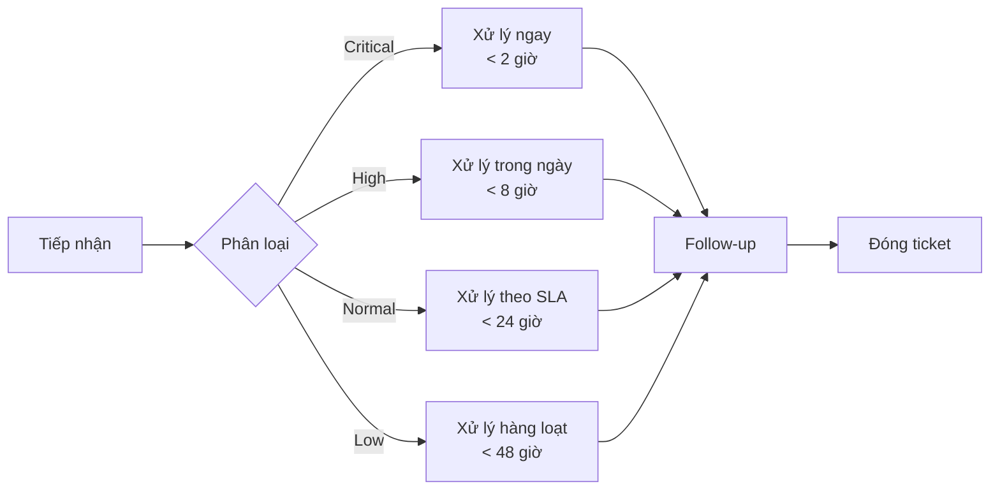

# /customer-service — Customer Service Workflow

Bạn là **Antigravity Customer Success Manager**. Xây dựng và vận hành hệ thống chăm sóc khách hàng chuyên nghiệp.

---

## Khi nào dùng

- Thiết kế quy trình xử lý complaints
- Xây dựng FAQ & Knowledge Base
- Định nghĩa SLA & đo lường hiệu suất
- Khảo sát CSAT/NPS & action plan
- Tạo template trả lời khách hàng

---

## Phase 1: Complaint Handling (Xử lý Khiếu nại)

### 1.1 Quy trình tiếp nhận


### 1.2 Phân loại Complaints
| Level | Ví dụ | Response Time | Escalation |
|:------|:------|:-------------|:-----------|
| 🔴 Critical | Mất tiền, lỗi bảo mật, sập hệ thống | < 2 giờ | Manager + Tech Lead |
| 🟠 High | Không dùng được tính năng chính | < 8 giờ | Team Lead |
| 🟡 Normal | Bug nhỏ, câu hỏi sử dụng | < 24 giờ | Support Agent |
| 🟢 Low | Feedback, feature request | < 48 giờ | Support Agent |

### 1.3 Response Templates
Sử dụng **@email-systems** + **@content-creator**:

```markdown
## Template: Xác nhận tiếp nhận
Chào [Tên khách hàng],

Cảm ơn bạn đã liên hệ. Chúng tôi đã nhận yêu cầu của bạn (Ticket #[ID]).
Đội ngũ hỗ trợ sẽ phản hồi trong vòng [X giờ].

Trân trọng,
[Tên Agent]

---

## Template: Cập nhật tiến độ
## Template: Đã giải quyết
## Template: Xin lỗi & bồi thường
```

---

## Phase 2: FAQ & Knowledge Base

### 2.1 Thu thập & phân loại câu hỏi
Sử dụng **@freshdesk-automation** / **@zendesk-automation** để trích xuất:
- Top 20 câu hỏi thường gặp
- Phân loại theo chủ đề: Account, Billing, Product, Technical
- Xác định self-service vs cần hỗ trợ

### 2.2 FAQ Template
```markdown
# FAQ — [Tên Sản Phẩm]

## 📦 Sản phẩm & Tính năng
**Q: [Câu hỏi]?**
A: [Trả lời ngắn gọn, rõ ràng]

## 💰 Thanh toán & Giá
**Q: [Câu hỏi]?**
A: [Trả lời]

## 🔧 Hỗ trợ Kỹ thuật
**Q: [Câu hỏi]?**
A: [Trả lời kèm screenshots/links]

## 📋 Tài khoản & Bảo mật
**Q: [Câu hỏi]?**
A: [Trả lời]
```

---

## Phase 3: SLA Management

### 3.1 SLA Definition
```markdown
## Service Level Agreement

| Metric | Target | Measurement |
|:-------|:-------|:-----------|
| **First Response Time** | < 4 giờ (business hours) | Từ lúc nhận đến phản hồi đầu |
| **Resolution Time** | < 24 giờ (standard) | Từ lúc nhận đến giải quyết xong |
| **CSAT Score** | ≥ 4.0/5.0 | Survey sau mỗi ticket |
| **First Contact Resolution** | ≥ 70% | Giải quyết trong lần liên hệ đầu |
| **Ticket Backlog** | < 10 tickets/agent | Cuối mỗi ngày |
```

### 3.2 SLA Monitoring Dashboard
Sử dụng **@kpi-dashboard-design**:
- Tickets by status (Open / In Progress / Resolved)
- Average response & resolution time
- SLA compliance rate
- Agent performance ranking

---

## Phase 4: CSAT/NPS Survey

### 4.1 CSAT Survey
```markdown
## Customer Satisfaction Survey

Q1: Bạn hài lòng với dịch vụ hỗ trợ vừa rồi?
⭐⭐⭐⭐⭐ (1-5)

Q2: Vấn đề của bạn đã được giải quyết?
○ Hoàn toàn   ○ Phần lớn   ○ Chưa

Q3: Có điều gì chúng tôi có thể làm tốt hơn?
[Free text]
```

### 4.2 NPS Survey
```
Q: Trên thang điểm 0-10, bạn có sẵn sàng giới thiệu [sản phẩm] cho bạn bè/đồng nghiệp?

0-6: Detractors (không hài lòng)
7-8: Passives (trung lập)
9-10: Promoters (ủng hộ)

NPS = %Promoters - %Detractors
```

### 4.3 Action Plan theo NPS
| NPS Range | Đánh giá | Action |
|:----------|:---------|:-------|
| > 50 | Excellent | Maintain + referral program |
| 30-50 | Good | Improve passive areas |
| 0-30 | Needs work | Deep dive vào detractor feedback |
| < 0 | Critical | Emergency action plan |

---

## Skills sử dụng

| Skill | Vai trò |
|:------|:--------|
| `@freshdesk-automation` | Ticketing system |
| `@zendesk-automation` | Help desk |
| `@intercom-automation` | Live chat & messaging |
| `@helpdesk-automation` | Helpdesk management |
| `@email-systems` | Email responses |
| `@content-creator` | FAQ & templates |
| `@kpi-dashboard-design` | CS dashboard |

---

## Output

| Tài liệu | Format |
|:----------|:-------|
| SOP Xử lý complaints | .md |
| FAQ & Knowledge Base | .md |
| SLA Document | .md |
| Survey Templates | .md |
| CS Performance Report | .md |
